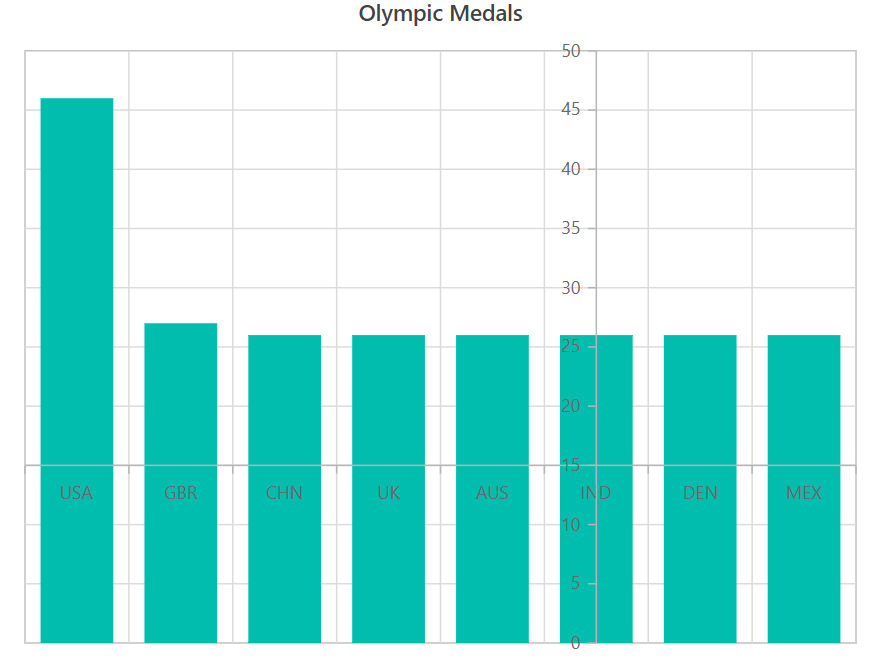
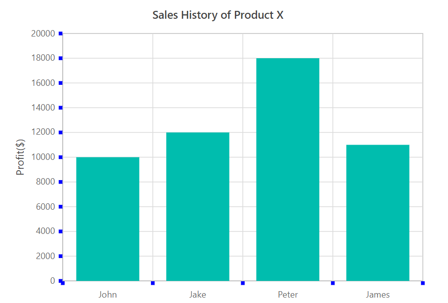
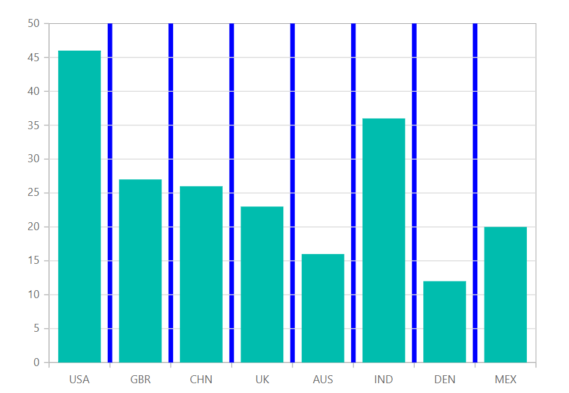
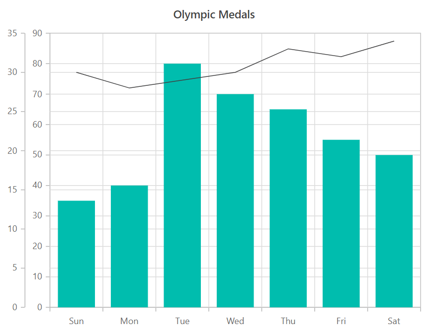
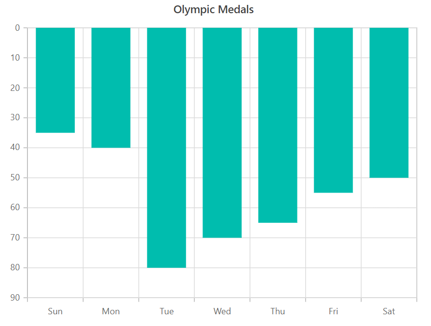
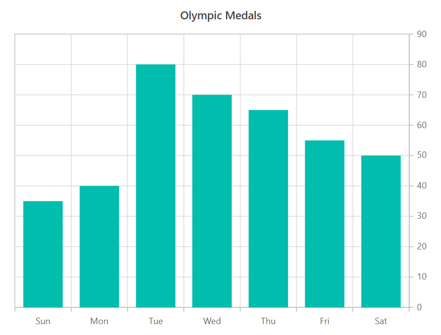

# Axis Customization

## Axis Crossing

An axis can be positioned in the chart area using [`CrossesAt`](https://help.syncfusion.com/cr/blazor/Syncfusion.Blazor~Syncfusion.Blazor.Charts.AxisModel~CrossesAt.html) and [`CrossesInAxis`](https://help.syncfusion.com/cr/blazor/Syncfusion.Blazor~Syncfusion.Blazor.Charts.AxisModel~CrossesInAxis.html) properties. The `CrossesAt` property specifies the values (datetime, numeric, or logarithmic) at which the axis line has to be intersected with the vertical axis or vice-versa, and the `CrossesInAxis` property specifies the axis name with which the axis line has to be crossed.





## Title

You can add a title to the axis using [`Title`](https://help.syncfusion.com/cr/blazor/Syncfusion.Blazor~Syncfusion.Blazor.Charts.AxisModel~Title.html) property to provide quick
information to the user about the data plotted in the axis. Title style can be customized using [`TitleStyle`](https://help.syncfusion.com/cr/blazor/Syncfusion.Blazor~Syncfusion.Blazor.Charts.AxisModel~TitleStyle.html) property of the axis.





## Tick Lines Customization

You can customize the  Width, Color and Size of the minor and major tick lines, using
[`MajorTickLines`](https://help.syncfusion.com/cr/blazor/Syncfusion.Blazor~Syncfusion.Blazor.Charts.AxisModel~MajorTickLines.html) and
[`MinorTickLines`](https://help.syncfusion.com/cr/blazor/Syncfusion.Blazor~Syncfusion.Blazor.Charts.AxisModel~MinorTickLines.html) properties in the axis.





## Grid Lines Customization

You can customize the Width, Color and DashArray of the minor and major grid lines, using [`MajorGridLines`](https://help.syncfusion.com/cr/blazor/Syncfusion.Blazor~Syncfusion.Blazor.Charts.AxisModel~MajorGridLines.html)
and [`MinorGridLines`](https://help.syncfusion.com/cr/blazor/Syncfusion.Blazor~Syncfusion.Blazor.Charts.AxisModel~MinorGridLines.html) properties in the axis.





## Multiple Axis

In addition to primary X and Y axis, we can add n number of axis to the chart. Series can be associated with
this axis, by mapping with axis's unique name. See also

* [Mixed Chart](./chart-series)
* [Multiple Panes](./multiple-panes)





## Inversed Axis

<!-- markdownlint-disable MD033 -->

When an axis is inversed, highest value of the axis comes closer to origin and vice versa. To place an axis in inversed manner set this property
 [`IsInversed`](https://help.syncfusion.com/cr/blazor/Syncfusion.Blazor~Syncfusion.Blazor.Charts.AxisModel~IsInversed.html) to true.

 



## Opposed Position

To place an axis opposite from its original position,
set [`OpposedPosition`](https://help.syncfusion.com/cr/blazor/Syncfusion.Blazor~Syncfusion.Blazor.Charts.AxisModel~OpposedPosition.html) property of the axis to true.





## See Also

* [Data label](./data-labels)
* [Tooltip](./tool-tip)
* [Marker](./data-markers)