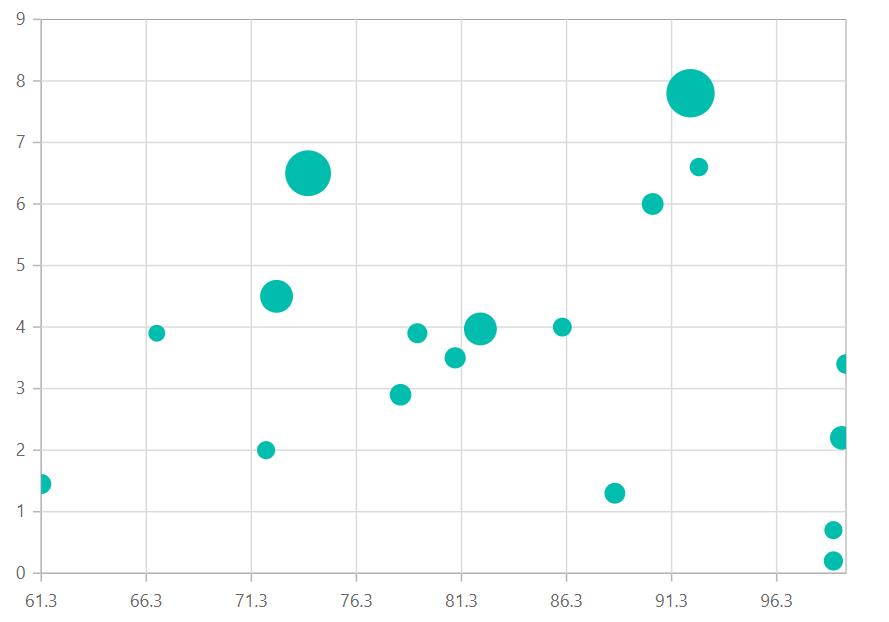

# Bubble Chart

## Bubble

Visualize data with three numeric parameters. The bubble size depends on third parameter. To render a bubble series, use series [`Type`](https://help.syncfusion.com/cr/cref_files/aspnetcore-js2/aspnetcore/Syncfusion.EJ2~Syncfusion.EJ2.Charts.ChartSeries~Type.html) as `Bubble`.





## Bubble Size Mapping

`Size` property can be used to map the size value specified in data source.







## Customization

You can use the following properties to customize the bubble series.

* [`Fill`](https://help.syncfusion.com/cr/cref_files/aspnetcore-js2/aspnetcore/Syncfusion.EJ2~Syncfusion.EJ2.Charts.ChartSeries~Fill.html) – used to change the color of the bubble.
* [`Opacity`](https://help.syncfusion.com/cr/blazor/Syncfusion.Blazor~Syncfusion.Blazor.Charts.ChartSeries~Opacity.html) – used to control the transparency of the chart series.

```csharp
@using Syncfusion.Blazor.Charts

<SfChart Width="60%">
    <ChartSeriesCollection>
        <ChartSeries DataSource="@SalesReports" XName="X" YName="Y" Opacity="0.7" Fill="blue" Size="Size" Type="ChartSeriesType.Bubble">
        </ChartSeries>
    </ChartSeriesCollection>
</SfChart>

@code{
    public class ChartData
    {
        public double X;
        public double Y;
        public double Size;
        public string Text;
    }

    public List<ChartData> SalesReports = new List<ChartData>
{
        new ChartData { X= 92.2, Y= 7.8, Size= 1.347, Text= "China" },
        new ChartData { X= 74, Y= 6.5, Size= 1.241, Text= "India" },
        new ChartData { X= 90.4, Y= 6.0, Size= 0.238, Text= "Indonesia" },
        new ChartData { X= 99.4, Y= 2.2, Size= 0.312, Text= "US" },
        new ChartData { X= 88.6, Y= 1.3, Size= 0.197, Text= "Brazil" },
        new ChartData { X= 99, Y= 0.7, Size= 0.0818, Text= "Germany" },
        new ChartData { X= 72, Y= 2.0, Size= 0.0826, Text= "Egypt" },
        new ChartData { X= 99.6, Y= 3.4, Size= 0.143, Text= "Russia" },
        new ChartData { X= 99, Y= 0.2, Size= 0.128, Text= "Japan" },
        new ChartData { X= 86.1, Y= 4.0, Size= 0.115, Text= "Mexico" },
        new ChartData { X= 92.6, Y= 6.6, Size= 0.096, Text= "Philippines" },
        new ChartData { X= 61.3, Y= 1.45, Size= 0.162, Text= "Nigeria" },
        new ChartData { X= 82.2, Y= 3.97, Size= 0.7, Text= "Hong Kong" },
        new ChartData { X= 79.2, Y= 3.9, Size= 0.162, Text= "Netherland" },
        new ChartData { X= 72.5, Y= 4.5, Size= 0.7, Text= "Jordan" },
        new ChartData { X= 81, Y= 3.5, Size= 0.21, Text= "Australia" },
        new ChartData { X= 66.8, Y= 3.9, Size= 0.028, Text= "Mongolia" },
        new ChartData { X= 78.4, Y= 2.9, Size= 0.231, Text= "Taiwan" }
    };
}
```


## See Also

* [Data label](../data-labels)
* [Tooltip](../tool-tip)