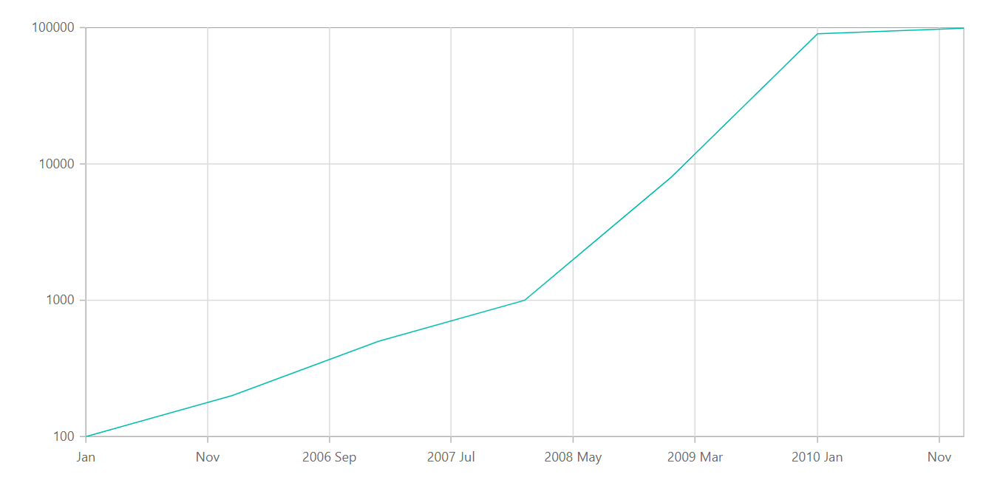
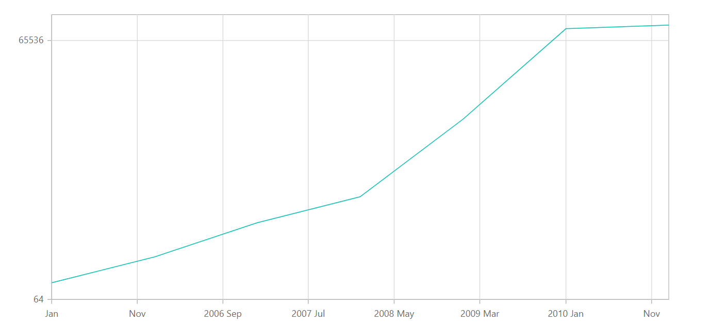

# Logarithmic Axis

<!-- markdownlint-disable MD033 -->

Logarithmic axis uses logarithmic scale and it is very useful in visualizing data, when it has numeric values in
both lower order of magnitude (eg: 10-6) and higher order of magnitude (eg: 106).





## Range

Range of an axis, will be calculated automatically based on the provided data, you can also customize the range
of the axis using [`Minimum`](https://help.syncfusion.com/cr/blazor/Syncfusion.Blazor~Syncfusion.Blazor.Charts.AxisModel~Minimum.html),
[`Maximum`](https://help.syncfusion.com/cr/blazor/Syncfusion.Blazor~Syncfusion.Blazor.Charts.AxisModel~Maximum.html) and [`Interval`](https://help.syncfusion.com/cr/cref_files/aspnetmvc-js2/Syncfusion.EJ2~Syncfusion.EJ2.Charts.ChartAxis~Interval.html) property of the axis.





## Logarithmic Base

Logarithmic base can be customized by using the [`LogBase`](https://help.syncfusion.com/cr/blazor/Syncfusion.Blazor~Syncfusion.Blazor.Charts.AxisModel~LogBase.html) property of the axis.
For example when the logBase is 5, the axis values follows 5-2, 5-1, 50,
51, 52 etc.





## Logarithmic Interval

Logarithmic axis Interval can be customized by using the [`Interval`](https://help.syncfusion.com/cr/blazor/Syncfusion.Blazor~Syncfusion.Blazor.Charts.AxisModel~Interval.html)
property of the axis. When the logarithmic base is 10 and logarithmic Interval is 2, then the axis labels are
placed at an Interval of 102. The default value of the Interval is 1.





## Label Format

### Logarithmic Label Format

Logarithmic labels can be formatted by using the [`LabelFormat`](https://help.syncfusion.com/cr/blazor/Syncfusion.Blazor~Syncfusion.Blazor.Charts.AxisModel~LabelFormat.html) property.
Logarithmic labels supports all globalize format.





The following table describes the result of applying some commonly used label formats on logarithmic values.

<!-- markdownlint-disable MD033 -->

<table>
<tr>
<td><b>Label Value</b></td>
<td><b>Label Format property value</b></td>
<td><b>Result </b></td>
<td><b>Description </b></td>
</tr>
<tr>
<td>1000</td>
<td>n1</td>
<td>1000.0</td>
<td>The Value is rounded to 1 decimal place</td>
</tr>
<tr>
<td>1000</td>
<td>n2</td>
<td>1000.00</td>
<td>The Value is rounded to 2 decimal place</td>
</tr>
<tr>
<td>1000</td>
<td>n3</td>
<td>1000.000</td>
<td>The Value is rounded to 3 decimal place</td>
</tr>
<tr>
<td>0.01</td>
<td>p1</td>
<td>1.0%</td>
<td>The Value is converted to percentage with 1 decimal place</td>
</tr>
<tr>
<td>0.01</td>
<td>p2</td>
<td>1.00%</td>
<td>The Value is converted to percentage with 2 decimal place</td>
</tr>
<tr>
<td>0.01</td>
<td>p3</td>
<td>1.000%</td>
<td>The Value is converted to percentage with 3 decimal place</td>
</tr>
<tr>
<td>1000</td>
<td>c1</td>
<td>$1000.0</td>
<td>The Currency symbol is appended to number and number is rounded to 1 decimal place</td>
</tr>
<tr>
<td>1000</td>
<td>c2</td>
<td>$1000.00</td>
<td>The Currency symbol is appended to number and number is rounded to 2 decimal place</td>
</tr>
</table>

## Custom Label Format

Axis also supports custom label format using placeholder like {value}°C, in which the value represent the axis
label e.g 20°C.





## See Also

* [Data label](./data-labels)
* [Tooltip](./tool-tip)
* [Marker](./data-markers)