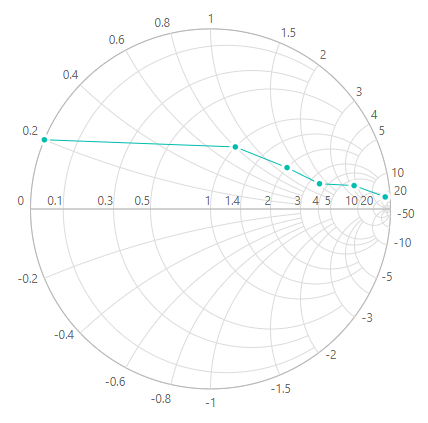
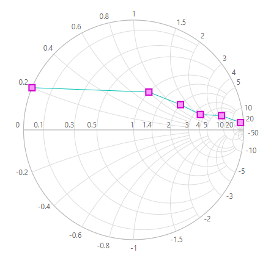
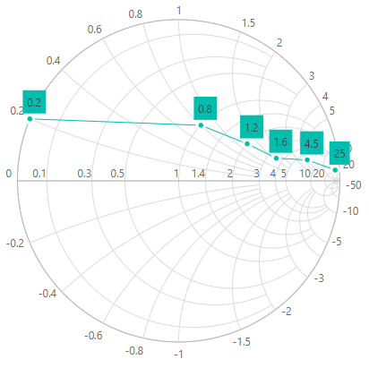
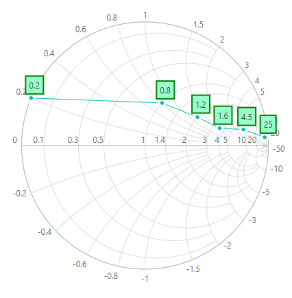

# Marker & Datalabels

Markers and Datalabels are used to provide information about the data points in the series. You can add a shape to adorn each data point. By default marker and datalabel both are disabled in Smith Chart. You can enable both of them by setting `Visible` property as true in marker and datalabel settings.

## Marker

Default visibility of marker is false. You can enable the marker by setting property `Visible` as true in `SmithchartSeriesMarker` tag. This will add marker for each point in the series. Using marker setting, you can customize marker differently for each series in Smith Chart.

```csharp
<SfSmithchart>
    <SmithchartSeriesCollection>
        <SmithchartSeries Name="First transmission" Points='FirstTransmissionData'>
            <SmithchartSeriesMarker Visible='true'></SmithchartSeriesMarker>
        </SmithchartSeries>
    </SmithchartSeriesCollection>
</SfSmithchart>

@code {
    public class SmithDataSource
    {
        public double? resistance;
        public double? reactance;
    };
    private List<SmithDataSource> FirstTransmissionData = new List<SmithDataSource> {
        new SmithDataSource { resistance= 10, reactance= 25 },
        new SmithDataSource { resistance= 6, reactance= 4.5 },
        new SmithDataSource { resistance= 3.5, reactance= 1.6 },
        new SmithDataSource { resistance= 2, reactance= 1.2 },
        new SmithDataSource { resistance= 1, reactance= 0.8 },
        new SmithDataSource { resistance= 0, reactance= 0.2 }
    };
}
```



### Marker Customization

Using `SmithchartSeriesMarker` tag, you can customize following marker properties differently for each series in the Smith Chart.

* `Width` - To control the width of the marker.
* `Height` - To control the height of the marker.
* `Fill` - Used to customize the fill color of the marker.
* `Opacity` - Used to customize the opacity of the marker.
* `SmithchartSeriesMarkerBorder` - Used to control the width and color of the marker's border.
* `Shape` - Used to change the shape of the marker.

```csharp
<SfSmithchart>
    <SmithchartSeriesCollection>
        <SmithchartSeries Points='FirstTransmissionData'>
            <SmithchartSeriesMarker
                Visible='true'
                Height='10'
                Width='10'
                Fill="#ff99ff"
                Opacity='1'
                Shape='Rectangle'>
            <SmithchartSeriesMarkerBorder
                Width='2'
                Color="#cc00cc">
            </SmithchartSeriesMarkerBorder>
            </SmithchartSeriesMarker>
        </SmithchartSeries>
    </SmithchartSeriesCollection>
</SfSmithchart>

@code {
    public class SmithDataSource
    {
        public double? resistance;
        public double? reactance;
    };
    private List<SmithDataSource> FirstTransmissionData = new List<SmithDataSource> {
        new SmithDataSource { resistance= 10, reactance= 25 },
        new SmithDataSource { resistance= 6, reactance= 4.5 },
        new SmithDataSource { resistance= 3.5, reactance= 1.6 },
        new SmithDataSource { resistance= 2, reactance= 1.2 },
        new SmithDataSource { resistance= 1, reactance= 0.8 },
        new SmithDataSource { resistance= 0, reactance= 0.2 }
    };
}
```



## Datalabels

By default, datalabel is disabled. You can enable the datalabel by setting property `Visible` as true in `SmithchartSeriesMarkerDataLabel` tag. For each point in series, data label is created. Data label for each series can be customized differently using `SmithchartSeriesMarkerDataLabel`.

```csharp
<SfSmithchart>
    <SmithchartSeriesCollection>
        <SmithchartSeries Points='FirstTransmissionData'>
            <SmithchartSeriesMarker Visible='true'>
                <SmithchartSeriesMarkerDataLabel Visible='true'></SmithchartSeriesMarkerDataLabel>
            </SmithchartSeriesMarker>
        </SmithchartSeries>
    </SmithchartSeriesCollection>
</SfSmithchart>

@code {
    public class SmithDataSource
    {
        public double? resistance;
        public double? reactance;
    };
    private List<SmithDataSource> FirstTransmissionData = new List<SmithDataSource> {
        new SmithDataSource { resistance= 10, reactance= 25 },
        new SmithDataSource { resistance= 6, reactance= 4.5 },
        new SmithDataSource { resistance= 3.5, reactance= 1.6 },
        new SmithDataSource { resistance= 2, reactance= 1.2 },
        new SmithDataSource { resistance= 1, reactance= 0.8 },
        new SmithDataSource { resistance= 0, reactance= 0.2 }
    };
}
```



### Datalabel customization

Using `SmithchartSeriesMarkerDataLabel` in `SmithchartSeriesMarker` tag, you can customize the datalabel for each series differently. In datalabel, you can customize the following properties differently for each series.

* `Fill` - Used to changes the fill color of the data label's shape.
* `Opacity` - Used to control the opacity of the data label's shape.
* `SmithChartMarkerDataLabelBorder` - Used to customize the width and color of the border.
* `TextStyle` - Used to customize the font color, width and size.

```csharp
<SfSmithchart>
    <SmithchartSeriesCollection>
        <SmithchartSeries Points='FirstTransmissionData'>
            <SmithchartSeriesMarker Visible='true'>
                <SmithchartSeriesMarkerDataLabel Visible='true' Fill="#99ffcc" Opacity='1'>
                    <SmithChartMarkerDataLabelBorder Color="green" Width='2'>
                    </SmithChartMarkerDataLabelBorder>
                </SmithchartSeriesMarkerDataLabel>
            </SmithchartSeriesMarker>
        </SmithchartSeries>
    </SmithchartSeriesCollection>
</SfSmithchart>

@code {
    public class SmithDataSource
    {
        public double? resistance;
        public double? reactance;
    };
    private List<SmithDataSource> FirstTransmissionData = new List<SmithDataSource> {
        new SmithDataSource { resistance= 10, reactance= 25 },
        new SmithDataSource { resistance= 6, reactance= 4.5 },
        new SmithDataSource { resistance= 3.5, reactance= 1.6 },
        new SmithDataSource { resistance= 2, reactance= 1.2 },
        new SmithDataSource { resistance= 1, reactance= 0.8 },
        new SmithDataSource { resistance= 0, reactance= 0.2 }
    };
}
```

