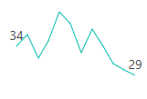

# Getting Started

This section briefly explains how to include a **Sparkline** in your Blazor server-side application. Refer to this [Getting Started with Syncfusion Blazor for Server-Side in Visual Studio 2019](https://blazor.syncfusion.com/documentation/getting-started/vs-blazor/) documentation for introduction and configuring common specifications.

## Importing Syncfusion Blazor component in an application

1. Install **Syncfusion.Blazor** NuGet package to the application by using the NuGet Package Manager. Please ensure to check the **Include prerelease** option.
2. You can add the client-side style resources through CDN or from NuGet package in the **HEAD** element of the **~/Pages/_Host.cshtml** page.

```html
<head>
    <link href="_content/Syncfusion.Blazor/styles/bootstrap4.css" rel="stylesheet" />
</head>
```

**Note:** The same theme file can be referred through the CDN version by using `https://cdn.syncfusion.com/blazor/18.1.36-beta/styles/bootstrap4.css`

> For Internet Explorer 11 kindly refer the polyfills. Refer the [`documentation`](https://blazor.syncfusion.com/documentation/common/how-to/render-blazor-server-app-in-ie/) for more information.

```html
<head>
    <link href="_content/Syncfusion.Blazor/styles/bootstrap4.css" rel="stylesheet" />
    <script src="https://github.com/Daddoon/Blazor.Polyfill/releases/download/3.0.1/blazor.polyfill.min.js"></script>
</head>
```

## Adding component package to the application

Open `**~/_Imports.razor` file and import the `Syncfusion.Blazor.**`

```csharp
@using Syncfusion.Blazor
@using Syncfusion.Blazor.Charts
```

## Add SyncfusionBlazor service in Startup.cs

Open the **Startup.cs** file and add services required by Syncfusion components using **service.AddSyncfusionBlazor()** method. Add this method in the **ConfigureServices** function as follows.

```csharp
using Syncfusion.Blazor;
namespace BlazorApplication
{
    public class Startup
    {
        ....
        ....
        public void ConfigureServices(IServiceCollection services)
        {
            ....
            ....
            services.AddSyncfusionBlazor();
        }
    }
}
```

**Note**: To enable custom client side resource loading from CRG or CDN. You need to disable resource loading by `AddSyncfusionBlazor(true)` and load the scripts in the **HEAD** element of the **~/Pages/_Host.cshtml** page.

```csharp
<head>
    <script src="https://cdn.syncfusion.com/blazor/18.1.36-beta/dist/syncfusion-blazor.min.js"></script>
</head>
```

## Adding Sparkline component to an application

Now, add the Syncfusion Blazor Sparkline component in any webpage `razor` in the `Pages` folder. For example, the sparkline component is added in the `~/Pages/Index.razor` page.

You can use the [`DataSource`](https://help.syncfusion.com/cr/blazor/Syncfusion.Blazor~Syncfusion.Blazor.Charts.SparklineModel%601~DataSource.html) property to load climate data into Sparkline. Also using the [`XName`](https://help.syncfusion.com/cr/blazor/Syncfusion.Blazor~Syncfusion.Blazor.Charts.SfSparkline%601~XName.html) and [`YName`](https://help.syncfusion.com/cr/blazor/Syncfusion.Blazor~Syncfusion.Blazor.Charts.SfSparkline%601~YName.html) properties, you can map the values of the x-axis and y-axis in sparkline from the data source. Since the *Month* is a value based on categories, specify it using the [`ValueType`](https://help.syncfusion.com/cr/blazor/Syncfusion.Blazor~Syncfusion.Blazor.Charts.SfSparkline%601~ValueType.html) property.

```csharp
<SfSparkline XName="Month"
              YName="Celsius"
              ValueType="SparklineValueType.Category"
              TValue="WeatherReport"
              DataSource="ClimateData"
              Height="80px"
              Width="150px">
</SfSparkline>

@code {
    public class WeatherReport
    {
        public string Month;
        public double Celsius;
    };
    private List<WeatherReport> ClimateData = new List<WeatherReport> {
        new  WeatherReport { Month= "Jan", Celsius= 34 },
        new  WeatherReport { Month= "Feb", Celsius= 36 },
        new  WeatherReport { Month= "Mar", Celsius= 32 },
        new  WeatherReport { Month= "Apr", Celsius= 35 },
        new  WeatherReport { Month= "May", Celsius= 40 },
        new  WeatherReport { Month= "Jun", Celsius= 38 },
        new  WeatherReport { Month= "Jul", Celsius= 33 },
        new  WeatherReport { Month= "Aug", Celsius= 37 },
        new  WeatherReport { Month= "Sep", Celsius= 34 },
        new  WeatherReport { Month= "Oct", Celsius= 31 },
        new  WeatherReport { Month= "Nov", Celsius= 30 },
        new  WeatherReport { Month= "Dec", Celsius= 29}
    };
}
```

<b>Run the application</b>

After the successful compilation of your application, press F5 to run the application. The Blazor Sparkline component will be rendered in the web browser as illustrated in the following screenshot.

   

## Change the type of sparkline

You can change the sparkline type by setting the [`Type`](https://help.syncfusion.com/cr/blazor/Syncfusion.Blazor~Syncfusion.Blazor.Charts.SfSparkline%601~Type.html) property to **Line**, **Column**, **WinLoss**, **Pie** or **Area**. Here, the sparkline type is set to **Area**.

```csharp
<SfSparkline XName="Month"
              YName="Celsius"
              ValueType="SparklineValueType.Category"
              Type="SparklineType.Area"
              TValue="WeatherReport"
              DataSource="ClimateData"
              Height="80px"
              Width="150px">
</SfSparkline>
```

> Refer [code block](#adding-sparkline-component-to-an-application) to know the property value of `ClimateData`.


## Add data label

You can add data labels to improve the readability of the sparkline chart. This can be achieved by setting the [`Visible`](https://help.syncfusion.com/cr/blazor/Syncfusion.Blazor~Syncfusion.Blazor.Charts.SparklineDataLabelSettings~Visible.html) property in the [`SparklineDataLabelSettings`](https://help.syncfusion.com/cr/blazor/Syncfusion.Blazor~Syncfusion.Blazor.Charts.SparklineDataLabelSettings.html). Available types are:

* Start
* End
* All
* High
* Low
* Negative

```csharp
<SfSparkline DataSource="ClimateData"
              TValue="WeatherReport"
              XName="Month"
              YName="Celsius"
              ValueType="SparklineValueType.Category"
              Height="80px"
              Width="150px">
    <SparklineDataLabelSettings Visible="new List<VisibleType> { VisibleType.Start, VisibleType.End }"></SparklineDataLabelSettings>
    <SparklinePadding Left="10" Right="10"></SparklinePadding>
</SfSparkline>
```

> Refer [code block](#adding-sparkline-component-to-an-application) to know the property value of `ClimateData`.



## Enable tooltip

The tooltip is useful when you cannot display information by using the data labels due to space constraints. You can enable tooltip by setting the [`Visible`](https://help.syncfusion.com/cr/blazor/Syncfusion.Blazor~Syncfusion.Blazor.Charts.SparklineTooltipSettings~Visible.html) property value to true in [`SparklineTooltipSettings`](https://help.syncfusion.com/cr/blazor/Syncfusion.Blazor~Syncfusion.Blazor.Charts.SparklineTooltipSettings.html).

```csharp
<SfSparkline DataSource="ClimateData"
              TValue="WeatherReport"
              XName="Month"
              YName="Celsius"
              ValueType="SparklineValueType.Category"
              Height="80px"
              Width="150px">
    <SparklineDataLabelSettings Visible="new List<VisibleType> { VisibleType.Start, VisibleType.End }"></SparklineDataLabelSettings>
    <SparklinePadding Left="10" Right="10"></SparklinePadding>
    <SparklineTooltipSettings Visible="true"></SparklineTooltipSettings>
</SfSparkline>
```

> Refer [code block](#adding-sparkline-component-to-an-application) to know the property value of `ClimateData`.


## See also

* [Getting Started with Syncfusion Blazor for Client-Side in .NET Core CLI](https://blazor.syncfusion.com/documentation/getting-started/dotnet-cli-blazor/)

* [Getting Started with Syncfusion Blazor for Server-Side in Visual Studio 2019](https://blazor.syncfusion.com/documentation/getting-started/vs-blazor-server/)

* [Getting Started with Syncfusion Blazor for Server-Side in .NET Core CLI](https://blazor.syncfusion.com/documentation/getting-started/dotnet-cli-blazor-server/)