# Pointers

Pointers are used to indicate values on an axis. The value of a pointer can be modified using the [`Value`](https://help.syncfusion.com/cr/aspnetcore-blazor/Syncfusion.Blazor~Syncfusion.Blazor.CircularGauge.CircularGaugePointer~Value.html) property.

```csharp
@using Syncfusion.Blazor.CircularGauge

<SfCircularGauge>
    <CircularGaugeAxes>
        <CircularGaugeAxis>
            <CircularGaugePointers>
                <CircularGaugePointer Value="90">
                </CircularGaugePointer>
            </CircularGaugePointers>
        </CircularGaugeAxis>
    </CircularGaugeAxes>
</SfCircularGauge>
```

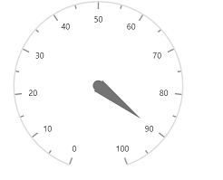

The Circular Gauge supports three types of pointers such as [`Needle`](https://help.syncfusion.com/cr/aspnetcore-blazor/Syncfusion.Blazor~Syncfusion.Blazor.CircularGauge.PointerType.html), [`RangeBar`](https://help.syncfusion.com/cr/aspnetcore-blazor/Syncfusion.Blazor~Syncfusion.Blazor.CircularGauge.PointerType.html), and [`Marker`](https://help.syncfusion.com/cr/aspnetcore-blazor/Syncfusion.Blazor~Syncfusion.Blazor.CircularGauge.PointerType.html). You can choose any pointer using the [`Type`](https://help.syncfusion.com/cr/aspnetcore-blazor/Syncfusion.Blazor~Syncfusion.Blazor.CircularGauge.CircularGaugePointer~Type.html) property.

## Needle pointer

The circular gauge's default pointer type will be needle. A needle point contains three parts, a needle, a cap / knob, and a tail.

```csharp
@using Syncfusion.Blazor.CircularGauge

<SfCircularGauge>
    <CircularGaugeAxes>
        <CircularGaugeAxis>
            <CircularGaugePointers>
                <CircularGaugePointer Value="90">
                </CircularGaugePointer>
            </CircularGaugePointers>
        </CircularGaugeAxis>
    </CircularGaugeAxes>
</SfCircularGauge>
```

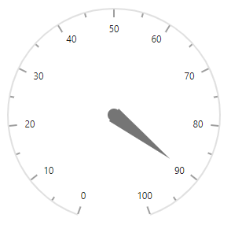

### Customization

The needle, tail and cap of the pointer can be customized with the following properties.

* [`CircularGaugePointer`](https://help.syncfusion.com/cr/aspnetcore-blazor/Syncfusion.Blazor~Syncfusion.Blazor.CircularGauge.CircularGaugePointer_members.html) - Customize the pointer's needle.
    * [`Radius`](https://help.syncfusion.com/cr/aspnetcore-blazor/Syncfusion.Blazor~Syncfusion.Blazor.CircularGauge.CircularGaugePointer~Radius.html) - sets the needle length
    * [`PointerWidth`](https://help.syncfusion.com/cr/aspnetcore-blazor/Syncfusion.Blazor~Syncfusion.Blazor.CircularGauge.CircularGaugePointer~PointerWidth.html) - sets the needle width
    * [`Color`](https://help.syncfusion.com/cr/aspnetcore-blazor/Syncfusion.Blazor~Syncfusion.Blazor.CircularGauge.CircularGaugePointer~Color.html) - sets the needle color
* [`CircularGaugeNeedleTail`](https://help.syncfusion.com/cr/aspnetcore-blazor/Syncfusion.Blazor~Syncfusion.Blazor.CircularGauge.CircularGaugeNeedleTail_members.html) -  Customize the pointer's tail.
    * [`Length`](https://help.syncfusion.com/cr/aspnetcore-blazor/Syncfusion.Blazor~Syncfusion.Blazor.CircularGauge.CircularGaugeNeedleTail~Length.html) - sets pointer's tail length
    * [`Color`](https://help.syncfusion.com/cr/aspnetcore-blazor/Syncfusion.Blazor~Syncfusion.Blazor.CircularGauge.CircularGaugeNeedleTail~Color.html) - sets pointer's tail color
    * [`CircularGaugeNeedleTailBorder`](https://help.syncfusion.com/cr/aspnetcore-blazor/Syncfusion.Blazor~Syncfusion.Blazor.CircularGauge.CircularGaugeNeedleTail~Border.html) -  Sets pointer's tail border
* [`CircularGaugeCap`](https://help.syncfusion.com/cr/aspnetcore-blazor/Syncfusion.Blazor~Syncfusion.Blazor.CircularGauge.CircularGaugeCap_members.html) -  Customize the pointer's cap.
    * [`Color`](https://help.syncfusion.com/cr/aspnetcore-blazor/Syncfusion.Blazor~Syncfusion.Blazor.CircularGauge.CircularGaugeCap~Color.html) - sets pointer's cap color
    * [`Radius`](https://help.syncfusion.com/cr/aspnetcore-blazor/Syncfusion.Blazor~Syncfusion.Blazor.CircularGauge.CircularGaugeCap~Radius.html) - sets pointer's cap radius
    * [`CircularGaugeCapBorder`](https://help.syncfusion.com/cr/aspnetcore-blazor/Syncfusion.Blazor~Syncfusion.Blazor.CircularGauge.CircularGaugeCap~Border.html) - sets pointer's cap border
    * [`Position`] - specifies the position of the Pointer. Its possible values are 'PointerRangePosition.Inside', 'PointerRangePosition.Outside' and 'PointerRangePosition.Cross'.

```csharp
@using Syncfusion.Blazor.CircularGauge

<SfCircularGauge Height="250px" Width="250px">
    <CircularGaugeAxes>
        <CircularGaugeAxis>
            <CircularGaugePointers>
                <CircularGaugePointer Value="90"
                                      Radius="40%"
                                      PointerWidth="30"
                                      Color="#007DD1"
                                      Position="PointerRangePosition.Inside">
                    <CircularGaugeCap Radius="15"
                                      Color="white">
                        <CircularGaugeCapBorder Width="4"
                                                Color="#007DD1">
                        </CircularGaugeCapBorder>
                    </CircularGaugeCap>
                    <CircularGaugeNeedleTail Length="35%"
                                             Color="#007DD1">
                    </CircularGaugeNeedleTail>
                </CircularGaugePointer>
            </CircularGaugePointers>
        </CircularGaugeAxis>
    </CircularGaugeAxes>
</SfCircularGauge>
```

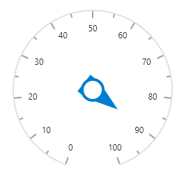

<!-- markdownlint-disable MD010 -->

The appearance of the needle pointer can be customized by using [`NeedleStartWidth`](https://help.syncfusion.com/cr/aspnetcore-blazor/Syncfusion.Blazor~Syncfusion.Blazor.CircularGauge.CircularGaugePointer~NeedleStartWidth.html) and [`NeedleEndWidth`](https://help.syncfusion.com/cr/aspnetcore-blazor/Syncfusion.Blazor~Syncfusion.Blazor.CircularGauge.CircularGaugePointer~NeedleEndWidth.html).

```csharp
@using Syncfusion.Blazor.CircularGauge

<SfCircularGauge>
    <CircularGaugeAxes>
        <CircularGaugeAxis StartAngle="270" EndAngle="90" Radius="90%" Minimum="0" Maximum="100">
		<CircularGaugeAxisLineStyle Width="3" Color="#1E7145">
            </CircularGaugeAxisLineStyle>
			 <CircularGaugeAxisLabelStyle>
                <CircularGaugeAxisLabelFont Color="#1E7145" Size="0px">
                </CircularGaugeAxisLabelFont>
            </CircularGaugeAxisLabelStyle>
			<CircularGaugeAxisMajorTicks Interval="100"
                                         Height="0"
                                         Width="1">
            </CircularGaugeAxisMajorTicks>
            <CircularGaugeAxisMinorTicks Width="0"
                                         Height="0"
                                         >
            </CircularGaugeAxisMinorTicks>
            <CircularGaugePointers>
                <CircularGaugePointer Value="70"
                                      Radius="80%" Color="green" PointerWidth="2" NeedleStartWidth="4" NeedleEndWidth="4">
				 <CircularGaugeCap Radius="8" Color="green">
                    </CircularGaugeCap>
                    <CircularGaugeNeedleTail Length="0%">
                    </CircularGaugeNeedleTail>
                </CircularGaugePointer>
            </CircularGaugePointers>
			<CircularGaugeAnnotations>
                <CircularGaugeAnnotation Angle="180" ZIndex="1">
                    <ContentTemplate>
                        <div class="custom-annotation">Customized Needle</div>
                    </ContentTemplate>
                </CircularGaugeAnnotation>
            </CircularGaugeAnnotations>
        </CircularGaugeAxis>
    </CircularGaugeAxes>
</SfCircularGauge>
<style type="text/css">
    .custom-annotation {
        color: #757575;
        font-family:Roboto; font-size:14px;padding-top: 26px;
    }
</style>
```

## Range bar pointer

The range bar pointer is like a range in an axis that can be placed on gauge to mark the pointer value. The
range bar starts from the beginning of the gauge and ends at the pointer value. You can set the pointer type using `Type` property in `CircularGaugePointer`.

```csharp
@using Syncfusion.Blazor.CircularGauge

<SfCircularGauge>
    <CircularGaugeAxes>
        <CircularGaugeAxis>
            <CircularGaugePointers>
                <CircularGaugePointer Value="50"
                                      Type="PointerType.RangeBar">
                </CircularGaugePointer>
            </CircularGaugePointers>
        </CircularGaugeAxis>
    </CircularGaugeAxes>
</SfCircularGauge>
```

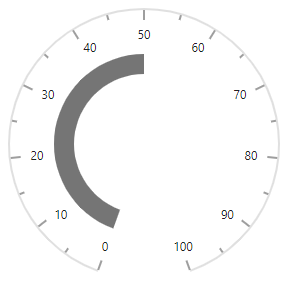

### Customization

You can customize the range bar using the following properties.

* [`PointerWidth`](https://help.syncfusion.com/cr/aspnetcore-blazor/Syncfusion.Blazor~Syncfusion.Blazor.CircularGauge.CircularGaugePointer~PointerWidth.html) - Specifies the width of the range bar
* [`Color`](https://help.syncfusion.com/cr/aspnetcore-blazor/Syncfusion.Blazor~Syncfusion.Blazor.CircularGauge.CircularGaugePointer~Color.html) - Specifies the color of the range bar
* [`Radius`](https://help.syncfusion.com/cr/aspnetcore-blazor/Syncfusion.Blazor~Syncfusion.Blazor.CircularGauge.CircularGaugePointer~Radius.html) - Specifies the range bar radius
* [`RoundedCornerRadius`](https://help.syncfusion.com/cr/aspnetcore-blazor/Syncfusion.Blazor~Syncfusion.Blazor.CircularGauge.CircularGaugePointer~RoundedCornerRadius.html) - Specifies the rounded corner of the range bar
* [`CircularGaugePointerBorder`](https://help.syncfusion.com/cr/aspnetcore-blazor/Syncfusion.Blazor~Syncfusion.Blazor.CircularGauge.CircularGaugePointerBorder_members.html) - Specifies the border of the range bar

```csharp
@using Syncfusion.Blazor.CircularGauge

<SfCircularGauge>
    <CircularGaugeAxes>
        <CircularGaugeAxis>
            <CircularGaugePointers>
                <CircularGaugePointer Value="46"
                                      Type="PointerType.RangeBar"
                                      PointerWidth="8"
                                      Radius="95%"
                                      Color="lightgray">
                    <CircularGaugePointerBorder Color="darkgray"
                                                Width="2">
                    </CircularGaugePointerBorder>
                </CircularGaugePointer>
            </CircularGaugePointers>
        </CircularGaugeAxis>
    </CircularGaugeAxes>
</SfCircularGauge>
```

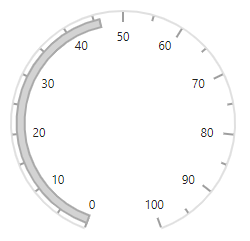

### Rounded corners

The start and end pointers of a range bar in the Circular Gauge are rounded to form arc using `RoundedCornerRadius` property.

```csharp
@using Syncfusion.Blazor.CircularGauge

<SfCircularGauge>
    <CircularGaugeAxes>
        <CircularGaugeAxis>
            <CircularGaugePointers>
                <CircularGaugePointer Value="46"
                                      RoundedCornerRadius="20"
                                      Type="PointerType.RangeBar">
                </CircularGaugePointer>
            </CircularGaugePointers>
        </CircularGaugeAxis>
    </CircularGaugeAxes>
</SfCircularGauge>
```

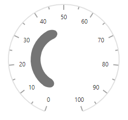

## Marker pointer

The different types of marker shapes can be used to mark the pointer value in an axis. You can change the marker shape using the [`MarkerShape`](https://help.syncfusion.com/cr/aspnetcore-blazor/Syncfusion.Blazor~Syncfusion.Blazor.CircularGauge.CircularGaugePointer~MarkerShape.html) property in pointer. The Circular Gauge supports the following marker shapes:
* Circle
* Rectangle
* Triangle
* InvertedTriangle
* Diamond

```csharp
@using Syncfusion.Blazor.CircularGauge

<SfCircularGauge>
    <CircularGaugeAxes>
        <CircularGaugeAxis>
            <CircularGaugePointers>
                <CircularGaugePointer Value="90"
                                      Type="PointerType.Marker"
                                      MarkerShape="GaugeShape.Diamond"
                                      MarkerHeight="15"
                                      MarkerWidth="15">
                </CircularGaugePointer>
            </CircularGaugePointers>
        </CircularGaugeAxis>
    </CircularGaugeAxes>
</SfCircularGauge>
```

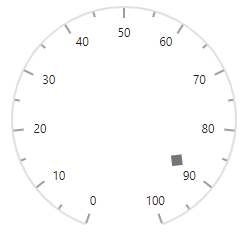

### Customization

You can customize the marker pointer using the following properties.

* [`Color`](https://help.syncfusion.com/cr/aspnetcore-blazor/Syncfusion.Blazor~Syncfusion.Blazor.CircularGauge.CircularGaugePointer~Color.html) - specifies marker pointer color
* [`MarkerWidth`](https://help.syncfusion.com/cr/aspnetcore-blazor/Syncfusion.Blazor~Syncfusion.Blazor.CircularGauge.CircularGaugePointer~MarkerWidth.html)  - specifies marker pointer width
* [`MarkerHeight`](https://help.syncfusion.com/cr/aspnetcore-blazor/Syncfusion.Blazor~Syncfusion.Blazor.CircularGauge.CircularGaugePointer~MarkerHeight.html) - specifies marker pointer height
* [`Radius`](https://help.syncfusion.com/cr/aspnetcore-blazor/Syncfusion.Blazor~Syncfusion.Blazor.CircularGauge.CircularGaugePointer~Radius.html) - specifies marker pointer radius
* [`CircularGaugePointerBorder`](https://help.syncfusion.com/cr/aspnetcore-blazor/Syncfusion.Blazor~Syncfusion.Blazor.CircularGauge.CircularGaugePointerBorder_members.html) - specifies marker pointer's border color and width.

```csharp
@using Syncfusion.Blazor.CircularGauge

<SfCircularGauge>
    <CircularGaugeAxes>
        <CircularGaugeAxis>
            <CircularGaugePointers>
                <CircularGaugePointer Value="90"
                                      Type="PointerType.Marker"
                                      MarkerShape="GaugeShape.InvertedTriangle"
                                      MarkerHeight="15"
                                      MarkerWidth="15"
                                      Color="white"
                                      Radius="110%">
                    <CircularGaugePointerBorder Width="2" Color="#007DD1"></CircularGaugePointerBorder>
                </CircularGaugePointer>
            </CircularGaugePointers>
        </CircularGaugeAxis>
    </CircularGaugeAxes>
</SfCircularGauge>
```

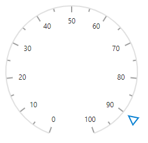

### Image marker pointer

You can use image instead of rendering marker shape to denote the pointer value. It can be achieved by setting [`MarkerShape`](https://help.syncfusion.com/cr/aspnetcore-blazor/Syncfusion.Blazor~Syncfusion.Blazor.CircularGauge.CircularGaugePointer~MarkerShape.html) to 'GaugeShape.Image' and assigning image path to [`ImageUrl`](https://help.syncfusion.com/cr/aspnetcore-blazor/Syncfusion.Blazor~Syncfusion.Blazor.CircularGauge.CircularGaugePointer~ImageUrl.html) as shown in following example.

```csharp
@using Syncfusion.Blazor.CircularGauge

<SfCircularGauge>
    <CircularGaugeAxes>
        <CircularGaugeAxis>
            <CircularGaugePointers>
                <CircularGaugePointer Value="90"
                                      Type="PointerType.Marker"
                                      MarkerShape="GaugeShape.Image"
                                      ImageUrl="football.png"
                                      MarkerHeight="20"
                                      MarkerWidth="20"
                                      Radius="100%">
                </CircularGaugePointer>
            </CircularGaugePointers>
        </CircularGaugeAxis>
    </CircularGaugeAxes>
</SfCircularGauge>
```

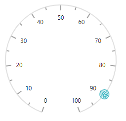

<!-- markdownlint-disable MD010 -->

## Dragging pointer

The pointers can be dragged over the axis values by clicking and dragging the same. To enable or disable the pointer drag, use the
[`EnablePointerDrag`](https://help.syncfusion.com/cr/aspnetcore-blazor/Syncfusion.Blazor~Syncfusion.Blazor.CircularGauge.SfCircularGauge~EnablePointerDrag.html) property.

```csharp
@using Syncfusion.Blazor.CircularGauge

<SfCircularGauge EnablePointerDrag="true" Height="250px" Width="250px">
    <CircularGaugeAxes>
        <CircularGaugeAxis>
            <CircularGaugePointers>
                <CircularGaugePointer Value="50">
                </CircularGaugePointer>
            </CircularGaugePointers>
        </CircularGaugeAxis>
    </CircularGaugeAxes>
</SfCircularGauge>
```

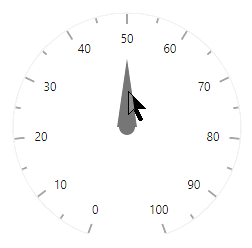

## Multiple pointers

In addition to the default pointer, you can add n number of pointers to an axis using the [`CircularGaugePointers`](https://help.syncfusion.com/cr/aspnetcore-blazor/Syncfusion.Blazor~Syncfusion.Blazor.CircularGauge.CircularGaugePointers_members.html) tag.

```csharp
@using Syncfusion.Blazor.CircularGauge

<SfCircularGauge>
    <CircularGaugeAxes>
        <CircularGaugeAxis>
            <CircularGaugePointers>
                <CircularGaugePointer Value="90"
                                      MarkerShape="GaugeShape.InvertedTriangle"
                                      Radius="100%"
                                      MarkerHeight="15"
                                      MarkerWidth="15">
                </CircularGaugePointer>
                <CircularGaugePointer Value="90"
                                      Type="PointerType.RangeBar"
                                      Radius="60%"
                                      MarkerWidth="10">
                </CircularGaugePointer>
                <CircularGaugePointer Value="90"
                                      Radius="50%"
                                      PointerWidth="25"
                                      Color="#007DD1">
                    <CircularGaugeCap Radius="15">
                        <CircularGaugeCapBorder Width="5">
                        </CircularGaugeCapBorder>
                    </CircularGaugeCap>
                    <CircularGaugeNeedleTail Length="25%">
                    </CircularGaugeNeedleTail>
                </CircularGaugePointer>
            </CircularGaugePointers>
            <CircularGaugeAxisLabelStyle UseRangeColor="true">
            </CircularGaugeAxisLabelStyle>
            <CircularGaugeAxisMinorTicks UseRangeColor="true"></CircularGaugeAxisMinorTicks>
        </CircularGaugeAxis>
    </CircularGaugeAxes>
</SfCircularGauge>
```

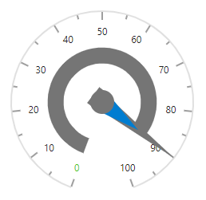

## Pointer animation

The pointers are animated on loading the gauge using the [`CircularGaugePointerAnimation`](https://help.syncfusion.com/cr/aspnetcore-blazor/Syncfusion.Blazor~Syncfusion.Blazor.CircularGauge.CircularGaugePointerAnimation_members.html) tag in pointer.
The [`Enable`](https://help.syncfusion.com/cr/aspnetcore-blazor/Syncfusion.Blazor~Syncfusion.Blazor.CircularGauge.CircularGaugePointerAnimation~Enable.html) property in animation allows you to enable or disable the animation.
The [`Duration`](https://help.syncfusion.com/cr/aspnetcore-blazor/Syncfusion.Blazor~Syncfusion.Blazor.CircularGauge.CircularGaugePointerAnimation~Duration.html) property specifies the duration of the animation in milliseconds.

```csharp
@using Syncfusion.Blazor.CircularGauge

<SfCircularGauge Height="250" Width="250">
    <CircularGaugeAxes>
        <CircularGaugeAxis>
            <CircularGaugePointers>
                <CircularGaugePointer Value="70">
                    <CircularGaugePointerAnimation Enable="true" Duration="1500">
                    </CircularGaugePointerAnimation>
                </CircularGaugePointer>
            </CircularGaugePointers>
        </CircularGaugeAxis>
    </CircularGaugeAxes>
</SfCircularGauge>
```

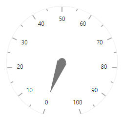

<!-- markdownlint-disable MD010 -->