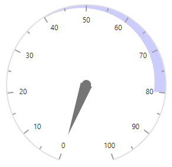
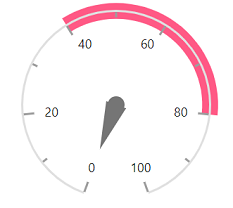
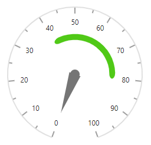
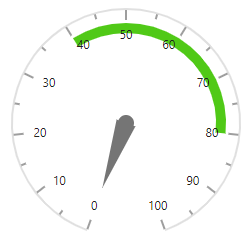
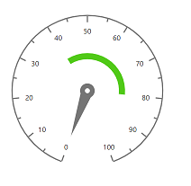
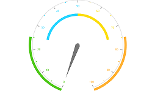

# Ranges

You can categorizes certain interval on Circular Gauge axis using the [`CircularGaugeRanges`](https://help.syncfusion.com/cr/aspnetcore-blazor/Syncfusion.Blazor~Syncfusion.Blazor.CircularGauge.CircularGaugeRanges_members.html) tag.

## Range start and end

The start and end values of a range in an axis can be customized using the [`Start`](https://help.syncfusion.com/cr/aspnetcore-blazor/Syncfusion.Blazor~Syncfusion.Blazor.CircularGauge.CircularGaugeRange~Start.html) and [`End`](https://help.syncfusion.com/cr/aspnetcore-blazor/Syncfusion.Blazor~Syncfusion.Blazor.CircularGauge.CircularGaugeRange~End.html) properties.

```csharp
@using Syncfusion.Blazor.CircularGauge

<SfCircularGauge>
    <CircularGaugeAxes>
        <CircularGaugeAxis>
            <CircularGaugeRanges>
                <CircularGaugeRange Start="40" End="80">
                </CircularGaugeRange>
            </CircularGaugeRanges>
        </CircularGaugeAxis>
    </CircularGaugeAxes>
</SfCircularGauge>
```


## Start width and end width

Using [`StartWidth`](https://help.syncfusion.com/cr/aspnetcore-blazor/Syncfusion.Blazor~Syncfusion.Blazor.CircularGauge.CircularGaugeRange~StartWidth.html) and [`EndWidth`](https://help.syncfusion.com/cr/aspnetcore-blazor/Syncfusion.Blazor~Syncfusion.Blazor.CircularGauge.CircularGaugeRange~EndWidth.html) properties, you can customize the start width and end width of the range.

```csharp
@using Syncfusion.Blazor.CircularGauge

<SfCircularGauge>
    <CircularGaugeAxes>
        <CircularGaugeAxis>
            <CircularGaugeRanges>
                <CircularGaugeRange Start="40"
                                    End="80"
                                    StartWidth="2"
                                    EndWidth="20">
                </CircularGaugeRange>
            </CircularGaugeRanges>
        </CircularGaugeAxis>
    </CircularGaugeAxes>
</SfCircularGauge>
```


## Changing color

The color of a range can be customized using the [`Color`](https://help.syncfusion.com/cr/aspnetcore-blazor/Syncfusion.Blazor~Syncfusion.Blazor.CircularGauge.CircularGaugeRange~Color.html) and [`Opacity`](https://help.syncfusion.com/cr/aspnetcore-blazor/Syncfusion.Blazor~Syncfusion.Blazor.CircularGauge.CircularGaugeRange~Opacity.html) properties.

```csharp
@using Syncfusion.Blazor.CircularGauge

<SfCircularGauge>
    <CircularGaugeAxes>
        <CircularGaugeAxis>
            <CircularGaugeRanges>
                <CircularGaugeRange Start="40"
                                    End="80"
                                    StartWidth="2"
                                    EndWidth="20"
                                    Color="blue"
                                    Opacity="0.2">
                </CircularGaugeRange>
            </CircularGaugeRanges>
        </CircularGaugeAxis>
    </CircularGaugeAxes>
</SfCircularGauge>
```



## Range Position

The ranges can be placed either inside, outside or center of the axis using the [`Position`] property in [`CircularGaugeRange`](https://help.syncfusion.com/cr/aspnetcore-blazor/Syncfusion.Blazor~Syncfusion.Blazor.CircularGauge.CircularGaugeRange_members.html). Its possible values are 'PointerRangePosition.Inside', 'PointerRangePosition.Outside' and 'PointerRangePosition.Cross'.

```csharp
@using Syncfusion.Blazor.CircularGauge

<SfCircularGauge>
    <CircularGaugeAxes>
        <CircularGaugeAxis>
            <CircularGaugeRanges>
                <CircularGaugeRange Start="40" End="80" StartWidth="15" EndWidth="15" Color="#ff5985" Position="PointerRangePosition.Cross">
                </CircularGaugeRange>
            </CircularGaugeRanges>
        </CircularGaugeAxis>
    </CircularGaugeAxes>
</SfCircularGauge>
```



## Rounded corners

You can customize the corner radius using the [`RoundedCornerRadius`](https://help.syncfusion.com/cr/aspnetcore-blazor/Syncfusion.Blazor~Syncfusion.Blazor.CircularGauge.CircularGaugeRange~RoundedCornerRadius.html) property in [`CircularGaugeRange`](https://help.syncfusion.com/cr/aspnetcore-blazor/Syncfusion.Blazor~Syncfusion.Blazor.CircularGauge.CircularGaugeRange_members.html).

```csharp
@using Syncfusion.Blazor.CircularGauge

<SfCircularGauge>
    <CircularGaugeAxes>
        <CircularGaugeAxis>
            <CircularGaugeRanges>
                <CircularGaugeRange Start="40" End="80" RoundedCornerRadius="5">
                </CircularGaugeRange>
            </CircularGaugeRanges>
        </CircularGaugeAxis>
    </CircularGaugeAxes>
</SfCircularGauge>
```



## Radius

You can place a range inside or outside the axis using the [`Radius`](https://help.syncfusion.com/cr/aspnetcore-blazor/Syncfusion.Blazor~Syncfusion.Blazor.CircularGauge.CircularGaugeRange~Radius.html) property. The radius of a range takes value either in percentage or in pixels. By default, a range take 100% of the axis radius.

### In pixel

You can set a radius of the range in pixel as demonstrated as follows.

```csharp
@using Syncfusion.Blazor.CircularGauge

<SfCircularGauge>
    <CircularGaugeAxes>
        <CircularGaugeAxis>
            <CircularGaugeRanges>
                <CircularGaugeRange Start="40" End="80" Radius="100px">
                </CircularGaugeRange>
            </CircularGaugeRanges>
        </CircularGaugeAxis>
    </CircularGaugeAxes>
</SfCircularGauge>
```



### In percentage

By setting value in percentage, a range gets its dimension with respect to its axis radius.
For example, when the radius is ‘50%’,the range is rendered to half of the axis radius.

```csharp
@using Syncfusion.Blazor.CircularGauge

<SfCircularGauge>
    <CircularGaugeAxes>
        <CircularGaugeAxis>
            <CircularGaugeRanges>
                <CircularGaugeRange Start="40" End="80" Radius="50%">
                </CircularGaugeRange>
            </CircularGaugeRanges>
        </CircularGaugeAxis>
    </CircularGaugeAxes>
</SfCircularGauge>
```



<!-- markdownlint-disable MD010 -->

## Dragging ranges

The ranges can be dragged over the axis line by clicking and dragging the same. To enable or disable the range drag, use the
[`EnableRangeDrag`](https://help.syncfusion.com/cr/aspnetcore-blazor/Syncfusion.Blazor~Syncfusion.Blazor.CircularGauge.SfCircularGauge~EnableRangeDrag.html) property.

```csharp
@using Syncfusion.Blazor.CircularGauge

<SfCircularGauge EnableRangeDrag="true" Height="250px" Width="250px">
    <CircularGaugeAxes>
        <CircularGaugeAxis>
            <CircularGaugePointers>
                <CircularGaugePointer Value="50">
                </CircularGaugePointer>
            </CircularGaugePointers>
			<CircularGaugeRanges>
                <CircularGaugeRange Start="0" End="100" Radius="108%" Color="#30B32D" StartWidth="8" EndWidth="8">
                </CircularGaugeRange>
			<CircularGaugeRanges>
        </CircularGaugeAxis>
    </CircularGaugeAxes>
</SfCircularGauge>
```


## Multiple ranges

You can add multiple ranges to an axis with the above customization as demonstrated as follows.

You can set the range color to ticks and labels of an axis by enabling the [`UseRangeColor`](https://help.syncfusion.com/cr/aspnetcore-blazor/Syncfusion.Blazor~Syncfusion.Blazor.CircularGauge.CircularGaugeLabel~UseRangeColor.html) property in [`CircularGaugeAxisMajorTicks`](https://help.syncfusion.com/cr/aspnetcore-blazor/Syncfusion.Blazor~Syncfusion.Blazor.CircularGauge.CircularGaugeAxisMajorTicks_members.html), [`CircularGaugeAxisMinorTicks`](https://help.syncfusion.com/cr/aspnetcore-blazor/Syncfusion.Blazor~Syncfusion.Blazor.CircularGauge.CircularGaugeAxisMinorTicks_members.html) and [`CircularGaugeAxisLabelStyle`](https://help.syncfusion.com/cr/aspnetcore-blazor/Syncfusion.Blazor~Syncfusion.Blazor.CircularGauge.CircularGaugeAxisLabelStyle_members.html) tags.

```csharp
@using Syncfusion.Blazor.CircularGauge

<SfCircularGauge>
    <CircularGaugeAxes>
        <CircularGaugeAxis>
            <CircularGaugeRanges>
                <CircularGaugeRange Start="0" End="25" Radius="108%">
                </CircularGaugeRange>
                <CircularGaugeRange Start="25" End="50" Radius="70%">
                </CircularGaugeRange>
                <CircularGaugeRange Start="50" End="75" Radius="70%">
                </CircularGaugeRange>
                <CircularGaugeRange Start="75" End="100" Radius="108%">
                </CircularGaugeRange>
            </CircularGaugeRanges>
            <CircularGaugeAxisLabelStyle UseRangeColor="true">
            </CircularGaugeAxisLabelStyle>
            <CircularGaugeAxisMinorTicks UseRangeColor="true"></CircularGaugeAxisMinorTicks>
        </CircularGaugeAxis>
    </CircularGaugeAxes>
</SfCircularGauge>
```



## See also

* [Tooltip for Ranges](gauge-user-interaction/#tooltip-for-ranges)