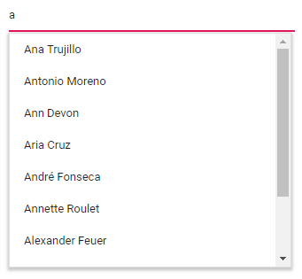
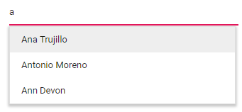
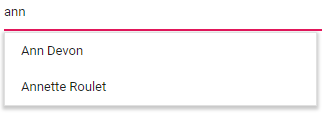

# Filtering

The AutoComplete has built-in support to filter data items. The filter operation
starts as soon as you start typing characters in the component.

## Change the filter type

Determines on which filter type the component needs to be considered on search action.
The available [FilterType](https://help.syncfusion.com/cr/blazor/Syncfusion.Blazor~Syncfusion.Blazor.DropDowns.DropDownBase%601~FilterType.html) and its supported data types are:

| **Filter Type** | **Description** | **Supported Types** |
| --- | --- |
| StartsWith | Checks whether a value begins with the specified value. | String |
| EndsWith | Checks whether a value ends with specified value. | String |
| Contains | Checks whether a value contains with specified value. | String |

The following examples shows data filtering is done with the `StartsWith` type.

```csharp
@using Syncfusion.Blazor.Data
@using Syncfusion.Blazor.DropDowns

<SfAutoComplete TValue="string" TItem="OrderDetails"  Placeholder="Select a customerID" Query="@Query" FilterType="Syncfusion.Blazor.DropDowns.FilterType.StartsWith">
    <SfDataManager Url="https://services.odata.org/V4/Northwind/Northwind.svc/" Adaptor="Adaptors.ODataV4Adaptor" CrossDomain=true></SfDataManager>
    <AutoCompleteFieldSettings Value="ContactName"></AutoCompleteFieldSettings>
</SfAutoComplete>

@code {
    public Query Query = new Query().Select(new List<string> { "CustomerID" }).Take(6).RequiresCount();
    public class OrderDetails
    {
        public int? OrderID { get; set; }
        public string CustomerID { get; set; }
        public int? EmployeeID { get; set; }
        public double? Freight { get; set; }
        public string ShipCity { get; set; }
        public bool Verified { get; set; }
        public DateTime? OrderDate { get; set; }
        public string ShipName { get; set; }
        public string ShipCountry { get; set; }
        public DateTime? ShippedDate { get; set; }
        public string ShipAddress { get; set; }
    }
}
```

The output will be as follows.



## Filter item count

You can specify the filter suggestion item count using the
[SuggestionCount](https://help.syncfusion.com/cr/blazor/Syncfusion.Blazor~Syncfusion.Blazor.DropDowns.SfAutoComplete%601~SuggestionCount.html) property of AutoComplete.

Refer to the following example to restrict the suggestion list item counts as 3.

```csharp
@using Syncfusion.Blazor.Data
@using Syncfusion.Blazor.DropDowns

<SfAutoComplete TValue="string" TItem="OrderDetails" Placeholder="Select a customerID" Query="@Query" SuggestionCount=3 FilterType="Syncfusion.Blazor.DropDowns.FilterType.StartsWith">
    <SfDataManager Url="https://services.odata.org/V4/Northwind/Northwind.svc/" Adaptor="Adaptors.ODataV4Adaptor" CrossDomain=true></SfDataManager>
    <AutoCompleteFieldSettings Value="CustomerID"></AutoCompleteFieldSettings>
</SfAutoComplete>

@code {

    public Query Query = new Query().Select(new List<string> { "CustomerID" }).RequiresCount();
    public class OrderDetails
    {
        public int? OrderID { get; set; }
        public string CustomerID { get; set; }
        public int? EmployeeID { get; set; }
        public double? Freight { get; set; }
        public string ShipCity { get; set; }
        public bool Verified { get; set; }
        public DateTime? OrderDate { get; set; }
        public string ShipName { get; set; }
        public string ShipCountry { get; set; }
        public DateTime? ShippedDate { get; set; }
        public string ShipAddress { get; set; }
    }
}
```

The output will be as follows.



## Limit the minimum filter character

You can set the limit for the character count to filter the data on the AutoComplete. This can be done by
setting the [MinLength](https://help.syncfusion.com/cr/blazor/Syncfusion.Blazor~Syncfusion.Blazor.DropDowns.SfAutoComplete%601~MinLength.html) property to AutoComplete.

In the following example, the remote request doesn't fetch the search data until the search key contains three characters.

```csharp
@using Syncfusion.Blazor.Data
@using Syncfusion.Blazor.DropDowns

<SfAutoComplete TValue="string" TItem="OrderDetails" Placeholder="Select a customerID" Query="@Query" MinLength=3 FilterType="Syncfusion.Blazor.DropDowns.FilterType.StartsWith">
    <SfDataManager Url="https://services.odata.org/V4/Northwind/Northwind.svc/" Adaptor="Adaptors.ODataV4Adaptor" CrossDomain=true></SfDataManager>
    <AutoCompleteFieldSettings Value="CustomerID"></AutoCompleteFieldSettings>
</SfAutoComplete>

@code {

    public Query Query = new Query().Select(new List<string> { "CustomerID" }).RequiresCount();
    public class OrderDetails
    {
        public int? OrderID { get; set; }
        public string CustomerID { get; set; }
        public int? EmployeeID { get; set; }
        public double? Freight { get; set; }
        public string ShipCity { get; set; }
        public bool Verified { get; set; }
        public DateTime? OrderDate { get; set; }
        public string ShipName { get; set; }
        public string ShipCountry { get; set; }
        public DateTime? ShippedDate { get; set; }
        public string ShipAddress { get; set; }
    }
}
```

The output will be as follows.



## Case sensitive filtering

Data items can be filtered either with or without case sensitivity using the DataManager.
This can be done by setting the [IgnoreCase](https://help.syncfusion.com/cr/blazor/Syncfusion.Blazor~Syncfusion.Blazor.DropDowns.DropDownBase%601~IgnoreCase.html) property of AutoComplete.

The following sample depicts how to filter the data with case-sensitive.

```csharp
@using Syncfusion.Blazor.Data
@using Syncfusion.Blazor.DropDowns

<SfAutoComplete TValue="string" TItem="Countries" Placeholder="Select a country" IgnoreCase=false DataSource="@LocalData">
    <AutoCompleteFieldSettings Value="Name"></AutoCompleteFieldSettings>
</SfAutoComplete>

@code {

    public class Countries
    {
        public string Name { get; set; }
        public string Code { get; set; }
    }

    List<Countries> LocalData = new List<Countries> {
        new Countries() { Name = "Australia", Code = "AU" },
        new Countries() { Name = "Bermuda", Code = "BM" },
        new Countries() { Name = "Canada", Code = "CA" },
        new Countries() { Name = "Cameroon", Code = "CM" },
        new Countries() { Name = "Denmark", Code = "DK" },
        new Countries() { Name = "France", Code = "FR" },
        new Countries() { Name = "Finland", Code = "FI" },
        new Countries() { Name = "Germany", Code = "DE" },
        new Countries() { Name = "Greenland", Code = "GL" },
        new Countries() { Name = "Hong Kong", Code = "HK" },
    };
}
```

## Diacritics filtering

An AutoComplete supports diacritics filtering, which will ignore the [Diacritics](https://en.wikipedia.org/wiki/Diacritic) and
makes it easier to filter the results in international characters lists
when the [IgnoreAccent](https://help.syncfusion.com/cr/blazor/Syncfusion.Blazor~Syncfusion.Blazor.DropDowns.DropDownBase%601~IgnoreAccent.html) is enabled.

In the following sample, data with diacritics are bound as dataSource for AutoComplete.

```csharp
@using Syncfusion.Blazor.Data
@using Syncfusion.Blazor.DropDowns

<SfAutoComplete TValue="string" TItem="Data" Placeholder="e.g: Aero" IgnoreAccent=true DataSource="@Country">
    <AutoCompleteFieldSettings Value="Name"></AutoCompleteFieldSettings>
</SfAutoComplete>

@code {

    public class Data
    {
        public string Name { get; set; }
    }

    List<Data>Country = new List<Data>
    {
        new Data() { Name = "Aeróbics"},
        new Data() { Name = "Aeróbics en Agua"},
        new Data() { Name = "Aerografía"},
        new Data() { Name = "Águilas"},
        new Data() { Name = "Ajedrez"},
        new Data() { Name = "Ala Delta"},
        new Data() { Name = "Álbumes de Música"},
        new Data() { Name = "Alusivos"},
        new Data() { Name = "Análisis de Escritura a Mano"},
    };
}
```
