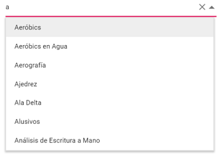

# Filtering

The ComboBox has built-in support to filter data items when [AllowFiltering](https://help.syncfusion.com/cr/blazor/Syncfusion.Blazor~Syncfusion.Blazor.DropDowns.SfComboBox%601~AllowFiltering.html) is enabled. The filter
operation starts as soon as you start typing characters in the component.

```csharp
@using Syncfusion.Blazor.Data
@using Syncfusion.Blazor.DropDowns

<SfComboBox TValue="string" TItem="EmployeeData" Placeholder="Select a customer" Query="@Query" AllowFiltering=true>
    <SfDataManager Url="https://ej2services.syncfusion.com/production/web-services/api/Employees" Adaptor="Adaptors.WebApiAdaptor" CrossDomain=true></SfDataManager>
    <ComboBoxFieldSettings Text="FirstName" Value="EmployeeID"></ComboBoxFieldSettings>
</SfComboBox>

@code {
    public Query Query = new Query();

    public class EmployeeData
    {
        public int EmployeeID { get; set; }
        public string FirstName { get; set; }
        public string Designation { get; set; }
        public string Country { get; set; }
    }
}
```

The output will be as follows.


## Diacritics filtering

ComboBox supports diacritics filtering, which will ignore the [Diacritics](https://en.wikipedia.org/wiki/Diacritic) and
makes it easier to filter the results in international characters lists
when the [IgnoreAccent](https://help.syncfusion.com/cr/blazor/Syncfusion.Blazor~Syncfusion.Blazor.DropDowns.DropDownBase%601~IgnoreAccent.html) is enabled.

In the following sample, data with diacritics are bound as dataSource for ComboBox.

```csharp
@using Syncfusion.Blazor.DropDowns

<SfComboBox TValue="string" TItem="Data" Placeholder="e.g: Aero" AllowFiltering=true IgnoreAccent=true DataSource="@Country">
    <ComboBoxFieldSettings Value="Name"></ComboBoxFieldSettings>
</SfComboBox>

@code {

    public class Data
    {
        public string Name { get; set; }
    }

    List<Data> Country = new List<Data>
{
        new Data() { Name = "Aeróbics"},
        new Data() { Name = "Aeróbics en Agua"},
        new Data() { Name = "Aerografía"},
        new Data() { Name = "Águilas"},
        new Data() { Name = "Ajedrez"},
        new Data() { Name = "Ala Delta"},
        new Data() { Name = "Álbumes de Música"},
        new Data() { Name = "Alusivos"},
        new Data() { Name = "Análisis de Escritura a Mano"},
    };
}
```

The output will be as follows.


