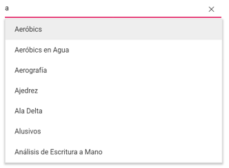

# Filtering

The MultiSelect has built-in support to filter data items when [AllowFiltering](https://help.syncfusion.com/cr/aspnetcore-blazor/Syncfusion.Blazor~Syncfusion.Blazor.DropDowns.MultiSelectModel~AllowFiltering.html) is enabled. The filter
operation starts as soon as you start typing characters in the MultiSelect input.

```csharp
@using Syncfusion.Blazor.Data
@using Syncfusion.Blazor.DropDowns

<SfMultiSelect TValue="string[]" Placeholder="Select a customer" Query="@Query" AllowFiltering=true>
    <SfDataManager Url="https://ej2services.syncfusion.com/production/web-services/api/Employees" Adaptor="Adaptors.WebApiAdaptor" CrossDomain=true></SfDataManager>
    <MultiSelectFieldSettings Text="FirstName" Value="EmployeeID"></MultiSelectFieldSettings>
</SfMultiSelect>

@code {
    public string Query = "new sf.data.Query().select(['FirstName', 'EmployeeID']).take(6).requiresCount()";
}
```

The output will be as follows.


## Diacritics Filtering

MultiSelect supports diacritics filtering which will ignore the [Diacritics](https://en.wikipedia.org/wiki/Diacritic) and
makes it easier to filter the results in international characters lists
when the [IgnoreAccent](https://help.syncfusion.com/cr/aspnetcore-blazor/Syncfusion.Blazor~Syncfusion.Blazor.DropDowns.MultiSelectModel~IgnoreAccent.html) is enabled.

In the following sample, data with diacritics are bound as dataSource for MultiSelect.

```csharp
@using Syncfusion.Blazor.DropDowns

<SfMultiSelect TValue="string[]" Placeholder="e.g: Aero" AllowFiltering=true IgnoreAccent=true DataSource="@Country">
    <MultiSelectFieldSettings Value="Name"></MultiSelectFieldSettings>
</SfMultiSelect>

@code {

    public class Data
    {
        public string Name { get; set; }
    }

    List<Data> Country = new List<Data>
{
        new Data() { Name = "Aeróbics"},
        new Data() { Name = "Aeróbics en Agua"},
        new Data() { Name = "Aerografía"},
        new Data() { Name = "Águilas"},
        new Data() { Name = "Ajedrez"},
        new Data() { Name = "Ala Delta"},
        new Data() { Name = "Álbumes de Música"},
        new Data() { Name = "Alusivos"},
        new Data() { Name = "Análisis de Escritura a Mano"},
    };
}
```

The output will be as follows.
