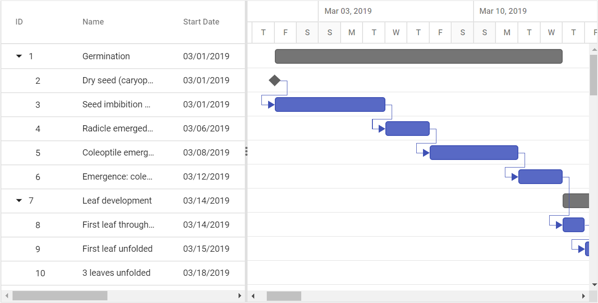

# Data Binding

The Gantt control uses `DataManager` for binding the data source, which supports both RESTful JSON data services and local JavaScript object array. The [`DataSource`](https://help.syncfusion.com/cr/cref_files/aspnetcore-js2/Syncfusion.EJ2~Syncfusion.EJ2.Gantt.Gantt~DataSource.html) property can be assigned either with the instance of DataManager or JavaScript object array collection. The Gantt control supports binding two types of data:
* Local data
* Remote data

## Local data

To bind local data to Gantt, you can assign a JavaScript object array to the [`DataSource`](https://help.syncfusion.com/cr/cref_files/aspnetcore-js2/Syncfusion.EJ2~Syncfusion.EJ2.Gantt.Gantt~DataSource.html) property. The local data source can also be provided as an instance of the `DataManager`.

In local data binding, the data source for rendering the Gantt control is retrieved from the same application locally.

The following are the two types of data binding possible with the Gantt control:

* Hierarchical data binding.
* Self-referential data binding (Flat data).

### Hierarchical data binding

The [`Child`](https://help.syncfusion.com/cr/cref_files/aspnetcore-js2/Syncfusion.EJ2~Syncfusion.EJ2.Gantt.GanttTaskFields~Child.html) property is used to map the child records in hierarchical data.

The following code example shows how to bind the hierarchical local data into the Gantt control.





### Self-referential data binding (Flat data)

The Gantt control can be bound with self-referential data by mapping the data source field values to the [`Id`](https://help.syncfusion.com/cr/cref_files/aspnetcore-js2/Syncfusion.EJ2~Syncfusion.EJ2.Gantt.GanttTaskFields~Id.html) and [`ParentID`](https://help.syncfusion.com/cr/cref_files/aspnetcore-js2/Syncfusion.EJ2~Syncfusion.EJ2.Gantt.GanttTaskFields~ParentID.html) properties.

* ID field: This field contains unique values used to identify each individual task and it is mapped to the [`Id`](https://help.syncfusion.com/cr/cref_files/aspnetcore-js2/Syncfusion.EJ2~Syncfusion.EJ2.Gantt.GanttTaskFields~Id.html) property.
* Parent ID field: This field contains values that indicate parent tasks and it is mapped to the [`ParentID`](https://help.syncfusion.com/cr/cref_files/aspnetcore-js2/Syncfusion.EJ2~Syncfusion.EJ2.Gantt.GanttTaskFields~ParentID.html) property.





## Remote data

To bind remote data to the Gantt component, assign service data as an instance of `DataManager` to the [`DataSource`](https://help.syncfusion.com/cr/cref_files/aspnetcore-js2/Syncfusion.EJ2~Syncfusion.EJ2.Gantt.Gantt~DataSource.html) property.





