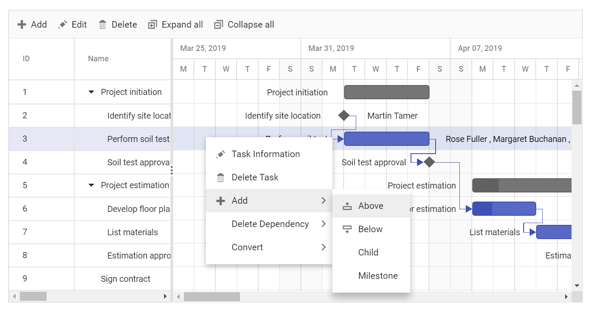
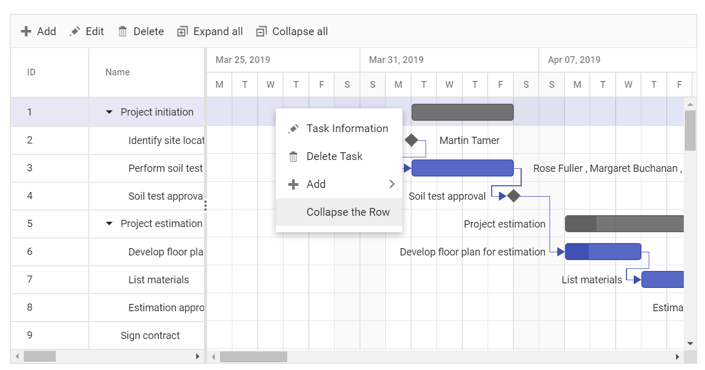

# Context menu

The Gantt control allows you to perform quick actions by using context menu. When right-clicking the context menu, the context menu options are shown. To enable this feature, set the [`enableContextMenu`] to true. The default context menu options are enabled using the [`editSettings`] property. The context menu options can be customized using the [`contextMenuItems`] property.

The default items are listed in the following table.

Items| Description
----|----
`AutoFit`|  Auto-fits the current column.
`AutoFitAll` | Auto-fits all columns.
`SortAscending` | Sorts the current column in ascending order.
`SortDescending` | Sorts the current column in descending order.
`TaskInformation`|  Edits the current task.
`Add` | Adds a new row to the Gantt.
`Indent` | Indent the selected record to one level.
`Outdent` | Outdent the selected record to one level.
`DeleteTask` | Deletes the current task.
`Save` | Saves the edited task.
`Cancel` | Cancels the edited task.
`DeleteDependency` | Deletes the current dependency task link.
`Convert` | Converts current task to milestone or vice-versa.





## Custom context menu items

The custom context menu items can be added by defining the [`contextMenuItems`] as a collection of [`contextMenuItemModel`].
Actions for the customized items can be defined in the [`contextMenuClick`] event and the visibility of customized items can be defined in the [`contextMenuOpen`] event.

The following sample shows context menu item for parent rows to expand or collapse child rows.





> You can show an specific item in context menu for header/content area in the Gantt control by defining the `target` property.