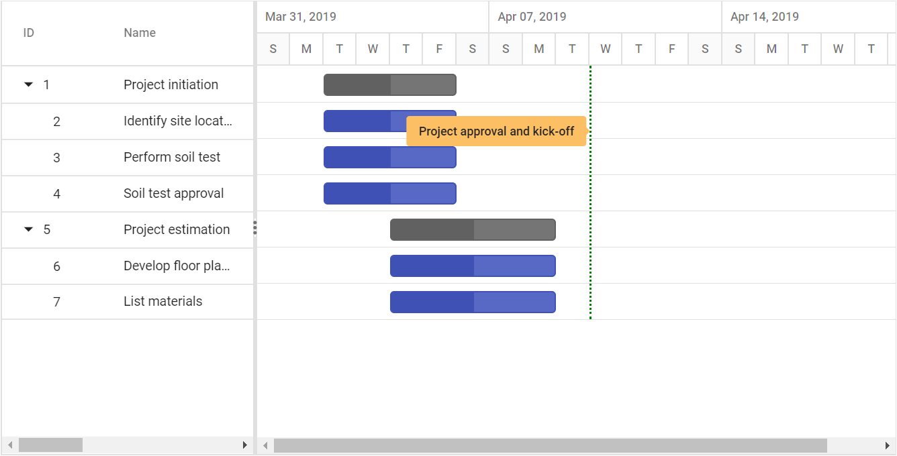

# Event Markers

The event markers in the Gantt control is used to highlight the important events in a project. Event markers can be initialized by using the [`EventMarkers`](https://help.syncfusion.com/cr/cref_files/aspnetcore-js2/Syncfusion.EJ2~Syncfusion.EJ2.Gantt.Gantt~EventMarkers.html) property, and you can define date and label for the event markers using the [`Day`](https://help.syncfusion.com/cr/cref_files/aspnetcore-js2/Syncfusion.EJ2~Syncfusion.EJ2.Gantt.GanttEventMarker~Day.html) and [`Label`](https://help.syncfusion.com/cr/cref_files/aspnetcore-js2/Syncfusion.EJ2~Syncfusion.EJ2.Gantt.GanttEventMarker~Label.html) properties. You can also customize it using the [`CssClass`](https://help.syncfusion.com/cr/cref_files/aspnetcore-js2/Syncfusion.EJ2~Syncfusion.EJ2.Gantt.GanttEventMarker~CssClass.html) properties. The following code example shows how to add event markers in the Gantt control.





