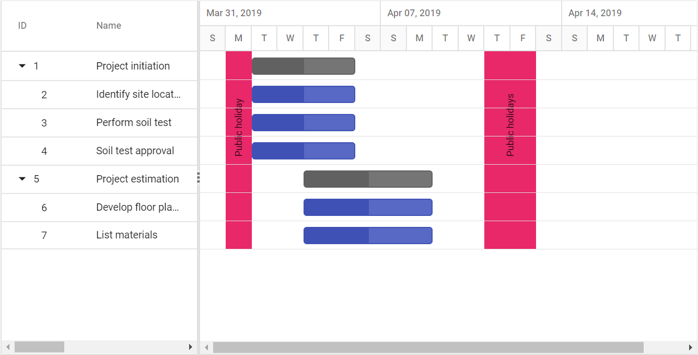

# Holidays

Non-working days in a project can be displayed in the Gantt control using the [`Holidays`](https://help.syncfusion.com/cr/cref_files/aspnetcore-js2/Syncfusion.EJ2~Syncfusion.EJ2.Gantt.Gantt~Holidays.html) property. Each holiday can be defined with the following properties:

* [`From`](https://help.syncfusion.com/cr/cref_files/aspnetcore-js2/Syncfusion.EJ2~Syncfusion.EJ2.Gantt.GanttHoliday~From.html): Defines start date of the holiday(s).
* [`To`](https://help.syncfusion.com/cr/cref_files/aspnetcore-js2/Syncfusion.EJ2~Syncfusion.EJ2.Gantt.GanttHoliday~To.html): Defines end date of the holiday(s).
* [`Label`](https://help.syncfusion.com/cr/cref_files/aspnetcore-js2/Syncfusion.EJ2~Syncfusion.EJ2.Gantt.GanttHoliday~Label.html): Defines the description or label for the holiday.
* [`CssClass`](https://help.syncfusion.com/cr/cref_files/aspnetcore-js2/Syncfusion.EJ2~Syncfusion.EJ2.Gantt.GanttHoliday~CssClass.html): Formats the holidays label in the Gantt chart.

The following code example shows how to display the non-working days in the Gantt control.





The following screenshot shows the output of Holidays in Gantt control.

