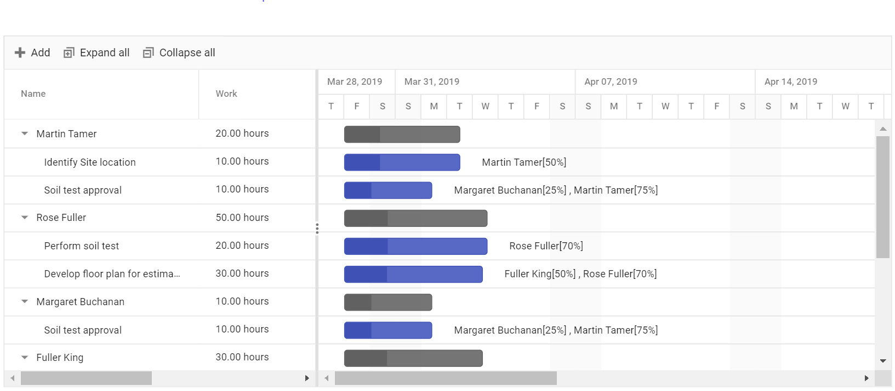

# Resource Breakdown View

The resource breakdown view is used to visualize the tasks assigned to each resource in hierarchy manner. Resources are displayed as parents and all the tasks assigned to each resource are displayed as its child records. It can be initialized by setting the [`viewType`](../api/gantt/#viewtype) property to `ResourceView`.

## Unassigned task

A task not assigned to any one of the resource are termed as unassigned tasks. The unassigned tasks are grouped with a name as `Unassigned Task` and displayed at the bottom of Gantt data collection . It is validated at load time during Gantt record creation by default based on a task `resourceInfo` mapping property in the Gantt chart data source. If the resource is assigned to the unassigned grouped tasks, the task will be moved as child to the respective resource.

## Resource task

A task assigned to one or more resources are termed as resource task and it is added as child task to the respective resource. Already assigned task can also be shared or moved with other resources by adding a resource name to the task or removing resource name from the task by cell or dialog editing.

>Note: Currently, there is no support for predecessor validation in `ResourceView` type.





