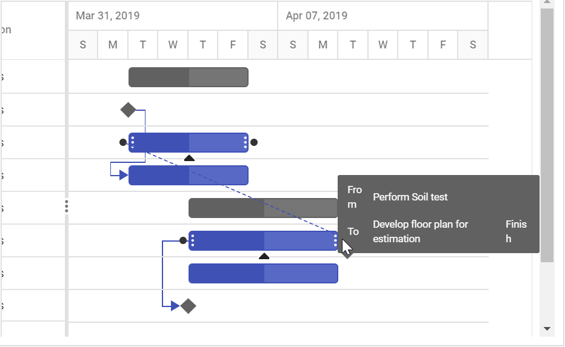
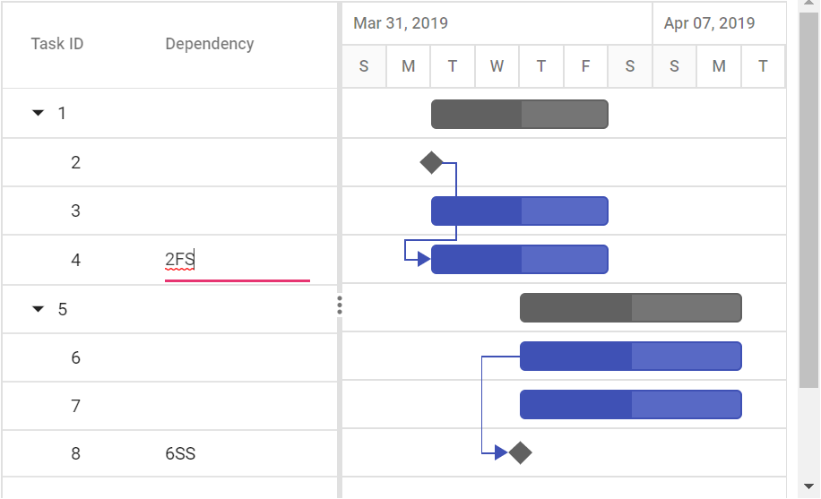
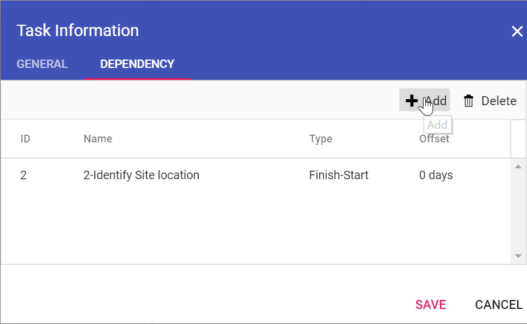

# Managing Tasks

The Gantt component has options to dynamically insert, delete, and update tasks in a project. The primary key column is necessary to manage the tasks and perform CRUD operations in Gantt. To define the primary key, set the [`columns.isPrimaryKey`](../api/gantt/column/#isprimarykey) property to `true` in the column.

To use CRUD, inject the [`Edit`](../api/gantt/#editmodule) module into the Gantt component.

## Adding new tasks

Tasks can be dynamically added to the Gantt project by enabling the [`editSettings.allowAdding`](../api/gantt/editSettings/#allowadding) property.

### Toolbar

A row can be added to the Gantt component from the toolbar while the [`editSettings.allowAdding`](../api/gantt/editSettings/#allowadding) property is set to `true`. After clicking the toolbar add icon, you should provide the task information in the add dialog.



```typescript
import * as React from 'react';
import * as ReactDOM from 'react-dom';
import { GanttComponent, Inject, Edit, EditSettingsModel, Selection, Toolbar, ToolbarItem } from '@syncfusion/ej2-react-gantt';
import { data } from './datasource';
class App extends React.Component<{}, {}>{
    public taskFields: any = {
    id: 'TaskID',
    name: 'TaskName',
    startDate: 'StartDate',
    duration: 'Duration',
    progress: 'Progress',
    child: 'subtasks'
  };
  public editOptions: EditSettingsModel = {
      allowAdding: true
  };
  public toolbarOptions: ToolbarItem[] = ['Add'];
    render() {
        return <GanttComponent dataSource={data} taskFields={this.taskFields} allowSelection={true}
        editSettings={this.editOptions} toolbar={this.toolbarOptions} height = '450px'>
            <Inject services={[Edit, Selection, Toolbar]} />
        </GanttComponent>
    }
};
ReactDOM.render(<App />, document.getElementById('root'));
```



> By default, a new row will be added to the top-most row in the Gantt component.

### Context menu

A row can also be added above, below or child of the selected row by using context menu support. For this, we need to enable the property[`enableContextMenu`](../api/gantt/#enablecontextmenu) and inject the [`ContextMenu`](../api/gantt/#contextmodule) module into the Gantt control.



```typescript

import * as React from 'react';
import * as ReactDOM from 'react-dom';
import { GanttComponent, Inject, Edit, ContextMenu, Selection, Sort, Resize, Toolbar } from '@syncfusion/ej2-react-gantt';
import { data } from './datasource';
class App extends React.Component {
    constructor() {
        super(...arguments);
        this.taskFields = {
            id: 'TaskID',
            name: 'TaskName',
            startDate: 'StartDate',
            duration: 'Duration',
            progress: 'Progress',
            child: 'subtasks'
        };
        this.editOptions = {
            allowAdding: true,
            allowEditing: true,
            allowDeleting: true
        };
        this.toolbarOptions = ['Add'];
    }
    render() {
        return <GanttComponent dataSource={data} taskFields={this.taskFields} allowSelection={true} editSettings={this.editOptions} enableContextMenu={true} toolbar={this.toolbarOptions} height='450px'>
           <Inject services={[Edit, ContextMenu, Selection, Sort, Resize, Toolbar]}/>
        </GanttComponent>;
    }
}
;
ReactDOM.render(<App />, document.getElementById('root'));

```



### Using method

You can add rows to the Gantt component dynamically using the [`addRecord`](../api/gantt/#addrecord) method and you can define the add position of the default new record by using the [`rowPosition`](../api/gantt/rowPosition/) property. You can also pass the `rowIndex` as an additional parameter.

* Top of all the rows.
* Bottom to all the existing rows.
* Above the selected row.
* Below the selected row.
* As child to the selected row.



```typescript
import * as React from 'react';
import * as ReactDOM from 'react-dom';
import { ButtonComponent } from '@syncfusion/ej2-react-buttons';
import { GanttComponent, Inject, Edit, EditSettingsModel, Selection, ColumnsDirective, ColumnDirective} from '@syncfusion/ej2-react-gantt';
import { data } from './datasource';
class App extends React.Component<{}, {}>{
    public taskFields: any = {
    id: 'TaskID',
    name: 'TaskName',
    startDate: 'StartDate',
    duration: 'Duration',
    progress: 'Progress',
    child: 'subtasks'
  };
  public editOptions: EditSettingsModel = {
      allowAdding: true,
      allowEditing: true
  };
  private ganttInstance:any;
  public clickHandler(){
    let data: any= {
        TaskID: 10,
        TaskName: 'New Added Task',
        StartDate: new Date('04/02/2019'),
        Duration: 4,
        Progress: 50
    };
    this.ganttInstance.editModule.addRecord(data, 'Below', 2);
}
    render() {
        return(<div>
        <ButtonComponent onClick= { this.clickHandler.bind(this)}>Add Row</ButtonComponent>
        <GanttComponent dataSource={data}  ref={gantt => this.ganttInstance = gantt}  taskFields={this.taskFields} allowSelection={true}
        editSettings={this.editOptions} height = '450px'>
            <Inject services={[Edit, Selection]} />
        </GanttComponent></div>)
    }
};
ReactDOM.render(<App />, document.getElementById('root'));
```



## Editing tasks

The editing feature can be enabled in the Gantt component by enabling the [`editSettings.allowEditing`](../api/gantt/editSettings/#allowediting) and [`editSettings.allowTaskbarEditing`](../api/gantt/editSettings/#allowtaskbarediting) properties.

The following editing options are available to update the tasks in the Gantt chart:
* Cell
* Dialog
* Taskbar
* Dependency links

### Cell editing

By setting the edit mode to auto using the [`editSettings.mode`](../api/gantt/editSettings/#mode) property, the tasks can be edited by double-clicking the TreeGrid cells.

`Note:` If the [`Edit`](../api/gantt/#editmodule) module is not injected, you cannot edit the tasks through TreeGrid cells.

The following code example shows you how to enable the cell editing in Gantt component.



```typescript
import * as React from 'react';
import * as ReactDOM from 'react-dom';
import { GanttComponent, Inject, Edit, EditSettingsModel, Selection } from '@syncfusion/ej2-react-gantt';
import { data } from './datasource';
class App extends React.Component<{}, {}>{
    public taskFields: any = {
    id: 'TaskID',
    name: 'TaskName',
    startDate: 'StartDate',
    duration: 'Duration',
    progress: 'Progress',
    child: 'subtasks'
  };
  public editOptions: EditSettingsModel = {
    allowEditing: true,
    mode: 'Auto'
  };
    render() {
        return <GanttComponent dataSource={data} taskFields={this.taskFields} allowSelection={true}
        editSettings={this.editOptions} height = '450px'>
            <Inject services={[Edit, Selection]} />
        </GanttComponent>
    }
};
ReactDOM.render(<App />, document.getElementById('root'));
```



`Note:` When the edit mode is set to `Auto`, double-clicking on the TreeGrid side changes the cells to editable mode. Double-clicking on the chart side opens the edit dialog for editing the task details.

### Dialog editing

Modify the task details through the edit dialog by setting the edit [`mode`](../api/gantt/editSettings/#mode).



```typescript
import * as React from 'react';
import * as ReactDOM from 'react-dom';
import { GanttComponent, Inject, Edit, EditSettingsModel } from '@syncfusion/ej2-react-gantt';
import { data } from './datasource';
class App extends React.Component<{}, {}>{
    public taskFields: any = {
    id: 'TaskID',
    name: 'TaskName',
    startDate: 'StartDate',
    duration: 'Duration',
    progress: 'Progress',
    child: 'subtasks'
  };
  public editOptions: EditSettingsModel = {
    allowEditing: true,
    mode: 'Dialog'
  };
    render() {
        return <GanttComponent dataSource={data} taskFields={this.taskFields}
        editSettings={this.editOptions} height = '450px'>
            <Inject services={[Edit]} />
        </GanttComponent>
    }
};
ReactDOM.render(<App />, document.getElementById('root'));
```



`Note:` In dialog editing mode, the edit dialog appears when the TreeGrid or Gantt chart sides are double-clicked.

#### Sections or tabs in dialog

In the Gantt dialog, you can define the required tabs or editing sections using the [`addDialogFields`](../api/gantt/#adddialogfields) and [`editDialogFields`](../api/gantt/#editdialogfields) properties. Every tab is defined using the [`type`](../api/gantt/dialogFieldType/) property.



```typescript
let ProjectResources: Object[] = [
  { resourceId: 1, resourceName: 'Martin Tamer' },
  { resourceId: 2, resourceName: 'Rose Fuller' },
  { resourceId: 3, resourceName: 'Margaret Buchanan' },
  { resourceId: 4, resourceName: 'Fuller King' },
  { resourceId: 5, resourceName: 'Davolio Fuller' },
  { resourceId: 6, resourceName: 'Van Jack' },
  { resourceId: 7, resourceName: 'Fuller Buchanan' },
  { resourceId: 8, resourceName: 'Jack Davolio' },
  { resourceId: 9, resourceName: 'Tamer Vinet' },
  { resourceId: 10, resourceName: 'Vinet Fuller' },
  { resourceId: 11, resourceName: 'Bergs Anton' },
  { resourceId: 12, resourceName: 'Construction Supervisor' }
];

let data: Object[] = [
  {
      TaskID: 1,
      TaskName: 'Project Initiation',
      StartDate: new Date('04/02/2019'),
      EndDate: new Date('04/21/2019'),
      isParent: true,
      subtasks: [
          { TaskID: 2, TaskName: 'Identify Site location', StartDate: new Date('04/02/2019'), Duration: 0, Progress: 50, isParent: false, info: 'Measure the total property area alloted for construction' },
          {
              TaskID: 3, TaskName: 'Perform Soil test', StartDate: new Date('04/02/2019'), Duration: 4, Progress: 50, resources: [2, 3, 5], isParent: false, info: 'Obtain an engineered soil test of lot where construction is planned.' +
                  'From an engineer or company specializing in soil testing'
          },
          { TaskID: 4, TaskName: 'Soil test approval', StartDate: new Date('04/02/2019'), Duration: 4, Predecessor: "2FS", Progress: 50, isParent: false },
      ]
  },
  {
      TaskID: 5,
      TaskName: 'Project Estimation',
      StartDate: new Date('04/02/2019'),
      EndDate: new Date('04/21/2019'),
      isParent: true,
      subtasks: [
          {
              TaskID: 6, TaskName: 'Develop floor plan for estimation', StartDate: new Date('04/04/2019'), Duration: 3, Progress: 50, resources: [4],
              isParent: false, info: 'Develop floor plans and obtain a materials list for estimations'
          },
          { TaskID: 7, TaskName: 'List materials', StartDate: new Date('04/04/2019'), Duration: 3, Progress: 50, resources: [4, 8], isParent: false, info: '' },
          { TaskID: 8, TaskName: 'Estimation approval', StartDate: new Date('04/04/2019'), Duration: 0, Predecessor: "6SS", Progress: 50, resources: [12, 5], isParent: false, info: '' }
      ]
  },
];

import * as React from 'react';
import * as ReactDOM from 'react-dom';
import { GanttComponent, Inject,Toolbar, ToolbarItem, Edit,AddDialogFieldsDirective, EditSettingsModel, EditDialogFieldsDirective, EditDialogFieldDirective, AddDialogFieldDirective } from '@syncfusion/ej2-react-gantt';

class App extends React.Component<{}, {}>{
    public taskFields: any = {
        id: 'TaskID',
        name: 'TaskName',
        startDate: 'StartDate',
        endDate: 'EndDate',
        duration: 'Duration',
        progress: 'Progress',
        dependency: 'Predecessor',
        child: 'subtasks',
        notes: 'info',
        resourceInfo: 'resources'
  };
  public toolbarOptions: ToolbarItem[] = ['Add'];
    public editOptions: EditSettingsModel = {
        allowEditing: true,
        allowAdding:true,
        mode: 'Dialog'
  };
    render() {
        return <GanttComponent dataSource={data} toolbar={this.toolbarOptions} taskFields={this.taskFields} editSettings={this.editOptions} height='450px'
        resourceNameMapping='resourceName' resourceIDMapping='resourceId' resources={ProjectResources}>
        <AddDialogFieldsDirective>
            <AddDialogFieldDirective type='General' headerText='General'></AddDialogFieldDirective>
            <AddDialogFieldDirective type='Dependency'></AddDialogFieldDirective>
        </AddDialogFieldsDirective>
           <EditDialogFieldsDirective>
              <EditDialogFieldDirective type='General' headerText='General'></EditDialogFieldDirective>
              <EditDialogFieldDirective type='Dependency'></EditDialogFieldDirective>
              <EditDialogFieldDirective type='Resources'></EditDialogFieldDirective>
              <EditDialogFieldDirective type='Notes'></EditDialogFieldDirective>
            </EditDialogFieldsDirective>
            <Inject services={[Edit, Toolbar]} />
        </GanttComponent>
    }
};
ReactDOM.render(<App />, document.getElementById('root'));
```



#### Limiting data fields in general tab

In the Gantt dialog, you can make only specific data source fields visible for editing by using the [`addDialogFields`](../api/gantt/#adddialogfields) and [`editDialogFields`](../api/gantt/#editdialogfields) properties. The data fields are defined with [`type`](../api/gantt/addDialogFieldSettings/#type) and [`fields`] (../api/gantt/addDialogFieldSettings/#fields) properties.

`Note:` You can also define the custom fields in the add/edit dialog General tab using the [`fields`](../api/gantt/addDialogFieldSettings/#fields) property.



```typescript
let ProjectResources: Object[] = [
  { resourceId: 1, resourceName: 'Martin Tamer' },
  { resourceId: 2, resourceName: 'Rose Fuller' },
  { resourceId: 3, resourceName: 'Margaret Buchanan' },
  { resourceId: 4, resourceName: 'Fuller King' },
  { resourceId: 5, resourceName: 'Davolio Fuller' },
  { resourceId: 6, resourceName: 'Van Jack' },
  { resourceId: 7, resourceName: 'Fuller Buchanan' },
  { resourceId: 8, resourceName: 'Jack Davolio' },
  { resourceId: 9, resourceName: 'Tamer Vinet' },
  { resourceId: 10, resourceName: 'Vinet Fuller' },
  { resourceId: 11, resourceName: 'Bergs Anton' },
  { resourceId: 12, resourceName: 'Construction Supervisor' }
];

let data: Object[] = [
  {
      TaskID: 1,
      TaskName: 'Project Initiation',
      StartDate: new Date('04/02/2019'),
      EndDate: new Date('04/21/2019'),
      isParent: true,
      subtasks: [
          { TaskID: 2, TaskName: 'Identify Site location', StartDate: new Date('04/02/2019'), Duration: 0, Progress: 50, isParent: false, info: 'Measure the total property area alloted for construction' },
          {
              TaskID: 3, TaskName: 'Perform Soil test', StartDate: new Date('04/02/2019'), Duration: 4, Progress: 50, resources: [2, 3, 5], isParent: false, info: 'Obtain an engineered soil test of lot where construction is planned.' +
                  'From an engineer or company specializing in soil testing'
          },
          { TaskID: 4, TaskName: 'Soil test approval', StartDate: new Date('04/02/2019'), Duration: 4, Predecessor: "2FS", Progress: 50, isParent: false },
      ]
  },
  {
      TaskID: 5,
      TaskName: 'Project Estimation',
      StartDate: new Date('04/02/2019'),
      EndDate: new Date('04/21/2019'),
      isParent: true,
      subtasks: [
          {
              TaskID: 6, TaskName: 'Develop floor plan for estimation', StartDate: new Date('04/04/2019'), Duration: 3, Progress: 50, resources: [4],
              isParent: false, info: 'Develop floor plans and obtain a materials list for estimations'
          },
          { TaskID: 7, TaskName: 'List materials', StartDate: new Date('04/04/2019'), Duration: 3, Progress: 50, resources: [4, 8], isParent: false, info: '' },
          { TaskID: 8, TaskName: 'Estimation approval', StartDate: new Date('04/04/2019'), Duration: 0, Predecessor: "6SS", Progress: 50, resources: [12, 5], isParent: false, info: '' }
      ]
  },
];

import * as React from 'react';
import * as ReactDOM from 'react-dom';
import { GanttComponent, Inject,Toolbar, ToolbarItem, Edit, ColumnsDirective, ColumnDirective, AddDialogFieldsDirective, EditSettingsModel, EditDialogFieldsDirective, EditDialogFieldDirective, AddDialogFieldDirective } from '@syncfusion/ej2-react-gantt';

class App extends React.Component<{}, {}>{
    public taskFields: any = {
        id: 'TaskID',
        name: 'TaskName',
        startDate: 'StartDate',
        endDate: 'EndDate',
        duration: 'Duration',
        progress: 'Progress',
        dependency: 'Predecessor',
        child: 'subtasks',
        notes: 'info',
        resourceInfo: 'resources'
  };
  public toolbarOptions: ToolbarItem[] = ['Add'];
    public editOptions: EditSettingsModel = {
        allowEditing: true,
        allowAdding:true,
        mode: 'Dialog'
  };
    render() {
        return <GanttComponent dataSource={data} toolbar={this.toolbarOptions} taskFields={this.taskFields} editSettings={this.editOptions} height='450px'
        resourceNameMapping='resourceName' resourceIDMapping='resourceId' resources={ProjectResources}>
         <ColumnsDirective>
                <ColumnDirective field='TaskID' width='100' ></ColumnDirective>
                <ColumnDirective field='TaskName' headerText='Job Name' width='250'></ColumnDirective>
                <ColumnDirective field='resources'></ColumnDirective>
                <ColumnDirective field='StartDate'></ColumnDirective>
                <ColumnDirective field='Duration'></ColumnDirective>
                <ColumnDirective field='Progress'></ColumnDirective>
                <ColumnDirective field='Predecessor'></ColumnDirective>
                <ColumnDirective field='isParent' headerText='Custom Column'></ColumnDirective>
            </ColumnsDirective>
        <AddDialogFieldsDirective>
            <AddDialogFieldDirective type='General' headerText='General' fields= {['TaskID', 'TaskName', 'isParent']}></AddDialogFieldDirective>
            <AddDialogFieldDirective type='Dependency'></AddDialogFieldDirective>
            <AddDialogFieldDirective type='Resources'></AddDialogFieldDirective>
        </AddDialogFieldsDirective>
           <EditDialogFieldsDirective>
              <EditDialogFieldDirective type='General' headerText='General' fields= {['TaskID', 'TaskName', 'isParent']}></EditDialogFieldDirective>
              <EditDialogFieldDirective type='Dependency'></EditDialogFieldDirective>
              <EditDialogFieldDirective type='Resources'></EditDialogFieldDirective>
          </EditDialogFieldsDirective>
            <Inject services={[Edit, Toolbar]} />
        </GanttComponent>
    }
};
ReactDOM.render(<App />, document.getElementById('root'));
```



### Taskbar editing

Modify the task details through user interaction, such as resizing and dragging the taskbar, by enabling the [`allowTaskbarEditing`](../api/gantt/editSettings/#allowtaskbarediting) property.



```typescript
import * as React from 'react';
import * as ReactDOM from 'react-dom';
import { GanttComponent, Inject, Edit, EditSettingsModel } from '@syncfusion/ej2-react-gantt';
import { data} from './datasource';
class App extends React.Component<{}, {}>{
    public taskFields: any = {
        id: 'TaskID',
        name: 'TaskName',
        startDate: 'StartDate',
        duration: 'Duration',
        progress: 'Progress',
        child: 'subtasks'
    };
  public editOptions: EditSettingsModel = {
    allowTaskbarEditing: true
  };
    render() {
        return <GanttComponent dataSource={data} taskFields={this.taskFields}
        editSettings={this.editOptions}  height = '450px'>
            <Inject services={[Edit]} />
        </GanttComponent>
    }
};
ReactDOM.render(<App />, document.getElementById('root'));
```



#### Prevent editing for specific tasks

On taskbar edit action, the [`taskbarEditing`](../api/gantt/#taskbarediting) event will be triggered. You can prevent the taskbar from editing using the [`taskbarEditing`](../api/gantt/#taskbarediting) event. This can be done by setting cancel property of [`taskbarEditing`](../api/gantt/#taskbarediting) event argument to true. And we can hide the taskbar editing indicators like taskbar resizer, progress resizer and connector points by using [`queryTaskbarInfo`](../api/gantt/#querytaskbarinfo) event.  The following code example shows how to achieve this.



```typescript
import * as React from 'react';
import * as ReactDOM from 'react-dom';
import { GanttComponent, Inject, Edit, EditSettingsModel } from '@syncfusion/ej2-react-gantt';
import { data} from './datasource';
class App extends React.Component<{}, {}>{
    public taskFields: any = {
        id: 'TaskID',
        name: 'TaskName',
        startDate: 'StartDate',
        duration: 'Duration',
        progress: 'Progress',
        child: 'subtasks'
    };
    public editOptions: EditSettingsModel = {
        allowTaskbarEditing: true
    };
    public taskbarEditing(args: any){
        if (args.data.TaskID == 4) // We can't edit Task Id 4
            args.cancel = true;
    };
    public queryTaskbarInfo(args: any) {
        if (args.data.TaskID == 6) {
            args.taskbarElement.className += ' e-preventEdit' // Taskbar editing indicators are disabled
        }
    };
    render() {
        return <GanttComponent dataSource={data} taskFields={this.taskFields}
        editSettings={this.editOptions} taskbarEditing={this.taskbarEditing.bind(this)} height = '450px' queryTaskbarInfo={this.queryTaskbarInfo.bind(this)}>
        <Inject services={[Edit]} />
        </GanttComponent>
    }
};
ReactDOM.render(<App />, document.getElementById('root'));
```



### Task dependencies

In the Gantt component, you can update the dependencies between tasks and link the tasks interactively. The task dependencies can be mapped from the data source using the [`dependency`](../api/gantt/taskFields/#dependency) property.

You can update the task dependencies using the following ways:

* Mouse interactions: Using connector points in the taskbar, you can perform drag and drop action to create task dependency links.
* Edit dialog: Create or remove the task dependencies using the `Dependency` tab in the edit dialog.
* Cell editing: Create or remove the task links using cell editing.

The following code example demonstrates how to enable task dependency editing in the Gantt chart using the [`editSettings`](../api/gantt/editSettings/) property.



```typescript
let data: Object[] = [
  {
      TaskID: 1,
      TaskName: 'Project Initiation',
      StartDate: new Date('04/02/2019'),
      EndDate: new Date('04/21/2019'),
      isParent: true,
      subtasks: [
          { TaskID: 2, TaskName: 'Identify Site location', StartDate: new Date('04/02/2019'), Duration: 0, Progress: 50 },
          { TaskID: 3, TaskName: 'Perform Soil test', StartDate: new Date('04/02/2019'), Duration: 4, Progress: 50 },
          { TaskID: 4, TaskName: 'Soil test approval', StartDate: new Date('04/02/2019'), Duration: 4, Predecessor: "2FS", Progress: 50 },
      ]
  },
  {
      TaskID: 5,
      TaskName: 'Project Estimation',
      StartDate: new Date('04/02/2019'),
      EndDate: new Date('04/21/2019'),
      isParent: true,
      subtasks: [
          { TaskID: 6, TaskName: 'Develop floor plan for estimation', StartDate: new Date('04/04/2019'), Duration: 3, Progress: 50 },
          { TaskID: 7, TaskName: 'List materials', StartDate: new Date('04/04/2019'), Duration: 3, Progress: 50 },
          { TaskID: 8, TaskName: 'Estimation approval', StartDate: new Date('04/04/2019'), Duration: 0, Predecessor: "6SS", Progress: 50 }
      ]
  },
];


import * as React from 'react';
import * as ReactDOM from 'react-dom';
import { GanttComponent, Inject, Edit, EditSettingsModel } from '@syncfusion/ej2-react-gantt';

class App extends React.Component<{}, {}>{
    public taskFields: any = {
    id: 'TaskID',
    name: 'TaskName',
    startDate: 'StartDate',
    duration: 'Duration',
    progress: 'Progress',
    dependency: 'Predecessor',
    child: 'subtasks'
   };
  public editOptions: EditSettingsModel = {
    allowEditing: true,
    allowTaskbarEditing: true
  };
    render() {
        return <GanttComponent dataSource={data} taskFields={this.taskFields}
        editSettings={this.editOptions} height = '450px'>
             <Inject services={[Edit]} />
        </GanttComponent>
    }
};
ReactDOM.render(<App />, document.getElementById('root'));
```





Updating with mouse interaction action



Updating with cell Edit



Updating with Dialog

`Note:` When the edit mode is set to `Auto`, on performing double-click action on TreeGrid side, the cells will be changed to editable mode and on performing double-click action on chart side, the edit dialog will appear for editing the task details.

### Update task values using method

Tasks' value can be dynamically updated by using the [`updateRecordById`](../api/gantt/#updaterecordbyid) method. You can call this method on any custom action. The following code example shows how to use this method to update a task.

>NOTE: Using the [`updateRecordById`](../api/gantt/#updaterecordbyid) method, you cannot update the task ID value.



```typescript
import * as React from 'react';
import * as ReactDOM from 'react-dom';
import { ButtonComponent } from '@syncfusion/ej2-react-buttons';
import { GanttComponent, Inject, Edit, EditSettingsModel, Selection } from '@syncfusion/ej2-react-gantt';
import { data } from './datasource';
class App extends React.Component<{}, {}>{
    public taskFields: any = {
    id: 'TaskID',
    name: 'TaskName',
    startDate: 'StartDate',
    duration: 'Duration',
    progress: 'Progress',
    child: 'subtasks'
  };
  public editOptions: EditSettingsModel = {
      allowEditing: true
  };
  private ganttInstance:any;
  public clickHandler(){
    let data: any = {
        TaskID: 3,
        TaskName: 'Updated by index value',
        StartDate: new Date('04/02/2019'),
        Duration: 4,
        Progress: 50
    };
    this.ganttInstance.updateRecordByID(data);
}
    render() {
        return (<div>
        <ButtonComponent onClick= { this.clickHandler.bind(this)}>Update Record</ButtonComponent>
        <GanttComponent dataSource={data}  ref={gantt => this.ganttInstance = gantt} taskFields={this.taskFields} allowSelection={true}
        editSettings={this.editOptions} height = '450px'>
            <Inject services={[Edit, Selection]} />
        </GanttComponent></div>)
    }
};
ReactDOM.render(<App />, document.getElementById('root'));
```



### Cell edit type and its params

The [`columns.editType`](../api/gantt/column/#edittype) is used to define the edit type for any particular column.
You can set the [`columns.editType`](../api/gantt/column/#edittype) based on data type of the column.

* `numericedit` - [`NumericTextBox`](../numerictextbox) component for integers, double, and decimal data types.

* `defaultedit` - [`TextBox`](../textbox) component for string data type.

* `dropdownedit` - [`DropDownList`](../drop-down-list) component to show all unique values related to that field.

* `booleanedit` - [`CheckBox`](../check-box) component for boolean data type.

* `datepickeredit` - [`DatePicker`](../datepicker) component for date data type.

* `datetimepickeredit` - [`DateTimePicker`](../datetimepicker) component for date time data type.

Also, you can customize the behavior of the editor component through the [`columns.edit.params`](../api/gantt/column/#edit).

The following table describes cell edit type component and their corresponding edit params of the column.

Edit Type |Component |Example
-----|-----|-----
`numericedit` | [`NumericTextBox`](../numerictextbox) | params: { decimals: 2, value: 5 }
`dropdownedit` | [`DropDownList`](../drop-down-list) | params: { value: 'Germany' }
`booleanedit` | [`Checkbox`](../check-box) | params: { checked: true}
`datepickeredit` | [`DatePicker`](../datepicker) | params: { format:'dd.MM.yyyy' }
`datetimepickeredit` | [`DateTimePicker`](../datetimepicker) | params: { value: new Date() }



```typescript

import * as React from 'react';
import * as ReactDOM from 'react-dom';
import { GanttComponent, ColumnsDirective, ColumnDirective, Edit, Inject } from '@syncfusion/ej2-react-gantt';
import { data } from './datasource';
class App extends React.Component {
    constructor() {
        super(...arguments);
        this.numericParams = { params: { min: 1 } };
        this.progressParams = { params: { showSpinButton: false} };
        this.taskFields = {
            id: 'TaskID',
            name: 'TaskName',
            startDate: 'StartDate',
            duration: 'Duration',
            progress: 'Progress',
            child: 'subtasks'
        };
        this.editOptions = {
           allowEditing: true
        };
    }
    render() {
        return <GanttComponent dataSource={data} taskFields={this.taskFields} editSettings={this.editOptions} height='450px'>
         <ColumnsDirective>
                <ColumnDirective field='TaskID'></ColumnDirective>
                <ColumnDirective field='TaskName'></ColumnDirective>
                <ColumnDirective field='StartDate'></ColumnDirective>
                <ColumnDirective field='Duration' editType='numericEdit' edit={ this.numericParams }></ColumnDirective>
                <ColumnDirective field='Progress' editType='numericEdit' edit={ this.progressParams }></ColumnDirective>
          </ColumnsDirective>
          <Inject services={[Edit]}/>
      </GanttComponent>;
    }
}
;
ReactDOM.render(<App />, document.getElementById('root'));

```



### Cell Edit Template

The cell edit template is used to create a custom component for a particular column by invoking the following functions:

* `create` - It is used to create the element at the time of initialization.

* `write` - It is used to create the custom component or assign default value at the time of editing.

* `read` - It is used to read the value from the component at the time of save.

* `destroy` - It is used to destroy the component.



```typescript

import * as React from 'react';
import * as ReactDOM from 'react-dom';
import { GanttComponent, Inject, ColumnsDirective, ColumnDirective, Edit } from '@syncfusion/ej2-react-gantt';
import { DropDownListComponent } from '@syncfusion/ej2-react-dropdowns';
import { data } from './datasource';
import { IEditCell } from '@syncfusion/ej2-grids';
class App extends React.Component {
    public elem : HTMLElement;
    public dropdownlistObj: DropDownListComponent;
    public dropdownlist: IEditCell = {
        create: () => {
            this.elem = document.createElement('input');
            return this.elem;
        },
        read: () => {
           return this.dropdownlistObj.value;
        },
        destroy: () => {
            this.dropdownlistObj.destroy();
        },
        write: (args: Object) => {
            this.dropdownlistObj = new DropDownListComponent({
                dataSource: this.ganttInstance.treeGrid.grid.dataSource,
                fields: { value: 'TaskName' },
                value: args.rowData[args.column.field]
            });
            this.dropdownlistObj.appendTo(this.elem);
        }
    };
    constructor() {
        super(...arguments);
        this.taskFields = {
            id: 'TaskID',
            name: 'TaskName',
            startDate: 'StartDate',
            duration: 'Duration',
            progress: 'Progress',
            child: 'subtasks'
        };
        this.editOptions = {
           allowEditing: true
        };
    }
    render() {
        return <GanttComponent dataSource={data} taskFields={this.taskFields} editSettings={this.editOptions} height='450px' ref={gantt => this.ganttInstance = gantt}>
         <ColumnsDirective>
                <ColumnDirective field='TaskID'></ColumnDirective>
                <ColumnDirective field='TaskName' edit={this.dropdownlist}></ColumnDirective>
                <ColumnDirective field='StartDate'></ColumnDirective>
                <ColumnDirective field='Duration'></ColumnDirective>
                <ColumnDirective field='Progress'></ColumnDirective>
          </ColumnsDirective>
          <Inject services={[Edit]}/>
      </GanttComponent>;
    }
}
;
ReactDOM.render(<App />, document.getElementById('root'));

```



### Disable editing for particular column

You can disable editing for particular columns, by using the [`columns.allowEditing`](../api/gantt/column/#allowediting) property.

In the following demo, editing is disabled for the `TaskName` column.



```typescript

import * as React from 'react';
import * as ReactDOM from 'react-dom';
import { GanttComponent, Inject, ColumnsDirective, ColumnDirective, Edit, Selection } from '@syncfusion/ej2-react-gantt';
import { data } from './datasource';
class App extends React.Component {
    constructor() {
        super(...arguments);
        this.taskFields = {
            id: 'TaskID',
            name: 'TaskName',
            startDate: 'StartDate',
            duration: 'Duration',
            progress: 'Progress',
            child: 'subtasks'
        };
        this.editOptions = {
           allowEditing: true
        };
    }
    render() {
        return <GanttComponent dataSource={data} taskFields={this.taskFields} allowSelection={true} editSettings={this.editOptions} height='450px'>
         <ColumnsDirective>
                <ColumnDirective field='TaskID'></ColumnDirective>
                <ColumnDirective field='TaskName' allowEditing={false}></ColumnDirective>
                <ColumnDirective field='StartDate'></ColumnDirective>
                <ColumnDirective field='Duration'></ColumnDirective>
                <ColumnDirective field='Progress'></ColumnDirective>
          </ColumnsDirective>
          <Inject services={[Edit, Selection]} />
      </GanttComponent>;
    }
}
;
ReactDOM.render(<App />, document.getElementById('root'));

```



## Maintaining data in server

All the modified data in Gantt control can be maintained in the database using RESTful web services.

All the CRUD operations in the gantt are done through DataManager. The DataManager has an option to bind all the CRUD related data in server-side.

In the below section, we have explained how to get the edited data details on the server-side using the `UrlAdaptor`.

### URL Adaptor

In Gantt, we can fetch data from SQL database using `ADO.NET` Entity Data Model and update the changes on CRUD action to the server by using `DataManager` support. To communicate with the remote data we are using `UrlAdaptor` of DataManager property to call the server method and get back resultant data in JSON format. We can know more about `UrlAdaptor` from [`here`](https://ej2.syncfusion.com/javascript/documentation/data/adaptors/?no-cache=1).

> Please refer the [link](https://docs.microsoft.com/en-us/aspnet/mvc/overview/older-versions-1/models-data/creating-model-classes-with-the-entity-framework-cs) to create the `ADO.NET` Entity Data Model in Visual studio,

We can define data source for Gantt as instance of DataManager using `url` property of DataManager. Please Check the below code snippet to assign data source to Gantt.

```typescript
import * as React from 'react';
import * as ReactDOM from 'react-dom';
import { GanttComponent } from '@syncfusion/ej2-react-gantt';
import { DataManager, UrlAdaptor } from '@syncfusion/ej2-data';
class App extends React.Component<{}, {}>{
    public taskFields: any = {
    id: 'TaskId',
    name: 'TaskName',
    startDate: 'StartDate',
    duration: 'Duration',
    dependency: 'Predecessor',
    child: 'SubTasks'
  };
  public dataSource: DataManager = new DataManager({
    url: '/Home/UrlDatasource',
    adaptor: new UrlAdaptor
  });
    render() {
        return <GanttComponent dataSource={this.dataSource} taskFields={this.taskFields} height = '450px'>
        </GanttComponent>
    }
};
ReactDOM.render(<App />, document.getElementById('root'));
```

```typescript

GanttDataSourceEntities db = new GanttDataSourceEntities();
public ActionResult UrlDatasource(DataManagerRequest dm)
{
    List<GanttData>DataList = db.GanttDatas.ToList();
    var count = DataList.Count();
    return Json(new { result = DataList, count = count });
}

```

We can also do CRUD operations over Gantt data and save the changes to database. By using `BatchUrl` property of DataManager, we can communicate with the controller method to update the data source on CRUD operation. In gantt CRUD actions on task are dependent with other tasks. For example on editing the child record on chart side, corresponding parent item also will get affect and predecessor dependency task as well get affected. So in Gantt all the CRUD operations are considered to be batch editing where you will get all the affected records as collection. Please check the below code snippet to assign controller method to this property.

```typescript
import * as React from 'react';
import * as ReactDOM from 'react-dom';
import { GanttComponent } from '@syncfusion/ej2-react-gantt';
import { DataManager, UrlAdaptor } from '@syncfusion/ej2-data';
class App extends React.Component<{}, {}>{
    public taskFields: any = {
    id: 'TaskId',
    name: 'TaskName',
    startDate: 'StartDate',
    duration: 'Duration',
    dependency: 'Predecessor',
    child: 'SubTasks'
  };
  public dataSource: DataManager = new DataManager({
    url: '/Home/UrlDatasource',
    adaptor: new UrlAdaptor,
    batchUrl: "Home/BatchSave"
  });
    render() {
        return <GanttComponent dataSource={this.dataSource} taskFields={this.taskFields} height = '450px'>
        </GanttComponent>
    }
};
ReactDOM.render(<App />, document.getElementById('root'));
```

```typescript

public class ICRUDModel<T> where T : class
{
    public object key { get; set; }
    public T value { get; set; }
    public List<T> added { get; set; }
    public List<T> changed { get; set; }
    public List<T> deleted { get; set; }
}
public ActionResult BatchSave([FromBody]ICRUDModel<GanttData> data)
{
    List<GanttData> uAdded = new List<GanttData>();
    List<GanttData> uChanged = new List<GanttData>();
    List<GanttData> uDeleted = new List<GanttData>();
    //...
    return Json(new { addedRecords = uAdded, changedRecords = uChanged, deletedRecords = uDeleted });
}

```

This server method will be triggered for all the CRUD operations like adding, editing and deleting actions. We can handle those each operations separately inside this method with corresponding data received in this method argument. Also, when using the `UrlAdaptor`, you need to return the data as JSON from the controller action and the JSON object must contain a property as result with dataSource as its value and one more property count with the dataSource total records count as its value.

### Insert action

Using the `added` argument of the `BatchUrl` method we can insert the newly added row to database and return the same to client side. please find the below code example for details.

```typescript

GanttDataSourceEntities db = new GanttDataSourceEntities();
public ActionResult BatchSave([FromBody]ICRUDModel<GanttData> data)
{
    List<GanttData> uAdded = new List<GanttData>();
    //Performing insert operation
    if (data.added != null && data.added.Count() > 0)
    {
        foreach (var rec in data.added)
        {
            uAdded.Add(this.Create(rec));
        }
    }
    return Json(new { addedRecords = uAdded });
    //...
}
public GanttData Create(GanttData value)
{
    db.GanttDatas.Add(value);
    db.SaveChanges();
    return value;
}

```

### Editing action

Using the `changed` argument of the `BatchUrl` method we can update the modified records to database and return the same to client side. please find the below code example for details.

```typescript

GanttDataSourceEntities db = new GanttDataSourceEntities();
public ActionResult BatchSave([FromBody]ICRUDModel<GanttData> data)
{
    List<GanttData> uChanged = new List<GanttData>();
    //Performing update operation
    if (data.changed != null && data.changed.Count() > 0)
    {
        foreach (var rec in data.changed)
        {
            uChanged.Add(this.Edit(rec));
        }
    }
    return Json(new { changedRecords = uChanged });
    //...
}
public GanttData Edit(GanttData value)
{
    GanttData result = db.GanttDatas.Where(currentData => currentData.TaskId == value.TaskId).FirstOrDefault();
    if (result != null)
    {
        result.TaskId = value.TaskId;
        result.TaskName = value.TaskName;
        result.StartDate = value.StartDate;
        result.EndDate = value.EndDate;
        result.Duration = value.Duration;
        result.Progress = value.Progress;
        result.Predecessor = value.Predecessor;
        db.SaveChanges();
        return result;
    }
    else
    {
        return null;
    }
}

```

### Delete action

Using the `deleted` argument of the `BatchUrl` method we can remove the deleted records from database and return the same to client side. on deleting the record we need to remove its corresponding child records as well if it exist from the data base. please find the below code example for details.

```typescript

GanttDataSourceEntities db = new GanttDataSourceEntities();
public ActionResult BatchSave([FromBody]ICRUDModel<GanttData> data)
{
    List<GanttData> uDeleted = new List<GanttData>();
    //Performing delete operation
    if (data.deleted != null && data.deleted.Count() > 0)
    {
        foreach (var rec in data.deleted)
        {
            uDeleted.Add(this.Delete(rec.TaskId));
        }
    }
    return Json(new { deletedRecords = uDeleted });
}
public GanttData Delete(string value)
{
    var result = db.GanttDatas.Where(currentData => currentData.TaskId == value).FirstOrDefault();
    db.GanttDatas.Remove(result);
    RemoveChildRecords(value);
    db.SaveChanges();
    return result;
}
public void RemoveChildRecords(string key)
{
    var childList = db.GanttDatas.Where(x => x.ParentId == key).ToList();
    foreach (var item in childList)
    {
        db.GanttDatas.Remove(item);
        RemoveChildRecords(item.TaskId);
    }
}

```

## Deleting tasks

A task delete option in the Gantt component can be enabled by enabling the [`ediSettings.allowDeleting`](../api/gantt/editSettings/#allowdeleting) property. Tasks can be deleted by clicking the delete toolbar item or using the `deleteRow` method. You can call this method dynamically on any custom actions like button click. The following code example shows how to enable the delete option in the Gantt component.



```typescript
import * as React from 'react';
import * as ReactDOM from 'react-dom';
import { ButtonComponent } from '@syncfusion/ej2-react-buttons';
import { GanttComponent, Inject, Edit, EditSettingsModel, Selection } from '@syncfusion/ej2-react-gantt';
import { data } from './datasource';
class App extends React.Component<{}, {}>{
    public taskFields: any = {
    id: 'TaskID',
    name: 'TaskName',
    startDate: 'StartDate',
    duration: 'Duration',
    progress: 'Progress',
    child: 'subtasks'
  };
  private ganttInstance:any;
  public editOptions: EditSettingsModel = {
      allowDeleting: true
  };
  public clickHandler(){
     this.ganttInstance.editModule.deleteRow();
}
    render() {
        return (<div>
        <ButtonComponent onClick= { this.clickHandler.bind(this)}>Task Delete</ButtonComponent>
        <GanttComponent dataSource={data}  ref={gantt => this.ganttInstance = gantt}  taskFields={this.taskFields} allowSelection={true}
        editSettings={this.editOptions} height = '450px'>
            <Inject services={[Edit, Selection]} />
        </GanttComponent></div>)
    }
};
ReactDOM.render(<App />, document.getElementById('root'));
```



> NOTE: You should select any one of the rows in the Gantt component to perform task delete action.
> You should set the [`allowDeleting`](../api/gantt/editSettings/#allowdeleting) value to `true` to delete the record dynamically.

### Delete confirmation message

Delete confirmation message is used to get the confirmation from users before deleting a task. This confirmation message can be enabled by setting the [`editSettings.showDeleteConfirmDialog`](../api/gantt/editSettings/#showdeleteconfirmdialog) property to true.

The following code snippet explains how to enable the delete confirmation message in Gantt.



```typescript
import * as React from 'react';
import * as ReactDOM from 'react-dom';
import { GanttComponent, Inject, Edit, EditSettingsModel,Selection, Toolbar, ToolbarItem } from '@syncfusion/ej2-react-gantt';
import { data } from './datasource';
class App extends React.Component<{}, {}>{
    public taskFields: any = {
    id: 'TaskID',
    name: 'TaskName',
    startDate: 'StartDate',
    duration: 'Duration',
    progress: 'Progress',
    child: 'subtasks'
  };
  public editOptions: EditSettingsModel = {
      allowDeleting: true,
      showDeleteConfirmDialog: true
  };
  public toolbar: ToolbarItem[] = ['Delete'];
    render() {
        return <GanttComponent dataSource={data} taskFields={this.taskFields} allowSelection={true}
        editSettings={this.editOptions} toolbar={this.toolbar} height = '450px'>
            <Inject services={[Edit, Selection, Toolbar]} />
        </GanttComponent>
    }
};
ReactDOM.render(<App />, document.getElementById('root'));
```



## Indent and Outdent

Indent and Outdent of a task are used to update the level of the task in hierarchical order of the task. It can be performed bu enabling the ['editSettings.allowEditing'](../api/gantt/editSettings/#allowediting) property.

`Indent` - Selected task can be indented to the level of task to the hierarchical order. It can be performed by using in-built context menu or toolbar items. It can also be invoked by using the `indent` method dynamically on any action like external button click. The following code example shows how to enable indent option in the Gantt chart.

`Outdent` - Selected task can be outdented to the level of task from the hierarchical order. It can be performed by using in-built context menu or toolbar items. It can also be invoked by using the `outdent` method dynamically on any action like external button click. The following code example shows how to enable outdent option in the Gantt chart.



```typescript

import * as React from 'react';
import * as ReactDOM from 'react-dom';
import { ButtonComponent } from '@syncfusion/ej2-react-buttons';
import { GanttComponent, Inject, Edit, Selection, Toolbar } from '@syncfusion/ej2-react-gantt';
import { data } from './datasource';
class App extends React.Component {
    constructor() {
        super(...arguments);
        this.taskFields = {
            id: 'TaskID',
            name: 'TaskName',
            startDate: 'StartDate',
            duration: 'Duration',
            progress: 'Progress',
            child: 'subtasks'
        };
        this.editOptions = {
            allowEditing: true,
            mode: 'Auto'
        };
        this.toolbarOptions = ['Indent', 'Outdent'];
    }
    indent() {
        this.ganttInstance.indent();
    };
    outdent() {
        this.ganttInstance.outdent();
    };
    toolbarClick(args) {
        if (args.item.text === 'Indent') {
            this.ganttInstance.indent();
        }
        if (args.item.text === 'Outdent') {
            this.ganttInstance.outdent();
        }
    };

    render() {
        return (<div>
        <ButtonComponent onClick={this.indent.bind(this)}>Indent</ButtonComponent>
        <ButtonComponent onClick={this.outdent.bind(this)}>Outdent</ButtonComponent>
        <GanttComponent dataSource={data} taskFields={this.taskFields} allowSelection={true} editSettings={this.editOptions} toolbar={this.toolbarOptions} toolbarClick={this.toolbarClick.bind(this)} height='450px' ref={gantt => this.ganttInstance = gantt}>
            <Inject services={[Edit, Selection, Toolbar]}/>
        </GanttComponent></div>);
    }
}
;
ReactDOM.render(<App />, document.getElementById('root'));

```



## Read-only Gantt

In Gantt, all create, update, delete operations can be disabled by set `readOnly` property as `true`. The following sample demonstrates, render Gantt chart as read only.



```typescript

import * as React from 'react';
import * as ReactDOM from 'react-dom';
import { GanttComponent, Inject, Edit, Selection, Toolbar, ContextMenu, Sort, Resize } from '@syncfusion/ej2-react-gantt';
import { data } from './datasource';
class App extends React.Component {
    constructor() {
        super(...arguments);
        this.taskFields = {
            id: 'TaskID',
            name: 'TaskName',
            startDate: 'StartDate',
            duration: 'Duration',
            progress: 'Progress',
            child: 'subtasks'
        };
        this.editOptions = {
            allowEditing: true,
            allowAdding: true,
            allowDeleting: true,
            allowTaskbarEditing: true
        };
        this.toolbarOptions = ['Add', 'Edit', 'Delete', 'Cancel', 'Update', 'PrevTimeSpan', 'NextTimeSpan', 'ExpandAll', 'CollapseAll', 'Search', 'Indent', 'Outdent'];
    }
    render() {
        return <GanttComponent dataSource={data} taskFields={this.taskFields} allowSelection={true} editSettings={this.editOptions} toolbar={this.toolbarOptions} enableContextMenu={true}  allowSorting={true} allowResizing={true} readOnly={true} height='450px'>
            <Inject services={[Edit, Selection, Toolbar, ContextMenu, Sort, Resize]}/>
        </GanttComponent>;
    }
}
;
ReactDOM.render(<App />, document.getElementById('root'));

```



## Troubleshoot: Editing works only when primary key column is defined

Editing feature requires a primary key column for CRUD operations.
While defining columns in Gantt using the [`columns`](../api/gantt/#columns) property, it is mandatory that any one of the columns, must be a primary column. By default, the [`id`](../api/gantt/taskFields/#id) column will be the primary key column.  If [`id`](../api/gantt/taskFields/#id) column is not defined, we need to enable [`isPrimaryKey`](../api/gantt/column/#isprimarykey) for any one of the columns defined in the [`columns`](../api/gantt/#columns) property.