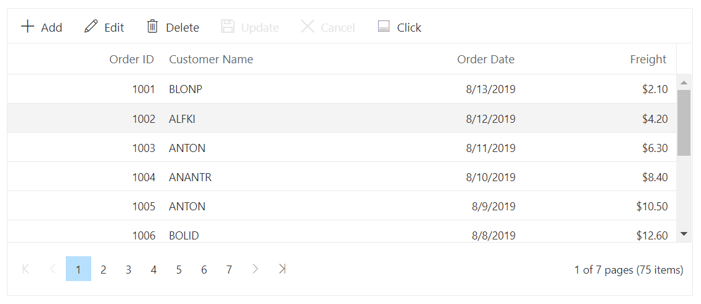
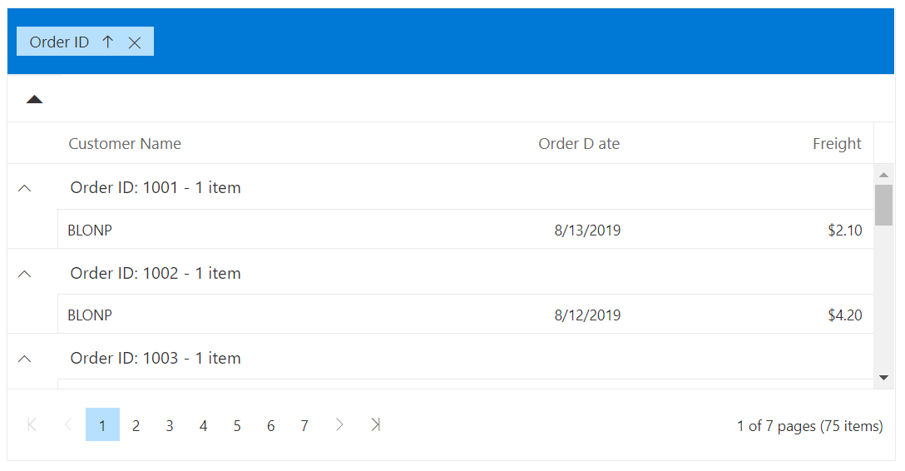
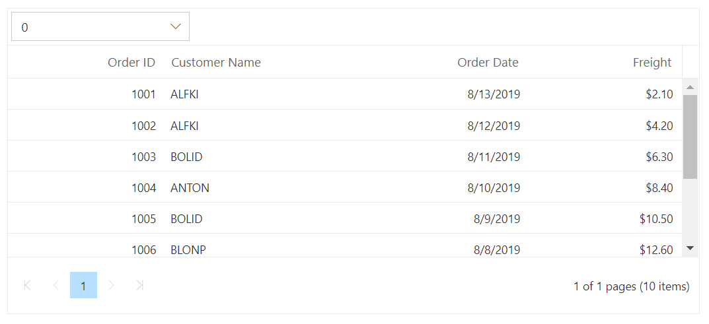
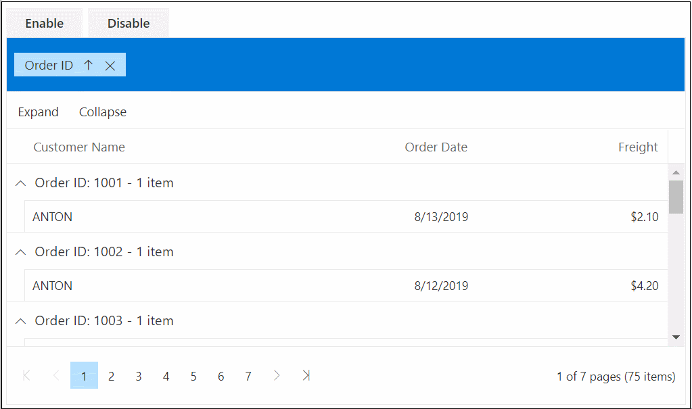

# Toolbar

The DataGrid provides tool bar support to handle datagrid actions. The [`Toolbar`](https://help.syncfusion.com/cr/aspnetcore-blazor/Syncfusion.Blazor~Syncfusion.Blazor.Grids.SfGrid~Toolbar.html)
 property accepts either the collection of built-in tool bar items and [`ItemModel`](https://help.syncfusion.com/cr/aspnetcore-blazor/Syncfusion.Blazor~Syncfusion.Blazor.Navigations.ToolbarModel~Items.htmls)

## Built-in Tool Bar Item

The DataGrid provides tool bar support to handle datagrid actions. The [`Toolbar`](https://help.syncfusion.com/cr/aspnetcore-blazor/Syncfusion.Blazor~Syncfusion.Blazor.Grids.SfGrid~Toolbar.html) as a collection of built-in items. It renders the button with icon and text.

The following table shows built-in tool bar items and its actions.

| Built-in Toolbar Items | Actions |
|------------------------|---------|
| Add | Adds a new record.|
| Edit | Edits the selected record.|
| Update | Updates the edited record.|
| Delete | Deletes the selected record.|
| Cancel | Cancels the edit state.|
| Search | Searches the records by the given key.|
| Print | Prints the datagrid.|
| ExcelExport | Exports the datagrid to Excel.|
| PdfExport | Exports the datagrid to PDF.|
| WordExport | Exports the datagrid to Word.|

```csharp

@using Syncfusion.Blazor.Grids

@{
    var Tool = (new List<string>() { "Search","Print"});
}
<SfGrid DataSource="@Orders" AllowPaging="true" Height="200" Toolbar=@Tool>
    <GridColumns>
        <GridColumn Field=@nameof(Order.OrderID) HeaderText="Order ID" TextAlign="TextAlign.Right" Width="120"></GridColumn>
        <GridColumn Field=@nameof(Order.CustomerID) HeaderText="Customer Name" Width="150"></GridColumn>
        <GridColumn Field=@nameof(Order.OrderDate) HeaderText=" Order Date" Format="d" Type="ColumnType.Date" TextAlign="TextAlign.Right" Width="130"></GridColumn>
        <GridColumn Field=@nameof(Order.Freight) HeaderText="Freight" Format="C2" TextAlign="TextAlign.Right" Width="120"></GridColumn>
    </GridColumns>
</SfGrid>

@code{
    public List<Order>Orders{ get; set; }
    private string[] Tool = (new string[] { "OrderID" });
    protected override void OnInitialized()
    {
        Orders = Enumerable.Range(1, 75).Select(x => new Order()
        {
            OrderID = 1000 + x,
            CustomerID = (new string[] { "ALFKI", "ANANTR", "ANTON", "BLONP", "BOLID" })[new Random().Next(5)],
            Freight = 2.1 * x,
            OrderDate = DateTime.Now.AddDays(-x),
        }).ToList();
    }

    public class Order
    {
        public int? OrderID { get; set; }
        public string CustomerID { get; set; }
        public DateTime? OrderDate { get; set; }
        public double? Freight { get; set; }
    }
}

```

The following screenshots represent a datagrid with Built-in toolbar,


## Custom Toolbar Items

Custom tool bar items can be added by defining the [`Toolbar`](https://help.syncfusion.com/cr/aspnetcore-blazor/Syncfusion.Blazor~Syncfusion.Blazor.Grids.SfGrid~Toolbar.html).
Custom toolbar items can be achieved by using Expand all and Collapse all functions.

```csharp

@using Syncfusion.Blazor
@using Syncfusion.Blazor.Grids
@using Syncfusion.Blazor.Navigations

 <SfGrid DataSource="@Orders" @ref="Grid" AllowGrouping="true" AllowPaging="true" Height="200" Toolbar="Toolbaritems">
     <GridEvents OnToolbarClick="ToolbarClickHandler" TValue="Order"></GridEvents>
     <GridGroupSettings Columns=@Tool></GridGroupSettings>
     <GridColumns>
         <GridColumn Field=@nameof(Order.OrderID) HeaderText="Order ID" TextAlign="TextAlign.Right" Width="120"></GridColumn>
         <GridColumn Field=@nameof(Order.CustomerID) HeaderText="Customer Name" Width="150"></GridColumn>
         <GridColumn Field=@nameof(Order.OrderDate) HeaderText=" Order Date" Format="d" Type="ColumnType.Date" TextAlign="TextAlign.Right" Width="130"></GridColumn>
         <GridColumn Field=@nameof(Order.Freight) HeaderText="Freight" Format="C2" TextAlign="TextAlign.Right" Width="120"></GridColumn>
     </GridColumns>
 </SfGrid>

 <style>
     .e-expand::before {
         content: '\e82e';
     }
     .e-collapse::before {
         content: '\e834';
     }
 </style>

 @code{
     SfGrid<Order> Grid;
     public List<Order>Orders{ get; set; }
     private List<ItemModel> Toolbaritems = new List<ItemModel>();
     private string[] Tool = (new string[] { "OrderID" });
     protected override void OnInitialized()
     {
         Orders = Enumerable.Range(1, 75).Select(x => new Order()
         {
             OrderID = 1000 + x,
             CustomerID = (new string[] { "ALFKI", "ANANTR", "ANTON", "BLONP", "BOLID" })[new Random().Next(5)],
             Freight = 2.1 * x,
             OrderDate = DateTime.Now.AddDays(-x),
         }).ToList();

          Toolbaritems.Add(new ItemModel() { Text = "Expand all", TooltipText = "Expand all", PrefixIcon = "e-expand" });
          Toolbaritems.Add(new ItemModel() { Text = "Collapse all", TooltipText = "Collapse all", PrefixIcon = "e-collapse", Align = (Syncfusion.Blazor.Navigations.ItemAlign.Right) });
         }

     public class Order
     {
         public int? OrderID { get; set; }
         public string CustomerID { get; set; }
         public DateTime? OrderDate { get; set; }
         public double? Freight { get; set; }
     }

     public void ToolbarClickHandler(Syncfusion.Blazor.Navigations.ClickEventArgs args)
     {
         if (args.Item.Text == "Expand all")
         {
             this.Grid.GroupExpandAll();
         }
         if (args.Item.Text == "Collapse all")
         {
             this.Grid.GroupCollapseAll();
         }
     }
 }

```

The following screenshots represent a datagrid with Custom toolbar items,


## Built-in and Custom Items in Toolbar

DataGrid have an option to use both built-in and custom tool bar items at same time.

In the below example, `Add`, `Edit`, `Delete`, `Update`, `Cancel` are built-in toolbar items and `Click` is custom toolbar item.

```csharp

@using Syncfusion.Blazor.Grids
@using Syncfusion.Blazor
@using Syncfusion.Blazor.Navigations

<SfGrid DataSource="@Orders" AllowPaging="true" Height="200" Toolbar="Toolbaritems">
    <GridEvents OnToolbarClick="ToolbarClickHandler" TValue="Order"></GridEvents>
    <GridEditSettings AllowAdding="true" AllowEditing="true" AllowDeleting="true" Mode="EditMode.Normal"></GridEditSettings>
    <GridColumns>
        <GridColumn Field=@nameof(Order.OrderID) HeaderText="Order ID" TextAlign="TextAlign.Right" IsPrimaryKey="true" ValidationRules="@(new { required=true, number=true})" Width="120"></GridColumn>
        <GridColumn Field=@nameof(Order.CustomerID) HeaderText="Customer Name" ValidationRules="@(new { required=true})" Width="150"></GridColumn>
        <GridColumn Field=@nameof(Order.OrderDate) HeaderText=" Order Date" Format="d" Type="ColumnType.Date" TextAlign="TextAlign.Right" Width="130"></GridColumn>
        <GridColumn Field=@nameof(Order.Freight) HeaderText="Freight" Format="C2" TextAlign="TextAlign.Right" EditType="EditType.NumericEdit" ValidationRules="@(new { required=true})" Width="120"></GridColumn>
    </GridColumns>
</SfGrid>
<style>
    .e-click::before {
        content: '\e525';
    }
</style>

@code{

    public List<Order>Orders{ get; set; }
    private List<Object> Toolbaritems = new List<Object>() { "Add", "Edit", "Delete", "Update", "Cancel", new ItemModel() { Text = "Click", TooltipText = "Click", PrefixIcon = "e-click", Id = "Click" } };
    protected override void OnInitialized()
    {
        Orders = Enumerable.Range(1, 75).Select(x => new Order()
        {
            OrderID = 1000 + x,
            CustomerID = (new string[] { "ALFKI", "ANANTR", "ANTON", "BLONP", "BOLID" })[new Random().Next(5)],
            Freight = 2.1 * x,
            OrderDate = DateTime.Now.AddDays(-x),
        }).ToList();
    }

    public class Order
    {
        public int? OrderID { get; set; }
        public string CustomerID { get; set; }
        public DateTime? OrderDate { get; set; }
        public double? Freight { get; set; }
    }

    public void ToolbarClickHandler(Syncfusion.Blazor.Navigations.ClickEventArgs args)
    {

        if (args.Item.Id == "Click")
        {
            //You can customized your code here....
        }
    }
}


```

The following screenshots represent a datagrid with Built-in and custom items in toolbar,


## Custom Toolbar

Custom tool bar items can be added by defining the [`Toolbar Template`](https://help.syncfusion.com/cr/aspnetcore-blazor/Syncfusion.Blazor~Syncfusion.Blazor.Grids.SfGrid~Toolbar.html) .Custom toolbar can be placed inside datagrid using [`ToolbarTemplate`] as below.

```csharp

@using Syncfusion.Blazor
@using Syncfusion.Blazor.Grids
@using Syncfusion.Blazor.Navigations

<SfGrid  DataSource="@Orders" AllowPaging="true" Height="200" @ref="Grid" AllowGrouping="true">
    <GridTemplates>
        <ToolbarTemplate>
            <SfToolbar>
                <ToolbarEvents Clicked="ToolbarClickHandler"></ToolbarEvents>
                <ToolbarItems>
                    <ToolbarItem Type="@ItemType.Button" prefixIcon="e-collapse" id="collapseall" TooltipText="Collapse"></ToolbarItem>
                </ToolbarItems>
            </SfToolbar>
        </ToolbarTemplate>
    </GridTemplates>

    <GridEvents OnToolbarClick="ToolbarClickHandler" TValue="Order"></GridEvents>
    <GridGroupSettings Columns=@Tool></GridGroupSettings>
    <GridColumns>
        <GridColumn Field=@nameof(Order.OrderID) HeaderText="Order ID" TextAlign="TextAlign.Right" Width="120"></GridColumn>
        <GridColumn Field=@nameof(Order.CustomerID) HeaderText="Customer Name" Width="150"></GridColumn>
        <GridColumn Field=@nameof(Order.OrderDate) HeaderText=" Order D ate" Format="d" Type="ColumnType.Date" TextAlign="TextAlign.Right" Width="130"></GridColumn>
        <GridColumn Field=@nameof(Order.Freight) HeaderText="Freight" Format="C2" TextAlign="TextAlign.Right" Width="120"></GridColumn>
    </GridColumns>
</SfGrid>

<style>
    .e-collapse::before {
        content: '\e834';
    }
</style>

@code{
    SfGrid<Order> Grid;

    public List<Order>Orders{ get; set; }

    private string[] Tool = (new string[] { "OrderID" });

    protected override void OnInitialized()
    {
        Orders = Enumerable.Range(1, 75).Select(x => new Order()
        {
            OrderID = 1000 + x,
            CustomerID = (new string[] { "ALFKI", "ANANTR", "ANTON", "BLONP", "BOLID" })[new Random().Next(5)],
            Freight = 2.1 * x,
            OrderDate = DateTime.Now.AddDays(-x),
        }).ToList();
    }

    public class Order
    {
        public int? OrderID { get; set; }
        public string CustomerID { get; set; }
        public DateTime? OrderDate { get; set; }
        public double? Freight { get; set; }
    }

    public void ToolbarClickHandler(Syncfusion.Blazor.Navigations.ClickEventArgs args)
    {
        this.Grid.GroupCollapseAll();
    }
}


```

The following screenshots represent a datagrid with Custom toolbar,


> The custom toolbar can be placed inside datagrid using Toolbar template component. The contents in the DataGrid can be collapsed by clicking the Collapse icon button.

### Custom Toolbar with dropdown list

Drop down list can be added by using dropdownlist in the tool bar section.

```csharp

@using Syncfusion.Blazor
@using Syncfusion.Blazor.Grids
@using Syncfusion.Blazor.Navigations
@using Syncfusion.Blazor.DropDowns


<SfGrid  DataSource="@Orders" AllowPaging="true" Height="200" @ref="Grid">
    <GridEvents TValue="Order"></GridEvents>
    <SfToolbar>
        <ToolbarItems>
            <ToolbarItem Type="ItemType.Input">
                <Template>
                    <SfDropDownList TValue="string" TItem="Select" DataSource=@LocalData Width="200">
                        <DropDownListFieldSettings Text="text" Value="text"> </DropDownListFieldSettings>
                        <DropDownListEvents TValue="string" ValueChange="OnChange"> </DropDownListEvents>
                    </SfDropDownList>
                </Template>
            </ToolbarItem>
        </ToolbarItems>
    </SfToolbar>

    <GridColumns>
        <GridColumn Field=@nameof(Order.OrderID) HeaderText="Order ID" TextAlign="TextAlign.Right" Width="120"></GridColumn>
        <GridColumn Field=@nameof(Order.CustomerID) HeaderText="Customer Name" Width="150"></GridColumn>
        <GridColumn Field=@nameof(Order.OrderDate) HeaderText=" Order Date" Format="d" Type="ColumnType.Date" TextAlign="TextAlign.Right" Width="130"></GridColumn>
        <GridColumn Field=@nameof(Order.Freight) HeaderText="Freight" Format="C2" TextAlign="TextAlign.Right" Width="120"></GridColumn>
    </GridColumns>
</SfGrid>

@code{

    SfGrid<Order> Grid;
    public List<Order> Orders { get; set; }
    public class Select
    {
        public string text { get; set; }
    }
     List<Select> LocalData = new List<Select>
    {
            new Select() { text = "0"},
            new Select() { text = "1"},
            new Select() { text = "2"},
            new Select() { text = "3"},
            new Select() { text = "4"},
            new Select() { text = "5"},
            new Select() { text = "6"},
            new Select() { text = "7"},
            new Select() { text = "8"},
            new Select() { text = "9"},
    };
    protected override void OnInitialized()
    {
        Orders = Enumerable.Range(1, 10).Select(x => new Order()
        {
            OrderID = 1000 + x,
            CustomerID = (new string[] { "ALFKI", "ANANTR", "ANTON", "BLONP", "BOLID" })[new Random().Next(5)],
            Freight = 2.1 * x,
            OrderDate = DateTime.Now.AddDays(-x),
        }).ToList();
    }
    public void OnChange(Syncfusion.Blazor.DropDowns.ChangeEventArgs<string> args)
    {
        this.Grid.SelectRow(int.Parse(args.Value));
    }

    public class Order
    {
        public int? OrderID { get; set; }
        public string CustomerID { get; set; }
        public DateTime? OrderDate { get; set; }
        public double? Freight { get; set; }
    }
}


```

The following screenshots represent a datagrid with Custom toolbar dropdown list,


## Enable/Disable Toolbar Items

You can enable / disable tool bar items by using the [`EnableToolbarItems method`](https:/help.syncfusion.com/cr/cref_files/aspnetcore-blazor/Syncfusion.Blazor~Syncfusion.Blazor.Navigations.SfToolbar~EnableItems.html).

```csharp

@using Syncfusion.Blazor
@using Syncfusion.Blazor.Grids
@using Syncfusion.Blazor.Navigations
@using Syncfusion.Blazor.Buttons

<div>
    <div style="float:left;">
        <SfButton id="Enable" Content="Enable" @onclick="enable"></SfButton>
    </div>
    <div style="padding-left: 90px">
        <SfButton id="Disable" Content="Disable" @onclick="disable"></SfButton>
    </div>
</div>

@{
    var Tool = (new string[] { "Expand", "Collapse" });
}
<SfGrid id="Grid" DataSource="@Orders" AllowPaging="true" Height="200" @ref="Grid" AllowGrouping="true" Toolbar=@Tool>

   <GridGroupSettings Columns=@GroupCol></GridGroupSettings>
   <GridEvents OnToolbarClick="ToolbarClickHandler" TValue="Order"></GridEvents>
   <GridColumns>
       <GridColumn Field=@nameof(Order.OrderID) HeaderText="Order ID" TextAlign="TextAlign.Right" Width="120"></GridColumn>
       <GridColumn Field=@nameof(Order.CustomerID) HeaderText="Customer Name" Width="150"></GridColumn>
       <GridColumn Field=@nameof(Order.OrderDate) HeaderText=" Order Date" Format="d" Type="ColumnType.Date" TextAlign="TextAlign.Right" Width="130"></GridColumn>
       <GridColumn Field=@nameof(Order.Freight) HeaderText="Freight" Format="C2" TextAlign="TextAlign.Right" Width="120"></GridColumn>
   </GridColumns>
</SfGrid>

<style>
    .e-expand::before {
        content: '\e82e';
    }

    .e-collapse::before {
        content: '\e834';
    }
</style>

@code{

    SfGrid<Order> Grid;
    public List<Order>Orders{ get; set; }
    private string[] GroupCol = (new string[] { "OrderID" });
    public void enable()
    {
        this.Grid.EnableToolbarItems(new List<string>() { "Grid_Expand", "Grid_Collapse" }, true);
    }

    public void disable()
    {
        this.Grid.EnableToolbarItems(new List<string>() { "Grid_Expand", "Grid_Collapse" }, false);
    }

    protected override void OnInitialized()
    {
        Orders = Enumerable.Range(1, 75).Select(x => new Order()
        {
            OrderID = 1000 + x,
            CustomerID = (new string[] { "ALFKI", "ANANTR", "ANTON", "BLONP", "BOLID" })[new Random().Next(5)],
            Freight = 2.1 * x,
            OrderDate = DateTime.Now.AddDays(-x),
        }).ToList();
    }


    public class Order
    {
        public int? OrderID { get; set; }
        public string CustomerID { get; set; }
        public DateTime? OrderDate { get; set; }
        public double? Freight { get; set; }
    }

    public void ToolbarClickHandler(Syncfusion.Blazor.Navigations.ClickEventArgs args)
    {
        if (args.Item.Text == "Expand")
        {
            this.Grid.GroupExpandAll();
        }
        if (args.Item.Text == "Collapse")
        {
            this.Grid.GroupCollapseAll();
        }
    }
}

```

The following screenshots represent a datagrid with Enable/disable toolbar items,

