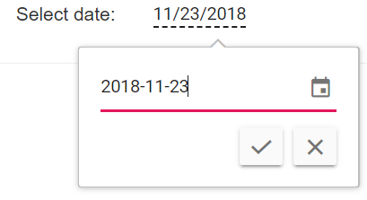

# Globalization

## Localization

Localization library allows you to localize the default text content of the In-place Editor to different cultures using the `Locale` property. In-place Editor following keys will be localize based on culture.

> Use `Resource` file to translate the static text of the In-place Editor. The Resource file is an XML file which contains the strings(key and value pairs) that you want to translate into different language. You can also refer [`Localization`](../../common/localization/) link to know more about how to configure and use localization in the Blazor Server and WebAssembly project for Syncfusion Blazor components.

| Locale key | en-US (default) |
|------|------|
| InPlaceEditor_Save | Save |
| InPlaceEditor_Cancel | Cancel |
| InPlaceEditor_LoadingText | Loading... |
| InPlaceEditor_EditIcon | Click to edit |
| InPlaceEditor_EditAreaClick | Click to edit |
| InPlaceEditor_EditAreaDoubleClick | Double click to edit |

In the following sample, `French` culture is set to In-place Editor and change the tooltip text.

```csharp

@using Syncfusion.Blazor.InPlaceEditor
@using Syncfusion.Blazor.DropDowns

<table class="table-section">
    <tr>
        <td> Choose Editable Type: </td>
        <td>
            <SfDropDownList Value="DropdownValue" Width="auto" Placeholder="Select edit type" DataSource="EditableData">
                <DropDownListEvents ValueChange="Onchange" TValue="string"></DropDownListEvents>
            </SfDropDownList>
        </td>
    </tr>
    <tr>
        <td class="sample-td">Enter your name: </td>
        <td class="sample-td">
            <SfInPlaceEditor EditableOn="EditableOn" Mode="RenderMode.Inline" Type="InputType.Text" Value="TextValue" SubmitOnEnter="true" Locale="fr-BE" Model="TModel">
            </SfInPlaceEditor>
        </td>
    </tr>
</table>

<style>
    .table-section {
        margin: 0 auto;
    }

    tr td:first-child {
        text-align: right;
        padding-right: 20px;
    }

    .sample-td {
        padding-top: 10px;
        min-width: 230px;
        height: 100px;
    }
</style>

@code {
    public string TextValue = "Andrew";
    public string DropdownValue = "Click";
    public string[] EditableData = new string[] { "Click", "DblClick", "EditIconClick" };
    public EditableType EditableOn = EditableType.Click;

    public TextBoxModel TModel = new TextBoxModel()
    {
        Placeholder = "Enter some text"
    };

    private void Onchange(ChangeEventArgs<string> args)
    {
        if (args.Value.ToString() == "Click")
        {
            this.EditableOn = EditableType.Click;
        }
        else if (args.Value.ToString() == "DblClick")
        {
            this.EditableOn = EditableType.DblClick;
        }
        else
        {
            this.EditableOn = EditableType.EditIconClick;
        }
        this.StateHasChanged();
    }
}

```

The output will be as follows.


## Right to left

Specifies the direction of the In-place Editor component using the enableRtl property. For writing systems that requires Arabic, Hebrew, and more. The direction can be switched to right-to-left.

> It will not change based on the locale property.

```csharp

@using Syncfusion.Blazor.InPlaceEditor

<table>
    <tr>
        <td class="control-title content-title"> Enter your name: </td>
        <td>
            <SfInPlaceEditor EnableRtl="true" Mode="RenderMode.Inline" Type="InputType.Text" Value="@TextValue" SubmitOnEnter="true" Model="@TModel">
            </SfInPlaceEditor>
        </td>
    </tr>
</table>

@code {
    public string TextValue = "Andrew";

    public TextBoxModel TModel = new TextBoxModel()
    {
        Placeholder = "Enter some text"
    };
}

```

The output will be as follows.


## Format

Formatting is a way of representing the value in different formats. You can format the following mentioned components with its `format` property when it is passed through the In-place Editor `Model` property.

* [DatePicker](../datepicker/date-format/)
* [DateRangePicker](../daterangepicker/globalization/)
* [DateTimePicker](../datetimepicker/globalization/)
* [NumericTextBox](../numerictextbox/formats/#custom-formats)
* [Slider](../slider/format/)
* [TimePicker](../timepicker/globalization/)

```csharp

@using Syncfusion.Blazor.InPlaceEditor

<table>
    <tr>
        <td class="control-title"> DatePicker </td>
        <td>
            <SfInPlaceEditor Mode="RenderMode.Inline" Type="InputType.Date" Value="@DateValue" Model="@DateModel">
            </SfInPlaceEditor>
        </td>
    </tr>
</table>

@code {
    public DateTime DateValue { get; set; } = new DateTime(DateTime.Now.Year, DateTime.Now.Month, DateTime.Now.Day);

    public DatePickerModel DateModel = new DatePickerModel()
    {
        Placeholder = "Select date",
        Format = "yyyy-MM-dd"
    };
}

```

The output will be as follows.

