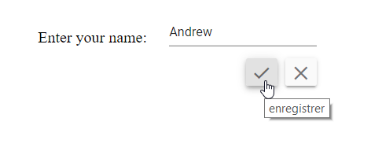
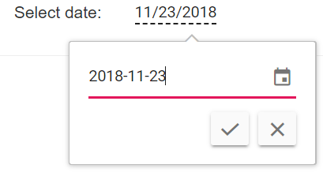

# Globalization

## Localization

Localization library allows you to localize the default text content of the In-place Editor to different cultures using the `Locale` property. In-place Editor following keys will be localize based on culture.

| Locale key | en-US (default) |
|------|------|
| save | Close |
| cancel | Cancel |
| loadingText | Loading... |
| editIcon | Click to edit |
| editAreaClick | Click to edit |
| editAreaDoubleClick | Double click to edit |

> To load translation object in an application, define the culture and the component locale text corresponding to the language in a separate `locale.json` file under `wwwroot` folder.

```bash
{
    "fr-BE": {
        "inplace-editor": {
            "save": "enregistrer",
            "cancel": "Annuler",
            "loadingText": "Chargement...",
            "editIcon": "Cliquez pour éditer",
            "editAreaClick": "Cliquez pour éditer",
            "editAreaDoubleClick": "Double-cliquez pour éditer"
        }
    }
}

```

In the following sample, `French` culture is set to In-place Editor and change the tooltip text.

```csharp

@using Syncfusion.Blazor
@using Syncfusion.Blazor.Inputs
@using Syncfusion.Blazor.InPlaceEditor
@using Syncfusion.Blazor.DropDowns
@using Microsoft.JSInterop;

<table class="table-section">
    <tr>
        <td> Choose Editable Type: </td>
        <td>
            <SfDropDownList Value="DropdownValue" Width="auto" Placeholder="Select edit type" DataSource="EditableData">
                <DropDownListEvents ValueChange="Onchange" TValue="string"></DropDownListEvents>
            </SfDropDownList>
        </td>
    </tr>
    <tr>
        <td class="sample-td">Enter your name: </td>
        <td class="sample-td">
            <SfInPlaceEditor EditableOn="EditableOn" Mode="RenderMode.Inline" Type="InputType.Text" Value="TextValue" SubmitOnEnter="true" Locale="fr-BE" Model="TModel">
            </SfInPlaceEditor>
        </td>
    </tr>
</table>

<style>
    .table-section {
        margin: 0 auto;
    }

    tr td:first-child {
        text-align: right;
        padding-right: 20px;
    }

    .sample-td {
        padding-top: 10px;
        min-width: 230px;
        height: 100px;
    }
</style>

@code {
    [Inject]
    protected IJSRuntime JsRuntime { get; set; }

    public string TextValue = "Andrew";
    public string DropdownValue = "Click";
    public string[] EditableData = new string[] { "Click", "DblClick", "EditIconClick" };
    public EditableType EditableOn = EditableType.Click;

    public TextBoxModel TModel = new TextBoxModel()
    {
        Placeholder = "Enter some text"
    };

    private void Onchange(ChangeEventArgs<string> args)
    {
        if (args.Value.ToString() == "Click")
        {
            this.EditableOn = EditableType.Click;
        }
        else if (args.Value.ToString() == "DblClick")
        {
            this.EditableOn = EditableType.DblClick;
        }
        else
        {
            this.EditableOn = EditableType.EditIconClick;
        }
        this.StateHasChanged();
    }

    protected override void OnAfterRender(bool firstRender)
    {
        //Refer the path for the locale data
        this.JsRuntime.Sf().LoadLocaleData("wwwroot/locale.json");
    }
}

```

The output will be as follows.



## Right to left

Specifies the direction of the In-place Editor component using the enableRtl property. For writing systems that requires Arabic, Hebrew, and more. The direction can be switched to right-to-left.

> It will not change based on the locale property.

```csharp

@using Syncfusion.Blazor
@using Syncfusion.Blazor.Inputs
@using Syncfusion.Blazor.InPlaceEditor

<table>
    <tr>
        <td class="control-title content-title"> Enter your name: </td>
        <td>
            <SfInPlaceEditor EnableRtl="true" Mode="RenderMode.Inline" Type="InputType.Text" Value="@TextValue" SubmitOnEnter="true" Model="@TModel">
            </SfInPlaceEditor>
        </td>
    </tr>
</table>

@code {
    public string TextValue = "Andrew";

    public TextBoxModel TModel = new TextBoxModel()
    {
        Placeholder = "Enter some text"
    };
}

```

The output will be as follows.


## Format

Formatting is a way of representing the value in different formats. You can format the following mentioned components with its `format` property when it is passed through the In-place Editor `Model` property.

* [DatePicker](../datepicker/date-format/)
* [DateRangePicker](../daterangepicker/globalization/)
* [DateTimePicker](../datetimepicker/globalization/)
* [NumericTextBox](../numerictextbox/formats/#custom-formats)
* [Slider](../slider/format/)
* [TimePicker](../timepicker/globalization/)

```csharp

@using Syncfusion.Blazor
@using Syncfusion.Blazor.Calendars
@using Syncfusion.Blazor.InPlaceEditor

<table>
    <tr>
        <td class="control-title"> DatePicker </td>
        <td>
            <SfInPlaceEditor Mode="RenderMode.Inline" Type="InputType.Date" Value="@DateValue" Model="@DateModel">
            </SfInPlaceEditor>
        </td>
    </tr>
</table>

@code {
    public DateTime DateValue { get; set; } = new DateTime(DateTime.Now.Year, DateTime.Now.Month, DateTime.Now.Day);

    public DatePickerModel DateModel = new DatePickerModel()
    {
        Placeholder = "Select date",
        Format = "yyyy-MM-dd"
    };
}

```

The output will be as follows.

