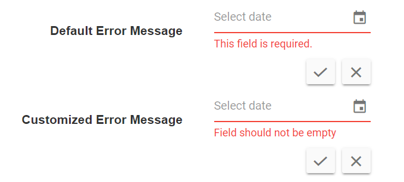

# Validation

In-place Editor component supports validation and it can be achieved by adding rules to the `ValidationRules` property, its child property `key` must be same as `Name` property, otherwise validation not performed. Submitting data to the server or calling the `validate` method validation executed.

In the following sample, first editor value submitted without selecting any date, so the default error message will be displayed below the  `DatePicker` element. Second editor configured with the `Validating` event with the handler. In handler event, the `errorMessage` argument value is modified and it will show below the `DatePicker` element.

```csharp

@using Syncfusion.Blazor
@using Syncfusion.Blazor.Calendars
@using Syncfusion.Blazor.InPlaceEditor

<table class="table-section">
    <tr>
        <td class="col-lg-6 col-md-6 col-sm-6 col-xs-6 control-title"> Default Error Message </td>
        <td class="col-lg-6 col-md-6 col-sm-6 col-xs-6">
            <SfInPlaceEditor Mode="RenderMode.Inline" EmptyText="dd/mm/yyyy" Name="Today" ValidationRules="Validate" Type="InputType.Date" Model="DateModel" TValue="string">
            </SfInPlaceEditor>
        </td>
    </tr>
    <tr>
        <td class="col-lg-6 col-md-6 col-sm-6 col-xs-6 control-title"> Customized Error Message </td>
        <td class="col-lg-6 col-md-6 col-sm-6 col-xs-6">
            <SfInPlaceEditor Mode="RenderMode.Inline" EmptyText="dd/mm/yyyy" Name="TodayCustom" ValidationRules="Validation" Type="InputType.Date" Model="DateModel" TValue="string">
                <InPlaceEditorEvents Validating="OnValidation" TValue="string"></InPlaceEditorEvents>
            </SfInPlaceEditor>
        </td>
    </tr>
</table>

<style>
    .table-section {
        margin: 0 auto;
    }

    td {
        padding: 20px 0;
        min-width: 230px;
        height: 100px;
    }

    .control-title {
        font-weight: 600;
        padding-right: 20px;
        text-align: right;
        width: 50%;
    }
</style>

@code {
    public DatePickerModel DateModel = new DatePickerModel()
    {
        Placeholder = "Select date"
    };
    public object Validate = new
    {
        Today = new { required = true }
    };
    public object Validation = new
    {
        TodayCustom = new { required = true }
    };

    private void OnValidation(ValidateEventArgs args)
    {
        args.ErrorMessage = "Field should not be empty";
    }
}

```

The output will be as follows.



* For custom validation except specifying validationRules, specify errorMessage at validating event, message will be shown when the value is `Empty`.