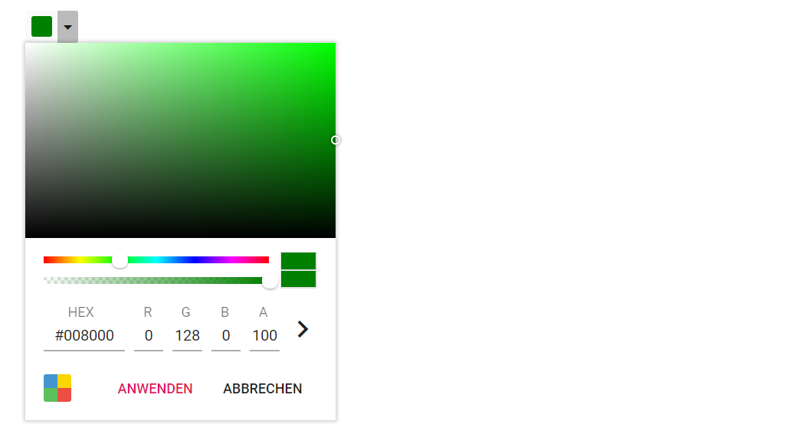
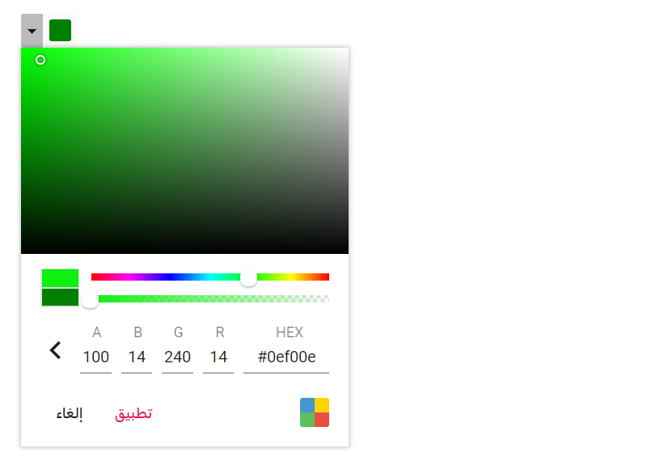

# Localization and RTL

## Localization

The `Localization` library allows you to localize default text content of the Color Picker. The Color Picker component has static text for control buttons (apply / cancel) and mode switcher that can be changed to other cultures (Arabic, Deutsch, French, etc.) by defining the locale value and translation object.

The following list of properties and its values are used in the Color Picker.

| Locale key | en-US (default) |
| ------------ | ----------------------- |
| Apply  | Apply |
| Cancel  | Cancel |
| ModeSwitcher | Switch Mode |

> To load translation object in an application, define the culture and the component locale text corresponding to the language in a separate `locale.json` file under `wwwroot` folder.

`locale.json`

```json

{
    "de-DE": {
    "colorpicker": {
      "Apply": "Anwenden",
      "Cancel": "Abbrechen",
      "ModeSwitcher": "Modus wechseln"
    }
    }
}

```

```csharp

@using Syncfusion.Blazor.Inputs

<SfColorPicker></SfColorPicker>

@code {
    [Inject]
    protected IJSRuntime JsRuntime { get; set; }

    protected override void OnAfterRender(bool firstRender)
    {
        this.JsRuntime.Sf().LoadLocaleData("wwwroot/locale.json").SetCulture("de-DE");
    }
}

```

Output be like


## RTL

Color Picker component has `RTL` support. It helps to render the Color Picker from right-to-left direction. It improves the user experiences and accessibility for users who use right-to-left languages(Arabic, Farsi, Urdu, etc). This can be achieved by setting the [`EnableRtl`](https://help.syncfusion.com/cr/blazor/Syncfusion.Blazor~Syncfusion.Blazor.Inputs.SfColorPicker~EnableRtl.html) property to true.

In the following example Color Picker component is rendered in RTL mode with `arabic` locale.

```csharp

@using Syncfusion.Blazor.Inputs

<SfColorPicker EnableRtl="true"></SfColorPicker>

@code {
    [Inject]
    protected IJSRuntime JsRuntime { get; set; }

    protected override void OnAfterRender(bool firstRender)
    {
        this.JsRuntime.Sf().LoadLocaleData("wwwroot/locale.json").SetCulture("ar-AE");
    }
}

```

Output be like
