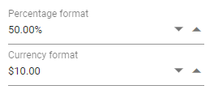
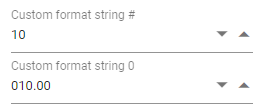

# Number Formats

You can format the value of NumericTextBox using the [Format](https://help.syncfusion.com/cr/blazor/SfNumericTextBox.Blazor~SfNumericTextBox.Blazor.Inputs.SfNumericTextBox%601~Format.html) property.
The value will be displayed in the specified format when the component is in focused out state. The format string
supports both the standard numeric format string and custom numeric format string.

## Standard formats

From the standard numeric format, you can use the numeric related format specifiers such as `n`,`p`, and `c` in the NumericTextBox component. By using these format specifiers, you can achieve the percentage and currency textbox behavior also.

The following example demonstrates percentage and currency formats.

```csharp
@using SfNumericTextBox.Blazor.Inputs

<SfNumericTextBox Value=0.5 Min=0 Max=1 Step=0.01 Format="p2" Placeholder="Percentage format" FloatLabelType="@FloatLabelType.Auto"></SfNumericTextBox>
<SfNumericTextBox TValue="int?" Value=10 Format="c2" Placeholder="Currency format" FloatLabelType="@FloatLabelType.Auto"></SfNumericTextBox>
```

The output will be as follows.



## Custom formats

From the custom numeric format string, you can provide any custom format by
combining one or more custom specifiers.

The following examples demonstrate format the value by using currency format string `#` and `0`.

```csharp
@using SfNumericTextBox.Blazor.Inputs

<SfNumericTextBox TValue="int?" Value=10 Format="###.##" Placeholder="Custom format string #" FloatLabelType="@FloatLabelType.Always"></SfNumericTextBox>
<SfNumericTextBox TValue="int?" Value=10 Format="000.00" Placeholder="Custom format string 0" FloatLabelType="@FloatLabelType.Always"></SfNumericTextBox>
```

The output will be as follows.


