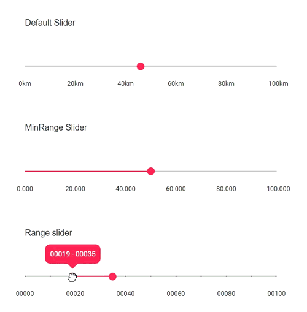

# Numeric Range Slider in Blazor Slider control

The numeric values can be formatted into different decimal digits or fixed number of whole numbers or to represent the units. The Numeric processing is demonstrated below.

We have numeric range sliders, which can be formatted in any way of your choice. In the examples found below, the first one demonstrates the visualization of ticks in km.

```csharp
 <SliderTicksData ShowSmallTicks="true" Placement="Placement.After" LargeStep="20" SmallStep="10" Format="##.##km"> </SliderTicksData>
                <SliderTooltipData IsVisible="true" Placement="TooltipPlacement.Before" Format="##.##km"></SliderTooltipData>
```

The second example showcases the use of decimal point in the Slider's ticks and tooltip placement.

```csharp
  <SliderTicksData ShowSmallTicks="true" Placement="Placement.After" LargeStep="20" SmallStep="10" Format="##.#00"> </SliderTicksData>
                    <SliderTooltipData IsVisible="true" Placement="TooltipPlacement.Before" Format="##.#00"></SliderTooltipData>
```

And in the third example, the formatting involves the placement of zeros before the required values.

```csharp
 <SliderTicksData ShowSmallTicks="true" Placement="Placement.After" LargeStep="20" SmallStep="10" Format="0000#"> </SliderTicksData>
                <SliderTooltipData IsVisible="true" Placement="TooltipPlacement.Before" Format="0000#"></SliderTooltipData>
```

The complete code for the above Numeric Range Slider can be found below.

```csharp
@using Syncfusion.Blazor.Inputs;

<div class="control-section">
    <div class="content-wrapper">
        <div class="sliderwrap">
            <label class="labeltext userselect">Default Slider</label>
            <SfSlider Value="30">
                <SliderTicksData ShowSmallTicks="true" Placement="Placement.After" LargeStep="20" SmallStep="10" Format="##.##km"> </SliderTicksData>
                <SliderTooltipData IsVisible="true" Placement="TooltipPlacement.Before" Format="##.##km"></SliderTooltipData>
            </SfSlider>
        </div>
        <div class="sliderwrap">
            <label class="labeltext userselect">MinRange Slider</label>
            <SfSlider Value="30" Type=SliderType.MinRange>
                <SliderTicksData ShowSmallTicks="true" Placement="Placement.After" LargeStep="20" SmallStep="10" Format="##.#00"> </SliderTicksData>
                    <SliderTooltipData IsVisible="true" Placement="TooltipPlacement.Before" Format="##.#00"></SliderTooltipData>
            </SfSlider>
        </div>
        <div class="sliderwrap">
            <label class="labeltext userselect">Range slider</label>
            <SfSlider Value=@Value Type=SliderType.Range>
                <SliderTicksData ShowSmallTicks="true" Placement="Placement.After" LargeStep="20" SmallStep="10" Format="0000#"> </SliderTicksData>
                <SliderTooltipData IsVisible="true" Placement="TooltipPlacement.Before" Format="0000#"></SliderTooltipData>
            </SfSlider>
        </div>
    </div>
</div>
@code{
    public int[] Value = { 20, 50 };
}
<style>
    .content-wrapper {
        width: 40%;
        margin: 0 auto;
        min-width: 185px;
    }

    .sliderwrap {
        margin-top: 40px;
    }

    .e-bigger .content-wrapper {
        width: 80%;
    }

    .sliderwrap label {
        padding-bottom: 26px;
        font-size: 13px;
        font-weight: 500;
        margin-top: 15px;
    }

    .userselect {
        -webkit-user-select: none; /* Safari 3.1+ */
        -moz-user-select: none; /* Firefox 2+ */
        -ms-user-select: none; /* IE 10+ */
        user-select: none; /* Standard syntax */
    }
</style>
```

