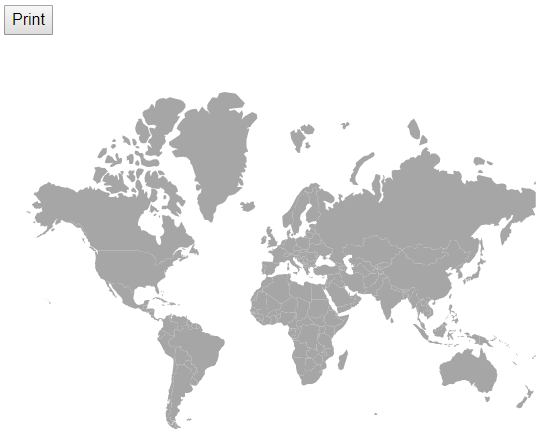
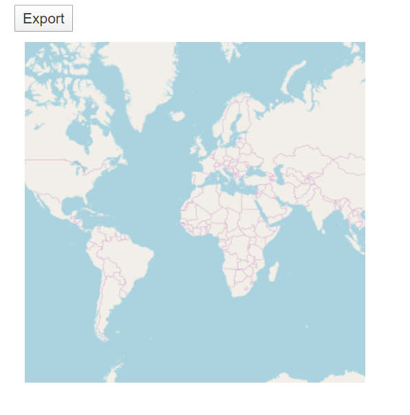

# Print and export

## Print

To use the print functionality, we should set the [`AllowPrint`](https://help.syncfusion.com/cr/blazor/Syncfusion.Blazor~Syncfusion.Blazor.Maps.SfMaps~AllowPrint.html) property to **true**. The rendered map can be printed directly from the browser by calling the method [`print`](https://help.syncfusion.com/cr/blazor/Syncfusion.Blazor~Syncfusion.Blazor.Maps.SfMaps~Print.html). You can get the Maps component object using `@ref="maps"`.

```csharp
@using Syncfusion.Blazor.Maps

<button @onclick="PrintMap">Print</button>
@*  To create reference  *@
<SfMaps @ref="maps" AllowPrint="true">
    <MapsLayers>
        <MapsLayer ShapeData='new {dataOptions= "https://cdn.syncfusion.com/maps/map-data/world-map.json"}'>
            <MapsLayerTooltipSettings Visible="true"
                                  ValuePath="name">
            </MapsLayerTooltipSettings>
        </MapsLayer>
    </MapsLayers>
</SfMaps>

@code {
    SfMaps maps;
    void PrintMap()
    {
        // using Maps component reference call 'Print' method
        this.maps.Print();
    }
}
```



## Export

### Image Export

To use the image export functionality, we should set the [`AllowImageExport`](https://help.syncfusion.com/cr/blazor/Syncfusion.Blazor~Syncfusion.Blazor.Maps.SfMaps~AllowImageExport.html) property to **true**. The rendered map can be exported as an image using the [`export`](https://help.syncfusion.com/cr/blazor/Syncfusion.Blazor~Syncfusion.Blazor.Maps.SfMaps~Export.html) method. The method requires two parameters: image type and file name. The map can be exported as an image in the following formats.

* JPEG
* PNG
* SVG

```csharp
@using Syncfusion.Blazor.Maps

<button @onclick="ExportMap">Export</button>
<SfMaps @ref="Maps" AllowImageExport="true">
    <MapsLayers>
        <MapsLayer ShapeData='new {dataOptions= "https://cdn.syncfusion.com/maps/map-data/world-map.json"}'>
        </MapsLayer>
    </MapsLayers>
</SfMaps>

@code {
    SfMaps Maps;
    void ExportMap()
    {
        this.Maps.Export(ExportType.PNG, "Maps");
    }
}
```


### PDF Export

To use the PDF export functionality, we should set the [`AllowPdfExport`](https://help.syncfusion.com/cr/blazor/Syncfusion.Blazor~Syncfusion.Blazor.Maps.SfMaps~AllowPdfExport.html) property to **true**. The rendered map can be exported as PDF using the [`export`](https://help.syncfusion.com/cr/blazor/Syncfusion.Blazor~Syncfusion.Blazor.Maps.SfMaps~Export.html) method. The [`export`](https://help.syncfusion.com/cr/blazor/Syncfusion.Blazor~Syncfusion.Blazor.Maps.SfMaps~Export.html) method requires three parameters: file type, file name and orientation of the PDF document. The orientation setting is optional and "0" indicates portrait and "1" indicates landscape.

```csharp
@using Syncfusion.Blazor.Maps

<button @onclick="ExportMap">Export</button>
<SfMaps @ref="Maps" AllowPdfExport="true">
    <MapsLayers>
        <MapsLayer ShapeData='new {dataOptions= "https://cdn.syncfusion.com/maps/map-data/world-map.json"}'>
        </MapsLayer>
    </MapsLayers>
</SfMaps>

@code {
    SfMaps Maps;
    void ExportMap()
    {
        this.Maps.Export(ExportType.PDF, "Maps", 0);
    }
}
```


### Export the tile maps

The rendered map with providers such as OSM, Bing and Google static maps can be exported using the [`Export`](https://help.syncfusion.com/cr/aspnetcore-blazor/Syncfusion.Blazor~Syncfusion.Blazor.Maps.SfMaps~Export.html) method. It supports the following export formats.

* JPEG
* PNG
* PDF

```csharp
@using Syncfusion.Blazor.Maps

<button @onclick="ExportMap">Export</button>
<SfMaps @ref="Maps" AllowPdfExport="true" AllowImageExport="true">
    <MapsLayers>
        <MapsLayer LayerType="ShapeLayerType.OSM">
        </MapsLayer>
    </MapsLayers>
</SfMaps>

@code {
    SfMaps Maps;
    void ExportMap()
    {
        this.Maps.Export(ExportType.PNG, "OSM Map");
    }
}
```


