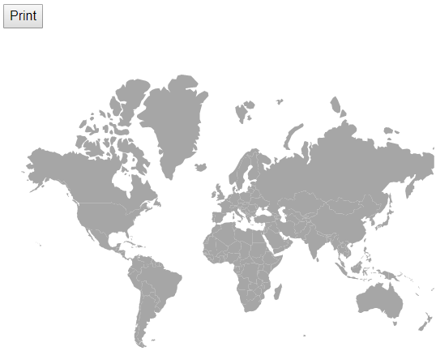
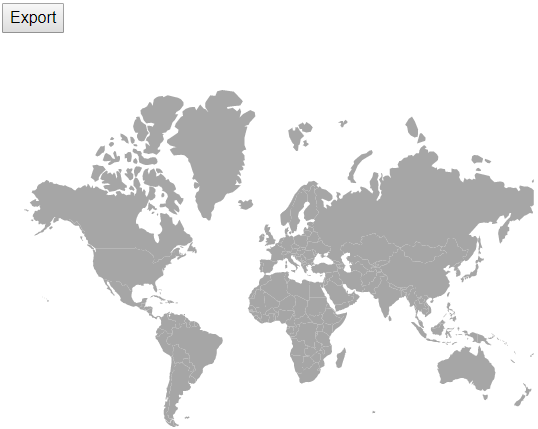
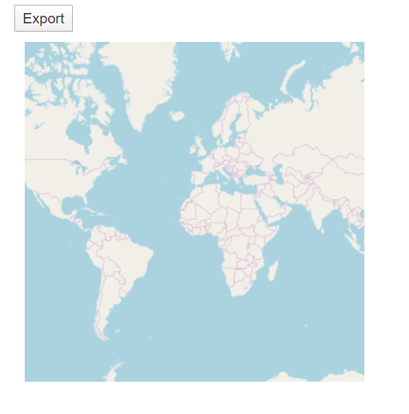

# Print and export

## Print

The rendered maps can be printed directly from browser by calling the public method [`Print`](https://help.syncfusion.com/cr/aspnetcore-blazor/Syncfusion.Blazor~Syncfusion.Blazor.Maps.SfMaps~Print.html). You can get the Maps component object using `@ref="maps"`.

```csharp
@using Syncfusion.Blazor.Maps

<button @onclick="PrintMap">Print</button>
@*  To create reference  *@
<SfMaps @ref="maps">
    <MapsLayers>
        <MapsLayer ShapeData='new {dataOptions= "https://cdn.syncfusion.com/maps/map-data/world-map.json"}'>
            <MapsLayerTooltipSettings Visible="true"
                                  ValuePath="name">
            </MapsLayerTooltipSettings>
        </MapsLayer>
    </MapsLayers>
</SfMaps>

@code {
    SfMaps maps;
    void PrintMap()
    {
        // using Maps component reference call 'Print' method
        maps.Print();
    }
}
```



## Export

The rendered maps can be exported in the following formats using the [`Export`](https://help.syncfusion.com/cr/aspnetcore-blazor/Syncfusion.Blazor~Syncfusion.Blazor.Maps.SfMaps~Export.html) method. The input parameters for this method are export type for format and file name of result.

* PNG
* JPEG
* SVG
* PDF

```csharp
@using Syncfusion.Blazor.Maps

<button @onclick="ExportMap">Export</button>
<SfMaps @ref="Maps">
    <MapsLayers>
        <MapsLayer ShapeData='new {dataOptions= "https://cdn.syncfusion.com/maps/map-data/world-map.json"}'>
        </MapsLayer>
    </MapsLayers>
</SfMaps>

@code {
    SfMaps Maps;
    void ExportMap()
    {
        maps.Export(ExportType.PNG, "World Map");
    }
}
```



### Export the tile maps

The rendered map with providers such as OSM, Bing and Google static maps can be exported using the [`Export`](https://help.syncfusion.com/cr/aspnetcore-blazor/Syncfusion.Blazor~Syncfusion.Blazor.Maps.SfMaps~Export.html) method. It supports the following export formats.

* JPEG
* PNG
* PDF

```csharp
@using Syncfusion.Blazor.Maps

<button @onclick="ExportMap">Export</button>
<SfMaps @ref="Maps">
    <MapsLayers>
        <MapsLayer LayerType="ShapeLayerType.OSM">
        </MapsLayer>
    </MapsLayers>
</SfMaps>

@code {
    SfMaps Maps;
    void ExportMap()
    {
        maps.Export(ExportType.PNG, "OSM Map");
    }
}
```


