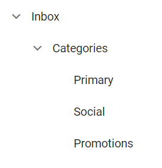

<!-- markdownlint-disable MD024 -->

# Getting Started

This section briefly explains about how to include a `TreeView` in your Blazor server-side application. You can refer [Getting Started with Syncfusion Blazor for Server-Side in Visual Studio 2019](../../getting-started/vs-blazor/) page for the introduction and configuring the common specifications.

To get start quickly with Blazor TreeView, you can check on this video:

`youtube:mScCY8cgyM0`

## Importing Syncfusion Blazor component in the application

* Install **Syncfusion.Blazor** NuGet package to the application by using the `NuGet Package Manager`.
    >Note:Please ensure to check the **Include prerelease** option for our Beta release.

* You can add the client-side style resources using NuGet package to the `<head>` element of the `~/wwwroot/index.html` page in Blazor WebAssembly app or `~/Pages/_Host.cshtml` page in Blazor Server app.
    >Note: You can also add the client-side style resources through CDN.

```csharp
<head>
    <link href="_content/Syncfusion.Blazor/styles/bootstrap4.css" rel="stylesheet" />
</head>
```

```csharp
<head>
    <link href="https://cdn.syncfusion.com/blazor/{:version:}/styles/bootstrap4.css" rel="stylesheet" />
</head>
```

* For `Internet Explorer` 11 kindly refer the polyfills. Refer the [documentation](https://blazor.syncfusion.com/documentation/common/how-to/render-blazor-server-app-in-ie/) for more information.

```csharp
<head>
    <link href="_content/Syncfusion.Blazor/styles/bootstrap4.css" rel="stylesheet" />
    <script src="https://github.com/Daddoon/Blazor.Polyfill/releases/download/3.0.1/blazor.polyfill.min.js"></script>
</head>
```

## Add Syncfusion Blazor service in Startup.cs (Server-side application)

Open the **Startup.cs** file and add services required by Syncfusion components using `services.AddSyncfusionBlazor()` method. Add this method in the **ConfigureServices** function as follows.

```csharp
using Syncfusion.Blazor;

namespace BlazorApplication
{
    public class Startup
    {
        ....
        ....
        public void ConfigureServices(IServiceCollection services)
        {
            ....
            ....
            services.AddSyncfusionBlazor();
        }
    }
}
```

## Add Syncfusion Blazor service in Program.cs (Client-side application)

Open the **Program.cs** file and add services required by Syncfusion components using `builder.Services.AddSyncfusionBlazor()` method. Add this method in the **Main** function as follows.

```csharp
namespace BlazorApplication
{
    public class Program
    {
        ....
        ....
        public static async Task Main(string[] args)
            {
            ....
            ....
            builder.Services.AddSyncfusionBlazor();
        }
    }
}
```

>Note: To enable custom client side resource loading from CRG or CDN. You need to disable resource loading by **AddSyncfusionBlazor(true)** and load the scripts to the `<head>` element of the **~/wwwroot/index.html** page in Blazor WebAssembly app or **~/Pages/_Host.cshtml** page in Blazor Server app.

```csharp
<head>
    <script src="https://cdn.syncfusion.com/blazor/{:version:}/syncfusion-blazor.min.js"></script>
</head>
```

## Adding component package to the application

 Open `~/_Imports.razor` file and import the `Syncfusion.Blazor.Navigations` packages.

```csharp
    @using Syncfusion.Blazor
    @using Syncfusion.Blazor.Navigations
```

## Adding TreeView component to the application

Now, add the Syncfusion Blazor TreeView component in any web page `razor` in the `Pages` folder. For example, the TreeView component is added in the `~/Pages/Index.razor` page.

```csharp
@using Syncfusion.Blazor.Navigations
<SfTreeView TValue="MailItem">
    <TreeViewFieldsSettings TValue="MailItem" Id="Id" DataSource="@MyFolder" Text="FolderName" ParentID="ParentId" HasChildren="HasSubFolders" Expanded="Expanded"></TreeViewFieldsSettings>
</SfTreeView>

@code{
    public class MailItem
    {
        public string Id { get; set; }
        public string ParentId { get; set; }
        public string FolderName { get; set; }
        public bool Expanded { get; set; }
        public bool HasSubFolders { get; set; }
    }
    List<MailItem> MyFolder = new List<MailItem>();
    protected override void OnInitialized()
    {
        base.OnInitialized();
        MyFolder.Add(new MailItem
        {
            Id = "1",
            FolderName = "Inbox",
            HasSubFolders = true,
            Expanded = true
        });
        MyFolder.Add(new MailItem
        {
            Id = "2",
            ParentId = "1",
            FolderName = "Categories",
            Expanded = true,
            HasSubFolders = true
        });
        MyFolder.Add(new MailItem
        {
            Id = "3",
            ParentId = "2",
            FolderName = "Primary"
        });
        MyFolder.Add(new MailItem
        {
            Id = "4",
            ParentId = "2",
            FolderName = "Social"
        });
        MyFolder.Add(new MailItem
        {
            Id = "5",
            ParentId = "2",
            FolderName = "Promotions"
        });
    }
}

```

## Run the application

After successful compilation of your application, simply press `F5` to run the application.



## See Also

* [Getting Started with Syncfusion Blazor for Client-Side in .NET Core CLI](https://blazor.syncfusion.com/documentation/getting-started/blazor-webassembly-dotnet-cli/)
* [Getting Started with Syncfusion Blazor for Client-Side in Visual Studio 2019](https://blazor.syncfusion.com/documentation/getting-started/blazor-webassembly/)
* [Getting Started with Syncfusion Blazor for Server-Side in .NET Core CLI](https://blazor.syncfusion.com/documentation/getting-started/server-side-blazor-dotnet-cli/)