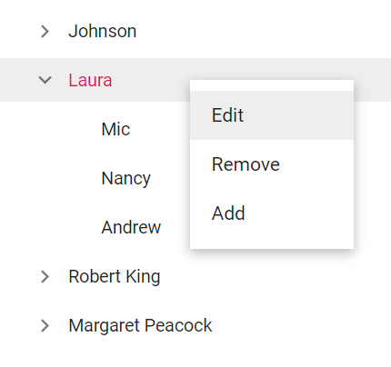

# Process the tree node operations using context menu

You can integrate the context menu with `TreeView` component in order to perform the TreeView related operations like add, remove and renaming node.

Following is an example which demonstrates the above cases which are used to manipulate TreeView operations in the `ItemSelected` event of context menu.

```csharp
@using Syncfusion.Blazor.Navigations
@using Newtonsoft.Json;


    <div id="treeview">
        <SfTreeView TValue="EmployeeData" @ref="tree" AllowDragAndDrop="true" SelectedNodes="@selectedNodes">
            <TreeViewFieldsSettings Id="Id" ParentID="Pid" DataSource="@ListData" Text="Name" HasChildren="HasChild" Expanded="Expanded"></TreeViewFieldsSettings>
            <TreeViewEvents TValue="EmployeeData" NodeSelected="OnSelect" NodeClicked="nodeClicked"></TreeViewEvents>
            <SfContextMenu @ref="menu" Target="#treeview" Items="@MenuItems">
                <ContextMenuEvents ItemSelected="MenuSelect"></ContextMenuEvents>
            </SfContextMenu>
        </SfTreeView>
    </div>

@code
{
    // Reference for treeview
    SfTreeView<EmployeeData> tree;

    // Reference for context menu
    SfContextMenu menu;

    string selectedId;
    string[] selectedNodes = new string[] { };
    int index = 100;

    // Datasource for menu items
    public List<MenuItem> MenuItems = new List<MenuItem>{
        new MenuItem { Text = "Edit" },
        new MenuItem { Text = "Remove" },
        new MenuItem { Text = "Add" }
    };

    public class EmployeeData
    {
        public string Id { get; set; }
        public string Name { get; set; }
        public string Pid { get; set; }
        public bool HasChild { get; set; }
    }

    // Triggers when TreeView Node is selected
    public void OnSelect(NodeSelectEventArgs args)
    {
        this.selectedId = args.NodeData.Id;
    }

    // Triggers when TreeView node is clicked
    public async void nodeClicked(NodeClickEventArgs args)
    {
        string eventString = JsonConvert.SerializeObject(args.Event);
        Dictionary<string, dynamic> eventParameters = JsonConvert.DeserializeObject<Dictionary<string, dynamic>>(eventString);
        if ((eventParameters["which"]).ToString() == "3")
        {
            this.selectedNodes = new string[] { (await args.Node.GetAttribute("data-uid")).ToString() };
            StateHasChanged();
        }
    }

    // To add a new node
    void AddNodes()
    {
        List<object> TreeData = new List<object>();
        string NodeId = "tree_" + this.index.ToString();
        TreeData.Add(new
        {
            Id = NodeId,
            Name = "NewItem",

        });

        this.tree.AddNodes(TreeData, this.selectedId, null, false);
        this.tree.BeginEdit(NodeId);
        this.index = this.index + 1;

    }

    // To delete a tree node
    void RemoveNodes()
    {
        string[] removeNode = new string[] { this.selectedId };
        this.tree.RemoveNodes(removeNode);
    }

    // To edit a tree node
    void RenameNodes()
    {
        this.tree.BeginEdit(this.selectedId);
    }

    // Triggers when context menu is selected
    public void MenuSelect(MenuEventArgs args)
    {
        string selectedText;
        selectedText = args.Item.Text;
        if (selectedText == "Edit")
        {
            this.RenameNodes();
        }
        else if (selectedText == "Remove")
        {
            this.RemoveNodes();
        }
        else if (selectedText == "Add")
        {
            this.AddNodes();
        }
    }


    // local data source
    List<EmployeeData> ListData = new List<EmployeeData>();

    protected override void OnInitialized()
    {
        base.OnInitialized();
        ListData = new List<EmployeeData>();
        ListData.Add(new EmployeeData
        {
            Id = "1",
            Name = "Johnson",
            HasChild = true,
        });
        ListData.Add(new EmployeeData
        {
            Id = "2",
            Pid = "1",
            Name = "Sourav",
        });
        ListData.Add(new EmployeeData
        {
            Id = "3",
            Pid = "1",
            Name = "Sanjay",
        });

        ListData.Add(new EmployeeData
        {
            Id = "4",
            Pid = "1",
            Name = "Steve",
        });
        ListData.Add(new EmployeeData
        {
            Id = "6",
            Pid = "1",
            Name = "Martin",
        });
        ListData.Add(new EmployeeData
        {
            Id = "7",
            Name = "Laura",
            HasChild = true,
        });
        ListData.Add(new EmployeeData
        {
            Id = "8",
            Pid = "7",
            Name = "Mic",
        });
        ListData.Add(new EmployeeData
        {
            Id = "9",
            Pid = "7",
            Name = "Nancy",
        });
        ListData.Add(new EmployeeData
        {
            Id = "10",
            Pid = "7",
            Name = "Andrew",
        });
        ListData.Add(new EmployeeData
        {
            Id = "11",
            Name = "Robert King",
            HasChild = true,
        });
        ListData.Add(new EmployeeData
        {
            Id = "12",
            Pid = "11",
            Name = "Richard",
        });
        ListData.Add(new EmployeeData
        {
            Id = "13",
            Pid = "11",
            Name = "James",
        });
        ListData.Add(new EmployeeData
        {
            Id = "14",
            Pid = "11",
            Name = "Murrey",
        });
        ListData.Add(new EmployeeData
        {
            Id = "15",
            Pid = "11",
            Name = "Chris",
        });
        ListData.Add(new EmployeeData
        {
            Id = "16",
            Name = "Margaret Peacock",
            HasChild = true,
        });
        ListData.Add(new EmployeeData
        {
            Id = "17",
            Pid = "16",
            Name = "Ryaz",
        });
        ListData.Add(new EmployeeData
        {
            Id = "18",
            Pid = "16",
            Name = "Mary",
        });
        ListData.Add(new EmployeeData
        {
            Id = "19",
            Pid = "16",
            Name = "Stephen",
        });
        ListData.Add(new EmployeeData
        {
            Id = "20",
            Pid = "16",
            Name = "Raffel",
        });
    }
}
```

Output be like the below.

