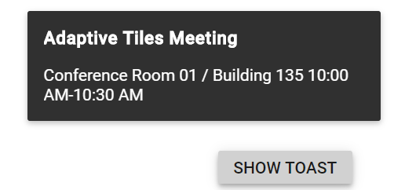
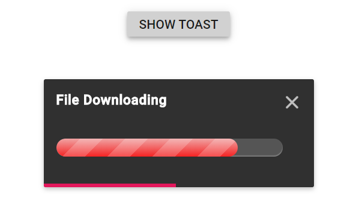
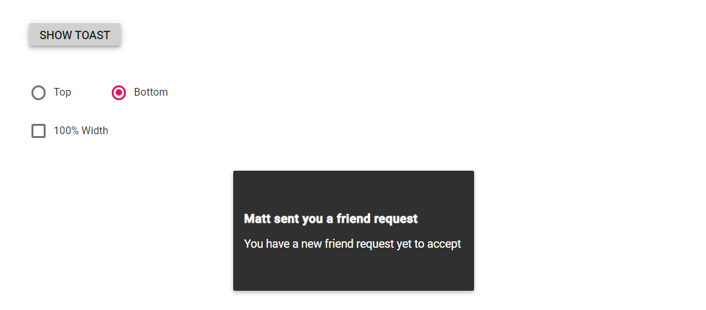

# Configuring Options

This section explains the steps required to customize the appearance of the toast using built-in APIs.

## Title and content template

Toast can be created with the notification message. The message contains `Title` and content of the toasts. The title and contents are adaptable in any resolution.

> The Title or `Content` property can be given as HTMLElement/element ID to a string that can be displayed as a toast.

```csharp

@using Syncfusion.Blazor
@using Syncfusion.Blazor.Buttons
@using Syncfusion.Blazor.Notifications

<SfToast @ref="ToastObj" Title="Adaptive Tiles Meeting" Content="@ToastContent">
    <ToastPosition X="Center"></ToastPosition>
</SfToast>
<div class="col-lg-12 col-sm-12 col-md-12 center">
    <div id="toastBtnDefault" style="margin: auto;text-align: center">
        <SfButton @onclick="@ShowOnClick"> Show Toast </SfButton>
    </div>
</div>

<style>
    .e-toast .e-meeting::before {
        content: "\e705";
        font-size: 17px;
    }
</style>

@code {
    SfToast ToastObj;

    public string ToastContent = "Conference Room 01 / Building 135 10:00 AM-10:30 AM";

    private void ShowOnClick()
    {
        this.ToastObj.Show();
    }

}

```

The output will be as follows.



## Specifying custom target

By default, the toast can be rendered in the document body. You can change the target position for toast rendering using the `Target` property. Based on the target, the `Position` will be updated.

## Close button

By default, the `ShowCloseButton` is not enabled. You can enable it by setting the true value. Before expiring the toast, you can use this button to close or destroy toasts manually.

## Progress bar

By default, the `ShowProgressBar` is not enabled. If it is enabled, it can visually indicate how long to get toast expires. Based on the `TimeOut` property, progress bar will appear.

## Newest on top

By default, the newly created toasts will append next with existing toasts. You can change the sequence like inserting before the toast by enabling the `NewestOnTop`.

Here, The following sample demonstrates the combination of the `Target`, `ShowCloseButton`, `ShowProgressBar` and `NewestOnTop` properties in toast.

```csharp

@using Syncfusion.Blazor
@using Syncfusion.Blazor.Buttons
@using Syncfusion.Blazor.Notifications

    <div class="control-section toast-default-section">
        <SfToast @ref="ToastObj" Title="File Downloading" Content="@ToastContent" ShowCloseButton="true"
                  Target="#toast_target" NewestOnTop="true" ShowProgressBar="true" >
            <ToastPosition X="Center"></ToastPosition>
        </SfToast>
        <div class="col-lg-12 col-sm-12 col-md-12 center">
            <div id="toastBtnDefault" style="margin: auto; text-align: center">
                <SfButton @onclick="@ShowOnClick"> Show Toast </SfButton>
            </div>
        </div>
        <br /><br />
        <div id='toast_target'></div>
    </div>

<style>
  .e-toast .e-meeting::before {
    content: "\e705";
    font-size: 17px;
  }
  .progress {
    height: 20px;
    position: relative;
    margin: 20px 0 20px 0;
    background: #555;
    -moz-border-radius: 25px;
    -webkit-border-radius: 25px;
    border-radius: 25px;
    box-shadow: inset 0 -1px 1px rgba(255, 255, 255, 0.3);
  }
  .progress span {
    background-color: #f0a3a3;
    background-image: -webkit-gradient(linear, left top, left bottom, color-stop(0, #f0a3a3), color-stop(1, #f42323));
    display: block;
    height: 100%;
    border-radius: 10px;
    width: 50%;
    position: relative;
    overflow: hidden;
  }
  .progress span::after {
    background-image: -webkit-gradient(linear, 0 0, 100% 100%,
    color-stop(.25, rgba(255, 255, 255, .2)),
    color-stop(.25, transparent), color-stop(.5, transparent),
    color-stop(.5, rgba(255, 255, 255, .2)),
    color-stop(.75, rgba(255, 255, 255, .2)),
    color-stop(.75, transparent), to(transparent));
    content: "";
    position: absolute;
    top: 0;
    left: 0;
    bottom: 0;
    right: 0;
    background-size: 50px 50px;
    -webkit-animation: moveAnimate 2s linear infinite;
    overflow: hidden;
  }
  @@-webkit-keyframes moveAnimate {
    0% {
      background-position: 0 0;
    }
    100% {
      background-position: 50px 50px;
    }
  }
</style>

@code {
    SfToast ToastObj;

    public string ToastContent = "<div class='progress'><span style='width: 80%'></span></div>";

    private void ShowOnClick()
    {
        this.ToastObj.Show();
    }

}

```

The output will be as follows.



## Width and height

The dimensions of the toast can be set using the `Width` and `Height` properties. This will individually set all toasts. You can create different custom dimension toasts.

By default, the toast can be rendered with `300px` width with `auto` height.

> In mobile devices, the default width of the toast gets '100%' width of the page.
> When you set toast width as '100%', the toast occupies full width and will be displayed at the top or bottom based on the position `Y` property.

Both the width and height properties allow setting pixels/numbers/percentage. The number value is considered as pixels.

```csharp

@using Syncfusion.Blazor
@using Syncfusion.Blazor.Buttons
@using Syncfusion.Blazor.Notifications
@using System.Threading

<div class="control-section toast-default-section">
    <SfToast @ref="ToastObj" Title="@Title" Width="@Width" Height="@Height" Content="@ToastContent">
        <ToastPosition X="Center" Y="@PositionY"></ToastPosition>
    </SfToast>
    <div class="col-lg-12 col-sm-12 col-md-12 center">
        <div id="toastBtnDefault" style="margin: auto; text-align: center">
            <SfButton @onclick="@ShowOnClick"> Show Toast </SfButton>
        </div>
    </div>
    <div class='row' style="padding-top: 20px" id="toast_pos_target">
        <table style="margin-left: 200px">
            <tr>
                <td>
                    <div style='padding:25px 0 0 0;'>
                        <SfRadioButton Name="toast" Label="Top" Value="Target" ValueChange="@CheckboxChange"></SfRadioButton>
                    </div>
                </td>
                <td>
                    <div style='padding:25px 0 0 0;'>
                        <SfRadioButton Name="toast" Label="Bottom" Value="Global" ValueChange="@CheckboxChange1" Checked="true"></SfRadioButton>
                    </div>
                </td>
            </tr>
            <tr>
                <td>
                    <div style='padding:25px 0 0 0;'>
                        <SfCheckBox Label="100% Width" ValueChange="@OnChange"></SfCheckBox>
                    </div>
                </td>
            </tr>
        </table>
    </div>
    <br /><br />
    <div id='result'></div>
</div>

@code {
    SfToast ToastObj;

    public string Width { get; set; } = "400";
    public string Height { get; set; } = "120";
    public string PositionY { get; set; } = "Bottom";
    public string Title { get; set; } = "Matt sent you a friend request";
    public string ToastContent { get; set; } = "You have a new friend request yet to accept";
    public int timeDelay { get; set; } = 500;
    private void OnChange(Syncfusion.Blazor.Buttons.ChangeEventArgs e)
    {
        if (e.Checked)
        {
            ToastObj.Hide();
            this.Width = "100%";
            this.Title = "";
            this.ToastContent = "<div class='e-custom'>Take a look at our next generation <b>Javascript</b> <a href='https://blazor.syncfusion.com/home/index.html' target='_blank'>LEARN MORE</a></div>";
            StateHasChanged();
        }
        else
        {
            ToastObj.Hide();
            this.Width = "300";
            this.Title = "Matt sent you a friend request";
            this.ToastContent = "You have a new friend request yet to accept";
            StateHasChanged();
        }
    }
    private void CheckboxChange(Syncfusion.Blazor.Buttons.ChangeArgs e)
    {
        if (e.Value == "Target")
        {
            this.PositionY = "Top";
            ToastObj.Hide();
            StateHasChanged();
        }
    }
    private void CheckboxChange1(Syncfusion.Blazor.Buttons.ChangeArgs e)
    {
        if (e.Value == "Global")
        {
            this.PositionY = "Bottom";
            ToastObj.Hide();
            StateHasChanged();
        }
    }
    private void toastShow(int timeDelay)
    {
        Thread.Sleep(500);
        ToastObj.Show();
    }
    private void ShowOnClick()
    {
        this.ToastObj.Show();
    }
}

```

The output will be as follows.


