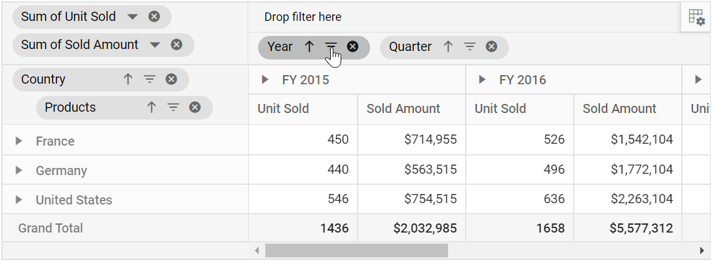
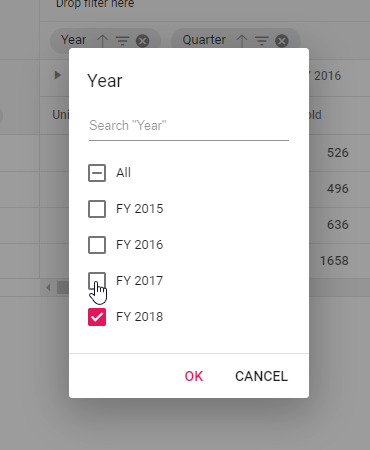
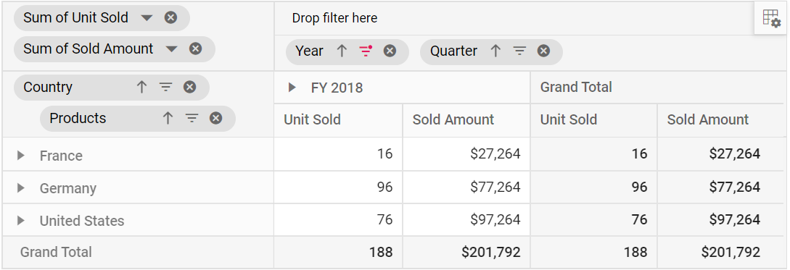
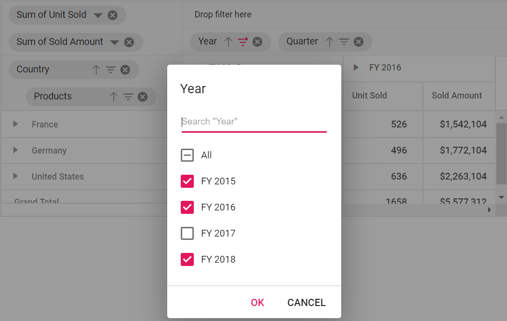
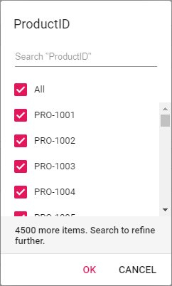
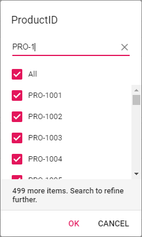
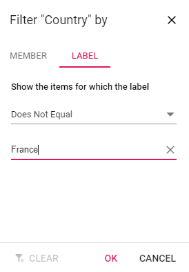
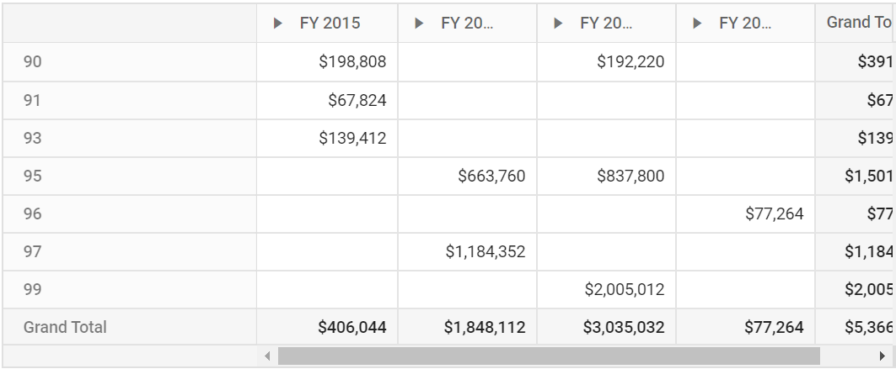
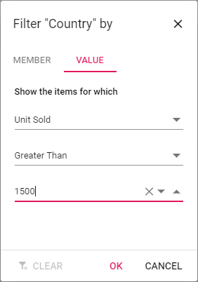
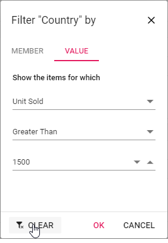

# Filtering

Filtering allows to view the pivot table with selective records based on members that can be either included or excluded through UI and code-behind.

The following are the three different types of filtering:

* Member filtering
* Label filtering
* Value filtering

> When all the above filtering options are disabled via code-hind, then the filter icon would be disabled in the field list or group bar UI.

## Member filtering

Allows to view the pivot table with selective records based on included and excluded members in each field. By default, member filter option is enabled by the [`AllowMemberFilter`](https://help.syncfusion.com/cr/cref_files/aspnetmvc-js2/Syncfusion.EJ2~Syncfusion.EJ2.PivotView.PivotViewDataSourceSettings~AllowMemberFilter.html) boolean property in [`PivotViewDataSourceSettings`](https://help.syncfusion.com/cr/aspnetmvc-js2/Syncfusion.EJ2~Syncfusion.EJ2.PivotView.PivotViewDataSourceSettings_members.html) class. This UI option helps end user to filter members by clicking the filter icon besides any field in the row, column and filter axes available in the field list or grouping bar UI at runtime.

 

 

 

Meanwhile filtering can also be configured at code behind using the [`PivotViewFilterSettings`](https://help.syncfusion.com/cr/aspnetmvc-js2/Syncfusion.EJ2~Syncfusion.EJ2.PivotView.PivotViewFilterSetting_members.html) class while initial rendering of the component. The basic settings required to add filter criteria are:

* [`Name`](https://help.syncfusion.com/cr/cref_files/aspnetmvc-js2/Syncfusion.EJ2~Syncfusion.EJ2.PivotView.PivotViewFilterSetting~Name.html): It allows to set the appropriate field name.
* [`Type`](https://help.syncfusion.com/cr/cref_files/aspnetmvc-js2/Syncfusion.EJ2~Syncfusion.EJ2.PivotView.PivotViewFilterSetting~Type.html): It allows to set the filter type as [**FilterType.Include**](https://help.syncfusion.com/cr/cref_files/aspnetmvc-js2/Syncfusion.EJ2~Syncfusion.EJ2.PivotView.FilterType.html) or [**FilterType.Exclude**](https://help.syncfusion.com/cr/cref_files/aspnetmvc-js2/Syncfusion.EJ2~Syncfusion.EJ2.PivotView.FilterType.html) to include or exclude field members respectively.
* [`Items`](https://help.syncfusion.com/cr/cref_files/aspnetmvc-js2/Syncfusion.EJ2~Syncfusion.EJ2.PivotView.PivotViewFilterSetting~Items.html): It allows to set the members which needs to be either included or excluded from display.





### Option to select and unselect all members

The member filter dialog comes with an option "All", which on checked selects all members and on unchecked deselects all members. The option "All" would appear in intermediate state mentioning that both selected and unselected child members are available.

When all members are deselected, the "Ok" button in member filter dialog would be disabled, meaning, at least one member should be selected and bound to the pivot table component.

### Provision to search specific member(s)

By default, search option is available to quickly navigate to the desired members. It can be done by entering the starting character(s) of the actual members.

### Performance Tips

In member filter dialog, end user can set the limit to display members while loading large data. Based on this limit, initial loading will get completed quickly without any performance constraint. Also, a message with remaining member count, which are not part of the UI, will be displayed in the member editor.

The data limit can be set using the [`MaxNodeLimitInMemberEditor`](https://help.syncfusion.com/cr/cref_files/aspnetmvc-js2/Syncfusion.EJ2~Syncfusion.EJ2.PivotView.PivotView~MaxNodeLimitInMemberEditor.html) property in [`PivotView`](https://help.syncfusion.com/cr/aspnetmvc-js2/Syncfusion.EJ2~Syncfusion.EJ2.PivotView.PivotView_properties.html) class. By default, the property holds the numeric value **1000**.





Meanwhile, end user can utilize the search option to refine the members from the exceeded limit. For example, consider that there are 5000 members in the name "Node 1", "Node 2", "Node 3", and so on... and user has set the property [`MaxNodeLimitInMemberEditor`](https://help.syncfusion.com/cr/cref_files/aspnetmvc-js2/Syncfusion.EJ2~Syncfusion.EJ2.PivotView.PivotView~MaxNodeLimitInMemberEditor.html) to **500**. In this case, only the initial 500 members will be displayed by default leaving a message "4500 more items. Search to refine further.". To get the member(s) between 501 to 5000, enter the starting character(s) in search option to bring the desired member(s) from the exceeded limit to the UI. Now, end user can either check or uncheck to continue with the filtering process.

## Label filtering

The label filtering helps to view the pivot table with selective header text in fields across row and column axes based on the applied filter criteria. The following are the three different types of label filtering available:

* Filtering string data type
* Filtering number data type
* Filtering date data type

The label filtering dialog can be enabled by setting the [`AllowLabelFilter`](https://help.syncfusion.com/cr/cref_files/aspnetmvc-js2/Syncfusion.EJ2~Syncfusion.EJ2.PivotView.PivotViewDataSourceSettings~AllowLabelFilter.html) property in [`PivotViewDataSourceSettings`](https://help.syncfusion.com/cr/aspnetmvc-js2/Syncfusion.EJ2~Syncfusion.EJ2.PivotView.PivotViewDataSourceSettings_members.html) class to **true**. After enabling this API, click the filter icon besides any field in row or column axis available in field list or grouping bar UI. Now a filtering dialog will appear and navigate to "Label" tab to perform label filtering operations.





 

 
 

 
 

> In label filtering UI, based on the field chosen, it’s member data type is automatically recognized and filtering operation will be carried out. Where as in code behind, user need to define the data type through a property and it has been explained in the immediate section below.

### Filtering string data type through code

This type of filtering is exclusively applicable for fields with members in string data type. The filtering can be configured using the [`PivotViewFilterSettings`](https://help.syncfusion.com/cr/aspnetmvc-js2/Syncfusion.EJ2~Syncfusion.EJ2.PivotView.PivotViewFilterSetting_members.html) class through code-behind. The properties required for label filter are:

* [`Name`](https://help.syncfusion.com/cr/cref_files/aspnetmvc-js2/Syncfusion.EJ2~Syncfusion.EJ2.PivotView.PivotViewFilterSetting~Name.html): Sets the field name.
* [`Type`](https://help.syncfusion.com/cr/cref_files/aspnetmvc-js2/Syncfusion.EJ2~Syncfusion.EJ2.PivotView.PivotViewFilterSetting~Type.html): Sets the filter type as [**FilterType.Label**](https://help.syncfusion.com/cr/cref_files/aspnetmvc-js2/Syncfusion.EJ2~Syncfusion.EJ2.PivotView.FilterType.html) to the field.
* [`Condition`](https://help.syncfusion.com/cr/cref_files/aspnetmvc-js2/Syncfusion.EJ2~Syncfusion.EJ2.PivotView.PivotViewFilterSetting~Condition.html): Sets the operator type such as [**Operators.Equals**](https://help.syncfusion.com/cr/cref_files/aspnetmvc-js2/Syncfusion.EJ2~Syncfusion.EJ2.PivotView.Operators.html), [**Operators.GreaterThan**](https://help.syncfusion.com/cr/cref_files/aspnetmvc-js2/Syncfusion.EJ2~Syncfusion.EJ2.PivotView.Operators.html), [**Operators.LessThan**](https://help.syncfusion.com/cr/cref_files/aspnetmvc-js2/Syncfusion.EJ2~Syncfusion.EJ2.PivotView.Operators.html), etc.
* [`Value1`](https://help.syncfusion.com/cr/cref_files/aspnetmvc-js2/Syncfusion.EJ2~Syncfusion.EJ2.PivotView.PivotViewFilterSetting~Value1.html): Sets the start value.
* [`Value2`](https://help.syncfusion.com/cr/cref_files/aspnetmvc-js2/Syncfusion.EJ2~Syncfusion.EJ2.PivotView.PivotViewFilterSetting~Value2.html): Sets the end value. It is applicable only for the operator such as [**Operators.Between**](https://help.syncfusion.com/cr/cref_files/aspnetmvc-js2/Syncfusion.EJ2~Syncfusion.EJ2.PivotView.Operators.html) and [**Operators.NotBetween**](https://help.syncfusion.com/cr/cref_files/aspnetmvc-js2/Syncfusion.EJ2~Syncfusion.EJ2.PivotView.Operators.html).

For example, in a "Country" field, to show countries names that contains "United" text alone, set [`Value1`](https://help.syncfusion.com/cr/cref_files/aspnetmvc-js2/Syncfusion.EJ2~Syncfusion.EJ2.PivotView.PivotViewFilterSetting~Value1.html) to "United" and [`Condition`](https://help.syncfusion.com/cr/cref_files/aspnetmvc-js2/Syncfusion.EJ2~Syncfusion.EJ2.PivotView.PivotViewFilterSetting~Condition.html) to [**Operators.Contains**](https://help.syncfusion.com/cr/cref_files/aspnetmvc-js2/Syncfusion.EJ2~Syncfusion.EJ2.PivotView.Operators.html) for desired output in pivot table.
[**Operators**](https://help.syncfusion.com/cr/cref_files/aspnetmvc-js2/Syncfusion.EJ2~Syncfusion.EJ2.PivotView.Operators.html) that can be used in label filtering are:

| Operator | Description |
|------|-------------|
| Equals| Displays the pivot table that matches with the text.|
| DoesNotEquals| Displays the pivot table that does not match with the given text.|
| BeginWith| Displays the pivot table that begins with text.|
| DoesNotBeginWith| Displays the pivot table that does not begins with text.|
| EndsWith| Displays the pivot table that ends with text.|
| DoesNotEndsWith| Displays the pivot table that does not ends with text.|
| Contains| Displays the pivot table that contains text.|
| DoesNotContains| Displays the pivot table that does not contain text.|
| GreaterThan| Displays the pivot table when the text is greater.|
| GreaterThanOrEqualTo| Displays the pivot table when the text is greater than or equal.|
| LessThan| Displays the pivot table when the text is lesser.|
| LessThanOrEqualTo| Displays the pivot table when the text is lesser than or equal.|
| Between| Displays the pivot table that records between the start and end text.|
| NotBetween| Displays the pivot table that does not record between the start and end text.|





### Filtering number data type through code

This type of filtering is exclusively applicable for fields with members in number data type. The filtering can be configured in a similar way explained in the previous section - "Filtering string data type through code", except the [`Type`](https://help.syncfusion.com/cr/cref_files/aspnetmvc-js2/Syncfusion.EJ2~Syncfusion.EJ2.PivotView.PivotViewFilterSetting~Type.html) property setting. For number data type, set the [`Type`](https://help.syncfusion.com/cr/cref_files/aspnetmvc-js2/Syncfusion.EJ2~Syncfusion.EJ2.PivotView.PivotViewFilterSetting~Type.html) property to [**FilterType.Number**](https://help.syncfusion.com/cr/cref_files/aspnetmvc-js2/Syncfusion.EJ2~Syncfusion.EJ2.PivotView.FilterType.html) enumeration.

For example, in a "Sold" field, to show the values between "90" to "100", set [`Value1`](https://help.syncfusion.com/cr/cref_files/aspnetmvc-js2/Syncfusion.EJ2~Syncfusion.EJ2.PivotView.PivotViewFilterSetting~Value1.html) to "90", [`Value2`](https://help.syncfusion.com/cr/cref_files/aspnetmvc-js2/Syncfusion.EJ2~Syncfusion.EJ2.PivotView.PivotViewFilterSetting~Value2.html) to "100" and [`Condition`](https://help.syncfusion.com/cr/cref_files/aspnetmvc-js2/Syncfusion.EJ2~Syncfusion.EJ2.PivotView.PivotViewFilterSetting~Condition.html) to [**Operators.Between**](https://help.syncfusion.com/cr/cref_files/aspnetmvc-js2/Syncfusion.EJ2~Syncfusion.EJ2.PivotView.Operators.html) for desired output in pivot table.

> Operators like [**Operators.Equals**](https://help.syncfusion.com/cr/cref_files/aspnetmvc-js2/Syncfusion.EJ2~Syncfusion.EJ2.PivotView.Operators.html), [**Operators.DoesNotEquals**](https://help.syncfusion.com/cr/cref_files/aspnetmvc-js2/Syncfusion.EJ2~Syncfusion.EJ2.PivotView.Operators.html), [**Operators.GreaterThan**](https://help.syncfusion.com/cr/cref_files/aspnetmvc-js2/Syncfusion.EJ2~Syncfusion.EJ2.PivotView.Operators.html), [**Operators.GreaterThanOrEqualTo**](https://help.syncfusion.com/cr/cref_files/aspnetmvc-js2/Syncfusion.EJ2~Syncfusion.EJ2.PivotView.Operators.html), [**Operators.LessThan**](https://help.syncfusion.com/cr/cref_files/aspnetmvc-js2/Syncfusion.EJ2~Syncfusion.EJ2.PivotView.Operators.html), [**Operators.LessThanOrEqualTo**](https://help.syncfusion.com/cr/cref_files/aspnetmvc-js2/Syncfusion.EJ2~Syncfusion.EJ2.PivotView.Operators.html), [**Operators.Between**](https://help.syncfusion.com/cr/cref_files/aspnetmvc-js2/Syncfusion.EJ2~Syncfusion.EJ2.PivotView.Operators.html), and [**Operators.NotBetween**](https://help.syncfusion.com/cr/cref_files/aspnetmvc-js2/Syncfusion.EJ2~Syncfusion.EJ2.PivotView.Operators.html) are alone applicable for number data type.





### Filtering date data type through code

This type of filtering is exclusively applicable for fields with members in date data type. The filtering can be configured in a similar way explained in the prior section - "Filtering string data type through code", except the [`Type`](https://help.syncfusion.com/cr/cref_files/aspnetmvc-js2/Syncfusion.EJ2~Syncfusion.EJ2.PivotView.PivotViewFilterSetting~Type.html) property setting. For date data type, set the [`Type`](https://help.syncfusion.com/cr/cref_files/aspnetmvc-js2/Syncfusion.EJ2~Syncfusion.EJ2.PivotView.PivotViewFilterSetting~Type.html) property to [**FilterType.Date**](https://help.syncfusion.com/cr/cref_files/aspnetmvc-js2/Syncfusion.EJ2~Syncfusion.EJ2.PivotView.FilterType.html) enumeration.

For example, in a "Delivery Date" field, to show the delivery records of the first week of the year 2019, then set [`Value1`](https://help.syncfusion.com/cr/cref_files/aspnetmvc-js2/Syncfusion.EJ2~Syncfusion.EJ2.PivotView.PivotViewFilterSetting~Value1.html) to "2019-01-07" and [`Condition`](https://help.syncfusion.com/cr/cref_files/aspnetmvc-js2/Syncfusion.EJ2~Syncfusion.EJ2.PivotView.PivotViewFilterSetting~Condition.html) to [**Operators.Before**](https://help.syncfusion.com/cr/cref_files/aspnetmvc-js2/Syncfusion.EJ2~Syncfusion.EJ2.PivotView.Operators.html) for desired output in pivot table.

> Operators like [**Operators.Equals**](https://help.syncfusion.com/cr/cref_files/aspnetmvc-js2/Syncfusion.EJ2~Syncfusion.EJ2.PivotView.Operators.html), [**Operators.DoesNotEquals**](https://help.syncfusion.com/cr/cref_files/aspnetmvc-js2/Syncfusion.EJ2~Syncfusion.EJ2.PivotView.Operators.html), [**Operators.Before**](https://help.syncfusion.com/cr/cref_files/aspnetmvc-js2/Syncfusion.EJ2~Syncfusion.EJ2.PivotView.Operators.html), [**Operators.BeforeOrEqualTo**](https://help.syncfusion.com/cr/cref_files/aspnetmvc-js2/Syncfusion.EJ2~Syncfusion.EJ2.PivotView.Operators.html), [**Operators.After**](https://help.syncfusion.com/cr/cref_files/aspnetmvc-js2/Syncfusion.EJ2~Syncfusion.EJ2.PivotView.Operators.html), [**Operators.AfterOrEqualTo**](https://help.syncfusion.com/cr/cref_files/aspnetmvc-js2/Syncfusion.EJ2~Syncfusion.EJ2.PivotView.Operators.html), [**Operators.Between**](https://help.syncfusion.com/cr/cref_files/aspnetmvc-js2/Syncfusion.EJ2~Syncfusion.EJ2.PivotView.Operators.html), and [**Operators.NotBetween**](https://help.syncfusion.com/cr/cref_files/aspnetmvc-js2/Syncfusion.EJ2~Syncfusion.EJ2.PivotView.Operators.html) are alone applicable for date data type.





### Clearing the existing label filter

End user can clear the applied label filter by simply click the "Clear" option at the bottom of the filter dialog under "Label" tab.

## Value filtering

The value filtering helps to perform filter operation based only on value fields and its resultant aggregated values over other fields defined in row and column axes.

The value filtering dialog can be enabled by setting the [`AllowValueFilter`](https://help.syncfusion.com/cr/cref_files/aspnetmvc-js2/Syncfusion.EJ2~Syncfusion.EJ2.PivotView.PivotViewDataSourceSettings~AllowValueFilter.html) property in [`PivotViewDataSourceSettings`](https://help.syncfusion.com/cr/aspnetmvc-js2/Syncfusion.EJ2~Syncfusion.EJ2.PivotView.PivotViewDataSourceSettings_members.html) class to **true**. After enabling this API, click the filter icon besides any field in row or column axis available in field list or grouping bar UI. Now a filtering dialog will appear and navigate to "Value" tab to perform value filtering operations.





 

 
 

 
 

The value filtering can also be configured using the [`PivotViewFilterSettings`](https://help.syncfusion.com/cr/aspnetmvc-js2/Syncfusion.EJ2~Syncfusion.EJ2.PivotView.PivotViewFilterSetting_members.html) class through code-behind. The properties required for value filter are:

* [`Name`](https://help.syncfusion.com/cr/cref_files/aspnetmvc-js2/Syncfusion.EJ2~Syncfusion.EJ2.PivotView.PivotViewFilterSetting~Name.html): Sets the normal field name.
* [`Type`](https://help.syncfusion.com/cr/cref_files/aspnetmvc-js2/Syncfusion.EJ2~Syncfusion.EJ2.PivotView.PivotViewFilterSetting~Type.html): Sets the filter type as [**FilterType.Value**](https://help.syncfusion.com/cr/cref_files/aspnetmvc-js2/Syncfusion.EJ2~Syncfusion.EJ2.PivotView.FilterType.html) to the field.
* [`Measure`](https://help.syncfusion.com/cr/cref_files/aspnetmvc-js2/Syncfusion.EJ2~Syncfusion.EJ2.PivotView.PivotViewFilterSetting~Measure.html): Sets the value field name.
* [`Condition`](https://help.syncfusion.com/cr/cref_files/aspnetmvc-js2/Syncfusion.EJ2~Syncfusion.EJ2.PivotView.PivotViewFilterSetting~Condition.html): Sets the operator type such as [**Operators.Equals**](https://help.syncfusion.com/cr/cref_files/aspnetmvc-js2/Syncfusion.EJ2~Syncfusion.EJ2.PivotView.Operators.html), [**Operators.GreaterThan**](https://help.syncfusion.com/cr/cref_files/aspnetmvc-js2/Syncfusion.EJ2~Syncfusion.EJ2.PivotView.Operators.html), [**Operators.LessThan**](https://help.syncfusion.com/cr/cref_files/aspnetmvc-js2/Syncfusion.EJ2~Syncfusion.EJ2.PivotView.Operators.html) etc.
* [`Value1`](https://help.syncfusion.com/cr/cref_files/aspnetmvc-js2/Syncfusion.EJ2~Syncfusion.EJ2.PivotView.PivotViewFilterSetting~Value1.html): Sets the start value.
* [`Value2`](https://help.syncfusion.com/cr/cref_files/aspnetmvc-js2/Syncfusion.EJ2~Syncfusion.EJ2.PivotView.PivotViewFilterSetting~Value2.html): Sets the end value. It is applicable only for the operator such as [**Operators.Between**](https://help.syncfusion.com/cr/cref_files/aspnetmvc-js2/Syncfusion.EJ2~Syncfusion.EJ2.PivotView.Operators.html) and [**Operators.NotBetween**](https://help.syncfusion.com/cr/cref_files/aspnetmvc-js2/Syncfusion.EJ2~Syncfusion.EJ2.PivotView.Operators.html).

For example, to show the data where total sum of units sold for each country exceeding 1500, set [`Value1`](https://help.syncfusion.com/cr/cref_files/aspnetmvc-js2/Syncfusion.EJ2~Syncfusion.EJ2.PivotView.PivotViewFilterSetting~Value1.html) to "1500" and [`Condition`](https://help.syncfusion.com/cr/cref_files/aspnetmvc-js2/Syncfusion.EJ2~Syncfusion.EJ2.PivotView.PivotViewFilterSetting~Condition.html) to [**Operators.GreaterThan**](https://help.syncfusion.com/cr/cref_files/aspnetmvc-js2/Syncfusion.EJ2~Syncfusion.EJ2.PivotView.Operators.html) in the "Country" field.

[**Operators**](https://help.syncfusion.com/cr/cref_files/aspnetmvc-js2/Syncfusion.EJ2~Syncfusion.EJ2.PivotView.Operators.html) that can be used in value filtering are:

| Operator | Description |
|------|-------------|
| Equals| Displays the pivot table that matches with the value.|
| DoesNotEquals| Displays the pivot table that does not match with the given value.|
| GreaterThan| Displays the pivot table when the value is greater.|
| GreaterThanOrEqualTo| Displays the pivot table when the value is greater than or equal.|
| LessThan| Displays the pivot table when the value is lesser.|
| LessThanOrEqualTo| Displays the pivot table when the value is lesser than or equal.|
| Between| Displays the pivot table that records between start and end values.|
| NotBetween| Displays the pivot table that does not record between start and end values.|





### Clearing the existing value filter

End user can clear the applied value filter by simply click the "Clear" option at the bottom of the filter dialog under "Value" tab.

