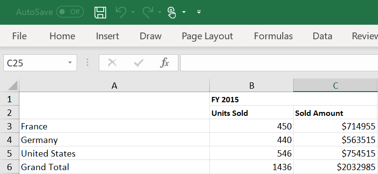
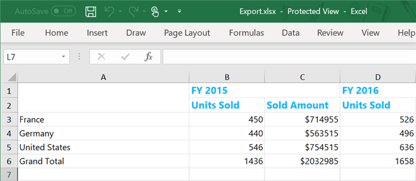
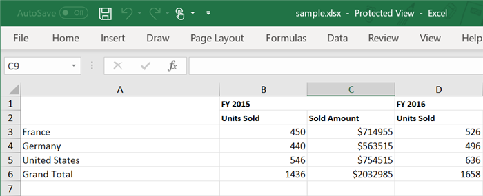
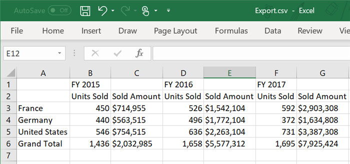

# Excel Export

The Excel export allows Pivot Table data to be exported as Excel document. To enable Excel export in the pivot table, set the [`AllowExcelExport`](https://help.syncfusion.com/cr/cref_files/blazor/Syncfusion.Blazor~Syncfusion.Blazor.PivotView.SfPivotView%601~AllowExcelExport.html) property in [`SfPivotView`](https://help.syncfusion.com/cr/blazor/Syncfusion.Blazor~Syncfusion.Blazor.PivotView.SfPivotView%601_members.html) class to **true**. Once the API is set, user needs to call the [`ExcelExport`](https://help.syncfusion.com/cr/cref_files/blazor/Syncfusion.Blazor~Syncfusion.Blazor.PivotView.SfPivotView%601~ExcelExport.html) method for exporting on external button click.

> The pivot table component can be exported to Excel format using options available in the toolbar. For more details [`refer`](./tool-bar) here.

```csharp
@using Syncfusion.Blazor.PivotView
@using Syncfusion.Blazor.Buttons

<SfButton OnClick="OnExcelExport" Content="Excel Export"></SfButton>
<SfPivotView TValue="ProductDetails" @ref="@pivot" AllowExcelExport="true" >
    <PivotViewDataSourceSettings DataSource="@data" EnableSorting=true>
        <PivotViewColumns>
            <PivotViewColumn Name="Year"></PivotViewColumn>
            <PivotViewColumn Name="Quarter"></PivotViewColumn>
        </PivotViewColumns>
        <PivotViewRows>
            <PivotViewRow Name="Country"></PivotViewRow>
            <PivotViewRow Name="Products"></PivotViewRow>
        </PivotViewRows>
        <PivotViewValues>
            <PivotViewValue Name="Sold" Caption="Units Sold"></PivotViewValue>
            <PivotViewValue Name="Amount" Caption="Sold Amount"></PivotViewValue>
        </PivotViewValues>
        <PivotViewFormatSettings>
            <PivotViewFormatSetting Name="Amount" Format="C0" UseGrouping=true></PivotViewFormatSetting>
        </PivotViewFormatSettings>
    </PivotViewDataSourceSettings>
</SfPivotView>

@code{
    SfPivotView<ProductDetails> pivot;
    public List<ProductDetails> data { get; set; }
    protected override void OnInitialized()
    {
        this.data = ProductDetails.GetProductData().ToList();
       //Bind the data source collection here. Refer "Assigning sample data to the pivot table" section in getting started for more details.
    }

    public void OnExcelExport(Microsoft.AspNetCore.Components.Web.MouseEventArgs args){
        this.pivot.ExcelExport();
    }
}
```



## Changing the pivot table style while exporting

The Excel export provides an option to change colors for headers, caption and records in pivot table before exporting. In-order to apply colors, define **theme** settings in **excelExportProperties** object and pass it as a parameter to the [`ExcelExport`](https://help.syncfusion.com/cr/cref_files/blazor/Syncfusion.Blazor~Syncfusion.Blazor.PivotView.SfPivotView%601~ExcelExport.html) method.

> By default, material theme will be applied to the pivot table during Excel exporting.

```csharp
@using Syncfusion.Blazor.PivotView
@using Syncfusion.Blazor.Buttons

<SfButton OnClick="OnExcelExport" Content="Excel Export"></SfButton>
<SfPivotView TValue="ProductDetails" @ref="@pivot" AllowExcelExport="true" >
    <PivotViewDataSourceSettings DataSource="@data" EnableSorting=true>
        <PivotViewColumns>
            <PivotViewColumn Name="Year"></PivotViewColumn>
            <PivotViewColumn Name="Quarter"></PivotViewColumn>
        </PivotViewColumns>
        <PivotViewRows>
            <PivotViewRow Name="Country"></PivotViewRow>
            <PivotViewRow Name="Products"></PivotViewRow>
        </PivotViewRows>
        <PivotViewValues>
            <PivotViewValue Name="Sold" Caption="Units Sold"></PivotViewValue>
            <PivotViewValue Name="Amount" Caption="Sold Amount"></PivotViewValue>
        </PivotViewValues>
        <PivotViewFormatSettings>
            <PivotViewFormatSetting Name="Amount" Format="C0" UseGrouping=true></PivotViewFormatSetting>
        </PivotViewFormatSettings>
    </PivotViewDataSourceSettings>
</SfPivotView>

@code{
    SfPivotView<ProductDetails> pivot;
    public List<ProductDetails> data { get; set; }
    protected override void OnInitialized()
    {
        this.data = ProductDetails.GetProductData().ToList();
       //Bind the data source collection here. Refer "Assigning sample data to the pivot table" section in getting started for more details.
    }

    public void OnExcelExport(Microsoft.AspNetCore.Components.Web.MouseEventArgs args) {
        object excelExportProperties = new {
            theme = new {
                header = new { fontName = "Segoe UI", fontColor= "#0fb5fc", fontSize = 15, bold= true },
                record = new { fontName= "Segoe UI", fontColor= "#000000" },
                caption= new { fontName= "Segoe UI", fontColor= "#000000" }
            }
        };
        this.pivot.ExcelExport(excelExportProperties);
    }
}

```



## Changing the file name while exporting

The Excel export provides an option to change file name of the document before exporting. In-order to change the file name, define **fileName** property in **excelExportProperties** object and pass it as a parameter to the [`ExcelExport`](https://help.syncfusion.com/cr/cref_files/blazor/Syncfusion.Blazor~Syncfusion.Blazor.PivotView.SfPivotView%601~ExcelExport.html) method.

```csharp
@using Syncfusion.Blazor.PivotView
@using Syncfusion.Blazor.Buttons

<SfButton OnClick="OnExcelExport" Content="Excel Export"></SfButton>
<SfPivotView TValue="ProductDetails" @ref="@pivot" AllowExcelExport="true" >
    <PivotViewDataSourceSettings DataSource="@data" EnableSorting=true>
        <PivotViewColumns>
            <PivotViewColumn Name="Year"></PivotViewColumn>
            <PivotViewColumn Name="Quarter"></PivotViewColumn>
        </PivotViewColumns>
        <PivotViewRows>
            <PivotViewRow Name="Country"></PivotViewRow>
            <PivotViewRow Name="Products"></PivotViewRow>
        </PivotViewRows>
        <PivotViewValues>
            <PivotViewValue Name="Sold" Caption="Units Sold"></PivotViewValue>
            <PivotViewValue Name="Amount" Caption="Sold Amount"></PivotViewValue>
        </PivotViewValues>
        <PivotViewFormatSettings>
            <PivotViewFormatSetting Name="Amount" Format="C0" UseGrouping=true></PivotViewFormatSetting>
        </PivotViewFormatSettings>
    </PivotViewDataSourceSettings>
</SfPivotView>

@code{
    SfPivotView<ProductDetails> pivot;
    public List<ProductDetails> data { get; set; }
    protected override void OnInitialized()
    {
        this.data = ProductDetails.GetProductData().ToList();
       //Bind the data source collection here. Refer "Assigning sample data to the pivot table" section in getting started for more details.
    }

    public void OnExcelExport(Microsoft.AspNetCore.Components.Web.MouseEventArgs args) {
        object excelExportProperties = new {
            fileName = "sample.xlsx"
        };
        this.pivot.ExcelExport(excelExportProperties);
    }
}

```



## CSV Export

The Excel export allows pivot table data to be exported in **CSV** file format as well. To enable CSV export in the pivot table, set the [`AllowExcelExport`](https://help.syncfusion.com/cr/cref_files/blazor/Syncfusion.Blazor~Syncfusion.Blazor.PivotView.SfPivotView%601~AllowExcelExport.html) property in [`SfPivotView`](https://help.syncfusion.com/cr/blazor/Syncfusion.Blazor~Syncfusion.Blazor.PivotView.SfPivotView%601.html) class as **true**. Once the API is set, user needs to call the [`CsvExport`](https://help.syncfusion.com/cr/cref_files/blazor/Syncfusion.Blazor~Syncfusion.Blazor.PivotView.SfPivotView%601~CsvExport.html) method for exporting on external button click.

> The pivot table component can be exported to CSV format using options available in the toolbar. For more details [`refer`](./tool-bar) here.

```csharp
@using Syncfusion.Blazor.PivotView
@using Syncfusion.Blazor.Buttons

<SfButton OnClick="OnCsvExport" Content="Csv Export"></SfButton>
<SfPivotView TValue="ProductDetails" @ref="@pivot" AllowExcelExport="true" >
    <PivotViewDataSourceSettings DataSource="@data" EnableSorting=true>
        <PivotViewColumns>
            <PivotViewColumn Name="Year"></PivotViewColumn>
            <PivotViewColumn Name="Quarter"></PivotViewColumn>
        </PivotViewColumns>
        <PivotViewRows>
            <PivotViewRow Name="Country"></PivotViewRow>
            <PivotViewRow Name="Products"></PivotViewRow>
        </PivotViewRows>
        <PivotViewValues>
            <PivotViewValue Name="Sold" Caption="Units Sold"></PivotViewValue>
            <PivotViewValue Name="Amount" Caption="Sold Amount"></PivotViewValue>
        </PivotViewValues>
        <PivotViewFormatSettings>
            <PivotViewFormatSetting Name="Amount" Format="C0" UseGrouping=true></PivotViewFormatSetting>
        </PivotViewFormatSettings>
    </PivotViewDataSourceSettings>
</SfPivotView>

@code{
    SfPivotView<ProductDetails> pivot;
    public List<ProductDetails> data { get; set; }
    protected override void OnInitialized(Microsoft.AspNetCore.Components.Web.MouseEventArgs args)
    {
        this.data = ProductDetails.GetProductData().ToList();
       //Bind the data source collection here. Refer "Assigning sample data to the pivot table" section in getting started for more details.
    }

    public void OnCsvExport() {
        this.pivot.CsvExport();
    }
}

```

