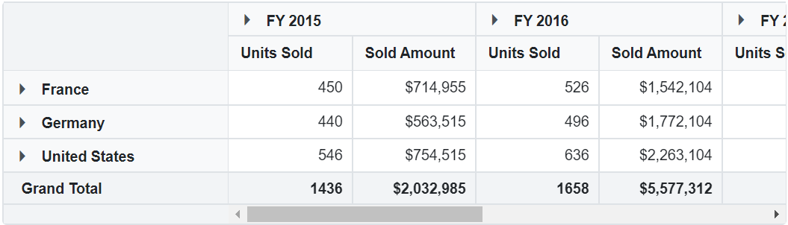
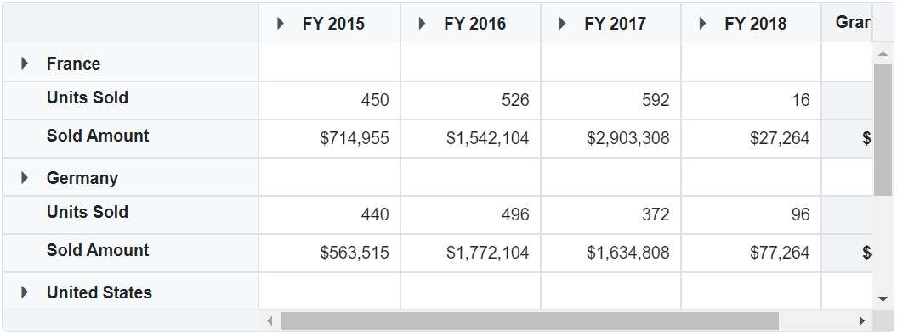
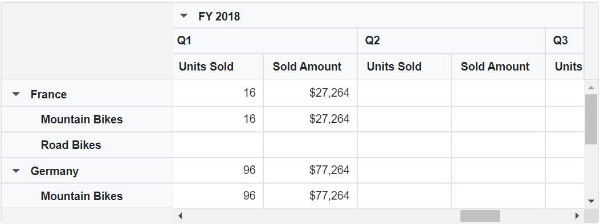
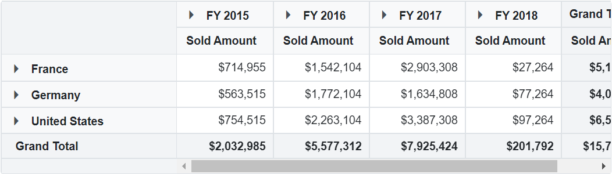
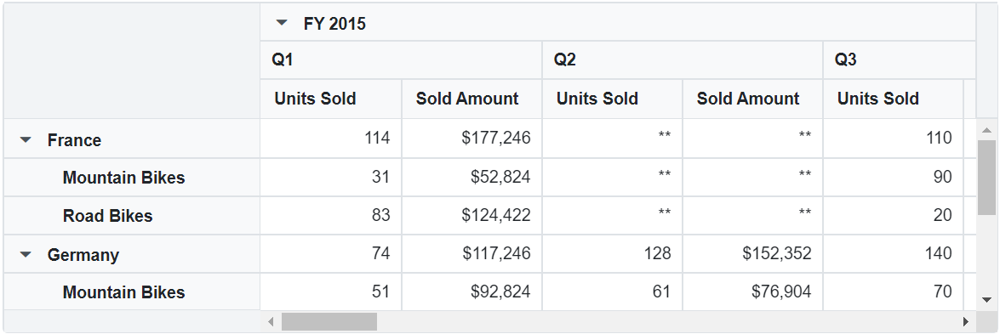
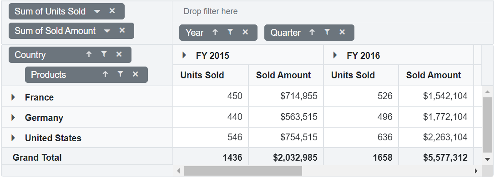

# Data Binding

The pivot table uses [`SfDataManager`](https://help.syncfusion.com/cr/blazor/Syncfusion.Blazor~Syncfusion.Blazor.DataManager.html), which supports both RESTful JSON data service binding and
local JavaScript object array binding. The [`DataSource`](https://help.syncfusion.com/cr/cref_files/blazor/Syncfusion.Blazor~Syncfusion.Blazor.PivotView.PivotViewDataSourceSettings%601~DataSource.html) property can be assigned either with the instance of
[`SfDataManager`](https://help.syncfusion.com/cr/blazor/Syncfusion.Blazor~Syncfusion.Blazor.DataManager.html) or list of objects. It supports two kinds of data binding method:

* Local data
* Remote data

## Local Data

To bind local data to the pivot table, user can assign a list of object to the [`DataSource`](https://help.syncfusion.com/cr/cref_files/blazor/Syncfusion.Blazor~Syncfusion.Blazor.PivotView.PivotViewDataSourceSettings%601~DataSource.html) property under [`PivotViewDataSourceSettings`](https://help.syncfusion.com/cr/blazor/Syncfusion.Blazor~Syncfusion.Blazor.PivotView.DataSourceSettingsModel%601.html) class. The list data source can also be provided as an instance of the [`SfDataManager`](https://help.syncfusion.com/cr/blazor/Syncfusion.Blazor~Syncfusion.Blazor.DataManager.html) class.

> By default, [`SfDataManager`](https://help.syncfusion.com/cr/blazor/Syncfusion.Blazor~Syncfusion.Blazor.DataManager.html) uses [`JsonAdaptor`](https://help.syncfusion.com/cr/blazor/Syncfusion.Blazor~Syncfusion.Blazor.Adaptors.html) for local data-binding.

```csharp
    @using Syncfusion.Blazor.PivotView

    <SfPivotView TValue="ProductDetails">
         <PivotViewDataSourceSettings DataSource="@data">
            <PivotViewColumns>
                <PivotViewColumn Name="Year"></PivotViewColumn>
                <PivotViewColumn Name="Quarter"></PivotViewColumn>
            </PivotViewColumns>
            <PivotViewRows>
                <PivotViewRow Name="Country"></PivotViewRow>
                <PivotViewRow Name="Products"></PivotViewRow>
            </PivotViewRows>
            <PivotViewValues>
                <PivotViewValue Name="Sold" Caption="Unit Sold"></PivotViewValue>
                <PivotViewValue Name="Amount" Caption="Sold Amount"></PivotViewValue>
            </PivotViewValues>
            <PivotViewFormatSettings>
                <PivotViewFormatSetting Name="Amount" Format="C"></PivotViewFormatSetting>
            </PivotViewFormatSettings>
        </PivotViewDataSourceSettings>
    </SfPivotView>

    @code{
        public List<ProductDetails> data { get; set; }
        protected override void OnInitialized()
        {
            this.data = ProductDetails.GetProductData().ToList();
           //Bind the data source collection here. Refer "Assigning sample data to the pivot table" section in getting started for more details.
        }
    }

```

 

## Remote Data

To interact with remote data source, provide the endpoint [`Url`](https://help.syncfusion.com/cr/cref_files/blazor/Syncfusion.Blazor~Syncfusion.Blazor.DataManager~Url.html) within [`SfDataManager`](https://help.syncfusion.com/cr/blazor/Syncfusion.Blazor~Syncfusion.Blazor.DataManager.html) class along with appropriate [`Adaptor`](https://blazor.syncfusion.com/documentation/data/adaptors/). By default, [`SfDataManager`](https://help.syncfusion.com/cr/blazor/Syncfusion.Blazor~Syncfusion.Blazor.DataManager.html) uses [`ODataAdaptor`](https://help.syncfusion.com/cr/blazor/Syncfusion.Blazor~Syncfusion.Blazor.Adaptors.html) for remote data-binding.

> When using [`SfDataManager`](https://help.syncfusion.com/cr/blazor/Syncfusion.Blazor~Syncfusion.Blazor.DataManager.html) for data binding then the TValue must be provided explicitly in the [`PivotViewDataSourceSettings`](https://help.syncfusion.com/cr/cref_files/blazor/Syncfusion.Blazor~Syncfusion.Blazor.PivotView.PivotViewDataSourceSettings%601.html) class.

### Binding with OData services

OData is a standardized protocol for creating and consuming data. User can retrieve data from OData service using the [`SfDataManager`](https://help.syncfusion.com/cr/blazor/Syncfusion.Blazor~Syncfusion.Blazor.DataManager.html) class. Refer to the following code example for remote data binding using OData service.

```csharp
    @using Syncfusion.Blazor.PivotView
    @using Syncfusion.Blazor.Data

    <SfPivotView TValue="OrderDetails" Width="800" Height="340">
        <PivotViewDataSourceSettings TValue="OrderDetails">
            <SfDataManager Url="https://js.syncfusion.com/demos/Sfervices/Wcf/Northwind.svc/Orders/?$top=7"   Adaptor="Syncfusion.Blazor.Adaptors.ODataAdaptor"></SfDataManager>
            <PivotViewColumns>
                <PivotViewColumn Name="OrderDate"></PivotViewColumn>
                <PivotViewColumn Name="ShipCity"></PivotViewColumn>
            </PivotViewColumns>
            <PivotViewRows>
                <PivotViewRow Name="OrderID"></PivotViewRow>
                <PivotViewRow Name="CustomerID"></PivotViewRow>
            </PivotViewRows>
            <PivotViewValues>
                <PivotViewValue Name="Freight"></PivotViewValue>
            </PivotViewValues>
            </PivotViewDataSourceSettings>
    </SfPivotView>

    @code{
        public class OrderDetails
        {
            public int OrderID { get; set; }
            public string OrderDate { get; set; }
            public string CustomerID { get; set; }
            public string ShipCity { get; set; }
            public double Freight { get; set; }
        }
    }

```

### Binding with OData V4 services

The OData V4 is an improved version of OData protocols, and the [`SfDataManager`](https://help.syncfusion.com/cr/blazor/Syncfusion.Blazor~Syncfusion.Blazor.DataManager.html) class can be used to retrieve and consume OData V4 services. For more details on OData V4 services, refer to the [OData documentation](http://docs.oasis-open.org/odata/odata/v4.0/errata03/os/complete/part1-protocol/odata-v4.0-errata03-os-part1-protocol-complete.html#_Toc453752197). To bind OData V4 service, use the [`ODataV4Adaptor`](https://blazor.syncfusion.com/documentation/data/adaptors/?no-cache=1#odatav4-adaptor).

```csharp
    @using Syncfusion.Blazor.PivotView
    @using Syncfusion.Blazor.Data

    <SfPivotView TValue="OrderDetails" Width="800" Height="340">
        <PivotViewDataSourceSettings TValue="OrderDetails">
            <SfDataManager Url="http://services.odata.org/V4/Northwind/Northwind.svc/Orders/"   Adaptor="Syncfusion.Blazor.Adaptors.ODataV4Adaptor"></SfDataManager>
            <PivotViewColumns>
                <PivotViewColumn Name="OrderDate"></PivotViewColumn>
                <PivotViewColumn Name="ShipCity"></PivotViewColumn>
            </PivotViewColumns>
            <PivotViewRows>
                <PivotViewRow Name="OrderID"></PivotViewRow>
                <PivotViewRow Name="CustomerID"></PivotViewRow>
            </PivotViewRows>
            <PivotViewValues>
                <PivotViewValue Name="Freight"></PivotViewValue>
            </PivotViewValues>
            </PivotViewDataSourceSettings>
    </SfPivotView>

    @code{
        public class OrderDetails
        {
            public int OrderID { get; set; }
            public string OrderDate { get; set; }
            public string CustomerID { get; set; }
            public string ShipCity { get; set; }
            public double Freight { get; set; }
        }
    }

```

### Web API

User can use [`WebApiAdaptor`](https://blazor.syncfusion.com/documentation/data/adaptors/?no-cache=1#web-api-adaptor) to bind pivot table with Web API created using OData endpoint.

```csharp
    @using Syncfusion.Blazor.PivotView
    @using Syncfusion.Blazor.Data

    <SfPivotView TValue="OrderDetails">
        <PivotViewDataSourceSettings TValue="ProductDetails" ExpandAll="true" EnableSorting="true">
            <SfDataManager Url="https://bi.syncfusion.com/northwindservice/api/orders" Adaptor="Syncfusion.Blazor.Adaptors.WebApiAdaptor"></SfDataManager>
            <PivotViewColumns>
                <PivotViewColumn Name="ProductName"></PivotViewColumn>
            </PivotViewColumns>
            <PivotViewRows>
                <PivotViewRow Name="ShipCountry"></PivotViewRow>
                <PivotViewRow Name="ShipCity"></PivotViewRow>
            </PivotViewRows>
            <PivotViewValues>
                <PivotViewValue Name="Quantity" Caption="Quantity"></PivotViewValue>
                <PivotViewValue Name="UnitPrice" Caption="Unit Price"></PivotViewValue>
            </PivotViewValues>
            <PivotViewFormatSettings>
                <PivotViewFormatSetting Name="UnitPrice" Format="C"></PivotViewFormatSetting>
            </PivotViewFormatSettings>
            </PivotViewDataSourceSettings>
    </SfPivotView>

    @code{
        public class ProductDetails
        {
           public int Quantity { get; set; }
           public double UnitPrice { get; set; }
           public string ProductName { get; set; }
           public string ShipCountry { get; set; }
           public string ShipCity { get; set; }
        }
    }

```

## Mapping

One can define field information like alias name (caption), data type, aggregation type, show and hide subtotals etc. using the [`FieldMapping`](https://help.syncfusion.com/cr/cref_files/blazor/Syncfusion.Blazor~Syncfusion.Blazor.PivotView.IPivotViewDataSourceSettings~FieldMapping.html) property under [`PivotViewDataSourceSettings`](https://help.syncfusion.com/cr/blazor/Syncfusion.Blazor~Syncfusion.Blazor.PivotView.DataSourceSettingsModel%601.html) class. The available options are,

* [`Name`](https://help.syncfusion.com/cr/cref_files/blazor/Syncfusion.Blazor~Syncfusion.Blazor.PivotView.FieldOptionsModel~Name.html) - It is to specify the appropriate field name.
* [`Caption`](https://help.syncfusion.com/cr/cref_files/blazor/Syncfusion.Blazor~Syncfusion.Blazor.PivotView.FieldOptionsModel~Caption.html) - It is to set the alias name (caption) to the specific field. Instead of actual field name, the alias name (caption) will be set in the UI of the pivot table.
* [`Type`](https://help.syncfusion.com/cr/cref_files/blazor/Syncfusion.Blazor~Syncfusion.Blazor.PivotView.FieldOptionsModel~Type.html) - It is to display values in the pivot table with appropriate aggregation such as sum, product, count, average, minimum, maximum, etc. Its default value is **sum**. This option is applicable only for relational data source.
* [`Axis`](https://help.syncfusion.com/cr/cref_files/blazor/Syncfusion.Blazor~Syncfusion.Blazor.PivotView.FieldOptionsModel~Axis.html) - It will help to display the field in specified axis such as row/column/value/filter axis of the pivot table.
* [`ShowNoDataItems`](https://help.syncfusion.com/cr/cref_files/blazor/Syncfusion.Blazor~Syncfusion.Blazor.PivotView.FieldOptionsModel~ShowNoDataItems.html) - It is to show all the members of a specific field to the pivot table, even if there are no data in the intersection of the row and column. The default value is **false**. This option is applicable only for relational data source.
* [`BaseField`](https://help.syncfusion.com/cr/cref_files/blazor/Syncfusion.Blazor~Syncfusion.Blazor.PivotView.FieldOptionsModel~BaseField.html) - For the aggregate types like "DifferenceFrom" or "PercentageOfDifferenceFrom" or "PercentageOfParentTotal", selective field is assigned for comparison via this property.
* [`BaseItem`](https://help.syncfusion.com/cr/cref_files/blazor/Syncfusion.Blazor~Syncfusion.Blazor.PivotView.FieldOptionsModel~BaseItem.html) For the aggregate types like "DifferenceFrom" or "PercentageOfDifferenceFrom" or "PercentageOfParentTotal", selective member in a field is assigned for comparison via this property.
* [`ShowSubTotals`](https://help.syncfusion.com/cr/cref_files/blazor/Syncfusion.Blazor~Syncfusion.Blazor.PivotView.FieldOptionsModel~ShowSubTotals.html) - It is to show or hide sub-totals of a specific field in row and column axis of the pivot table. The default value is **true**.
* [`IsNamedSet`](https://help.syncfusion.com/cr/cref_files/blazor/Syncfusion.Blazor~Syncfusion.Blazor.PivotView.FieldOptionsModel~IsNamedSet.html) - It is to set whether the specified field is named set or not. In general, the named set is a set of dimension members or a set expression (MDX query) to be created as a dimension in the SSAS OLAP cube itself. The default value is **false** and this option is applicable only for OLAP data source.
* [`IsCalculatedField`](https://help.syncfusion.com/cr/cref_files/blazor/Syncfusion.Blazor~Syncfusion.Blazor.PivotView.FieldOptionsModel~IsCalculatedField.html) - It is to set whether the specified field is a calculated field or not. In general, a calculated field is created from the bound data source or using simple formula with basic arithmetic operators in the pivot table. The default value is **false** and this option is applicable only for OLAP data source.
* [`ShowFilterIcon`](https://help.syncfusion.com/cr/cref_files/blazor/Syncfusion.Blazor~Syncfusion.Blazor.PivotView.FieldOptionsModel~ShowFilterIcon.html) - It is to show or hide the filter icon of a specific field which will be displayed on the button of the grouping bar and field list UI. This filter icon is used to filter the members of a specified field at runtime in the pivot table. The default value is **true**.
* [`ShowSortIcon`](https://help.syncfusion.com/cr/cref_files/blazor/Syncfusion.Blazor~Syncfusion.Blazor.PivotView.FieldOptionsModel~ShowSortIcon.html) - It is to show or hide the sort icon of a specific field which will be displayed on the button of the grouping bar and field list UI. This sort icon is used to order members of a specified field either in ascending or descending at runtime. The default value is **true**.
* [`ShowRemoveIcon`](https://help.syncfusion.com/cr/cref_files/blazor/Syncfusion.Blazor~Syncfusion.Blazor.PivotView.FieldOptionsModel~ShowRemoveIcon.html) - It is to show or hide the remove icon of a specific field which will be displayed on the button of the grouping bar and field list UI. This remove icon is used to remove the specified field during runtime. The default value is **true**.
* [`ShowValueTypeIcon`](https://help.syncfusion.com/cr/cref_files/blazor/Syncfusion.Blazor~Syncfusion.Blazor.PivotView.FieldOptionsModel~ShowValueTypeIcon.html) - It is to show or hide the value type icon of a specific field which will be displayed on the button of the grouping bar and field list UI. This value type icon helps to select the appropriate aggregation type to specified value field at runtime. The default value is **true**.
* [`ShowEditIcon`](https://help.syncfusion.com/cr/cref_files/blazor/Syncfusion.Blazor~Syncfusion.Blazor.PivotView.FieldOptionsModel~ShowEditIcon.html) - It is to show or hide the edit icon of a specific field which will be displayed on the button of the grouping bar and field list UI. This edit icon is used to modify caption, formula, and format of a specified calculated field at runtime. The default value is **true**.
* [`AllowDragAndDrop`](https://help.syncfusion.com/cr/cref_files/blazor/Syncfusion.Blazor~Syncfusion.Blazor.PivotView.FieldOptionsModel~AllowDragAndDrop.html) - It is to restrict specific field's button from being dragged on runtime in the grouping bar and field list UI. This will prevent from altering the current report. The default value is **true**.
* [`DataType`](https://help.syncfusion.com/cr/cref_files/blazor/Syncfusion.Blazor~Syncfusion.Blazor.PivotView.FieldOptionsModel~DataType.html) - It is to specify the type of the field like 'string', 'number', 'datetime', 'date', and 'boolean'.

The main purpose of these mapping options is to configure each field that is not part of the initial pivot report. Even if any field that is part of this mapping is defined here, the value set in the initial report will have the highest preceding.

> This option is applicable only for relational data source.
In the below code sample, visibility of the field button icons are configured.

 ```csharp
@using Syncfusion.Blazor.PivotView

<SfPivotView TValue="ProductDetails" ShowGroupingBar="true" ShowFieldList="true">
    <PivotViewDataSourceSettings DataSource="@dataSource">
        <PivotViewColumns>
            <PivotViewColumn Name="Year"></PivotViewColumn>
        </PivotViewColumns>
        <PivotViewRows>
            <PivotViewRow Name="Country"></PivotViewRow>
        </PivotViewRows>
        <PivotViewValues>
            <PivotViewValue Name="Sold" Caption="Units Sold"></PivotViewValue>
        </PivotViewValues>
        <PivotViewFormatSettings>
            <PivotViewFormatSetting Name="Amount" Format="C"></PivotViewFormatSetting>
        </PivotViewFormatSettings>
        <PivotViewFieldMapping>
            <PivotViewField Name="Quarter" ShowSortIcon="false"></PivotViewField>
            <PivotViewField Name="Products" ShowFilterIcon="false" ShowRemoveIcon="false"></PivotViewField>
            <PivotViewField Name="Amount" ShowValueTypeIcon="false" Caption="Sold Amount"></PivotViewField>
        </PivotViewFieldMapping>
    </PivotViewDataSourceSettings>
</SfPivotView>

@code{
    public List<ProductDetails> dataSource { get; set; }
    protected override void OnInitialized()
    {
        this.dataSource = ProductDetails.GetProductData().ToList();
        //Bind the data source collection here. Refer "Assigning sample data to the pivot table" section in getting started for more details.
    }
}

```


## Entity Framework

Entity Framework acts as a modern object-database mapper for .NET. This section explains how to consume data from the Microsoft SQL Server database and bind it to the pivot table component.

### Create DBContext class

The first step is to create a DBContext class called **OrderContext** for establishing connection to a Microsoft SQL Server database.

```csharp
    using Microsoft.EntityFrameworkCore;
    using System;
    using System.Collections.Generic;
    using System.Linq;
    using System.Threading.Tasks;
    using EFPivot.Data;

    namespace EFPivot.Data
    {
        public class OrderContext : DbContext
        {
            public virtual DbSet<Order> Orders { get; set; }

            protected override void OnConfiguring(DbContextOptionsBuilder optionsBuilder)
            {
                if (!optionsBuilder.IsConfigured)
                {
                    // Configures the context to connect to a Microsoft SQL Serve database
                    optionsBuilder.UseSqlServer(@"Data Source=(LocalDB)\MSSQLLocalDB;AttachDbFilename='D:\blazor\EFPivot\App_Data\NORTHWND.MDF';Integrated Security=True;Connect Timeout=30");
                }
            }
        }

        public class Order
        {
            [Key]
            public int? SoldAmount { get; set; }
            [Required]
            public string Year { get; set; }
            [Required]
            public string Products { get; set; }
        }
    }

```

### Create data access layer to perform data operation

Now need to create a class called **OrderDataAccessLayer**, which acts as data access layer to retrieve the records from the database table.

```csharp
    using Microsoft.EntityFrameworkCore;
    using System;
    using System.Collections.Generic;
    using System.Linq;
    using System.Threading.Tasks;
    using EFPivot.Data;

    namespace EFPivot.Data
    {
        public class OrderDataAccessLayer
        {
            OrderContext db = new OrderContext();

            //To get all order details
            public DbSet<Order> GetAllOrders()
            {
                try
                {
                    return db.Orders;
                }
                catch
                {
                    throw;
                }
            }
        }
    }

```

### Creating Web API controller

A Web API controller must be created which allows the pivot table to directly consume data from the Entity Framework.

```csharp
    using System;
    using System.Collections;
    using System.Collections.Generic;
    using System.Linq;
    using System.Threading.Tasks;
    using Microsoft.AspNetCore.Http;
    using Microsoft.AspNetCore.Mvc;
    using Microsoft.Extensions.Primitives;
    using EFPivot.Data;

    namespace EFPivot.Controller
    {
        [Route("api/[controller]")]
        [ApiController]
        public class DefaultController : ControllerBase
        {
            OrderDataAccessLayer db = new OrderDataAccessLayer();
            [HttpGet]
            public object Get()
            {
                IQueryable<Order> data = db.GetAllOrders().AsQueryable();
                return new { Items = data, Count = data.Count() };
            }
        }
    }

```

### Add Web API controller services in Startup.cs

Open the **Startup.cs** file and add services and endpoints required for Web API controller as follows.

```csharp
using Newtonsoft.Json.Serialization;

namespace BlazorApplication
{
    public class Startup
    {
        ....
        ....
        public void ConfigureServices(IServiceCollection services)
        {
            ....
            ....
            services.AddSingleton<OrderDataAccessLayer>();

            // Adds services for controllers to the specified Microsoft.Extensions.DependencyInjection.IServiceCollection.
            services.AddControllers().AddNewtonsoftJson(options =>
            {
                options.SerializerSettings.ContractResolver = new DefaultContractResolver();
            });
        }

        public void Configure(IApplicationBuilder app, IWebHostEnvironment env)
        {
            ....
            ....
            app.UseEndpoints(endpoints =>
            {
                // Adds endpoints for controller actions to the Microsoft.AspNetCore.Routing.IEndpointRouteBuilder
                endpoints.MapDefaultControllerRoute();
                .....
                .....
            });
        }
    }
}
```

### Configure pivot table component

Configure the pivot table to bind data using either the [`DataSource`](https://help.syncfusion.com/cr/cref_files/blazor/Syncfusion.Blazor~Syncfusion.Blazor.PivotView.PivotViewDataSourceSettings%601~DataSource.html) property or [`SfDataManager`](https://help.syncfusion.com/cr/blazor/Syncfusion.Blazor~Syncfusion.Blazor.DataManager.html) class under [`PivotViewDataSourceSettings`](https://help.syncfusion.com/cr/blazor/Syncfusion.Blazor~Syncfusion.Blazor.PivotView.DataSourceSettingsModel%601.html) class.

For instance, to bind data directly from the data access layer class **OrderDataAccessLayer**, assign the [`DataSource`](https://help.syncfusion.com/cr/cref_files/blazor/Syncfusion.Blazor~Syncfusion.Blazor.PivotView.PivotViewDataSourceSettings%601~DataSource.html) property to be **OrderData.GetAllOrders()** under [`PivotViewDataSourceSettings`](https://help.syncfusion.com/cr/blazor/Syncfusion.Blazor~Syncfusion.Blazor.PivotView.DataSourceSettingsModel%601.html) in the pivot table.

```csharp

    @inject OrderDataAccessLayer OrderData

    @using EFPivot.Data
    @using Syncfusion.Blazor.PivotView

    <SfPivotView Height="340" TValue="Order">
        <PivotViewDataSourceSettings DataSource="@OrderData.GetAllOrders()" ExpandAll=false EnableSorting=true>
            <PivotViewColumns>
                <PivotViewColumn Name="Year"></PivotViewColumn>
            </PivotViewColumns>
            <PivotViewRows>
                <PivotViewRow Name="Products"></PivotViewRow>
            </PivotViewRows>
            <PivotViewValues>
                <PivotViewValue Name="SoldAmount" Caption="Sold Amount"></PivotViewValue>
            </PivotViewValues>
            <PivotViewFormatSettings>
                <PivotViewFormatSetting Name="SoldAmount" Format="C"></PivotViewFormatSetting>
            </PivotViewFormatSettings>
        </PivotViewDataSourceSettings>
    </SfPivotView>

```

On the other hand, to configure the pivot table using Web API, provide the appropriate endpoint [`Url`](https://help.syncfusion.com/cr/cref_files/blazor/Syncfusion.Blazor~Syncfusion.Blazor.DataManager~Url.html) within [`SfDataManager`](https://help.syncfusion.com/cr/blazor/Syncfusion.Blazor~Syncfusion.Blazor.DataManager.html) along with [`Adaptor`](https://blazor.syncfusion.com/documentation/data/adaptors/) type under [`PivotViewDataSourceSettings`](https://help.syncfusion.com/cr/blazor/Syncfusion.Blazor~Syncfusion.Blazor.PivotView.DataSourceSettingsModel%601.html) class. Here, need to use [`WebApiAdaptor`](https://blazor.syncfusion.com/documentation/data/adaptors/?no-cache=1#web-api-adaptor) in-order to interact with the Web API to consume data from the Entity Framework appropriately.

```csharp
@using EFPivot.Data
@using Syncfusion.Blazor
@using Syncfusion.Blazor.PivotView

<SfPivotView TValue="Order" Height="340">
    <PivotViewDataSourceSettings TValue="Order" ExpandAll=false EnableSorting=true>
        <SfDataManager Url="api/Default" Adaptor="Adaptors.WebApiAdaptor"></SfDataManager>
        <PivotViewColumns>
            <PivotViewColumn Name="Year"></PivotViewColumn>
        </PivotViewColumns>
        <PivotViewRows>
            <PivotViewRow Name="Products"></PivotViewRow>
        </PivotViewRows>
        <PivotViewValues>
            <PivotViewValue Name="SoldAmount" Caption="Sold Amount"></PivotViewValue>
        </PivotViewValues>
        <PivotViewFormatSettings>
            <PivotViewFormatSetting Name="SoldAmount" Format="C"></PivotViewFormatSetting>
        </PivotViewFormatSettings>
    </PivotViewDataSourceSettings>
</SfPivotView>

```

## Values in row axis

By default, the value fields are plotted in column axis. To plot those fields in row axis, use the [`ValueAxis`](https://help.syncfusion.com/cr/blazor/Syncfusion.Blazor~Syncfusion.Blazor.PivotView.DataSourceSettingsModel%601~ValueAxis.html) property by setting its value as **row**. By default, it holds the value **column**.

```csharp
    @using Syncfusion.Blazor.PivotView

    <SfPivotView TValue="ProductDetails">
         <PivotViewDataSourceSettings DataSource="@data" ValueAxis="row">
            <PivotViewColumns>
                <PivotViewColumn Name="Year"></PivotViewColumn>
                <PivotViewColumn Name="Quarter"></PivotViewColumn>
            </PivotViewColumns>
            <PivotViewRows>
                <PivotViewRow Name="Country"></PivotViewRow>
                <PivotViewRow Name="Products"></PivotViewRow>
            </PivotViewRows>
            <PivotViewValues>
                <PivotViewValue Name="Sold" Caption="Unit Sold"></PivotViewValue>
                <PivotViewValue Name="Amount" Caption="Sold Amount"></PivotViewValue>
            </PivotViewValues>
            <PivotViewFormatSettings>
                <PivotViewFormatSetting Name="Amount" Format="C"></PivotViewFormatSetting>
            </PivotViewFormatSettings>
        </PivotViewDataSourceSettings>
    </SfPivotView>

    @code{
        public List<ProductDetails> data { get; set; }
        protected override void OnInitialized()
        {
            this.data = ProductDetails.GetProductData().ToList();
           //Bind the data source collection here. Refer "Assigning sample data to the pivot table" section in getting started for more details.
        }
    }

```



## Show 'no data' items

By default, the pivot table only shows the field item if it has data in its row or column combination. To show all items that do not have data in row and column combination in the pivot table, use the [`ShowNoDataItems`](https://help.syncfusion.com/cr/blazor/Syncfusion.Blazor~Syncfusion.Blazor.PivotView.PivotViewRow~ShowNoDataItems.html) property by settings its value to **true** for the desired fields. In the following code sample, rows of the "Country" and "Products" fields do not have data in all combination with "Year" and "Quarter" column field.

```csharp
    @using Syncfusion.Blazor.PivotView

    <SfPivotView TValue="ProductDetails">
         <PivotViewDataSourceSettings DataSource="@data" ExpandAll="true">
            <PivotViewColumns>
                <PivotViewColumn Name="Year" ShowNoDataItems="true"></PivotViewColumn>
                <PivotViewColumn Name="Quarter" ShowNoDataItems="true"></PivotViewColumn>
            </PivotViewColumns>
            <PivotViewRows>
                <PivotViewRow Name="Country" ShowNoDataItems="true"></PivotViewRow>
                <PivotViewRow Name="Products" ShowNoDataItems="true"></PivotViewRow>
            </PivotViewRows>
            <PivotViewValues>
                <PivotViewValue Name="Sold" Caption="Unit Sold"></PivotViewValue>
                <PivotViewValue Name="Amount" Caption="Sold Amount"></PivotViewValue>
            </PivotViewValues>
            <PivotViewFormatSettings>
                <PivotViewFormatSetting Name="Amount" Format="C"></PivotViewFormatSetting>
            </PivotViewFormatSettings>
        </PivotViewDataSourceSettings>
    </SfPivotView>

    @code{
        public List<ProductDetails> data { get; set; }
        protected override void OnInitialized()
        {
            this.data = ProductDetails.GetProductData().ToList();
           //Bind the data source collection here. Refer "Assigning sample data to the pivot table" section in getting started for more details.
        }
    }

```



## Show value headers always

To show value header always in pivot table, even if it holds a single value, use the [`AlwaysShowValueHeader`](https://help.syncfusion.com/cr/blazor/Syncfusion.Blazor~Syncfusion.Blazor.PivotView.DataSourceSettingsModel%601~AlwaysShowValueHeader.html) property by settings its value as **true**.

```csharp
    @using Syncfusion.Blazor.PivotView

    <SfPivotView TValue="ProductDetails">
         <PivotViewDataSourceSettings DataSource="@data" AlwaysShowValueHeader="true">
            <PivotViewColumns>
                <PivotViewColumn Name="Year"></PivotViewColumn>
                <PivotViewColumn Name="Quarter"></PivotViewColumn>
            </PivotViewColumns>
            <PivotViewRows>
                <PivotViewRow Name="Country"></PivotViewRow>
                <PivotViewRow Name="Products"></PivotViewRow>
            </PivotViewRows>
            <PivotViewValues>
                <PivotViewValue Name="Amount" Caption="Sold Amount"></PivotViewValue>
            </PivotViewValues>
            <PivotViewFormatSettings>
                <PivotViewFormatSetting Name="Amount" Format="C"></PivotViewFormatSetting>
            </PivotViewFormatSettings>
        </PivotViewDataSourceSettings>
    </SfPivotView>

    @code{
        public List<ProductDetails> data { get; set; }
        protected override void OnInitialized()
        {
            this.data = ProductDetails.GetProductData().ToList();
           //Bind the data source collection here. Refer "Assigning sample data to the pivot table" section in getting started for more details.
        }
    }

```



## Customize empty value cells

User can show custom string in empty value cells using the [`EmptyCellsTextContent`](https://help.syncfusion.com/cr/blazor/Syncfusion.Blazor~Syncfusion.Blazor.PivotView.PivotViewDataSourceSettings%601~EmptyCellsTextContent.html) property in [`PivotViewDataSourceSettings`](https://help.syncfusion.com/cr/blazor/Syncfusion.Blazor~Syncfusion.Blazor.PivotView.DataSourceSettingsModel%601.html) class of the pivot table. Since the property is of string data type, user can fill empty value cells with any value like "0", "-", "*", "(blank)", etc. Its common for all value fields and can be configured through code behind.

```csharp
    @using Syncfusion.Blazor.PivotView

    <SfPivotView TValue="ProductDetails">
        <PivotViewDataSourceSettings DataSource="@data" EmptyCellsTextContent="**" ExpandAll="true">
            <PivotViewColumns>
                <PivotViewColumn Name="Year"></PivotViewColumn>
                <PivotViewColumn Name="Quarter"></PivotViewColumn>
            </PivotViewColumns>
            <PivotViewRows>
                <PivotViewRow Name="Country"></PivotViewRow>
                <PivotViewRow Name="Products"></PivotViewRow>
            </PivotViewRows>
            <PivotViewValues>
                <PivotViewValue Name="Sold" Caption="Units Sold"></PivotViewValue>
                <PivotViewValue Name="Amount" Caption="Sold Amount"></PivotViewValue>
            </PivotViewValues>
        </PivotViewDataSourceSettings>
    </SfPivotView>

    @code{
        public List<ProductDetails> data { get; set; }
        protected override void OnInitialized()
        {
            this.data = ProductDetails.GetProductData().ToList();
           //Bind the data source collection here. Refer "Assigning sample data to the pivot table" section in getting started for more details.
        }
    }

```



## Event

The event [`OnLoad`](https://help.syncfusion.com/cr/cref_files/blazor/Syncfusion.Blazor~Syncfusion.Blazor.PivotView.PivotViewEvents%601~OnLoad.html) fires before initiate rendering of pivot table. It holds following parameters like[`DataSourceSettings`](https://help.syncfusion.com/cr/blazor/Syncfusion.Blazor~Syncfusion.Blazor.PivotView.LoadEventArgs%601~DataSourceSettings.html), [`FieldsType`](https://help.syncfusion.com/cr/blazor/Syncfusion.Blazor~Syncfusion.Blazor.PivotView.LoadEventArgs%601~FieldsType.html) and [`PivotView`](https://help.syncfusion.com/cr/blazor/Syncfusion.Blazor~Syncfusion.Blazor.PivotView.LoadEventArgs%601~Pivotview.html). In this event user can customize data source settings before initiating pivot table render module.

```csharp
    @using Syncfusion.Blazor.PivotView

    <SfPivotView TValue="ProductDetails" ShowGroupingBar="true">
        <PivotViewDataSourceSettings DataSource="@data" EmptyCellsTextContent="**" ExpandAll="true">
            <PivotViewColumns>
                <PivotViewColumn Name="Year"></PivotViewColumn>
                <PivotViewColumn Name="Quarter"></PivotViewColumn>
            </PivotViewColumns>
            <PivotViewRows>
                <PivotViewRow Name="Country"></PivotViewRow>
                <PivotViewRow Name="Products"></PivotViewRow>
            </PivotViewRows>
            <PivotViewValues>
                <PivotViewValue Name="Sold" Caption="Units Sold"></PivotViewValue>
                <PivotViewValue Name="Amount" Caption="Sold Amount"></PivotViewValue>
            </PivotViewValues>
             <PivotViewFormatSettings>
            <PivotViewFormatSetting Name="Amount" Format="C"></PivotViewFormatSetting>
        </PivotViewFormatSettings>
            <PivotViewEvents TValue="ProductDetails" OnLoad="load"></PivotViewEvents>
        </PivotViewDataSourceSettings>
    </SfPivotView>

    @code{
        public List<ProductDetails> data { get; set; }
        protected override void OnInitialized()
        {
            this.data = ProductDetails.GetProductData().ToList();
           //Bind the data source collection here. Refer "Assigning sample data to the pivot table" section in getting started for more details.
        }
        public void load(LoadEventArgs<ProductDetails> args)
        {
            args.DataSourceSettings.EmptyCellsTextContent = "###";
            args.DataSourceSettings.Columns[0].Caption = "Full Year";
            args.DataSourceSettings.ExpandAll = false;
        }
    }

```

