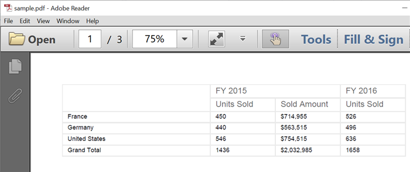
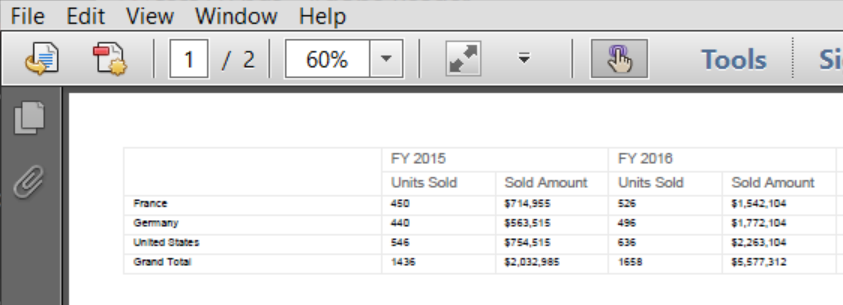

# PDF Export

The PDF export allows Pivot Table data to be exported as PDF document. To enable PDF export in the pivot table, set the [`AllowPdfExport`](https://help.syncfusion.com/cr/cref_files/blazor/Syncfusion.Blazor~Syncfusion.Blazor.PivotView.SfPivotView%601~AllowPdfExport.html) in [`SfPivotView`](https://help.syncfusion.com/cr/blazor/Syncfusion.Blazor~Syncfusion.Blazor.PivotView.SfPivotView%601_members.html) as **true**. Once the API is set, user needs to call the [`PdfExport`](https://help.syncfusion.com/cr/cref_files/blazor/Syncfusion.Blazor~Syncfusion.Blazor.PivotView.SfPivotView%601~PdfExport.html) method for exporting, on external button click.

> The pivot table component can be exported to PDF format using options available in the toolbar. For more details [`refer`](./tool-bar) here.

```csharp
@using Syncfusion.Blazor.PivotView
@using Syncfusion.Blazor.Buttons

<SfButton OnClick="OnPdfExport" Content="Pdf Export"></SfButton>
<SfPivotView TValue="ProductDetails" @ref="@pivot" AllowPdfExport="true" >
    <PivotViewDataSourceSettings DataSource="@data" EnableSorting=true>
        <PivotViewColumns>
            <PivotViewColumn Name="Year"></PivotViewColumn>
            <PivotViewColumn Name="Quarter"></PivotViewColumn>
        </PivotViewColumns>
        <PivotViewRows>
            <PivotViewRow Name="Country"></PivotViewRow>
            <PivotViewRow Name="Products"></PivotViewRow>
        </PivotViewRows>
        <PivotViewValues>
            <PivotViewValue Name="Sold" Caption="Units Sold"></PivotViewValue>
            <PivotViewValue Name="Amount" Caption="Sold Amount"></PivotViewValue>
        </PivotViewValues>
        <PivotViewFormatSettings>
            <PivotViewFormatSetting Name="Amount" Format="C0" UseGrouping=true></PivotViewFormatSetting>
        </PivotViewFormatSettings>
    </PivotViewDataSourceSettings>
</SfPivotView>

@code{
    SfPivotView<ProductDetails> pivot;
    public List<ProductDetails> data { get; set; }
    protected override void OnInitialized()
    {
        this.data = ProductDetails.GetProductData().ToList();
       //Bind the data source collection here. Refer "Assigning sample data to the pivot table" section in getting started for more details.
    }
    public void OnPdfExport(Microsoft.AspNetCore.Components.Web.MouseEventArgs args)
    {
        this.pivot.PdfExport();
    }
}
```


## Changing the pivot table style while exporting

The PDF export provides an option to change colors for headers, caption and records in pivot table before exporting. In-order to apply colors, define **theme** settings in **pdfExportProperties** object and pass it as a parameter to the [`PdfExport`](https://help.syncfusion.com/cr/cref_files/blazor/Syncfusion.Blazor~Syncfusion.Blazor.PivotView.SfPivotView%601~PdfExport.html) method.

> By default, material theme will be applied to the pivot table during PDF exporting.

```csharp
@using Syncfusion.Blazor.PivotView
@using Syncfusion.Blazor.Buttons

<SfButton OnClick="OnPdfExport" Content="Pdf Export"></SfButton>
<SfPivotView TValue="ProductDetails" @ref="@pivot" AllowPdfExport="true" >
    <PivotViewDataSourceSettings DataSource="@data" EnableSorting=true>
        <PivotViewColumns>
            <PivotViewColumn Name="Year"></PivotViewColumn>
            <PivotViewColumn Name="Quarter"></PivotViewColumn>
        </PivotViewColumns>
        <PivotViewRows>
            <PivotViewRow Name="Country"></PivotViewRow>
            <PivotViewRow Name="Products"></PivotViewRow>
        </PivotViewRows>
        <PivotViewValues>
            <PivotViewValue Name="Sold" Caption="Units Sold"></PivotViewValue>
            <PivotViewValue Name="Amount" Caption="Sold Amount"></PivotViewValue>
        </PivotViewValues>
        <PivotViewFormatSettings>
            <PivotViewFormatSetting Name="Amount" Format="C0" UseGrouping=true></PivotViewFormatSetting>
        </PivotViewFormatSettings>
    </PivotViewDataSourceSettings>
</SfPivotView>

@code{
    SfPivotView<ProductDetails> pivot;
    public List<ProductDetails> data { get; set; }
    protected override void OnInitialized()
    {
        this.data = ProductDetails.GetProductData().ToList();
       //Bind the data source collection here. Refer "Assigning sample data to the pivot table" section in getting started for more details.
    }
    public void OnPdfExport(Microsoft.AspNetCore.Components.Web.MouseEventArgs args)
    {
        object pdfExportProperties = new
        {
            theme = new
            {
                header = new
                {
                    fontColor = "#0fb5fc",fontName = "Calibri",fontSize = 15,bold = true,
                    borders = new { color = "#000000", lineStyle = "Thin" }
                },
                record = new
                {
                    fontColor = "#000000",fontName = "Segoe UI",fontSize = 12
                },
                caption = new
                {
                    fontColor= "#000000", fontName = "Segoe UI", fontSize = 12,
                }
            }
        };
        this.pivot.PdfExport(pdfExportProperties);
    }
}
```


## Changing the file name while exporting

The PDF export provides an option to change file name of the document before exporting. In-order to change the file name, define **fileName** property in **pdfExportProperties** object and pass it as a parameter to the [`PdfExport`](https://help.syncfusion.com/cr/cref_files/blazor/Syncfusion.Blazor~Syncfusion.Blazor.PivotView.SfPivotView%601~PdfExport.html) method.

```csharp
@using Syncfusion.Blazor.PivotView
@using Syncfusion.Blazor.Buttons

<SfButton OnClick="OnPdfExport" Content="Pdf Export"></SfButton>
<SfPivotView TValue="ProductDetails" @ref="@pivot" AllowPdfExport="true" >
    <PivotViewDataSourceSettings DataSource="@data" EnableSorting=true>
        <PivotViewColumns>
            <PivotViewColumn Name="Year"></PivotViewColumn>
            <PivotViewColumn Name="Quarter"></PivotViewColumn>
        </PivotViewColumns>
        <PivotViewRows>
            <PivotViewRow Name="Country"></PivotViewRow>
            <PivotViewRow Name="Products"></PivotViewRow>
        </PivotViewRows>
        <PivotViewValues>
            <PivotViewValue Name="Sold" Caption="Units Sold"></PivotViewValue>
            <PivotViewValue Name="Amount" Caption="Sold Amount"></PivotViewValue>
        </PivotViewValues>
        <PivotViewFormatSettings>
            <PivotViewFormatSetting Name="Amount" Format="C0" UseGrouping=true></PivotViewFormatSetting>
        </PivotViewFormatSettings>
    </PivotViewDataSourceSettings>
</SfPivotView>

@code{
    SfPivotView<ProductDetails> pivot;
    public List<PivotViewData.ProductDetails> data { get; set; }
    protected override void OnInitialized()
    {
        this.data = PivotViewData.GetProductData().ToList();
       //Bind your dataSource collection here, kindly refer the getting started section. for more information.
    }
    public void OnPdfExport(Microsoft.AspNetCore.Components.Web.MouseEventArgs args)
    {
        object pdfExportProperties = new { fileName = "sample.pdf" };
        this.pivot.PdfExport(pdfExportProperties);
    }
}
```



## Changing page size while exporting

The PDF export provides an option to change page size of the document before exporting. In-order to change the page size, define **pageSize** property in **pdfExportProperties** object and pass it as a parameter to the [`PdfExport`](https://help.syncfusion.com/cr/cref_files/blazor/Syncfusion.Blazor~Syncfusion.Blazor.PivotView.SfPivotView%601~PdfExport.html) method.

**Supported page sizes are:** Letter, Note, Legal, A0, A1, A2, A3, A5, A6, A7, A8, A9, B0, B1, B2, B3, B4, B5, Archa, Archb, Archc, Archd,
Arche, Flsa, HalfLetter, Letter11x17, Ledger.

```csharp
@using Syncfusion.Blazor.PivotView
@using Syncfusion.Blazor.Buttons

<SfButton OnClick="OnPdfExport" Content="Pdf Export"></SfButton>
<SfPivotView TValue="ProductDetails" @ref="@pivot" AllowPdfExport="true" >
    <PivotViewDataSourceSettings DataSource="@data" EnableSorting=true>
        <PivotViewColumns>
            <PivotViewColumn Name="Year"></PivotViewColumn>
            <PivotViewColumn Name="Quarter"></PivotViewColumn>
        </PivotViewColumns>
        <PivotViewRows>
            <PivotViewRow Name="Country"></PivotViewRow>
            <PivotViewRow Name="Products"></PivotViewRow>
        </PivotViewRows>
        <PivotViewValues>
            <PivotViewValue Name="Sold" Caption="Units Sold"></PivotViewValue>
            <PivotViewValue Name="Amount" Caption="Sold Amount"></PivotViewValue>
        </PivotViewValues>
        <PivotViewFormatSettings>
            <PivotViewFormatSetting Name="Amount" Format="C0" UseGrouping=true></PivotViewFormatSetting>
        </PivotViewFormatSettings>
    </PivotViewDataSourceSettings>
</SfPivotView>

@code{
    SfPivotView<ProductDetails> pivot;
    public List<ProductDetails> data { get; set; }
    protected override void OnInitialized()
    {
        this.data = ProductDetails.GetProductData().ToList();
       //Bind the data source collection here. Refer "Assigning sample data to the pivot table" section in getting started for more details.
    }
    public void OnPdfExport(Microsoft.AspNetCore.Components.Web.MouseEventArgs args)
    {
        object pdfExportProperties = new { pageSize = "A3" };
        this.pivot.PdfExport(pdfExportProperties);
    }
}
```


## Changing page orientation while exporting

The PDF export provides an option to change page orientation of the document before exporting. In-order to change the page orientation, define **pageOrientation** property in **pdfExportProperties** object and pass it as a parameter to the [`PdfExport`](https://help.syncfusion.com/cr/cref_files/blazor/Syncfusion.Blazor~Syncfusion.Blazor.PivotView.SfPivotView%601~PdfExport.html) method. By default, the page orientation will be in **Portrait** and it can be changed to **Landscape** based on user requirement.

```csharp
@using Syncfusion.Blazor.PivotView
@using Syncfusion.Blazor.Buttons

<SfButton OnClick="OnPdfExport" Content="Pdf Export"></SfButton>
<SfPivotView TValue="ProductDetails" @ref="@pivot" AllowPdfExport="true" >
    <PivotViewDataSourceSettings DataSource="@data" EnableSorting=true>
        <PivotViewColumns>
            <PivotViewColumn Name="Year"></PivotViewColumn>
            <PivotViewColumn Name="Quarter"></PivotViewColumn>
        </PivotViewColumns>
        <PivotViewRows>
            <PivotViewRow Name="Country"></PivotViewRow>
            <PivotViewRow Name="Products"></PivotViewRow>
        </PivotViewRows>
        <PivotViewValues>
            <PivotViewValue Name="Sold" Caption="Units Sold"></PivotViewValue>
            <PivotViewValue Name="Amount" Caption="Sold Amount"></PivotViewValue>
        </PivotViewValues>
        <PivotViewFormatSettings>
            <PivotViewFormatSetting Name="Amount" Format="C0" UseGrouping=true></PivotViewFormatSetting>
        </PivotViewFormatSettings>
    </PivotViewDataSourceSettings>
</SfPivotView>

@code{
    SfPivotView<ProductDetails> pivot;
    public List<ProductDetails> data { get; set; }
    protected override void OnInitialized(Microsoft.AspNetCore.Components.Web.MouseEventArgs args)
    {
        this.data = ProductDetails.GetProductData().ToList();
       //Bind the data source collection here. Refer "Assigning sample data to the pivot table" section in getting started for more details.
    }
    public void OnPdfExport()
    {
        object pdfExportProperties = new { pageOrientation= "Landscape", };
        this.pivot.PdfExport(pdfExportProperties);
    }
}
```

