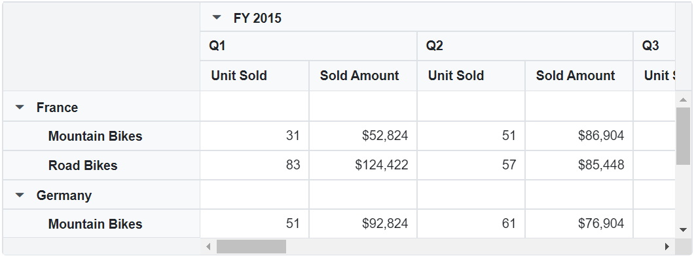

# Show or hide totals

## Show or hide grand totals

Allows to show or hide grand totals in rows and columns using the [`ShowGrandTotals`](https://help.syncfusion.com/cr/blazor/Syncfusion.Blazor~Syncfusion.Blazor.PivotView.DataSourceSettingsModel%601~ShowGrandTotals.html) property. To hide the grand totals in rows and columns, set the property [`ShowGrandTotals`](https://help.syncfusion.com/cr/blazor/Syncfusion.Blazor~Syncfusion.Blazor.PivotView.DataSourceSettingsModel%601~ShowGrandTotals.html) in [`PivotViewDataSourceSettings`](https://help.syncfusion.com/cr/cref_files/blazor/Syncfusion.Blazor~Syncfusion.Blazor.PivotView.PivotViewDataSourceSettings%601.html) class to **false**.
End user can also hide grand totals for row or columns separately by setting the property [`ShowRowGrandTotals`](https://help.syncfusion.com/cr/blazor/Syncfusion.Blazor~Syncfusion.Blazor.PivotView.DataSourceSettingsModel%601~ShowRowGrandTotals.html) or [`ShowColumnGrandTotals`](https://help.syncfusion.com/cr/blazor/Syncfusion.Blazor~Syncfusion.Blazor.PivotView.DataSourceSettingsModel%601~ShowColumnGrandTotals.html) in [`PivotViewDataSourceSettings`](https://help.syncfusion.com/cr/cref_files/blazor/Syncfusion.Blazor~Syncfusion.Blazor.PivotView.PivotViewDataSourceSettings%601.html) class to **false** respectively.

> By default, [`ShowGrandTotals`](https://help.syncfusion.com/cr/blazor/Syncfusion.Blazor~Syncfusion.Blazor.PivotView.DataSourceSettingsModel%601~ShowGrandTotals.html), [`ShowRowGrandTotals`](https://help.syncfusion.com/cr/blazor/Syncfusion.Blazor~Syncfusion.Blazor.PivotView.DataSourceSettingsModel%601~ShowRowGrandTotals.html) and [`ShowColumnGrandTotals`](https://help.syncfusion.com/cr/blazor/Syncfusion.Blazor~Syncfusion.Blazor.PivotView.DataSourceSettingsModel%601~ShowColumnGrandTotals.html) properties in [`PivotViewDataSourceSettings`](https://help.syncfusion.com/cr/cref_files/blazor/Syncfusion.Blazor~Syncfusion.Blazor.PivotView.PivotViewDataSourceSettings%601.html) class are set as **true**.

```csharp
    @using Syncfusion.Blazor.PivotView

    <SfPivotView TValue="ProductDetails">
         <PivotViewDataSourceSettings DataSource="@data" ShowGrandTotals=false>
            <PivotViewColumns>
                <PivotViewColumn Name="Year"></PivotViewColumn>
                <PivotViewColumn Name="Quarter"></PivotViewColumn>
            </PivotViewColumns>
            <PivotViewRows>
                <PivotViewRow Name="Country"></PivotViewRow>
                <PivotViewRow Name="Products"></PivotViewRow>
            </PivotViewRows>
            <PivotViewValues>
                <PivotViewValue Name="Sold" Caption="Unit Sold"></PivotViewValue>
                <PivotViewValue Name="Amount" Caption="Sold Amount"></PivotViewValue>
            </PivotViewValues>
            <PivotViewFormatSettings>
                <PivotViewFormatSetting Name="Amount" Format="C"></PivotViewFormatSetting>
            </PivotViewFormatSettings>
        </PivotViewDataSourceSettings>
    </SfPivotView>

    @code{
        public List<ProductDetails> data { get; set; }
        protected override void OnInitialized()
        {
            this.data = ProductDetails.GetProductData().ToList();
           //Bind the data source collection here. Refer "Assigning sample data to the pivot table" section in getting started for more details.
        }
    }

```


## Show or hide sub-totals

Allows to show or hide sub-totals in rows and columns using the [`ShowSubTotals`](https://help.syncfusion.com/cr/blazor/Syncfusion.Blazor~Syncfusion.Blazor.PivotView.DataSourceSettingsModel%601~ShowSubTotals.html) property. To hide all the sub-totals in rows and columns, set the property [`ShowSubTotals`](https://help.syncfusion.com/cr/blazor/Syncfusion.Blazor~Syncfusion.Blazor.PivotView.DataSourceSettingsModel%601~ShowSubTotals.html) in [`PivotViewDataSourceSettings`](https://help.syncfusion.com/cr/cref_files/blazor/Syncfusion.Blazor~Syncfusion.Blazor.PivotView.PivotViewDataSourceSettings%601.html) class to **false**. End user can also hide sub-totals for rows or columns separately by setting the property [`ShowRowSubTotals`](https://help.syncfusion.com/cr/blazor/Syncfusion.Blazor~Syncfusion.Blazor.PivotView.DataSourceSettingsModel%601~ShowRowSubTotals.html) or [`ShowColumnSubTotals`](https://help.syncfusion.com/cr/blazor/Syncfusion.Blazor~Syncfusion.Blazor.PivotView.DataSourceSettingsModel%601~ShowColumnSubTotals.html) in [`PivotViewDataSourceSettings`](https://help.syncfusion.com/cr/cref_files/blazor/Syncfusion.Blazor~Syncfusion.Blazor.PivotView.PivotViewDataSourceSettings%601.html) class to **false** respectively.

> By default, [`ShowSubTotals`](https://help.syncfusion.com/cr/blazor/Syncfusion.Blazor~Syncfusion.Blazor.PivotView.DataSourceSettingsModel%601~ShowSubTotals.html), [`ShowRowSubTotals`](https://help.syncfusion.com/cr/blazor/Syncfusion.Blazor~Syncfusion.Blazor.PivotView.DataSourceSettingsModel%601~ShowRowSubTotals.html) and [`ShowColumnSubTotals`](https://help.syncfusion.com/cr/blazor/Syncfusion.Blazor~Syncfusion.Blazor.PivotView.DataSourceSettingsModel%601~ShowColumnSubTotals.html) properties in [`PivotViewDataSourceSettings`](https://help.syncfusion.com/cr/cref_files/blazor/Syncfusion.Blazor~Syncfusion.Blazor.PivotView.PivotViewDataSourceSettings%601.html) class are set as **true**.

```csharp
    @using Syncfusion.Blazor.PivotView

    <SfPivotView TValue="ProductDetails">
         <PivotViewDataSourceSettings DataSource="@data" ExpandAll="true" ShowSubTotals="false">
            <PivotViewColumns>
                <PivotViewColumn Name="Year"></PivotViewColumn>
                <PivotViewColumn Name="Quarter"></PivotViewColumn>
            </PivotViewColumns>
            <PivotViewRows>
                <PivotViewRow Name="Country"></PivotViewRow>
                <PivotViewRow Name="Products"></PivotViewRow>
            </PivotViewRows>
            <PivotViewValues>
                <PivotViewValue Name="Sold" Caption="Unit Sold"></PivotViewValue>
                <PivotViewValue Name="Amount" Caption="Sold Amount"></PivotViewValue>
            </PivotViewValues>
            <PivotViewFormatSettings>
                <PivotViewFormatSetting Name="Amount" Format="C"></PivotViewFormatSetting>
            </PivotViewFormatSettings>
        </PivotViewDataSourceSettings>
    </SfPivotView>

    @code{
        public List<ProductDetails> data { get; set; }
        protected override void OnInitialized()
        {
            this.data = ProductDetails.GetProductData().ToList();
           //Bind the data source collection here. Refer "Assigning sample data to the pivot table" section in getting started for more details.
        }
    }

```


## Show or hide sub-totals for specific fields

Allows to show or hide sub-totals for specific fields in rows and columns using the [`ShowSubTotals`](https://help.syncfusion.com/cr/blazor/Syncfusion.Blazor~Syncfusion.Blazor.PivotView.PivotViewRow~ShowSubTotals.html) property. To hide sub-totals for a specific field in row or column axis, set the property [`ShowSubTotals`](https://help.syncfusion.com/cr/blazor/Syncfusion.Blazor~Syncfusion.Blazor.PivotView.PivotViewRow~ShowSubTotals.html) in [`PivotViewRow`](https://help.syncfusion.com/cr/cref_files/blazor/Syncfusion.Blazor~Syncfusion.Blazor.PivotView.PivotViewRows.html) or [`PivotViewColumn`](https://help.syncfusion.com/cr/cref_files/blazor/Syncfusion.Blazor~Syncfusion.Blazor.PivotView.PivotViewColumn.html) class to **false** respectively.

> By default, [`ShowSubTotals`](https://help.syncfusion.com/cr/blazor/Syncfusion.Blazor~Syncfusion.Blazor.PivotView.PivotViewRow~ShowSubTotals.html) property in [`PivotViewRow`](https://help.syncfusion.com/cr/cref_files/blazor/Syncfusion.Blazor~Syncfusion.Blazor.PivotView.PivotViewRows.html) or [`PivotViewColumn`](https://help.syncfusion.com/cr/cref_files/blazor/Syncfusion.Blazor~Syncfusion.Blazor.PivotView.PivotViewColumn.html) class is set as **true**.

```csharp
    @using Syncfusion.Blazor.PivotView

    <SfPivotView TValue="ProductDetails">
         <PivotViewDataSourceSettings DataSource="@data" ExpandAll="true">
            <PivotViewColumns>
                <PivotViewColumn Name="Year"></PivotViewColumn>
                <PivotViewColumn Name="Quarter"></PivotViewColumn>
            </PivotViewColumns>
            <PivotViewRows>
                <PivotViewRow Name="Country" ShowSubTotals="false"></PivotViewRow>
                <PivotViewRow Name="Products"></PivotViewRow>
            </PivotViewRows>
            <PivotViewValues>
                <PivotViewValue Name="Sold" Caption="Unit Sold"></PivotViewValue>
                <PivotViewValue Name="Amount" Caption="Sold Amount"></PivotViewValue>
            </PivotViewValues>
            <PivotViewFormatSettings>
                <PivotViewFormatSetting Name="Amount" Format="C"></PivotViewFormatSetting>
            </PivotViewFormatSettings>
        </PivotViewDataSourceSettings>
    </SfPivotView>

    @code{
        public List<ProductDetails> data { get; set; }
        protected override void OnInitialized()
        {
            this.data = ProductDetails.GetProductData().ToList();
           //Bind the data source collection here. Refer "Assigning sample data to the pivot table" section in getting started for more details.
        }
    }

```



## Show or hide totals using toolbar

It can also be achieved using built-in toolbar options by setting the [`ShowToolbar`](https://help.syncfusion.com/cr/blazor/Syncfusion.Blazor~Syncfusion.Blazor.PivotView.SfPivotView%601~ShowToolbar.html) property in [`SfPivotView`](https://help.syncfusion.com/cr/blazor/Syncfusion.Blazor~Syncfusion.Blazor.PivotView.SfPivotView%601_members.html) class to **true**. Also, include the items [**ToolbarItems.GrandTotal**](https://help.syncfusion.com/cr/cref_files/blazor/Syncfusion.Blazor~Syncfusion.Blazor.PivotView.ToolbarItems.html) and [**ToolbarItems.SubTotal**](https://help.syncfusion.com/cr/cref_files/blazor/Syncfusion.Blazor~Syncfusion.Blazor.PivotView.ToolbarItems.html) within the [`Toolbar`](https://help.syncfusion.com/cr/blazor/Syncfusion.Blazor~Syncfusion.Blazor.PivotView.SfPivotView%601~Toolbar.html) property in [`SfPivotView`](https://help.syncfusion.com/cr/blazor/Syncfusion.Blazor~Syncfusion.Blazor.PivotView.SfPivotView%601.html) class. End user can now see "Show/Hide Grand totals" and "Show/Hide Sub totals" icons in toolbar UI automatically.

```csharp
    @using Syncfusion.Blazor.PivotView

    <SfPivotView TValue="ProductDetails" ShowToolbar="true" Toolbar="@toolbar">
            <PivotViewDataSourceSettings DataSource="@data">
                <PivotViewColumns>
                    <PivotViewColumn Name="Year"></PivotViewColumn>
                    <PivotViewColumn Name="Quarter"></PivotViewColumn>
                </PivotViewColumns>
                <PivotViewRows>
                    <PivotViewRow Name="Country"></PivotViewRow>
                    <PivotViewRow Name="Products"></PivotViewRow>
                </PivotViewRows>
                <PivotViewValues>
                    <PivotViewValue Name="Sold" Caption="Units Sold"></PivotViewValue>
                    <PivotViewValue Name="Amount" Caption="Sold Amount"></PivotViewValue>
                </PivotViewValues>
                <PivotViewFormatSettings>
                    <PivotViewFormatSetting Name="Amount" Format="C"></PivotViewFormatSetting>
                </PivotViewFormatSettings>
            </PivotViewDataSourceSettings>
    </SfPivotView>

    @code{
        public List<ToolbarItems> toolbar = new List<ToolbarItems> {
            ToolbarItems.SubTotal,
            ToolbarItems.GrandTotal
        };
        public List<ProductDetails> data { get; set; }
        protected override void OnInitialized()
        {
            this.data = ProductDetails.GetProductData().ToList();
            //Bind the data source collection here. Refer "Assigning sample data to the pivot table" section in getting started for more details.
        }
    }

```

<!-- markdownlint-disable MD012 -->

<br/>
<br/>
<br/>

