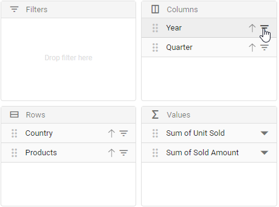

# Pivot Field List

The pivot table provides a built-in Field List similar to Microsoft Excel. It allows you to add or remove fields and also rearrange them between different axes, including column, row, value, and filter along with filter and sort options dynamically at runtime.

The field list can be displayed in three different formats to interact with pivot table. They are:

* **In-built Field List (Popup)**: To display the field list icon in pivot table UI to invoke the built-in dialog.
* **Stand-alone Field List (Fixed)**: To display the field list in a static position within a web page.
* **Invoking dynamic Field List (Customized)**: To display the field list by invoking the built-in dialog independently through other means, for example, on a button click.

## In-built Field List (Popup)

To enable the field list in pivot table UI, set the [`showFieldList`](https://ej2.syncfusion.com/react/documentation/api/pivotview#showfieldlist) property in [`PivotView`](https://ej2.syncfusion.com/react/documentation/api/pivotview) to **true**. A small icon will appear on the top left corner of the pivot table and clicking on this icon, field list dialog will appear.

> The field list icon will be displayed at the top right corner of the pivot table, when grouping bar is enabled.

To use field list, you need to inject the `FieldList` module in pivot table.



```typescript
import { FieldList, IDataOptions, IDataSet, Inject, PivotViewComponent } from '@syncfusion/ej2-react-pivotview';
import * as React from 'react';
import * as ReactDOM from 'react-dom';
import { pivotData } from './datasource';

class App extends React.Component<{}, {}>{

  public dataSourceSettings: IDataOptions = {
    columns: [{ name: 'Year', caption: 'Production Year' }, { name: 'Quarter' }],
    dataSource: pivotData as IDataSet[],
    expandAll: false,
    allowLabelFilter: true,
    allowValueFilter: true,
    filters: [],
    drilledMembers: [{ name: 'Country', items: ['France'] }],
    formatSettings: [{ name: 'Amount', format: 'C0' }],
    rows: [{ name: 'Country' }, { name: 'Products' }],
    values: [{ name: 'Sold', caption: 'Units Sold' }, { name: 'Amount', caption: 'Sold Amount' }]
  }
  public pivotObj: PivotViewComponent;
  render() {
    return <PivotViewComponent  ref={d => this.pivotObj = d!} id='PivotView' height={350} dataSourceSettings={this.dataSourceSettings} showFieldList={true}><Inject services={[FieldList]} /></PivotViewComponent>
  }
};

ReactDOM.render(<App />, document.getElementById('pivotview'));

```



## Stand-alone Field List (Fixed)

The field list can be rendered in a static position, anywhere in web page layout, like a separate component. To do so, you need to set [`renderMode`](https://ej2.syncfusion.com/react/documentation/api/pivotfieldlist#rendermode) property to **Fixed**.

> To make field list interact with pivot table, you need to use the [`updateView`](https://ej2.syncfusion.com/react/documentation/api/pivotfieldlist#updateview) and [`update`](https://ej2.syncfusion.com/react/documentation/api/pivotfieldlist#update) methods for data source update in both field list and pivot table simultaneously.



```typescript
import { CalculatedField, PivotFieldListComponent, IDataOptions, IDataSet, Inject, PivotViewComponent } from '@syncfusion/ej2-react-pivotview';
import * as React from 'react';
import * as ReactDOM from 'react-dom';
import { pivotData } from './datasource';

const SAMPLE_CSS = `
.e-pivotview {
    width: 58%;
    height: 100%;
    float: left;
}
.e-pivotfieldlist {
    width: 42%;
    height: 100%;
    float: right;
}
.e-pivotfieldlist .e-static {
    width: 100% !important;
}`;

class App extends React.Component<{}, {}>{

  public dataSourceSettings: IDataOptions = {
    columns: [{ name: 'Year', caption: 'Production Year' }, { name: 'Quarter' }],
    dataSource: pivotData as IDataSet[],
    expandAll: false,
    filters: [],
    formatSettings: [{ name: 'Amount', format: 'C0' }],
    rows: [{ name: 'Country' }, { name: 'Products' }],
    values: [{ name: 'Sold', caption: 'Units Sold' }, { name: 'Amount', caption: 'Sold Amount' }]
  }
  public pivotObj: PivotViewComponent;
  public fieldlistObj: PivotFieldListComponent;
  render() {
    return <div className="control-section">
    <style>{SAMPLE_CSS}</style>
    <PivotViewComponent id='PivotViewFieldList' ref={d => this.pivotObj = d!} enginePopulated={this.afterPivotPopulate.bind(this)} width={'99%'} height={'530'} gridSettings={{columnWidth: 140}}></PivotViewComponent>
    <PivotFieldListComponent id='PivotFieldList' ref={d => this.fieldlistObj = d!} enginePopulated={this.afterPopulate.bind(this)} dataSourceSettings={this.dataSourceSettings} renderMode={"Fixed"} allowCalculatedField={true}><Inject services={[CalculatedField]} /></PivotFieldListComponent></div>
  }

  afterPopulate(): void {
    if (this.fieldlistObj && this.pivotObj) {
        this.fieldlistObj.updateView(this.pivotObj);
    }
  }
  afterPivotPopulate(): void {
      if (this.fieldlistObj && this.pivotObj) {
          this.fieldlistObj.update(this.pivotObj);
      }
  }
  rendereComplete(): void {
      this.fieldlistObj.updateView(this.pivotObj);
  }
};

ReactDOM.render(<App />, document.getElementById('pivotview'));

```



## Invoking dynamic Field List (Customized)

Also, you can display the field list dialog independently through other means. For example, you can invoke the field list dialog on an external button click. To do so, set [`renderMode`](https://ej2.syncfusion.com/react/documentation/api/pivotfieldlist#rendermode) property to **Popup** and  since on button click, field list dialog will be invoked.

> * Meanwhile, you can display the field list dialog over specific target element within a web page using [`target`](https://ej2.syncfusion.com/react/documentation/api/pivotfieldlist#target) property. By default, the [`target`](https://ej2.syncfusion.com/react/documentation/api/pivotfieldlist#target) value is "null", which by default refers the `document.body` element.
> * To make field list interact with pivot table, you need to use the [`updateView`](https://ej2.syncfusion.com/react/documentation/api/pivotfieldlist#updateview) and [`update`](https://ej2.syncfusion.com/react/documentation/api/pivotfieldlist#update) methods for data source update in both field list and pivot table simultaneously.

The below sample code illustrates the field list dialog invoked on an external button click.



```typescript
import { ButtonComponent } from '@syncfusion/ej2-react-buttons';
import { CalculatedField, PivotFieldListComponent, IDataOptions, IDataSet, Inject, PivotViewComponent } from '@syncfusion/ej2-react-pivotview';
import * as React from 'react';
import * as ReactDOM from 'react-dom';
import { pivotData } from './datasource';

class App extends React.Component<{}, {}>{

  public dataSourceSettings: IDataOptions = {
    columns: [{ name: 'Year', caption: 'Production Year' }, { name: 'Quarter' }],
    dataSource: pivotData as IDataSet[],
    expandAll: false,
    filters: [],
    formatSettings: [{ name: 'Amount', format: 'C0' }],
    rows: [{ name: 'Country' }, { name: 'Products' }],
    values: [{ name: 'Sold', caption: 'Units Sold' }, { name: 'Amount', caption: 'Sold Amount' }]
  }
  public pivotObj: PivotViewComponent;
  public fieldlistObj: PivotFieldListComponent;
  render() {
    return <div><div className="control-section">
    <PivotViewComponent id='PivotView' ref={d => this.pivotObj = d!} enginePopulated={this.afterPivotPopulate.bind(this)} height={350} gridSettings={{columnWidth: 140}}></PivotViewComponent>
    <PivotFieldListComponent id='PivotFieldList' ref={d => this.fieldlistObj = d!} enginePopulated={this.afterPopulate.bind(this)} dataSourceSettings={this.dataSourceSettings} target='#PivotFieldList' renderMode={"Popup"} allowCalculatedField={true}><Inject services={[CalculatedField]} /></PivotFieldListComponent></div>
    <div className='col-lg-3 property-section'><ButtonComponent cssClass='e-primary' onClick={this.btnClick.bind(this)}>Field List</ButtonComponent></div></div>
  }

  btnClick(): void {
    this.fieldlistObj.dialogRenderer.fieldListDialog.show();
  }

  afterPopulate(): void {
    if (this.fieldlistObj && this.pivotObj) {
        this.fieldlistObj.updateView(this.pivotObj);
    }
  }
  afterPivotPopulate(): void {
      if (this.fieldlistObj && this.pivotObj) {
          this.fieldlistObj.update(this.pivotObj);
      }
  }
  rendereComplete(): void {
      this.fieldlistObj.updateView(this.pivotObj);
  }
};

ReactDOM.render(<App />, document.getElementById('pivotview'));

```



## Add or remove fields

Using check box besides each field, end user can select or unselect to add or remove fields respectively from the report at runtime.


## Remove specific field(s) from displaying

When a data source is bound to the component, fields will be automatically populated inside the Field List. In such case, user can also restrict specific field(s) from displaying. To do so, set the appropriate field name(s) in [`excludeFields`](https://ej2.syncfusion.com/react/documentation/api/pivotview/dataSourceSettingsModel/#excludefields) property belonging to [`dataSourceSettings`](https://ej2.syncfusion.com/react/documentation/api/pivotview#datasourcesettings).



```typescript
import { FieldList, IDataOptions, IDataSet, Inject, PivotViewComponent } from '@syncfusion/ej2-react-pivotview';
import * as React from 'react';
import * as ReactDOM from 'react-dom';
import { pivotData } from './datasource';

class App extends React.Component<{}, {}>{

  public dataSourceSettings: IDataOptions = {
    columns: [{ name: 'Year', caption: 'Production Year' }, { name: 'Quarter' }],
    dataSource: pivotData as IDataSet[],
    expandAll: false,
    allowLabelFilter: true,
    allowValueFilter: true,
    filters: [],
    drilledMembers: [{ name: 'Country', items: ['France'] }],
    formatSettings: [{ name: 'Amount', format: 'C0' }],
    rows: [{ name: 'Country' }, { name: 'Products' }],
    values: [{ name: 'Sold', caption: 'Units Sold' }, { name: 'Amount', caption: 'Sold Amount' }],
    excludeFields: ["Products", "Amount"]
  }
  public pivotObj: PivotViewComponent;
  render() {
    return <PivotViewComponent  ref={d => this.pivotObj = d!} id='PivotView' height={350} dataSourceSettings={this.dataSourceSettings} showFieldList={true}><Inject services={[FieldList]} /></PivotViewComponent>
  }
};

ReactDOM.render(<App />, document.getElementById('pivotview'));

```



## Re-arranging fields

In-order to re-arrange, drag any field from the field list and drop it into the column, row, value, or filter axis using the drag-and-drop holder. It helps end user to alter the report at runtime.


## Filtering members

Using the filter icon besides each field in row, column and filter axes, members can be either included or excluded at runtime. To know more about member filtering, [`refer`](./filtering) here.


<br/>

<br/>


## Sorting members

Using the sort icon besides each field in row and column axes, members can be arranged either in ascending or descending order at runtime. To know more about member sorting, [`refer`](./sorting) here.


<br/>


## Calculated fields

The calculated field support allows end user to add a new calculated field based on the available fields from the bound data source using basic arithmetic operators. To enable this support in Field List UI, set the [`allowCalculatedField`](https://ej2.syncfusion.com/react/documentation/api/pivotview#allowcalculatedfield) property in [`PivotView`](https://ej2.syncfusion.com/react/documentation/api/pivotview) to **true** in pivot table. Now a button will be seen automatically inside the field list UI which will invoke the calculated field dialog on click. To know more about calculated field, [`refer`](./calculated-field) here.


<br/>

<br/>


## Changing aggregation type of value fields at runtime

End user can perform calculations over a group of values using the aggregation option. The value fields bound to the field list, appears with a dropdown icon, helps to select an appropriate aggregation type at runtime. On selection, the values in the Pivot Table will be changed dynamically. To know more about aggregation, [`refer`](./aggregation) here.


<br/>
<br/>

<br/>


## Defer layout update

Defer layout update support to update the pivot table only on demand and not during every user action. To enable this support in Field List UI, set the [`allowDeferLayoutUpdate`](https://ej2.syncfusion.com/react/documentation/api/pivotview#allowdeferlayoutupdate) property in [`PivotView`](https://ej2.syncfusion.com/react/documentation/api/pivotview) to **true** in pivot table. Now a check box inside Field List UI will be seen in checked state, allowing pivot table to update only on demand. To know more about defer layout, [`refer`](./defer-update) here.


## Show field list using toolbar

It can also be viewed in toolbar by setting [`showFieldList`](https://ej2.syncfusion.com/react/documentation/api/pivotview#showfieldlist) and [`showToolbar`](https://ej2.syncfusion.com/react/documentation/api/pivotview#showtoolbar) properties in [`PivotView`](https://ej2.syncfusion.com/react/documentation/api/pivotview) to **true**. Also, include the **FieldList** within the [`Toolbar`](https://ej2.syncfusion.com/react/documentation/api/pivotview#toolbar) property in [`PivotView`](https://ej2.syncfusion.com/react/documentation/api/pivotview). When toolbar is enabled, field list icon will be automatically added into the toolbar and the icon won't appear on top left corner in the pivot table component.



```typescript
import * as React from 'react';
import * as ReactDOM from 'react-dom';
import {
    PivotViewComponent, IDataOptions, Inject, FieldList, CalculatedField,
    Toolbar
} from '@syncfusion/ej2-react-pivotview';
import { pivotData } from './datasource';
class App extends React.Component<{}, {}>{
  public dataSourceSettings: IDataOptions = {
    columns: [{ name: 'Year', caption: 'Production Year' }, { name: 'Quarter' }],
    dataSource: pivotData as IDataSet[],
    expandAll: false,
    filters: [],
    drilledMembers: [{ name: 'Country', items: ['France'] }],
    formatSettings: [{ name: 'Amount', format: 'C0' }],
    rows: [{ name: 'Country' }, { name: 'Products' }],
    values: [{ name: 'Sold', caption: 'Units Sold' }, { name: 'Amount', caption: 'Sold Amount' }]
  };
  public pivotObj: PivotViewComponent;
   public toolbarOptions: any = ['FieldList'];

  render() {
    return <PivotViewComponent id='PivotView' ref={(scope) => { this.pivotObj = scope; }} dataSourceSettings={this.dataSourceSettings} width={'100%'} height={350} showFieldList={true} gridSettings={{ columnWidth: 140 }} showToolbar={true} allowCalculatedField={true} displayOption={{ view: 'Both' }} toolbar={this.toolbarOptions}><Inject services={[FieldList, CalculatedField, Toolbar]} /></PivotViewComponent>
  }
};
ReactDOM.render(<App />, document.getElementById('pivotview'));

```



## Set caption to fields which isn’t bound to the report

One can set the caption to all fields from the data source even if it is not bound to the actual report. It can be achieved using the [`enginePopulated`](https://ej2.syncfusion.com/react/documentation/api/pivotfieldlist#enginepopulated) event. On doing so, caption of the respective field will be displayed in both grouping bar and field list.

In the sample, we have set caption to the fields `Year` and `Quarter` dynamically.



```typescript
import { FieldList, IDataOptions, IDataSet, Inject, PivotViewComponent } from '@syncfusion/ej2-react-pivotview';
import * as React from 'react';
import * as ReactDOM from 'react-dom';
import { pivotData } from './datasource';

class App extends React.Component<{}, {}>{

  public dataSourceSettings: IDataOptions = {
    columns: [{ name: 'Products' }],
    dataSource: pivotData as IDataSet[],
    filters: [],
    drilledMembers: [{ name: 'Country', items: ['France'] }],
    formatSettings: [{ name: 'Amount', format: 'C0' }],
    rows: [{ name: 'Country' }],
    values: [{ name: 'Sold', caption: 'Units Sold' }, { name: 'Amount', caption: 'Sold Amount' }]
  }
  public pivotObj: PivotViewComponent;
  render() {
    return <PivotViewComponent  ref={d => this.pivotObj = d!} id='PivotView' height={350} dataSourceSettings={this.dataSourceSettings} showFieldList={true} enginePopulated={this.afterPopulate.bind(this)} ><Inject services={[FieldList]} /></PivotViewComponent>
  }

  afterPopulate(): void {
     Object.keys(this.pivotObj.engineModule.fieldList).forEach((key, index) => {
                if (key === 'Quarter') {
                    this.pivotObj.engineModule.fieldList[key].caption = 'Production Quarter Year';
                }
                else if (key === 'Year') {
                    this.pivotObj.engineModule.fieldList[key].caption = 'Production Year';
                }
      });  
  }

};

ReactDOM.render(<App />, document.getElementById('pivotview'));

```



## Events

### EnginePopulated

The [`enginePopulated`](https://ej2.syncfusion.com/react/documentation/api/pivotfieldlist#enginepopulated) event is available in both Pivot Table and Field List.

* The event [`enginePopulated`](https://ej2.syncfusion.com/react/documentation/api/pivotfieldlist#enginepopulated) is triggered in field list whenever the report gets modified. The updated report is passed to the pivot table via [`updateView`](https://ej2.syncfusion.com/react/documentation/api/pivotfieldlist#updateview) method written within this event to refresh the same.

* Likewise, [`enginePopulated`](https://ej2.syncfusion.com/react/documentation/api/pivotfieldlist#enginepopulated) event is triggered in pivot table whenever the report gets modified. The updated report is passed to the field list via [`update`](https://ej2.syncfusion.com/react/documentation/api/pivotfieldlist#update) method written within this event to refresh the same.

The event [`enginePopulated`](https://ej2.syncfusion.com/react/documentation/api/pivotfieldlist#enginepopulated) is triggered after engine is populated. It has following parameters - [`dataSourceSettings`](https://ej2.syncfusion.com/react/documentation/api/pivotfieldlist#datasourcesettings), [`PivotFieldList`](https://ej2.syncfusion.com/react/documentation/api/pivotfieldlist) and `pivotValues`.

> Note: This event is not required for Popup field list since it is a in built one.



```typescript
import { CalculatedField, PivotFieldListComponent, IDataOptions, IDataSet, Inject, PivotViewComponent } from '@syncfusion/ej2-react-pivotview';
import * as React from 'react';
import * as ReactDOM from 'react-dom';
import { pivotData } from './datasource';

const SAMPLE_CSS = `
.e-pivotview {
    width: 58%;
    height: 100%;
    float: left;
}
.e-pivotfieldlist {
    width: 42%;
    height: 100%;
    float: right;
}
.e-pivotfieldlist .e-static {
    width: 100% !important;
}`;

class App extends React.Component<{}, {}>{

  public dataSourceSettings: IDataOptions = {
    columns: [{ name: 'Year', caption: 'Production Year' }, { name: 'Quarter' }],
    dataSource: pivotData as IDataSet[],
    expandAll: false,
    filters: [],
    formatSettings: [{ name: 'Amount', format: 'C0' }],
    rows: [{ name: 'Country' }, { name: 'Products' }],
    values: [{ name: 'Sold', caption: 'Units Sold' }, { name: 'Amount', caption: 'Sold Amount' }]
  }
  public pivotObj: PivotViewComponent;
  public fieldlistObj: PivotFieldListComponent;
  render() {
    return <div className="control-section">
    <style>{SAMPLE_CSS}</style>
    <PivotViewComponent id='PivotViewFieldList' ref={d => this.pivotObj = d!} enginePopulated={this.afterPivotPopulate.bind(this)} width={'99%'} height={'530'} gridSettings={{columnWidth: 140}}></PivotViewComponent>
    <PivotFieldListComponent id='PivotFieldList' ref={d => this.fieldlistObj = d!} enginePopulated={this.afterPopulate.bind(this)} dataSourceSettings={this.dataSourceSettings} renderMode={"Fixed"} allowCalculatedField={true}><Inject services={[CalculatedField]} /></PivotFieldListComponent></div>
  }

  afterPopulate(): void {
    if (this.fieldlistObj && this.pivotObj) {
        this.fieldlistObj.updateView(this.pivotObj);
    }
  }
  afterPivotPopulate(): void {
      if (this.fieldlistObj && this.pivotObj) {
          this.fieldlistObj.update(this.pivotObj);
      }
  }
  rendereComplete(): void {
      this.fieldlistObj.updateView(this.pivotObj);
  }
};

ReactDOM.render(<App />, document.getElementById('pivotview'));

```



### FieldDropped

The event [`onFieldDropped`](https://ej2.syncfusion.com/react/documentation/api/pivotview#onfielddropped) fires whenever a field is dropped in an axis. It has following parameters - `droppedAxis`, `droppedField` and `dataSourceSettings`. In this illustration, we have modified the `droppedField` caption through this event at runtime.



```typescript
import { FieldList, IDataOptions, IDataSet, Inject, PivotViewComponent, FieldDroppedEventArgs } from '@syncfusion/ej2-react-pivotview';
import * as React from 'react';
import * as ReactDOM from 'react-dom';
import { pivotData } from './datasource';

class App extends React.Component<{}, {}>{

  public dataSourceSettings: IDataOptions = {
    columns: [{ name: 'Year', caption: 'Production Year' }, { name: 'Quarter' }],
    dataSource: pivotData as IDataSet[],
    expandAll: false,
    allowLabelFilter: true,
    allowValueFilter: true,
    filters: [],
    drilledMembers: [{ name: 'Country', items: ['France'] }],
    formatSettings: [{ name: 'Amount', format: 'C0' }],
    rows: [{ name: 'Country' }, { name: 'Products' }],
    values: [{ name: 'Sold', caption: 'Units Sold' }, { name: 'Amount', caption: 'Sold Amount' }]
  }
  public pivotObj: PivotViewComponent;
  render() {
    return <PivotViewComponent  ref={d => this.pivotObj = d!} id='PivotView' height={350} dataSourceSettings={this.dataSourceSettings} onFieldDropped={this.fieldDropped.bind(this)}  showFieldList={true}><Inject services={[FieldList]} /></PivotViewComponent>
  }

  fieldDropped(args: FieldDroppedEventArgs): void  {
    args.droppedField.caption = args.droppedField.name + " --> " + args.droppedAxis;
  }
};

ReactDOM.render(<App />, document.getElementById('pivotview'));

```



### FieldListRefreshed

The event [`fieldListRefreshed`](https://ej2.syncfusion.com/react/documentation/api/pivotview/#fieldlistrefreshed) is triggered whenever there is any change done in the field list UI. It has following parameter - dataSourceSettings and pivotValues. It allows user to identify each field list update. This event is applicable only for static field list.

For example, if we perform a sort operation within the field list, the field list will be refreshed. The [`fieldListRefreshed`](https://ej2.syncfusion.com/react/documentation/api/pivotview/#fieldlistrefreshed) event will be triggered at that time and the user can perform custom operation inside that event.



```typescript
import { FieldList, IDataOptions, IDataSet, Inject, PivotViewComponent, FieldListRefreshedEventArgs } from '@syncfusion/ej2-react-pivotview';
import * as React from 'react';
import * as ReactDOM from 'react-dom';
import { pivotData } from './datasource';

class App extends React.Component<{}, {}>{

  public dataSourceSettings: IDataOptions = {
    columns: [{ name: 'Year', caption: 'Production Year' }, { name: 'Quarter' }],
    dataSource: pivotData as IDataSet[],
    expandAll: false,
    allowLabelFilter: true,
    allowValueFilter: true,
    filters: [],
    drilledMembers: [{ name: 'Country', items: ['France'] }],
    formatSettings: [{ name: 'Amount', format: 'C0' }],
    rows: [{ name: 'Country' }, { name: 'Products' }],
    values: [{ name: 'Sold', caption: 'Units Sold' }, { name: 'Amount', caption: 'Sold Amount' }]
  }
  public pivotObj: PivotViewComponent;
  render() {
    return <PivotViewComponent  ref={d => this.pivotObj = d!} id='PivotView' height={350} dataSourceSettings={this.dataSourceSettings} fieldListRefreshed={this.fieldListRefreshed.bind(this)} showFieldList={true}><Inject services={[FieldList]} /></PivotViewComponent>
  }

  fieldListRefreshed(args: FieldListRefreshedEventArgs): void  {
      //Triggers, whenever field list get refreshed.
  }
};

ReactDOM.render(<App />, document.getElementById('pivotview'));

```



## See Also

* [Change load limited data in member editor](./how-to/change-load-limited-data-in-member-editor)
* [Customize the icons for pivot table](./how-to/customize-the-icons-for-pivot-table)