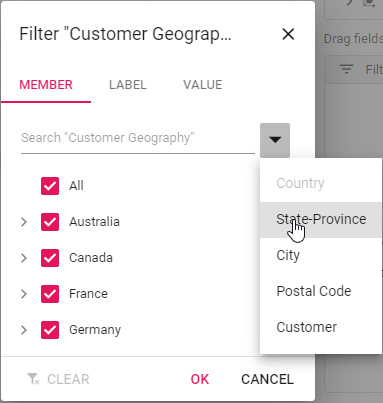
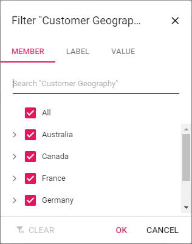
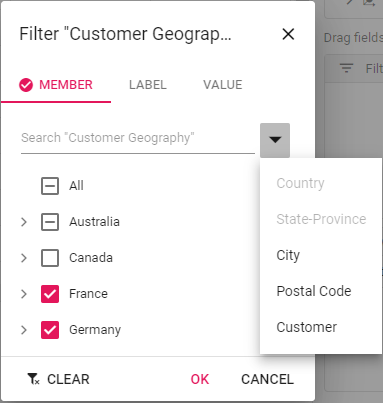

# Member filtering

Member filtering allows you to view pivot table with particular records based on filter criteria. You can disable the member filter by setting the [`allowMemberFilter`](https://ej2.syncfusion.com/react/documentation/api/pivotview/dataSourceSettings/#allowmemberfilter) property to **false**. By default, this property is set as **true**.

## Filtering through UI

Filtering can also be performed through UI option available in [`grouping bar`](./grouping-bar) and [`field list`](./field-list) at run time.

## Filtering through code

It can be configured using the `filterSettings` option through code-behind. The settings required to filter at initial rendering are:
* `name`: It allows to set field name.
* `type`: It allows to set filter type as either "Include" or "Exclude" to the field.
* `items`: It allows to set the filter members of the field.



```typescript
import { IDataOptions, IDataSet, PivotViewComponent } from '@syncfusion/ej2-react-pivotview';
import * as React from 'react';
import * as ReactDOM from 'react-dom';
import { pivotData } from './datasource';

class App extends React.Component<{}, {}>{

  public dataSourceSettings: IDataOptions = {
    columns: [{ name: 'Year', caption: 'Production Year' }, { name: 'Quarter' }],
    dataSource: pivotData as IDataSet[],
    expandAll: false,
    filterSettings: [{ name: 'Country', type: 'Exclude', items: ['United States'] }],
    filters: [],
    drilledMembers: [{ name: 'Country', items: ['France'] }],
    formatSettings: [{ name: 'Amount', format: 'C0' }],
    rows: [{ name: 'Country' }, { name: 'Products' }],
    values: [{ name: 'Sold', caption: 'Units Sold' }, { name: 'Amount', caption: 'Sold Amount' }]
  }
  public pivotObj: PivotViewComponent;
  render() {
    return <PivotViewComponent  ref={d => this.pivotObj = d!} id='PivotView' height={350} dataSourceSettings={this.dataSourceSettings}></PivotViewComponent>
  }
};

ReactDOM.render(<App />, document.getElementById('pivotview'));

```



### On demand member loading

> This feature is applicable only for the OLAP data source.

Users can load members on demand by setting the [`loadOnDemandInMemberEditor`](https://ej2.syncfusion.com/react/documentation/api/pivotview/#loadondemandinmembereditor) property to **true**. By default, one level is loaded in the member editor. So, the initial loading will be completed quickly, without any performance constraints. After that, based on the user requirement, members can be loaded on demand. By default this property is set to **true**. Search will be applied to only the level elements that are loaded.



```typescript
import * as React from 'react';
import * as ReactDOM from 'react-dom';
import { CalculatedField, FieldList, IDataOptions, IDataSet, Inject, PivotViewComponent } from '@syncfusion/ej2-react-pivotview';
class App extends React.Component<{}, {}>{
  public dataSourceSettings: IDataOptions = {
    catalog: 'Adventure Works DW 2008 SE',
            cube: 'Adventure Works',
            providerType: 'SSAS',
            enableSorting: true,
            url: 'https://bi.syncfusion.com/olap/msmdpump.dll',
            localeIdentifier: 1033,
            rows: [
                { name: '[Customer].[Customer Geography]', caption: 'Customer Geography' },
            ],
            columns: [
                { name: '[Product].[Product Categories]', caption: 'Product Categories' },
                { name: '[Measures]', caption: 'Measures' },
            ],
            values: [
                { name: '[Measures].[Customer Count]', caption: 'Customer Count' },
                { name: '[Measures].[Internet Sales Amount]', caption: 'Internet Sales Amount' },
                { name: 'Order on Discount', isCalculatedField: true }
            ],
            filters: [
                { name: '[Date].[Fiscal]', caption: 'Date Fiscal' },
            ],
            calculatedFieldSettings: [
                {
                    name: 'BikeAndComponents',
                    formula: '([Product].[Product Categories].[Category].[Bikes] + [Product].[Product Categories].[Category].[Components] )',
                    hierarchyUniqueName: '[Product].[Product Categories]',
                    formatString: 'Standard'
                },
                {
                    name: 'Order on Discount',
                    formula: '[Measures].[Order Quantity] + ([Measures].[Order Quantity] * 0.10)',
                    formatString: 'Currency'
                }
            ]
  };
  public pivotObj: PivotViewComponent;
  render() {
    return <PivotViewComponent  ref={d => this.pivotObj = d!} id='PivotView' height={350} dataSourceSettings={this.dataSourceSettings} allowCalculatedField={true} showFieldList={true} loadOnDemandInMemberEditor={true}><Inject services={[CalculatedField, FieldList]}/>
    </PivotViewComponent>
  }
};
ReactDOM.render(<App />, document.getElementById('pivotview'));

```





If the property is set to false, all members will be loaded for all levels at initial loading. So, it will take time to fetch the members at initial loading alone. After that, all operations (like drill, search) are performed using existing members without any performance constraints.



### Loading members based on level count

> This feature is applicable only for the OLAP data source.

User can load the members based on the level count by using the property [`levelCount`](https://ej2.syncfusion.com/react/documentation/api/pivotview/filterModel/#levelcount) in the [`filterSettings`](https://ej2.syncfusion.com/react/documentation/api/pivotview/dataSourceSettings/#filtersettings). By default this property is set to **1**. Search will be applied to only the level elements that are loaded.



```typescript
import * as React from 'react';
import * as ReactDOM from 'react-dom';
import { CalculatedField, FieldList, IDataOptions, IDataSet, Inject, PivotViewComponent } from '@syncfusion/ej2-react-pivotview';
class App extends React.Component<{}, {}>{
  public dataSourceSettings: IDataOptions = {
    catalog: 'Adventure Works DW 2008 SE',
            cube: 'Adventure Works',
            providerType: 'SSAS',
            enableSorting: true,
            url: 'https://bi.syncfusion.com/olap/msmdpump.dll',
            localeIdentifier: 1033,
            rows: [
                { name: '[Customer].[Customer Geography]', caption: 'Customer Geography' },
            ],
            columns: [
                { name: '[Product].[Product Categories]', caption: 'Product Categories' },
                { name: '[Measures]', caption: 'Measures' },
            ],
            values: [
                { name: '[Measures].[Customer Count]', caption: 'Customer Count' },
                { name: '[Measures].[Internet Sales Amount]', caption: 'Internet Sales Amount' },
                { name: 'Order on Discount', isCalculatedField: true }
            ],
            filters: [
                { name: '[Date].[Fiscal]', caption: 'Date Fiscal' },
            ],
            calculatedFieldSettings: [
                {
                    name: 'BikeAndComponents',
                    formula: '([Product].[Product Categories].[Category].[Bikes] + [Product].[Product Categories].[Category].[Components] )',
                    hierarchyUniqueName: '[Product].[Product Categories]',
                    formatString: 'Standard'
                },
                {
                    name: 'Order on Discount',
                    formula: '[Measures].[Order Quantity] + ([Measures].[Order Quantity] * 0.10)',
                    formatString: 'Currency'
                }
            ],
            filterSettings: [
                {
                    name: '[Date].[Fiscal]', items: ['[Date].[Fiscal].[Fiscal Quarter].&[2002]&[4]',
                        '[Date].[Fiscal].[Fiscal Year].&[2005]'],
                    levelCount: 3
                }
            ]
  };
  public pivotObj: PivotViewComponent;
  render() {
    return <PivotViewComponent  ref={d => this.pivotObj = d!} id='PivotView' height={350} dataSourceSettings={this.dataSourceSettings} allowCalculatedField={true} showFieldList={true}><Inject services={[CalculatedField, FieldList]}/>
    </PivotViewComponent>
  }
};
ReactDOM.render(<App />, document.getElementById('pivotview'));

```





## See Also

* [Label Filtering](./label-filtering)
* [Value Filtering](./value-filtering)