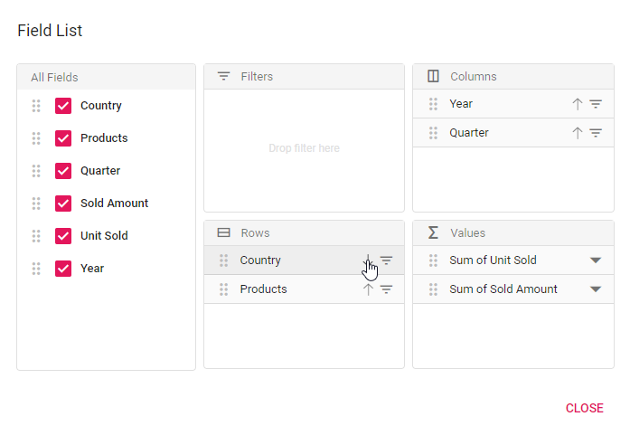
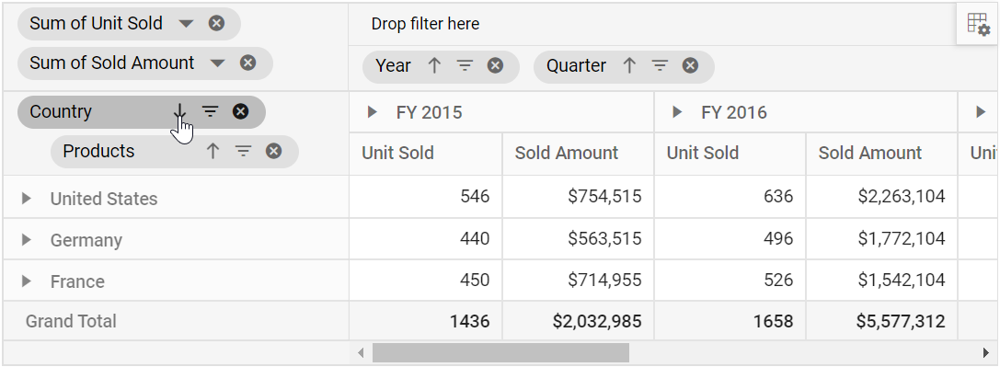
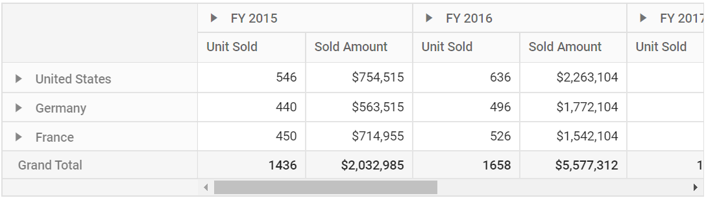

# Sorting

## Member Sorting

Allows to order field members in rows and columns either in ascending or descending order. By default, field members in rows and columns are in ascending order.

Member sorting can be enabled by setting the [`enableSorting`](https://ej2.syncfusion.com/react/documentation/api/pivotview/dataSourceSettingsModel/#enablesorting) property in [`dataSourceSettings`](https://ej2.syncfusion.com/react/documentation/api/pivotview/#datasourcesettings) to **true**. After enabling this API, click the sort icon besides each field in row or column axis, available in field list or grouping bar UI for re-arranging members either in ascending or descending order.

> By default the [`enableSorting`](https://ej2.syncfusion.com/react/documentation/api/pivotview/dataSourceSettingsModel/#enablesorting) property in [`dataSourceSettings`](https://ej2.syncfusion.com/react/documentation/api/pivotview/#datasourcesettings) set as **true**. If we set it as **false**, then the field members arrange in pivot table as its data source order. And, the sort icons in grouping bar and field list buttons will be removed.


<br/>

<br/>


Member sorting can also be configured using the [`sortSettings`](https://ej2.syncfusion.com/react/documentation/api/pivotview/dataSourceSettingsModel/#sortsettings) through code behind, during initial rendering. The settings required to sort are:

* [`name`](https://ej2.syncfusion.com/react/documentation/api/pivotview/sortModel/#name): It allows to set the field name.
* [`order`](https://ej2.syncfusion.com/react/documentation/api/pivotview/sortModel/#order): It allows to set the sort direction either to ascending or descending of the respective field.

> By default the [`order`](https://ej2.syncfusion.com/react/documentation/api/pivotview/sortModel/#order) property in the [`sortSettings`](https://ej2.syncfusion.com/react/documentation/api/pivotview/dataSourceSettingsModel/#sortsettings) set as **Ascending**. Meanwhile, we can arrange the field members as its order in data source by setting it as **None** where the sort icons in grouping bar and field list buttons for the corresponding field will be removed.



```typescript
import { IDataOptions, IDataSet, PivotViewComponent } from '@syncfusion/ej2-react-pivotview';
import * as React from 'react';
import * as ReactDOM from 'react-dom';
import { pivotData } from './datasource';

class App extends React.Component<{}, {}>{

  public dataSourceSettings: IDataOptions = {
    columns: [{ name: 'Year', caption: 'Production Year' }, { name: 'Quarter' }],
    dataSource: pivotData as IDataSet[],
    expandAll: false,
    enableSorting:true,
    sortSettings: [{ name: 'Country', order: 'Descending' }],
    filters: [],
    drilledMembers: [{ name: 'Country', items: ['France'] }],
    formatSettings: [{ name: 'Amount', format: 'C0' }],
    rows: [{ name: 'Country' }, { name: 'Products' }],
    values: [{ name: 'Sold', caption: 'Units Sold' }, { name: 'Amount', caption: 'Sold Amount' }]
  }
  public pivotObj: PivotViewComponent;
  render() {
    return <PivotViewComponent  ref={d => this.pivotObj = d!} id='PivotView' height={350} enableSorting={true} dataSourceSettings={this.dataSourceSettings}></PivotViewComponent>
  }
};

ReactDOM.render(<App />, document.getElementById('pivotview'));

```



## Value sorting

> This property is applicable only for relational data source.

Allows to sort individual value field and its aggregated values either in row or column axis in both ascending and descending order. It can been enabled by setting the [`enableValueSorting`](https://ej2.syncfusion.com/react/documentation/api/pivotview/#enablevaluesorting) property to **true**. On enabling, end user can sort the values by directly clicking the value field header positioned either in row or column axis of the pivot table component.

The value sorting can also be configured using the [`valueSortSettings`](https://ej2.syncfusion.com/react/documentation/api/pivotview/dataSourceSettingsModel/#valuesortsettings) option through code behind. The settings required to sort value fields are:

* [`headerText`](https://ej2.syncfusion.com/react/documentation/api/pivotview/valueSortSettingsModel/#headertext): It allows to set the header names with delimiters, that is used for value sorting. The header names are arranged from Level 1 to Level N, down the hierarchy with a delimiter for better specification.
* [`headerDelimiter`](https://ej2.syncfusion.com/react/documentation/api/pivotview/valueSortSettingsModel/#headerdelimiter): It allows to set the delimiters string to separate the header text between levels.
* [`sortOrder`](https://ej2.syncfusion.com/react/documentation/api/pivotview/valueSortSettingsModel/#sortorder): It allows to set the sort direction of the value field.



```typescript
import { IDataOptions, IDataSet, PivotViewComponent } from '@syncfusion/ej2-react-pivotview';
import * as React from 'react';
import * as ReactDOM from 'react-dom';
import { pivotData } from './datasource';

class App extends React.Component<{}, {}>{

  public dataSourceSettings: IDataOptions = {
    columns: [{ name: 'Year', caption: 'Production Year' }, { name: 'Quarter' }],
    dataSource: pivotData as IDataSet[],
    expandAll: false,
    valueSortSettings: {
      headerText: 'FY 2015##Sold Amount',
      headerDelimiter: '##',
      sortOrder: 'Descending'
    },
    filters: [],
    drilledMembers: [{ name: 'Country', items: ['France'] }],
    formatSettings: [{ name: 'Amount', format: 'C0' }],
    rows: [{ name: 'Country' }, { name: 'Products' }],
    values: [{ name: 'Sold', caption: 'Units Sold' }, { name: 'Amount', caption: 'Sold Amount' }]
  }
  public pivotObj: PivotViewComponent;
  render() {
    return <PivotViewComponent  ref={d => this.pivotObj = d!} id='PivotView' height={350} enableValueSorting={true} dataSourceSettings={this.dataSourceSettings}></PivotViewComponent>
  }
};

ReactDOM.render(<App />, document.getElementById('pivotview'));

```

