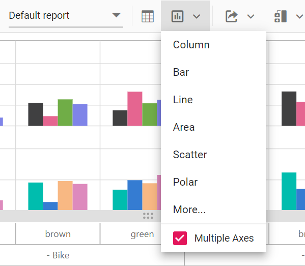
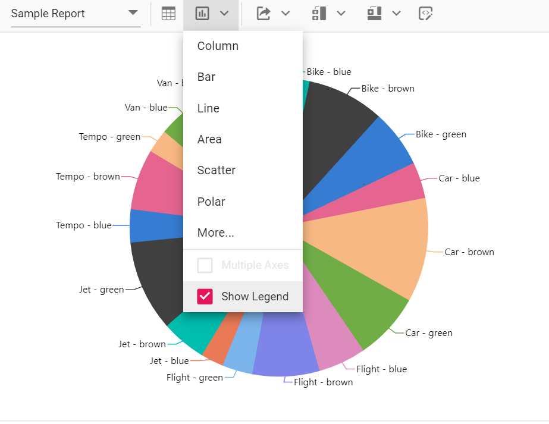

# Toolbar

A toolbar option has been provided to the pivot controls. It allows users access the frequently used features easily. Users also can save the state of the pivot table and load it back whenever required using this option. This option can be enabled by setting the `showToolbar` property to true. The [`toolbar`](../../api/pivotview/#toolbar) property accepts the collection of built-in toolbar options.

> To use the toolbar, inject the `Toolbar` module into the pivot table.

## Built-in toolbar options

Built-in toolbar options can be added by defining the [`toolbar`](../../api/pivotview/#toolbar) as a collection of built-in options.

The following table shows built-in toolbar options and its actions.

| Built-in Toolbar Options | Actions |
|------------------------|---------|
| New | Creates a new report |
| Save | Saves the current report |
| Save As | Save as current report |
| Rename | Renames the current report |
| Delete | Deletes the current report |
| Load | Loads any report from the report list |
| Grid | Shows pivot table |
| Chart | Shows a chart in any type from the built-in list and option to enable/disable multiple axes|
| Exporting | Exports the pivot table as PDF/Excel/CSV |
| Sub total | Shows or hides sub totals |
| Grand total | Shows or hides grand totals |
| Conditional Formatting | Shows the conditional formatting pop-up to apply formatting |
| Number Formatting | Shows the number formatting pop-up to apply number formatting |
| Fieldlist | Shows the fieldlist pop-up |
| MDX | Shows the MDX query that was run to retrieve data from the OLAP data source. **NOTE: This applies only to the OLAP data source.** |

> Report manipulation like save, load, rename, etc.., operations can be performed through events. In the following example, the localStorage (session storage) is used to manipulate the report operation.



```typescript
import * as React from 'react';
import * as ReactDOM from 'react-dom';
import {
    PivotViewComponent, IDataOptions, Inject, FieldList, CalculatedField,
    Toolbar, PDFExport, ExcelExport, ConditionalFormatting, SaveReportArgs,
    FetchReportArgs, LoadReportArgs, RemoveReportArgs, RenameReportArgs, NumberFormatting
} from '@syncfusion/ej2-react-pivotview';
import { pivotData } from './datasource';
class App extends React.Component<{}, {}>{
  public dataSourceSettings: IDataOptions = {
    columns: [{ name: 'Year', caption: 'Production Year' }, { name: 'Quarter' }],
    dataSource: pivotData as IDataSet[],
    expandAll: false,
    filters: [],
    drilledMembers: [{ name: 'Country', items: ['France'] }],
    formatSettings: [{ name: 'Amount', format: 'C0' }],
    rows: [{ name: 'Country' }, { name: 'Products' }],
    values: [{ name: 'Sold', caption: 'Units Sold' }, { name: 'Amount', caption: 'Sold Amount' }]
  };
  public pivotObj: PivotViewComponent;
   public toolbarOptions: any = ['New', 'Save', 'SaveAs', 'Rename', 'Remove', 'Load',
        'Grid', 'Chart', 'Export', 'SubTotal', 'GrandTotal', 'ConditionalFormatting', 'NumberFormatting', 'FieldList'];


    saveReport(args: any): void {
        let reports: SaveReportArgs[] = [];
        let isSaved: boolean = false;
        if (localStorage.pivotviewReports && localStorage.pivotviewReports !== "") {
            reports = JSON.parse(localStorage.pivotviewReports);
        }
        if (args.report && args.reportName && args.reportName !== '') {
            reports.map(function (item: any): any {
                if (args.reportName === item.reportName) {
                    item.report = args.report; isSaved = true;
                }
            });
            if (!isSaved) {
                reports.push(args);
            }
            localStorage.pivotviewReports = JSON.stringify(reports);
        }
    }
    fetchReport(args: FetchReportArgs): void {
        let reportCollection: string[] = [];
        let reeportList: string[] = [];
        if (localStorage.pivotviewReports && localStorage.pivotviewReports !== "") {
            reportCollection = JSON.parse(localStorage.pivotviewReports);
        }
        reportCollection.map(function (item: any): void { reeportList.push(item.reportName); });
        args.reportName = reeportList;
    }
    loadReport(args: LoadReportArgs): void {
        let reportCollection: string[] = [];
        if (localStorage.pivotviewReports && localStorage.pivotviewReports !== "") {
            reportCollection = JSON.parse(localStorage.pivotviewReports);
        }
        reportCollection.map(function (item: any): void {
            if (args.reportName === item.reportName) {
                args.report = item.report;
            }
        });
        if (args.report) {
            this.pivotObj.dataSource = JSON.parse(args.report).dataSource;
        }
    }
    removeReport(args: RemoveReportArgs): void {
        let reportCollection: any[] = [];
        if (localStorage.pivotviewReports && localStorage.pivotviewReports !== "") {
            reportCollection = JSON.parse(localStorage.pivotviewReports);
        }
        for (let i: number = 0; i < reportCollection.length; i++) {
            if (reportCollection[i].reportName === args.reportName) {
                reportCollection.splice(i, 1);
            }
        }
        if (localStorage.pivotviewReports && localStorage.pivotviewReports !== "") {
            localStorage.pivotviewReports = JSON.stringify(reportCollection);
        }
    }
    renameReport(args: RenameReportArgs): void {
        let reportCollection: string[] = [];
        if (localStorage.pivotviewReports && localStorage.pivotviewReports !== "") {
            reportCollection = JSON.parse(localStorage.pivotviewReports);
        }
        reportCollection.map(function (item: any): any { if (args.reportName === item.reportName) { item.reportName = args.rename; } });
        if (localStorage.pivotviewReports && localStorage.pivotviewReports !== "") {
            localStorage.pivotviewReports = JSON.stringify(reportCollection);
        }
    }
    newReport(): void {
        this.pivotObj.setProperties({ dataSource: { columns: [], rows: [], values: [], filters: [] } }, false);
    }
  render() {
    return <PivotViewComponent id='PivotView' ref={(scope) => { this.pivotObj = scope; }} dataSourceSettings={this.dataSourceSettings} width={'100%'} height={350} showFieldList={true} gridSettings={{ columnWidth: 140 }} allowExcelExport={true} allowConditionalFormatting={true} allowNumberFormatting={true} allowPdfExport={true} showToolbar={true} allowCalculatedField={true} displayOption={{ view: 'Both' }} toolbar={this.toolbarOptions} newReport={this.newReport.bind(this)} renameReport={this.renameReport.bind(this)} removeReport={this.removeReport.bind(this)} loadReport={this.loadReport.bind(this)} fetchReport={this.fetchReport.bind(this)} saveReport={this.saveReport.bind(this)}><Inject services={[FieldList, CalculatedField, Toolbar, PDFExport, ExcelExport, ConditionalFormatting, NumberFormatting]} /></PivotViewComponent>
  }
};
ReactDOM.render(<App />, document.getElementById('pivotview'));

```



## Show desired chart types in the dropdown menu

By default, all chart types are displayed in the dropdown menu included in the toolbar. However, based on the request for an application, we may need to show selective chart types on our own. This can be achieved using the [`chartTypes`](https://ej2.syncfusion.com/react/documentation/api/pivotview/#charttypes) property. To know more about supporting chart types, [`click here`](https://ej2.syncfusion.com/react/documentation/pivotview/pivot-chart/#chart-types).



```typescript
import * as React from 'react';
import * as ReactDOM from 'react-dom';
import {
    PivotViewComponent, IDataOptions, Inject, Toolbar
} from '@syncfusion/ej2-react-pivotview';
import { pivotData } from './datasource';
class App extends React.Component<{}, {}>{
  public dataSourceSettings: IDataOptions = {
    columns: [{ name: 'Year', caption: 'Production Year' }, { name: 'Quarter' }],
    dataSource: pivotData as IDataSet[],
    formatSettings: [{ name: 'Amount', format: 'C0' }],
    rows: [{ name: 'Country' }, { name: 'Products' }],
    values: [{ name: 'Sold', caption: 'Units Sold' }, { name: 'Amount', caption: 'Sold Amount' }]
  };
  public pivotObj: PivotViewComponent;
   public toolbarOptions: any = ['Grid','Chart'];
   public chartTypes: any = ['Column', 'Bar', 'Line', 'Area'];

  render() {
    return <PivotViewComponent id='PivotView' dataSourceSettings={this.dataSourceSettings} width={'100%'} height={350} showToolbar={true} toolbar={this.toolbarOptions} displayOption={{ view: 'Both' }} chartTypes={this.chartTypes} ><Inject services={[ Toolbar]} /></PivotViewComponent>
  }
};
ReactDOM.render(<App />, document.getElementById('pivotview'));

```



## Switch the chart to multiple axes

In the chart, the user can switch from single axis to multiple axes with the help of the built-in checkbox available inside the chart type dropdown menu in the toolbar. For more information [`refer here`](https://ej2.syncfusion.com/react/documentation/pivotview/pivot-chart/#multi-axis).





<!-- markdownlint-disable MD009 -->

## Show or hide legend

In the chart, legend can be shown or hidden dynamically with the help of the built-in option available in the chart type drop-down menu.
> By default, the legend is not be visible for the accumulation chart types like pie, doughnut, pyramid, and funnel. Users can enable or disable using the built-in checkbox option.



## Adding custom option to the toolbar

In addition to the existing built-in toolbar items, new toolbar item(s) may also be included. This can be achieved by using the [`toolbarRender`](https://ej2.syncfusion.com/react/documentation/api/pivotview#toolbarrender) event. The action of the new toolbar item(s) can also be defined within this event. 

> The new toolbar item(s) can be added to the desired position in the toolbar using the `splice` option.



```typescript
import * as React from 'react';
import * as ReactDOM from 'react-dom';
import {
    PivotViewComponent, IDataOptions, Inject, Toolbar, ToolbarArgs
} from '@syncfusion/ej2-react-pivotview';
import { pivotData } from './datasource';
class App extends React.Component<{}, {}>{
  public dataSourceSettings: IDataOptions = {
    columns: [{ name: 'Year', caption: 'Production Year' }, { name: 'Quarter' }],
    dataSource: pivotData as IDataSet[],
    filters: [],
    formatSettings: [{ name: 'Amount', format: 'C0' }],
    rows: [{ name: 'Country' }, { name: 'Products' }],
    values: [{ name: 'Sold', caption: 'Units Sold' }, { name: 'Amount', caption: 'Sold Amount' }]
  };
  public pivotObj: PivotViewComponent;
  public toolbarOptions: any = ['Expand/Collapse'];

    beforeToolbarRender(args: ToolbarArgs): void {
        args.customToolbar.splice(12, 0, {
            prefixIcon: 'e-tool-expand e-icons', tooltipText: 'Expand/Collapse',
            click: this.toolbarClicked.bind(this),
        });
    }
    toolbarClicked(args: any): void {
        this.pivotObj.dataSourceSettings.expandAll = !this.pivotObj.dataSourceSettings.expandAll;
    }
  render() {
    return <PivotViewComponent id='PivotView' ref={(scope) => { this.pivotObj = scope; }} dataSourceSettings={this.dataSourceSettings} width={'100%'} height={350} gridSettings={{ columnWidth: 140 }} showToolbar={true} displayOption={{ view: 'Both' }} toolbar={this.toolbarOptions} toolbarRender={this.beforeToolbarRender.bind(this)}><Inject services={[Toolbar]} /></PivotViewComponent>
  }
};
ReactDOM.render(<App />, document.getElementById('pivotview'));

```



<!-- markdownlint-disable MD009 -->

## Save and load report as a JSON file

The current pivot report can be saved as a JSON file in the desired path and loaded back to the pivot table at any time. 



```typescript
import * as React from 'react';
import * as ReactDOM from 'react-dom';
import { IDataOptions, IDataSet, Inject, PivotViewComponent } from '@syncfusion/ej2-react-pivotview';
import { pivotData } from './datasource';

const SAMPLE_CSS = `
.fileUpload {
    position: relative;
    overflow: hidden;
    margin: 10px;
}
.fileUpload input.upload {
    position: absolute;
    top: 0;
    right: 0;
    margin: 0;
    padding: 0;
    font-size: 20px;
    cursor: pointer;
    opacity: 0;
    filter: alpha(opacity=0);
}`;

class App extends React.Component<{}, {}>{
  public dataSourceSettings: IDataOptions = {
    columns: [{ name: 'Year', caption: 'Production Year' }, { name: 'Quarter' }],
    dataSource: pivotData as IDataSet[],
    filters: [],
    formatSettings: [{ name: 'Amount', format: 'C0' }],
    rows: [{ name: 'Country' }, { name: 'Products' }],
    values: [{ name: 'Sold', caption: 'Units Sold' }, { name: 'Amount', caption: 'Sold Amount' }]
  };
  public pivotObj: PivotViewComponent;

    ondataBound(args: any): void {
        var dataSource = JSON.parse(this.pivotObj.getPersistData()).dataSourceSettings.dataSource;
        var a = document.getElementById('save');
        var mime_type = 'application/octet-stream'; // text/html, image/png, et c
        a.setAttribute('download', 'pivot.JSON');
        a.href = 'data:'+ mime_type +';base64,'+ btoa(JSON.stringify(dataSource) || '');
        document.getElementById('files').addEventListener('change', this.readBlob, false);
    }
    readBlob(args: any): void {
        var files = document.getElementById('load').files;
        var file = files[0];
        var start = 0;
        var stop = file.size - 1;
        var reader = new FileReader();
        reader.onloadend = function(evt) {
            if (evt.target.readyState == FileReader.DONE) {
                this.pivotObj.dataSource = JSON.parse(evt.target.result);
            }
        };
        var blob = file.slice(start, stop + 1);
        reader.readAsBinaryString(blob);
    }

    render() {
    return (<div className='control-pane'>
               <div><style>{SAMPLE_CSS}</style><PivotViewComponent id='PivotView' ref={(scope) => { this.pivotObj = scope; }} dataSourceSettings={this.dataSourceSettings} width={'100%'} height={350} gridSettings={{ columnWidth: 140 }} dataBound={this.ondataBound.bind(this)}></PivotViewComponent></div><a id="save" class="btn btn-primary">Save</a><div class="fileUpload btn btn-primary"><span>Load</span><input id="files" type="file" class="upload" /></div>
            </div>);
       }
};
ReactDOM.render(<App />, document.getElementById('pivotview'));

```



## Events

### FetchReport

The event [`fetchReport`](https://ej2.syncfusion.com/react/documentation/api/pivotview#fetchreport) is triggered when dropdown list is clicked in the toolbar in-order to retrieve and populate saved reports. It has following parameter - `reportName`. This event allows user to fetch the report names from local storage and populate the dropdown list.

### LoadReport

The event [`loadReport`](https://ej2.syncfusion.com/react/documentation/api/pivotview#loadreport) is triggered when a report is selected from the dropdown list in the toolbar. It has following parameters - `report` and `reportName`. This event allows user to load the selected report to the pivot table.

### NewReport

The event [`newReport`](https://ej2.syncfusion.com/react/documentation/api/pivotview#newreport) is triggered when the new report icon is clicked in the toolbar. It has following parameter - `report`. This event allows user to create new report and add to the report list.

### RenameReport

The event [`renameReport`](https://ej2.syncfusion.com/react/documentation/api/pivotview#renamereport) is triggered when rename report icon is clicked in the toolbar. It has following parameters  - `rename`, `report` and `reportName`. This event allows user to rename the selected report from the report list.

### RemoveReport

The event [`removeReport`](https://ej2.syncfusion.com/react/documentation/api/pivotview#removereport) is triggered when remove report icon is clicked in the toolbar. It has following parameters  - `report` and `reportName`. This event allows user to remove the selected report from the report list.

### SaveReport

The event [`saveReport`](https://ej2.syncfusion.com/react/documentation/api/pivotview#savereport) is triggered when save report icon is clicked in the toolbar. It has following parameters  - `report` and `reportName`. This event allows user to save the altered report to the report list.

### ToolbarRender

The [`toolbarRender`](https://ej2.syncfusion.com/react/documentation/api/pivotview/#toolbarrender) event is triggered when the toolbar is rendered. It has the `customToolbar` parameter. This event helps to customize the built-in toolbar items and to [`include new toolbar item(s)`](https://ej2.syncfusion.com/react/documentation/pivotview/tool-bar/#adding-custom-option-to-the-toolbar).



```typescript
import * as React from 'react';
import * as ReactDOM from 'react-dom';
import {
    PivotViewComponent, IDataOptions, Inject, Toolbar, ToolbarArgs, SaveReportArgs, FieldList
} from '@syncfusion/ej2-react-pivotview';
import { pivotData } from './datasource';
class App extends React.Component<{}, {}>{
  public dataSourceSettings: IDataOptions = {
    columns: [{ name: 'Year', caption: 'Production Year' }, { name: 'Quarter' }],
    dataSource: pivotData as IDataSet[],
    filters: [],
    formatSettings: [{ name: 'Amount', format: 'C0' }],
    rows: [{ name: 'Country' }, { name: 'Products' }],
    values: [{ name: 'Sold', caption: 'Units Sold' }, { name: 'Amount', caption: 'Sold Amount' }]
  };
  public pivotObj: PivotViewComponent;
  public toolbarOptions: any = [ "Save", "Export", "FieldList"];

    saveReport(args: any): void {
        let reports: SaveReportArgs[] = [];
        let isSaved: boolean = false;
        if (localStorage.pivotviewReports && localStorage.pivotviewReports !== "") {
            reports = JSON.parse(localStorage.pivotviewReports);
        }
        if (args.report && args.reportName && args.reportName !== '') {
            reports.map(function (item: any): any {
                if (args.reportName === item.reportName) {
                    item.report = args.report; isSaved = true;
                }
            });
            if (!isSaved) {
                reports.push(args);
            }
            localStorage.pivotviewReports = JSON.stringify(reports);
        }
    }
    beforeToolbarRender(args: ToolbarArgs): void {
        args.customToolbar.splice(2, 0, {
            prefixIcon: 'e-rename-report e-icons', tooltipText: 'Custom Button',
            click: this.customButton.bind(this),
        });
        args.customToolbar.splice(3, 0, {
            prefixIcon: 'e-tool-expand e-icons', tooltipText: 'Expand/Collapse',
            click: this.toolbarClicked.bind(this),
        });
            args.customToolbar[0].align = "Left";
            args.customToolbar[1].align = "Center";
            args.customToolbar[2].align = "Right";
    }
    customButton(args: any): void {
      // Here you can customize the click event for custom button
    }
    toolbarClicked(args: any): void {
        this.pivotObj.dataSourceSettings.expandAll = !this.pivotObj.dataSourceSettings.expandAll;
    }
  render() {
    return <PivotViewComponent id='PivotView' ref={(scope) => { this.pivotObj = scope; }} dataSourceSettings={this.dataSourceSettings} width={'100%'} height={350} gridSettings={{ columnWidth: 140 }} showToolbar={true} displayOption={{ view: 'Both' }} showFieldList={true} toolbar={this.toolbarOptions} toolbarRender={this.beforeToolbarRender.bind(this)}><Inject services={[Toolbar, FieldList]} saveReport={this.saveReport.bind(this)} /></PivotViewComponent>
  }
};
ReactDOM.render(<App />, document.getElementById('pivotview'));

```



### BeforeExport

The pivot table (or) pivot chart can be exported as a pdf, excel, csv etc.,  document using the toolbar options. And, you can customize the export settings for exporting document by using the [`beforeExport`](https://ej2.syncfusion.com/react/documentation/api/pivotview/#beforeexport) event in the toolbar.

For example, you can add the header and footer for the pdf document by setting the `header` and `footer` properties for the `pdfExportProperties` in the [`beforeExport`](https://ej2.syncfusion.com/react/documentation/api/pivotview/#beforeexport) event.



```typescript
import * as React from 'react';
import * as ReactDOM from 'react-dom';
import {
    PivotViewComponent, IDataOptions, Inject, FieldList, CalculatedField,
    Toolbar, PDFExport, ExcelExport, ConditionalFormatting, SaveReportArgs,
    FetchReportArgs, LoadReportArgs, RemoveReportArgs, RenameReportArgs, BeforeExportEventArgs
} from '@syncfusion/ej2-react-pivotview';
import { pivotData } from './datasource';
class App extends React.Component<{}, {}>{
  public dataSourceSettings: IDataOptions = {
    columns: [{ name: 'Year', caption: 'Production Year' }, { name: 'Quarter' }],
    dataSource: pivotData as IDataSet[],
    expandAll: false,
    filters: [],
    formatSettings: [{ name: 'Amount', format: 'C0' }],
    rows: [{ name: 'Country' }, { name: 'Products' }],
    values: [{ name: 'Sold', caption: 'Units Sold' }, { name: 'Amount', caption: 'Sold Amount' }]
  };
  public pivotObj: PivotViewComponent;
   public toolbarOptions: any = ['New', 'Save', 'SaveAs', 'Rename', 'Remove', 'Load',
        'Grid', 'Chart', 'Export', 'SubTotal', 'GrandTotal', 'ConditionalFormatting', 'FieldList'];


    saveReport(args: any): void {
        let reports: SaveReportArgs[] = [];
        let isSaved: boolean = false;
        if (localStorage.pivotviewReports && localStorage.pivotviewReports !== "") {
            reports = JSON.parse(localStorage.pivotviewReports);
        }
        if (args.report && args.reportName && args.reportName !== '') {
            reports.map(function (item: any): any {
                if (args.reportName === item.reportName) {
                    item.report = args.report; isSaved = true;
                }
            });
            if (!isSaved) {
                reports.push(args);
            }
            localStorage.pivotviewReports = JSON.stringify(reports);
        }
    }
    fetchReport(args: FetchReportArgs): void {
        let reportCollection: string[] = [];
        let reeportList: string[] = [];
        if (localStorage.pivotviewReports && localStorage.pivotviewReports !== "") {
            reportCollection = JSON.parse(localStorage.pivotviewReports);
        }
        reportCollection.map(function (item: any): void { reeportList.push(item.reportName); });
        args.reportName = reeportList;
    }
    loadReport(args: LoadReportArgs): void {
        let reportCollection: string[] = [];
        if (localStorage.pivotviewReports && localStorage.pivotviewReports !== "") {
            reportCollection = JSON.parse(localStorage.pivotviewReports);
        }
        reportCollection.map(function (item: any): void {
            if (args.reportName === item.reportName) {
                args.report = item.report;
            }
        });
        if (args.report) {
            this.pivotObj.dataSource = JSON.parse(args.report).dataSource;
        }
    }
    removeReport(args: RemoveReportArgs): void {
        let reportCollection: any[] = [];
        if (localStorage.pivotviewReports && localStorage.pivotviewReports !== "") {
            reportCollection = JSON.parse(localStorage.pivotviewReports);
        }
        for (let i: number = 0; i < reportCollection.length; i++) {
            if (reportCollection[i].reportName === args.reportName) {
                reportCollection.splice(i, 1);
            }
        }
        if (localStorage.pivotviewReports && localStorage.pivotviewReports !== "") {
            localStorage.pivotviewReports = JSON.stringify(reportCollection);
        }
    }
    renameReport(args: RenameReportArgs): void {
        let reportCollection: string[] = [];
        if (localStorage.pivotviewReports && localStorage.pivotviewReports !== "") {
            reportCollection = JSON.parse(localStorage.pivotviewReports);
        }
        reportCollection.map(function (item: any): any { if (args.reportName === item.reportName) { item.reportName = args.rename; } });
        if (localStorage.pivotviewReports && localStorage.pivotviewReports !== "") {
            localStorage.pivotviewReports = JSON.stringify(reportCollection);
        }
    }
    newReport(): void {
        this.pivotObj.setProperties({ dataSource: { columns: [], rows: [], values: [], filters: [] } }, false);
    }
    beforeExport(args: BeforeExportEventArgs): void {
            args.excelExportProperties = {
                header: {
                    headerRows: 2,
                    rows: [
                        { cells: [{ colSpan: 4, value: "Pivot Table", style: { fontColor: '#C67878', fontSize: 20, hAlign: 'Center', bold: true, underline: true } }] }
                    ]
                },
                footer: {
                    footerRows: 4,
                    rows: [
                        { cells: [{ colSpan: 4, value: "Thank you for your business!", style: { hAlign: 'Center', bold: true } }] },
                        { cells: [{ colSpan: 4, value: "!Visit Again!", style: { hAlign: 'Center', bold: true } }] }
                    ]
                }
            };
            args.pdfExportProperties = {
                header: {
                    fromTop: 0,
                    height: 130,
                    contents: [
                        {
                            type: 'Text',
                            value: "Pivot Table",
                            position: { x: 0, y: 50 },
                            style: { textBrushColor: '#000000', fontSize: 13, dashStyle:'Solid',hAlign:'Center' }
                        }
                    ]
                },
                footer: {
                    fromBottom: 160,
                    height: 150,
                    contents: [
                        {
                            type: 'PageNumber',
                            pageNumberType: 'Arabic',
                            format: 'Page {$current} of {$total}',
                            position: { x: 0, y: 25 },
                            style: { textBrushColor: '#02007a', fontSize: 15 }
                        }
                    ]
                }
            };
        }
  render() {
    return <PivotViewComponent id='PivotView' ref={(scope) => { this.pivotObj = scope; }} dataSourceSettings={this.dataSourceSettings} width={'100%'} height={350} showFieldList={true} gridSettings={{ columnWidth: 140 }} allowExcelExport={true} allowConditionalFormatting={true} allowPdfExport={true} showToolbar={true} allowCalculatedField={true} displayOption={{ view: 'Both' }} toolbar={this.toolbarOptions} newReport={this.newReport.bind(this)} renameReport={this.renameReport.bind(this)} removeReport={this.removeReport.bind(this)} loadReport={this.loadReport.bind(this)} fetchReport={this.fetchReport.bind(this)} saveReport={this.saveReport.bind(this)} beforeExport={this.beforeExport.bind(this)}><Inject services={[FieldList, CalculatedField, Toolbar, PDFExport, ExcelExport, ConditionalFormatting]} /></PivotViewComponent>
  }
};
ReactDOM.render(<App />, document.getElementById('pivotview'));

```



## See Also

* [Toolbar Component](../../toolbar/getting-started.html)