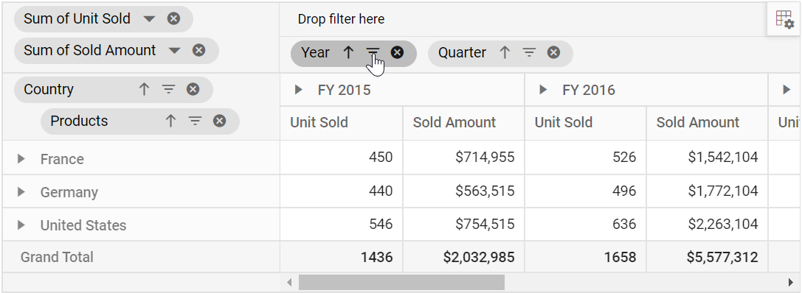
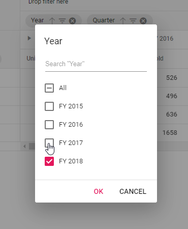
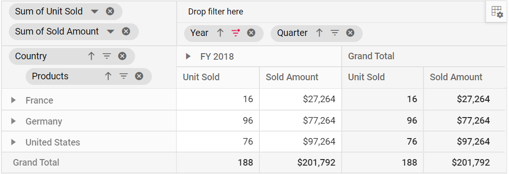
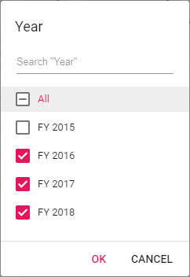
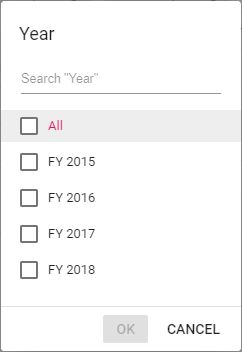
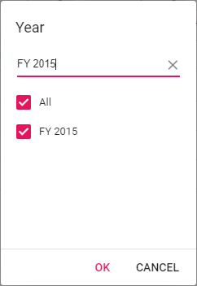
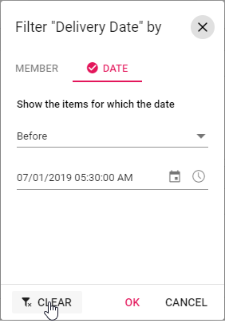
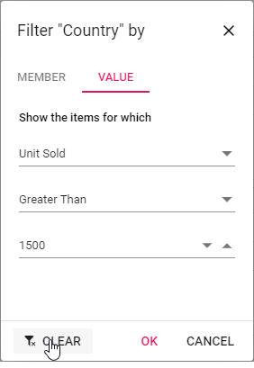

<!-- markdownlint-disable MD012 -->

# Filtering

Filtering allows to view the pivot table with selective records based on members that can be either included or excluded through UI and code-behind.

The following are the three different types of filtering:

* Member filtering
* Label filtering
* Value filtering

> When all the above filtering options are disabled via code-hind, then the filter icon would be disabled in the field list or group bar UI.

## Member filtering

Allows to view the pivot table with selective records based on included and excluded members in each field. By default, member filter option is enabled by the [`allowMemberFilter`](https://ej2.syncfusion.com/javascript/documentation/api/pivotview/dataSourceSettings/#allowmemberfilter) boolean property in [`dataSourceSettings`](https://ej2.syncfusion.com/javascript/documentation/api/pivotview/dataSourceSettings/). This UI option helps end user to filter members by clicking the filter icon besides any field in the row, column and filter axes available in the field list or grouping bar UI at runtime.


<br/>

<br/>

<br/>


Meanwhile filtering can also be configured at code behind using the [`filterSettings`](https://ej2.syncfusion.com/javascript/documentation/api/pivotview/filter/) while initial rendering of the component. The basic settings required to add filter criteria are:

* [`name`](https://ej2.syncfusion.com/javascript/documentation/api/pivotview/filter/#name): It allows to set the appropriate field name.
* [`type`](https://ej2.syncfusion.com/javascript/documentation/api/pivotview/filter/#type): It allows to set the filter type as **Include** or **Exclude** to include or exclude field members respectively.
* [`items`](https://ej2.syncfusion.com/javascript/documentation/api/pivotview/filter/#items): It allows to set the members which needs to be either included or excluded from display.



```typescript
import { PivotView, IDataSet } from '@syncfusion/ej2-pivotview';
import { pivotData } from './datasource.ts';

let pivotTableObj: PivotView = new PivotView({
        dataSourceSettings: {
        dataSource: pivotData as IDataSet[],
        expandAll: false,
        drilledMembers: [{ name: 'Country', items: ['France'] }],
        filterSettings: [{ name: 'Country', type: 'Exclude', items: ['United States'] }],
        columns: [{ name: 'Year', caption: 'Production Year' }, { name: 'Quarter' }],
        values: [{ name: 'Sold', caption: 'Units Sold' }, { name: 'Amount', caption: 'Sold Amount' }],
        rows: [{ name: 'Country' }, { name: 'Products' }],
        filters: []
    },
    height: 350
});
pivotTableObj.appendTo('#PivotTable');

```



### Option to select and unselect all members

The member filter dialog comes with an option "All", which on checked selects all members and on unchecked deselects all members. The option "All" would appear in intermediate state mentioning that both selected and unselected child members are available.



When all members are deselected, the "Ok" button in member filter dialog would be disabled, meaning, at least one member should be selected and bound to the pivot table component.



### Provision to search specific member(s)

By default, search option is available to quickly navigate to the desired members. It can be done by entering the starting character(s) of the actual members.



### Performance Tips

In member filter dialog, end user can set the limit to display members while loading large data. Based on this limit, initial loading will get completed quickly without any performance constraint. Also, a message with remaining member count, which are not part of the UI, will be displayed in the member editor.

The data limit can be set using the [`maxNodeLimitInMemberEditor`](https://ej2.syncfusion.com/javascript/documentation/api/pivotview#maxnodelimitinmembereditor) property in pivot table. By default, the property holds the numeric value **1000**.




```typescript
import { PivotView, IDataSet } from '@syncfusion/ej2-pivotview';
import { FieldList, GroupingBar, VirtualScroll } from '@syncfusion/ej2-pivotview';


let names: string[] = ['TOM', 'Hawk', 'Jon', 'Chandler', 'Monica', 'Rachel', 'Phoebe', 'Gunther',
    'Ross', 'Geller', 'Joey', 'Bing', 'Tribbiani', 'Janice', 'Bong', 'Perk', 'Green', 'Ken', 'Adams'];
let city: string[] = ['New York', 'Los Angeles', 'Chicago', 'Houston', 'Philadelphia', 'Phoenix', 'San Antonio', 'Austin',
    'San Francisco', 'Columbus', 'Washington', 'Portland', 'Oklahoma', 'Las Vegas', 'Virginia', 'St. Louis', 'Birmingham']
let hours: number[] = [1, 2, 3, 4, 5, 6, 7, 8, 9, 10];
let rating: number[] = [1, 2, 3, 4, 5, 6, 7, 8, 9, 10];
let designation: string[] = ['Manager', 'Engineer 1', 'Engineer 2', 'Developer', 'Tester'];
let status: string[] = ['Completed', 'Open', 'In Progress', 'Review', 'Testing'];
let data: Function = (count: number) => {
    let result: Object[] = [];
    for (let i = 0; i < count; i++) {
        result.push({
            TaskID: i + 1,
            Engineer: names[Math.round(Math.random() * names.length)] || names[0],
            City: names[Math.round(Math.random() * city.length)] || city[0],
            Designation: designation[Math.round(Math.random() * designation.length)] || designation[0],
            Estimation: hours[Math.round(Math.random() * hours.length)] || hours[0],
            Rating: hours[Math.round(Math.random() * rating.length)] || rating[0],
            Status: status[Math.round(Math.random() * status.length)] || status[0]
        });
    }
    return result;
};

PivotView.Inject(VirtualScroll, FieldList, GroupingBar);
let pivotTableObj: PivotView = new PivotView({
    dataSourceSettings: {
        dataSource: data(5000),
        expandAll: false,
        formatSettings: [{ name: 'Estimation', format: 'C' }],
        rows: [{ name: 'TaskID' }, { name: 'Status' }],
        columns: [{ name: 'Designation' }],
        values: [{ name: 'Estimation' }, { name: 'Rating' }],
    },
    width: 800,
    height: 300,
    enableVirtualization: true,
    showFieldList: true,
    showGroupingBar: true,
    maxNodeLimitInMemberEditor:500
});
pivotTableObj.appendTo('#PivotTable');

```



Meanwhile, end user can utilize the search option to refine the members from the exceeded limit. For example, consider that there are 5000 members in the name "Node 1", "Node 2", "Node 3", and so on... and user has set the property [`maxNodeLimitInMemberEditor`](https://ej2.syncfusion.com/javascript/documentation/api/pivotview#maxnodelimitinmembereditor) to **500**. In this case, only the initial 500 members will be displayed by default leaving a message "4500 more items. Search to refine further.". To get the member(s) between 501 to 5000, enter the starting character(s) in search option to bring the desired member(s) from the exceeded limit to the UI. Now, end user can either check or uncheck to continue with the filtering process.

## Label filtering

The label filtering helps to view the pivot table with selective header text in fields across row and column axes based on the applied filter criteria. The following are the three different types of label filtering available:

* Filtering string data type
* Filtering number data type
* Filtering date data type

The label filtering dialog can be enabled by setting the [`allowLabelFilter`](https://ej2.syncfusion.com/javascript/documentation/api/pivotview/dataSourceSettings/#allowlabelfilter) property in [`dataSourceSettings`](https://ej2.syncfusion.com/javascript/documentation/api/pivotview/dataSourceSettings/) to **true**. After enabling this API, click the filter icon besides any field in row or column axis available in field list or grouping bar UI. Now a filtering dialog will appear and navigate to "Label" tab to perform label filtering operations.

### Filtering string data type through code

This type of filtering is exclusively applicable for fields with members in string data type. The filtering can be configured using the [`filterSettings`](https://ej2.syncfusion.com/javascript/documentation/api/pivotview/filter/) through code-behind. The properties required for label filter are:

* [`name`](https://ej2.syncfusion.com/javascript/documentation/api/pivotview/filter/#name): Sets the field name.
* [`type`](https://ej2.syncfusion.com/javascript/documentation/api/pivotview/filter/#type): Sets the filter type as **Label** to the field.
* [`condition`](https://ej2.syncfusion.com/javascript/documentation/api/pivotview/filter/#condition): Sets the operator type such as equals, greater than, less than, etc.
* [`value1`](https://ej2.syncfusion.com/javascript/documentation/api/pivotview/filter/#value1): Sets the start value.
* [`value2`](https://ej2.syncfusion.com/javascript/documentation/api/pivotview/filter/#value2): Sets the end value. It is applicable only for the operator such as 'Between' and 'NotBetween'.

Operators that can be used in label filtering are:

| Operator | Description |
|------|-------------|
| Equals| Displays the pivot table that matches with the text.|
| DoesNotEquals| Displays the pivot table that does not match with the given text.|
| BeginWith| Displays the pivot table that begins with text.|
| DoesNotBeginWith| Displays the pivot table that does not begins with text.|
| EndsWith| Displays the pivot table that ends with text.|
| DoesNotEndsWith| Displays the pivot table that does not ends with text.|
| Contains| Displays the pivot table that contains text.|
| DoesNotContains| Displays the pivot table that does not contain text.|
| GreaterThan| Displays the pivot table when the text is greater.|
| GreaterThanOrEqualTo| Displays the pivot table when the text is greater than or equal.|
| LessThan| Displays the pivot table when the text is lesser.|
| LessThanOrEqualTo| Displays the pivot table when the text is lesser than or equal.|
| Between| Displays the pivot table that records between the start and end text.|
| NotBetween| Displays the pivot table that does not record between the start and end text.|



```typescript
import { PivotView, IDataSet } from '@syncfusion/ej2-pivotview';
import { pivotData } from './datasource.ts';

let pivotTableObj: PivotView = new PivotView({
        dataSourceSettings: {
        dataSource: pivotData as IDataSet[],
        expandAll: false,
        allowLabelFilter: true,
        filterSettings: [{ name: 'Country', type: 'Label', condition: 'GreaterThan', value1: 'United Kingdom' }],
        columns: [{ name: 'Year', caption: 'Production Year' }, { name: 'Quarter' }],
        values: [{ name: 'Sold', caption: 'Units Sold' }, { name: 'Amount', caption: 'Sold Amount' }],
        rows: [{ name: 'Country' }, { name: 'Products' }],
        filters: []
    },
    height: 350
});
pivotTableObj.appendTo('#PivotTable');

```



### Filtering number data type through code

This type of filtering is exclusively applicable for fields with members in number data type. The filtering can be configured in a similar way explained in the previous section - "Filtering string data type through code", except the [`type`](https://ej2.syncfusion.com/javascript/documentation/api/pivotview/filter/#type) property setting. For number data type, set the [`type`](https://ej2.syncfusion.com/javascript/documentation/api/pivotview/filter/#type) property to **Number**.

For example, to show only the groups less than the value 40000, set [`Value1`](https://ej2.syncfusion.com/javascript/documentation/api/pivotview/filter/#value1) to **40000** with filter operator **LessThan** on the amount field.

Operators that can be used in number filtering are:

| Operator | Description |
|------|-------------|
| Equals| Displays the pivot table that matches with the number.|
| DoesNotEquals| Displays the pivot table that does not match with the given number.|
| GreaterThan| Displays the pivot table when the number is greater.|
| GreaterThanOrEqualTo| Displays the pivot table when the number is greater than or equal.|
| LessThan| Displays the pivot table when the number is lesser.|
| LessThanOrEqualTo| Displays the pivot table when the number is lesser than or equal.|
| Between| Displays the pivot table that records between start and end numbers.|
| NotBetween| Displays the pivot table that does not record between the start and end numbers.|

> Number filtering option is enabled only when the field contains the **number** format.



```typescript
import { PivotView, IDataSet } from '@syncfusion/ej2-pivotview';
import { pivotData } from './datasource.ts';

let pivotTableObj: PivotView = new PivotView({
        dataSourceSettings: {
        dataSource: pivotData as IDataSet[],
        expandAll: false,
        allowLabelFilter: true,
        filterSettings: [{ name: 'Amount', type: 'Number', condition: 'LessThan', value1: '40000' }],
        columns: [{ name: 'Year', caption: 'Production Year' }, { name: 'Quarter' }],
        values: [{ name: 'Sold', caption: 'Units Sold' }],
        rows: [{ name: 'Amount', caption: 'Sold Amount' }],
        filters: [{ name: 'Country' }, { name: 'Products' }]
    },
    height: 350
});
pivotTableObj.appendTo('#PivotTable');

```



### Filtering date data type through code

This type of filtering is exclusively applicable for fields with members in date data type. The filtering can be configured in a similar way explained in the prior section - "Filtering string data type through code", except the [`type`](https://ej2.syncfusion.com/javascript/documentation/api/pivotview/filter/#type) property setting. For date data type, set the [`type`](https://ej2.syncfusion.com/javascript/documentation/api/pivotview/filter/#type) property to **Date**.

For example, in a "Date" field, to show the records before the year 2016, then set [`Value1`](https://ej2.syncfusion.com/javascript/documentation/api/pivotview/filter/#value1) as **2016** and [`condition`](https://ej2.syncfusion.com/javascript/documentation/api/pivotview/filter/#condition) to **Equals** for desired output in pivot table.

Date filtering can be configured using the `filterSettings` option through code-behind. The settings required to filter at initial rendering are:

* `name`: Sets the field name.
* `type`: Sets the filter type as **Date** to the field.
* `condition`: Sets the operator type such as equals, before, after, etc.
* `value1`: Sets the start date.
* `value2`: Sets the end date. It is applicable only for the operator such as 'Between' and 'NotBetween'.

Operators that can be used in date filtering are:

| Operator | Description |
|------|-------------|
| Equals| Displays the pivot table that matches with the given date.|
| DoesNotEquals| Displays the pivot table that does not match with the given date.|
| Before| Displays the records on the pivot table before to the given date.|
| BeforeOrEqualTo| Displays the records on the pivot table before or equal to the given date.|
| After| Displays the records on the pivot table after to the given date.|
| AfterOrEqualTo| Display the records on the pivot table after or equal to the given date.|
| Between| Displays the pivot table that records between the start and end dates.|
| NotBetween| Displays the pivot table that does not record between the start and end dates.|

> Date filtering option is enabled only when the field has **date** type `formatsettings`.



```typescript
import { PivotView, IDataSet } from '@syncfusion/ej2-pivotview';
import { pivotData } from './datasource.ts';

let pivotTableObj: PivotView = new PivotView({
        dataSourceSettings: {
        dataSource: pivotData as IDataSet[],
        expandAll: false,
        allowLabelFilter: true,
        drilledMembers: [{ name: 'Country', items: ['France'] }],
        formatSettings: [{ name: 'Year', format: 'dd/MM/yyyy-hh:mm', type: 'date' }],
        filterSettings: [{ name: 'Year', type: 'Date', condition: 'Before', value1: new Date('2016') }],
        columns: [{ name: 'Year', caption: 'Production Year' }, { name: 'Quarter' }],
        values: [{ name: 'Sold', caption: 'Units Sold' }, { name: 'Amount', caption: 'Sold Amount' }],
        rows: [{ name: 'Country' }, { name: 'Products' }],
        filters: []
    },
    height: 350
});
pivotTableObj.appendTo('#PivotTable');

```



### Clearing the existing label filter

End user can clear the applied label filter by simply click the "Clear" option at the bottom of the filter dialog under "Label" tab.



## Value Filtering

The value filtering helps to perform filter operation based only on value fields and its resultant aggregated values over other fields defined in row and column axes.

The value filtering dialog can be enabled by setting the [`allowValueFilter`](https://ej2.syncfusion.com/javascript/documentation/api/pivotview/dataSourceSettings/#allowlabelfilter) property in [`dataSourceSettings`](https://ej2.syncfusion.com/javascript/documentation/api/pivotview/dataSourceSettings/) to **true**. After enabling this API, click the filter icon besides any field in row or column axis available in field list or grouping bar UI. Now a filtering dialog will appear and navigate to "Value" tab to perform value filtering operations.

Value filtering can be configured using the `filterSettings` option through the code-behind. The settings required to filter at initial rendering are:

* [`name`](https://ej2.syncfusion.com/javascript/documentation/api/pivotview/filter/#name): Sets the normal field name.
* [`type`](https://ej2.syncfusion.com/javascript/documentation/api/pivotview/filter/#type): Sets the filter type as **Value** to the field.
* [`measure`](https://ej2.syncfusion.com/javascript/documentation/api/pivotview/filter/#measure): Sets the value field name.
* [`condition`](https://ej2.syncfusion.com/javascript/documentation/api/pivotview/filter/#condition): Sets the operator type such as equals, greater than, less than, etc.
* [`value1`](https://ej2.syncfusion.com/javascript/documentation/api/pivotview/filter/#value1): Sets the start value.
* [`value2`](https://ej2.syncfusion.com/javascript/documentation/api/pivotview/filter/#value2): Sets the end value. It is applicable only for the operator such as 'Between' and 'NotBetween'.

Operators that can be used in value filtering are:

| Operator | Description |
|------|-------------|
| Equals| Displays the pivot table that matches with the value.|
| DoesNotEquals| Displays the pivot table that does not match with the given value.|
| GreaterThan| Displays the pivot table when the value is greater.|
| GreaterThanOrEqualTo| Displays the pivot table when the value is greater than or equal.|
| LessThan| Displays the pivot table when the value is lesser.|
| LessThanOrEqualTo| Displays the pivot table when the value is lesser than or equal.|
| Between| Displays the pivot table that records between start and end values.|
| NotBetween| Displays the pivot table that does not record between start and end values.|



```typescript
import { PivotView, IDataSet } from '@syncfusion/ej2-pivotview';
import { pivotData } from './datasource.ts';

let pivotTableObj: PivotView = new PivotView({
        dataSourceSettings: {
        dataSource: pivotData as IDataSet[],
        expandAll: false,
        allowValueFilter: true,
        drilledMembers: [{ name: 'Country', items: ['France'] }],
        filterSettings: [{ name: 'Country', measure: 'Sold', type: 'Value', condition: 'GreaterThan', value1: '2000' }],
        columns: [{ name: 'Year', caption: 'Production Year' }, { name: 'Quarter' }],
        values: [{ name: 'Sold', caption: 'Units Sold' }, { name: 'Amount', caption: 'Sold Amount' }],
        rows: [{ name: 'Country' }, { name: 'Products' }],
        filters: []
    },
    height: 350
});
pivotTableObj.appendTo('#PivotTable');

```



### Clearing the existing value filter

End user can clear the applied value filter by simply click the "Clear" option at the bottom of the filter dialog under "Value" tab.

