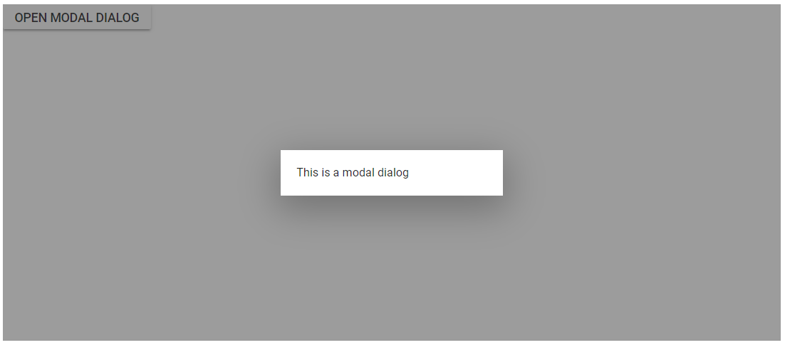
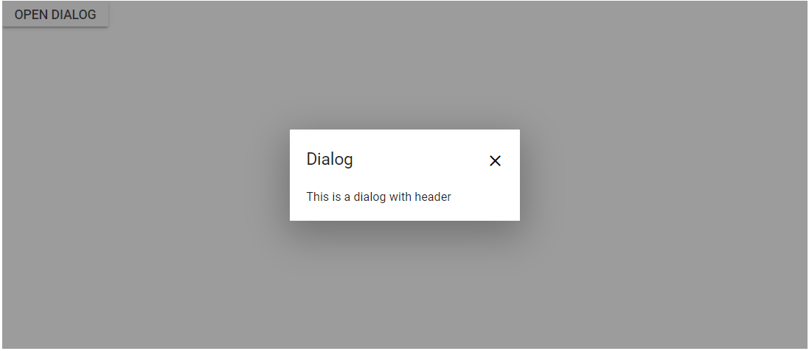
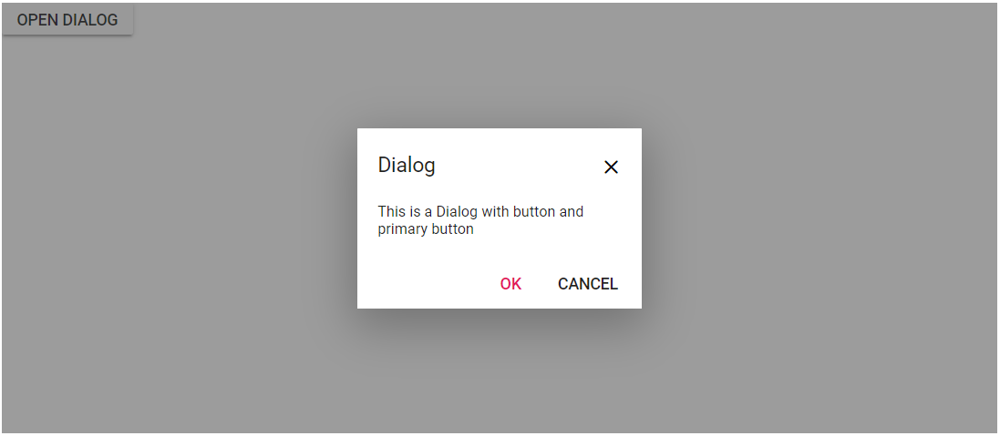

<!-- markdownlint-disable MD024 -->

# Getting Started

This section briefly explains how to include a Dialog component in your Blazor Server-side application. You can refer [Getting Started with Syncfusion Blazor for Server-Side in Visual Studio 2019 page](../getting-started/server-side-blazor/) for the introduction and configuring the common specifications.

To get start quickly with Blazor Dialog component, you can check on this video:
`youtube:uSyGKuB8ghg`

## Importing Syncfusion Blazor component in the application

* Install `Syncfusion.Blazor` NuGet package to the application by using the `NuGet Package Manager`.

> Please ensure to check the `Include prerelease` option for our Beta release.

* You can add the client-side resources through CDN or from NuGet package in the `<head>` element of the **~/Pages/_Host.cshtml** page.

```html

<head>
    <link href="_content/Syncfusion.Blazor/styles/bootstrap4.css" rel="stylesheet" />
    @*<link href="https://cdn.syncfusion.com/blazor/{:version:}/styles/bootstrap4.css" rel="stylesheet" />*@
</head>

```

> For Internet Explorer 11 kindly refer the polyfills. Refer the [documentation](../../common/how-to/render-blazor-server-app-in-ie/) for more information.

```html

<head>
    <link href="_content/Syncfusion.Blazor/styles/bootstrap4.css" rel="stylesheet" />
    <script src="https://github.com/Daddoon/Blazor.Polyfill/releases/download/3.0.1/blazor.polyfill.min.js"></script>
</head>

```

## Adding component package to the application

Open **~/_Imports.razor** file and import the `Syncfusion.Blazor.Popups` package.

```csharp

@using Syncfusion.Blazor.Popups

```

## Add SyncfusionBlazor service in Startup.cs

Open the **Startup.cs** file and add services required by Syncfusion components using `services.AddSyncfusionBlazor()` method. Add this method in the ConfigureServices function as follows.

```csharp

using Syncfusion.Blazor;
namespace BlazorApplication
{
    public class Startup
    {
        ....
        ....
        public void ConfigureServices(IServiceCollection services)
        {
            ....
            ....
            services.AddSyncfusionBlazor();
        }
    }
}

```

> To enable custom client side resource loading from CRG or CDN. You need to disable resource loading by  `AddSyncfusionBlazor(true)` and load the scripts in the `<head>` element of the **~/Pages/_Host.cshtml** page.

```html

<head>
    <script src="https://cdn.syncfusion.com/blazor/{:version:}/syncfusion-blazor.min.js"></script>
</head>

```

## Add Dialog component

To initialize the Dialog component, add the below code to your **Index.razor** view page which is present under **~/Pages** folder.

The following code explains how to initialize a simple Dialog in Razor page.

```csharp

@using Syncfusion.Blazor
@using Syncfusion.Blazor.Popups

<SfDialog  Width="250px">
    <DialogTemplates>
        <Content> This is a Dialog with content</Content>
    </DialogTemplates>
</SfDialog>

```

## Run the application

After successful compilation of your application, simply run the application.

The output will be as follows.


> In the dialog control, max-height is calculated based on the dialog target element height. If the target property is not configured, the document.body is considered as a target. Therefore, to show a dialog in proper height, you need to add min-height to the target element.

## Modal dialog

A `modal` shows an overlay behind the Dialog. So, the users should interact the Dialog compulsory before interacting with the remaining content in an application.

While the user clicks the overlay, the action can be handled through the `OnOverlayClick` event. In the following code, it explains the Dialog close action performed while clicking the overlay.

```csharp

@using Syncfusion.Blazor
@using Syncfusion.Blazor.Popups
@using Syncfusion.Blazor.Buttons

<SfButton @onclick="@OnClicked">Open Modal Dialog</SfButton>
<SfDialog @bind-Visible="@IsVisible" Width="250px" IsModal="true">
    <DialogEvents OnOverlayClick="OnOverlayclick">
    </DialogEvents>
    <DialogTemplates>
        <Content> This is a modal dialog</Content>
    </DialogTemplates>
</SfDialog>

@code {
    private bool IsVisible { get; set; } = true;
    private void OnClicked()
    {
        this.IsVisible = true;
    }
    private void OnOverlayclick(object arg)
    {
        this.IsVisible = false;
    }
}

```

The output will be as follows.



## Enable header

The Dialog header can be enabled by adding the header content as text or HTML content using the `Header` template of the dialog.

```csharp

@using Syncfusion.Blazor
@using Syncfusion.Blazor.Popups
@using Syncfusion.Blazor.Buttons

<SfButton @onclick="@OnClicked">Open Dialog</SfButton>
<SfDialog @bind-Visible="@IsVisible" Width="250px" ShowCloseIcon="true" IsModal="true">
    <DialogTemplates>
        <Header> Dialog</Header>
        <Content> This is a dialog with header</Content>
    </DialogTemplates>
</SfDialog>

@code {
    private bool IsVisible { get; set; } = true;
    private void OnClicked() {
       this.IsVisible = true;
    }
}

```

The output will be as follows.



## Render Dialog with buttons

Create `ButtonModel` object and set it to `DialogButton` property as the following code to render a Dialog with buttons in Razor page.

```csharp

@using Syncfusion.Blazor
@using Syncfusion.Blazor.Popups
@using Syncfusion.Blazor.Buttons

<SfButton @onclick="@OnBtnClick">Open Dialog</SfButton>
<SfDialog @bind-Visible="@IsVisible" Width="250px" ShowCloseIcon="true" IsModal="true">
    <DialogTemplates>
        <Header> Dialog</Header>
        <Content> This is a Dialog with button and primary button</Content>
    </DialogTemplates>
    <DialogButtons>
        <DialogButton OnClick="@OkClick">
            <DialogButtonModel Content="OK" IsPrimary="true"></DialogButtonModel>
        </DialogButton>
        <DialogButton OnClick="@OkClick">
            <DialogButtonModel Content="Cancel"></DialogButtonModel>
        </DialogButton>
    </DialogButtons>
</SfDialog>

@code {
    private bool IsVisible { get; set; } = true;

    private void OkClick()
    {
        this.IsVisible = false;
    }
    private void OnBtnClick()
    {
        this.IsVisible = true;
    }
}

```

The output will be as follows.



## See Also

* [Getting Started with Syncfusion Blazor for client-side in .NET Core CLI](../getting-started/blazor-webassembly-dotnet-cli/)

* [Getting Started with Syncfusion Blazor for server-side in Visual Studio 2019](../getting-started/server-side-blazor/)

* [Getting Started with Syncfusion Blazor for server-side in .NET Core CLI](../getting-started/server-side-blazor-dotnet-cli/)
