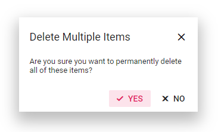

# Add an icons to dialog buttons

You can add icons to the dialog buttons using the `DialogButton` property or `FooterTemplate` property.

In the following code, dialog footer buttons are customized with icons using `DialogButton` property.

```csharp

@using Syncfusion.Blazor
@using Syncfusion.Blazor.Popups
@using Syncfusion.Blazor.Buttons

<SfButton @onclick="@OnClicked">Open Dialog</SfButton>
<SfDialog @bind-Visible="@IsVisible" Width="300px" ShowCloseIcon="true" CloseOnEscape="true">
    <DialogTemplates>
        <Header> <div>Delete Multiple Items</div> </Header>
        <Content> <div>Are you sure you want to permanently delete all of these items?</div> </Content>
    </DialogTemplates>
    <DialogButtons>
        <DialogButton OnClick="@OnClick">
            <DialogButtonModel Content="Yes" IsPrimary="true" IconCss="e-icons e-ok-icon"></DialogButtonModel>
        </DialogButton>
        <DialogButton OnClick="@OnClick">
            <DialogButtonModel Content="No" IconCss="e-icons e-close-icon"></DialogButtonModel>
        </DialogButton>
    </DialogButtons>
</SfDialog>

<style>
    a, a:hover, .highcontrast .e-dialog a, .highcontrast .e-dialog a:hover {
        color: inherit;
        text-decoration: none;
    }

    .e-btn-icon.e-icons.e-ok-icon.e-icon-left:before {
        content: '\e7ff';
    }

    .e-btn-icon.e-icons.e-close-icon.e-icon-left:before {
        content: '\e825';
    }
</style>

@code {
    private bool IsVisible { get; set; } = true;

    private void OnClick()
    {
        this.IsVisible = false;
    }

    private void OnClicked()
    {
        this.IsVisible = true;
    }
}

```

In the following code, dialog footer buttons are customized with icons using `FooterTemplate` template property.

```csharp

@using Syncfusion.Blazor
@using Syncfusion.Blazor.Popups
@using Syncfusion.Blazor.Buttons

<SfButton @onclick="@OnClicked">Open Dialog</SfButton>
<SfDialog @bind-Visible="@IsVisible" Width="300px" ShowCloseIcon="true" CloseOnEscape="true">
    <DialogTemplates>
        <Header> Delete Multiple Items</Header>
        <Content> Are you sure you want to permanently delete all of these items?</Content>
        <FooterTemplate><SfButton CssClass="e-primary e-flat" @onclick="@OnBtnClicked"><span class='e-btn-icon e-icons e-ok-icon e-icon-left'></span>Yes</SfButton><SfButton CssClass="e-flat" @onclick="@OnBtnClicked"><span class='e-btn-icon e-icons e-close-icon e-icon-left'></span>No</SfButton></FooterTemplate>
    </DialogTemplates>
</SfDialog>

<style>
    a, a:hover, .highcontrast .e-dialog a, .highcontrast .e-dialog a:hover {
        color: inherit;
        text-decoration: none;
    }
    .e-btn-icon.e-icons.e-ok-icon.e-icon-left:before {
        content: '\e7ff';
    }
    .e-btn-icon.e-icons.e-close-icon.e-icon-left:before {
        content: '\e825';
    }
</style>

@code {
    private bool IsVisible { get; set; } = true;

    private void OnClicked() {
        this.IsVisible = true;
    }
    private void OnBtnClicked() {
        this.IsVisible = false;
    }
}

```

The output will be as follows.


