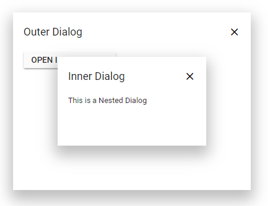

# Create Nested Dialog

A Dialog can be nested within another Dialog. The following sample contains parent and child Dialog (inner Dialog).

**Step 1**:

Create two dialog elements with ID `#dialog` and `#innerDialog`.

**Step 2**:

Initialize the Dialog as mentioned in the below sample.

**Step 3**:

Set the inner Dialog target as `#dialog`.

```csharp

@using Syncfusion.Blazor
@using Syncfusion.Blazor.Popups
@using Syncfusion.Blazor.Buttons

<SfButton @onclick="@OnClicked">Open Dialog</SfButton>
<SfDialog ID="dialog" @bind-Visible="@isVisibleParent" ShowCloseIcon="true" Width="400px" Height="300px" >
    <DialogTemplates>
        <Header> Outer Dialog</Header>
        <Content><SfButton @onclick="@OnBtnClicked">Open InnerDialog</SfButton></Content>
    </DialogTemplates>
    <DialogPositionData X="center" Y="center"></DialogPositionData>
</SfDialog>
<SfDialog ID="innerDialog" @bind-Visible="@isVisibleChild" Target="#dialog" ShowCloseIcon="true" Width="250px" Height="150px">
    <DialogTemplates>
        <Header> Inner Dialog</Header>
        <Content> This is a Nested Dialog</Content>
    </DialogTemplates>
    <DialogPositionData X="center" Y="center"></DialogPositionData>
</SfDialog>

@code {
    private bool isVisibleParent { get; set; } = true;
    private bool isVisibleChild { get; set;} = false;
    private void OnClicked() {
        this.isVisibleParent = true;
    }
    private void OnBtnClicked() {
        this.isVisibleChild = true;
    }
}

```

The output will be as follows.

