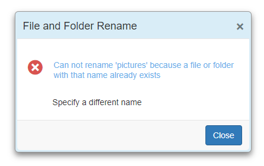

# Customize the dialog appearance

You can customize the dialog appearance by providing dialog template as string or HTML element to the `Content` template property. In the following code block, dialog is customized as error window appearance.

```csharp

@using Syncfusion.Blazor
@using Syncfusion.Blazor.Popups
@using Syncfusion.Blazor.Buttons

<SfButton @onclick="@OnClicked">Open Dialog</SfButton>
<SfDialog @bind-Visible="@IsVisible" Width="400px" ShowCloseIcon="true" CloseOnEscape="true" >
    <DialogTemplates>
        <Header> File and Folder Rename</Header>
        <Content> <div class='msg-wrapper  col-lg-12'><span class='e-icons close-icon col-lg-2'></span><span class='error-msg col-lg-10'>Can not rename 'pictures' because a file or folder with that name already exists</span></div><div class='error-detail col-lg-8'><span>Specify a different name</span></div> </Content>
    </DialogTemplates>
    <DialogAnimationSettings Effect="@Effects" Duration=400></DialogAnimationSettings>
    <DialogButtons>
        <DialogButton OnClick="@OnClick">
            <DialogButtonModel Content="Close" IsPrimary="true"></DialogButtonModel>
       </DialogButton>
    </DialogButtons>
</SfDialog>

<style>
    .e-btn.e-flat.e-primary, .e-btn.e-flat.e-primary:focus {
        background-color: #317ab9;
        border-color: #265f91;
        color: #fff;
    }
    .e-btn.e-flat.e-primary:hover, .e-btn.e-flat.e-primary:active {
        background-color: #21527d;
        border-color: #163854;
        color: #fff;
    }
    .close-icon {
        width: 24px;
        height: 24px;
        position: relative;
        display: inline-block;
    }
    .error-msg {
        color: #66afe9;
        display: inline-block;
        position: relative;
        top: -20px;
        left: 10px;
    }
    .error-detail {
        position: relative;
        left: 56px;
        margin: 0 0 21px;
    }
    .e-icons.close-icon.col-lg-2:before {
        content: '\e7e9';
        font-size: 26px;
        color:#d9534f;
        position: relative;
        left: 1px;
        bottom: 18px;
    }
    .e-dialog .e-footer-content {
        background-color: #f8f8f8;
    }

    .e-dialog.e-control.e-popup, .e-dialog.e-control.e-popup .e-dlg-header-content {
        background-color: #d9edf7;
    }
    .e-dialog.e-control.e-popup {
        padding:3px;
    }
    .e-dialog.e-control .e-dlg-header-content {
        padding: 10px;
    }
    .e-dialog.e-control .e-footer-content {
        padding: 8px 12px;
    }

    .e-dialog.e-control .e-dlg-content {
        padding: 15px 0 0;
    }

    .msg-wrapper.col-lg-12 {
        margin-top: 20px;
    }
</style>

@code {
    private bool IsVisible { get; set; } = true;

    public DialogEffect Effects = DialogEffect.Zoom;
    private void OnClick()
    {
        this.IsVisible = false;
    }
    private void OnClicked() {
        this.IsVisible = true;
    }
}

```

The output will be as follows.

