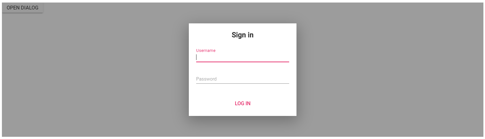

# Prevent closing of modal dialog

You can prevent closing of modal dialog by setting the `OnClose` event argument cancel value to true.
In the following sample, the dialog is closed when you enter the username value with minimum 4 characters. Otherwise, it will not be closed.

```csharp

@using Syncfusion.Blazor
@using Syncfusion.Blazor.Popups
@using Syncfusion.Blazor.Buttons

<SfButton @onclick="@OnClicked">Open Dialog</SfButton>
<SfDialog @bind-Visible="@IsVisible" ID="dialog" IsModal="true" Width="300px">
    <DialogEvents OnClose="Validation"></DialogEvents>
    <DialogTemplates>
        <Header> <div id="heading">Sign in</div> </Header>
        <Content>
            <div id='input-container'>
                <div class="e-float-input e-input-group">
                    <input id="username" required="" type="text" @bind="@Textvalue" />
                    <span class="e-float-line"></span>
                    <label class="e-float-text">Username</label>
                </div>
            </div>
            <div class='form-group'>
                <div class="e-float-input e-input-group">
                    <input id="password" required="" type="password" @bind="@Textvalue2" />
                    <span class="e-float-line"></span>
                    <label class="e-float-text">Password</label>
                </div>
            </div>
        </Content>
    </DialogTemplates>
    <DialogButtons>
        <DialogButton OnClick="@OnClick">
            <DialogButtonModel Content="Log in" IsPrimary="true"></DialogButtonModel>
        </DialogButton>
    </DialogButtons>
</SfDialog>

<style>
    #dialog.e-dialog .e-dlg-header-content .e-dlg-header {
        text-align: center;
        width: 100%;
        color: #333;
        font-weight: bold;
        font-size: 20px;
    }

    #input-container .e-float-input { /* csslint allow: adjoining-classes */
        margin: 17px 0;
    }

    .e-footer-content {
        padding: 20px 0 0;
        width: 100%;
    }

    .e-dialog .e-footer-content .e-btn {
        width: 100%;
        height: 36px;
    }

    #heading {
        color: #333;
        font-weight: bold;
        margin: 0 0 15px;
        text-align: center;
        font-size: 20px;
    }

    #dialog.e-dialog .e-footer-content {
        padding: 0 18px 18px;
    }

        #dialog.e-dialog .e-footer-content .e-btn {
            margin-left: 0;
        }
</style>

@code {
    private bool IsVisible { get; set; } = true;
    private string Textvalue { get; set; } = "";
    private string Textvalue2 { get; set; } = "";

    private void OnClick()
    {
        this.IsVisible = false;
    }

    private void OnClicked()
    {
        this.IsVisible = true;
    }

    private void Validation(BeforeCloseEventArgs args)
    {
        if (Textvalue == "" && Textvalue2 == "")
        {
            args.Cancel = true;
            System.Diagnostics.Debug.WriteLine("Enter the Username and Password");
        }
        else if (Textvalue == "")
        {
            args.Cancel = true;
            System.Diagnostics.Debug.WriteLine("Enter the username");
        }
        else if (Textvalue2 == "")
        {
            args.Cancel = true;
            System.Diagnostics.Debug.WriteLine("Enter the password");
        }
        else if (Textvalue.Length < 4)
        {
            args.Cancel = true;
            System.Diagnostics.Debug.WriteLine("Username must be minimum 4 characters");
        }
        else
        {
            args.Cancel = false;
            Textvalue = "";
            Textvalue2 = "";
        }
    }
}

```

The output will be as follows.

