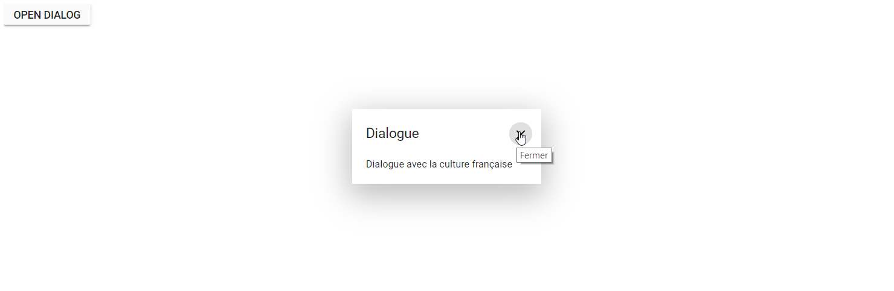

# Localization

Localization library allows you to localize the default text content of
Dialog. In Dialog, The close button's tooltip text alone will be localized based on the culture.
By using `Locale` property, you can set the culture dynamically in dialog component.

| Locale key | en-US (default)  |
|------|------|
| close |  Close |

## Loading translations

To load the translation object in an application, define the culture and the component's locale text corresponding to the language in a separate `locale.json` file.

```bash
{
    "fr-CH": {
        "dialog": {
            "close": "Fermer"
        }
    }
}

```

In the following sample, `French` culture is set to Dialog and change the close button's tooltip
text.

```csharp

@using Syncfusion.Blazor
@using Syncfusion.Blazor.Popups
@using Syncfusion.Blazor.Buttons
@using Microsoft.JSInterop;

<SfButton @onclick="@OnBtnClick">Open Dialog</SfButton>
<SfDialog @bind-Visible="@IsVisible" Width="250px" Locale="fr-CH" ShowCloseIcon="true" >
    <DialogTemplates>
        <Header> Dialogue</Header>
        <Content> Dialogue avec la culture française</Content>
    </DialogTemplates>
</SfDialog>

@code {
    private bool IsVisible { get; set; } = true;
    [Inject]
    protected IJSRuntime JsRuntime { get; set; }

    protected override void OnAfterRender(bool firstRender) {
        //Refer the path for the locale data
        this.JsRuntime.Sf().LoadLocaleData("wwwroot/js/locale.json");
    }
    private void OnBtnClick()
    {
       this.IsVisible = true;
    }
}

```

The output will be as follows.

