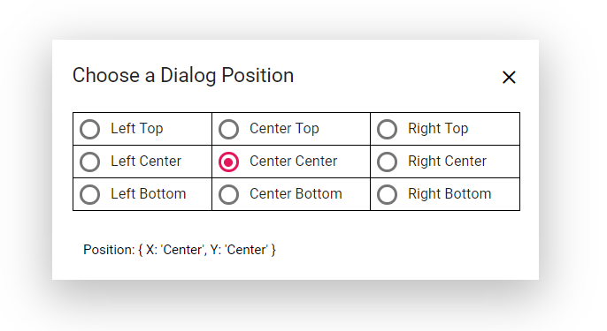

# Positioning

The Dialog can be positioned using the `DialogPositionData` property by providing the X and Y coordinates. It can be positioned inside the target of the `container` or `<body>` of the element based on the given X and Y values.

for X is: left, center, right (or) any offset value
for Y is: top, center, bottom (or) any offset value

The following code demonstrates the different Dialog positions.

```csharp

@using Syncfusion.Blazor
@using Syncfusion.Blazor.Popups
@using Syncfusion.Blazor.Buttons

<div id="target">
    <SfButton @onclick="@OnClicked">Open Dialog</SfButton>
    <SfDialog @bind-Visible="@isVisible" Target="#target" Width="445px" ShowCloseIcon="true">
        <DialogTemplates>
            <Header> <div>Choose a Dialog Position</div> </Header>
            <Content>
                <table style="width:405px;" id="poschange">
                    <tr>
                        <td><SfRadioButton Label="Left Top" Name="xy" Value="left top" ValueChange="@OnChangeHandler"></SfRadioButton></td>
                        <td><SfRadioButton Label="Center Top" Name="xy" Value="center top" ValueChange="@OnChangeHandler"></SfRadioButton></td>
                        <td><SfRadioButton Label="Right Top" Name="xy" Value="right top" ValueChange="@OnChangeHandler"></SfRadioButton></td>
                    </tr>
                    <tr>
                        <td><SfRadioButton Label="Left Center" Name="xy" Value="left center" ValueChange="@OnChangeHandler"></SfRadioButton></td>
                        <td><SfRadioButton Label="Center Center" Name="xy" Value="center center" ValueChange="@OnChangeHandler" @bind-Checked="@Checked"></SfRadioButton></td>
                        <td><SfRadioButton Label="Right Center" Name="xy" Value="right center" ValueChange="@OnChangeHandler"></SfRadioButton></td>
                    </tr>
                    <tr>
                        <td><SfRadioButton Label="Left Bottom" Name="xy" Value="left bottom" ValueChange="@OnChangeHandler"></SfRadioButton></td>
                        <td><SfRadioButton Label="Center Bottom" Name="xy" Value="center bottom" ValueChange="@OnChangeHandler"></SfRadioButton></td>
                        <td><SfRadioButton Label="Right Bottom" Name="xy" Value="right bottom" ValueChange="@OnChangeHandler"></SfRadioButton></td>
                    </tr>
                </table>
            </Content>
            <FooterTemplate><span>Position : { X: '@Xvalue', Y: '@Yvalue' }</span></FooterTemplate>
        </DialogTemplates>
        <DialogPositionData X="@Xvalue" Y="@Yvalue"></DialogPositionData>
    </SfDialog>
</div>

<style>
    .e-dialog table,
    .e-dialog th,
    .e-dialog td {
        border: 1px solid #D8D8D8;
        border-collapse: collapse;
    }

    .e-dialog .e-footer-content {
        padding: 0px 10px 10px;
        text-align: center;
    }
    #target {
        min-height: 450px;
        height: 100%;
    }

    .e-dialog .e-dlg-content {
        padding: 10px 16px 10px;
    }
    .e-radio + label .e-label {
        line-height: 18px;
    }
    td {
        padding: 4px;
    }
</style>

@code {
    private bool isVisible { get; set; } = true;

    public string Xvalue = "center";
    public string Yvalue = "center";
    public bool Checked { get; set; } = true;

    private void OnClicked()
    {
        this.isVisible = true;
    }

    private void OnChangeHandler(ChangeArgs arg)
    {
        this.Xvalue = arg.Value.ToString().Split(' ')[0];
        this.Yvalue = arg.Value.ToString().Split(' ')[1];
        this.StateHasChanged();
    }
}

```

The output will be as follows.

