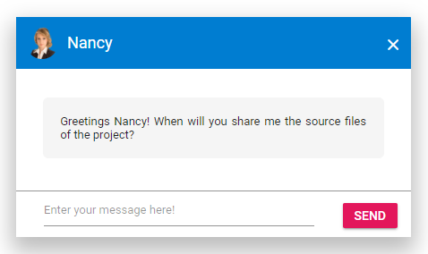

# Template

In Dialog, the template support is provided to the header and footer sections. So any text or HTML content can be appended in these sections.

## Header

The Dialog header content can be provided through the
`Header` property, and it will allow both text and any HTML content as a string.
Also in header, close button is provided as built-in support, and this can be enabled through
the `ShowCloseIcon` property.

## Footer

The Dialog footer can be enabled by adding built-in `DialogButton` or providing any HTML string through the `FooterTemplate`.

> The `DialogButton` and `FooterTemplate` properties can't be used at the same time.

The following example demonstrates the usage of header and footer template in the Dialog.

```csharp

@using Syncfusion.Blazor
@using Syncfusion.Blazor.Popups
@using Syncfusion.Blazor.Inputs
@using Syncfusion.Blazor.Buttons

<SfButton @onclick="@OnBtnClick">OPEN DIALOG</SfButton>
<SfDialog @bind-Visible="@IsVisible" Height="250px" Width="435px" ShowCloseIcon="true">
    <DialogTemplates>
        <Header> <span class='e-avatar template-image e-avatar-xsmall e-avatar-circle'></span><div id='template' title='Nancy' class='e-icon-settings'>Nancy</div></Header>
        <Content> <div class='dialogContent'><span class='dialogText'>@DialogText</span></div></Content>
        <FooterTemplate>
            <SfTextBox @ref="TextboxObj" type='text' @bind-Value="@TextboxValue" Placeholder='Enter your message here!' /><button id='sendButton' @onclick="@OnsendBtnclick" class='e-control e-btn e-primary' data-ripple='true'>Send</button>
        </FooterTemplate>
    </DialogTemplates>
</SfDialog>

<style>
    #sendButton {
        top: 2px;
        position: relative;
    }
    .e-footer-content .e-input-group{
        width: 75%;
        float: left;
    }
    .e-dialog .e-dlg-header-content {
        background-color: #3f51b5;
    }
    .e-dialog .e-dlg-header-content .e-btn.e-dlg-closeicon-btn {
        top: 5px;
        left: -11px;
    }
    .e-dialog .e-dlg-header {
        position: relative;
    }
    .e-dialog .e-footer-content, .highcontrast.e-bigger .e-dialog .e-footer-content {
        padding: 15px;
    }
    .e-dialog .e-dlg-content {
        padding: 0;
    }
    .e-dialog .e-dlg-header-content {
        padding: 6px;
    }
    .e-open-icon::before {
        content: '\e782';
    }
    #template {
        display: inline-block;
        padding: 0px 10px;
        vertical-align: middle;
        height: 40px;
        line-height: 40px;
    }
    input {
        width: 75%;
        float: left;
    }
    .e-icon-settings.e-icons {
        float: left;
        position: relative;
        left: 14%;
        top: -33px;
    }
    .dialogContent .dialogText {
        font-size: 13px;
        padding: 5%;
        word-wrap: break-word;
        border-radius: 6px;
        text-align: justify;
        font-style: initial;
        display: block;
    }
    .e-dlg-header .e-icon-settings, .e-icon-btn {
        color: #fff;
    }
    .dialogContent .dialogText, .dialogContent .dialogText {
        background-color: #f5f5f5;
    }
    .e-dialog .e-footer-content, .fabric .e-dialog .e-footer-content {
        border-top: 0.5px solid rgba(0, 0, 0, 0.42);
    }
    .dialogContent {
        display: block;
        font-size: 15px;
        word-wrap: break-word;
        text-align: center;
        font-style: italic;
        border-radius: 6px;
        padding: 3%;
        position: relative;
        top: 25px;
    }
    .control-wrapper .e-control.e-dialog {
        width: 30%;
    }
    .e-dialog .e-dlg-header-content .e-icon-dlg-close {
        color: #fff;
    }
    .e-dialog .e-dlg-header-content .e-btn.e-dlg-closeicon-btn:hover,
    .e-dialog .e-dlg-header-content .e-btn.e-dlg-closeicon-btn:focus {
        background-color: rgba(255,255,255, 0.10);
    }
    .e-dialog .e-dlg-header-content .e-btn.e-dlg-closeicon-btn:active .e-icon-dlg-close,
    .e-dialog .e-dlg-header-content .e-btn.e-dlg-closeicon-btn:focus .e-icon-dlg-close,
    .e-dialog .e-dlg-header-content .e-btn.e-dlg-closeicon-btn:hover .e-icon-dlg-close {
        color: #fff;
    }
    .e-dialog .e-dlg-header-content .e-dlg-header .e-avatar.template-image {
        background-image: url("https://blazor.syncfusion.com/demos/css/Dialog/images/1.png");
        vertical-align: middle;
        display: inline-block;
        width: 36px;
        height: 36px;
    }
</style>

@code {
    private bool IsVisible { get; set; } = true;
    SfTextBox TextboxObj;

    public string DialogText { get; set; } = "Greetings Nancy! When will you share me the source files of the project?";
    private string TextboxValue;
    private void OnBtnClick()
    {
        this.IsVisible = true;
    }
    private void OnsendBtnclick()
    {
        if(this.TextboxObj.Value != "") {
            DialogText = this.TextboxObj.Value;
            TextboxValue = "";
            this.StateHasChanged();
        }
    }
}

```

The output will be as follows.



## See Also

* [How to add an icon to dialog buttons](./how-to/add-an-icons-to-dialog-buttons)
* [How to customize the dialog appearance](./how-to/customize-the-dialog-appearance)