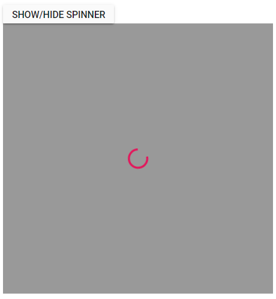

# Customize the Spinner Component

You can customize the Spinner component when initializing or after rendering the it.

## Customize when initializing the Spinner component

Provided support to change the default Spinner appearance when initializing Spinner component using the following properties.

* CssClass
* Label
* Type
* Width

### CssClass

Add the customized `Class` name to a Spinner root element to customize the Blazor Spinner component UI styles.

The following code explains how to initialize a Spinner with the custom class name in the Blazor Razor page.

```csharp

@using Syncfusion.Blazor.Buttons
@using Syncfusion.Blazor.Spinner
<div>
    <SfButton @onclick="@Click">Show/Hide Spinner</SfButton>
    <div id="container"></div>
    <SfSpinner @ref="SpinnerObj" Target="#container" CssClass="e-customClass">
    </SfSpinner>
</div>


@code{
    SfSpinner SpinnerObj;
    string target { get; set; } = "#container";

    private async Task Click()
    {
        SpinnerObj.ShowSpinner(target);
        await Task.Delay(2000);
        SpinnerObj.HideSpinner(target);
    }
}

<style>
    .e-spinner-pane.e-customClass .e-spinner-inner .e-spin-material {
        stroke: #808080;
    }
</style>

```


#### Modal Spinner

You can initialize a modal spinner by adding the class `e-spin-overlay` to the `CssClass` property of the spinner.

The following code explains how to render modal spinner.

```csharp

@using Syncfusion.Blazor.Buttons
@using Syncfusion.Blazor.Spinner

<SfButton @onclick="@Click">Show/Hide Spinner</SfButton>
<div id="container"></div>
<SfSpinner @ref="SpinnerObj" Target="@target" CssClass="e-spin-overlay" />

<style>
    #container {
        position: relative;
        height: 550px;
    }
</style>

@code{
    SfSpinner SpinnerObj;

    private string target { get; set; } = "#container";

    private async Task Click()
    {
        SpinnerObj.ShowSpinner(target);
        await Task.Delay(10000);
        SpinnerObj.HideSpinner(target);
    }
}

```



### Label

Add the customize label text in Blazor Spinner component at the bottom.

The following code explains how to set the `Label` on Spinner in Blazor Razor page.

```csharp

@using Syncfusion.Blazor.Buttons
@using Syncfusion.Blazor.Spinner
<div>
    <SfButton @onclick="@Click">Show/Hide Spinner</SfButton>
    <div id="container"></div>
    <SfSpinner @ref="SpinnerObj" Target="#container" Label="Loading....">
    </SfSpinner>
</div>


@code{
    SfSpinner SpinnerObj;
    string target { get; set; } = "#container";

    private async Task Click()
    {
        SpinnerObj.ShowSpinner(target);
        await Task.Delay(2000);
        SpinnerObj.HideSpinner(target);
    }
}

```


### Type

By default, the Blazor Spinner is loaded based on the theme used in the application. You can also customize the type and show it on Spinner using the `Type` property. The available types are:

* Material
* Fabric
* Bootstrap
* HighContrast
* Bootstrap4

The following code explains how to use the `Type` property when initializing Spinner in Blazor Razor page.

```csharp

@using Syncfusion.Blazor.Buttons
@using Syncfusion.Blazor.Spinner
@using Syncfusion.Blazor.Popups
<div>
    <SfButton @onclick="@Click">Show/Hide Spinner</SfButton>
    <div id="container"></div>
    <SfSpinner @ref="SpinnerObj" Target="#container" Type="SpinnerType.Bootstrap">
    </SfSpinner>
</div>

@code{
    SfSpinner SpinnerObj;
    string target { get; set; } = "#container";

    private async Task Click()
    {
        SpinnerObj.ShowSpinner(target);
        await Task.Delay(2000);
        SpinnerObj.HideSpinner(target);
    }
}

```


### Width

By default, the Spinner width is `30px`.  You can change the size of the Spinner based on your application using the `Width` property.

The following code explains how to use the `Width` property when initializing Spinner in Blazor Razor page.

```csharp

@using Syncfusion.Blazor.Buttons
@using Syncfusion.Blazor.Spinner

<div>
    <SfButton @onclick="@Click">Show/Hide Spinner</SfButton>
    <div id="container"></div>
    <SfSpinner @ref="SpinnerObj" Target="#container" Width="50px">
    </SfSpinner>
</div>

@code{
    SfSpinner SpinnerObj;
    string target { get; set; } = "#container";

    private async Task Click()
    {
        SpinnerObj.ShowSpinner(target);
        await Task.Delay(2000);
        SpinnerObj.HideSpinner(target);
    }
}

```


## Customize after creating the Spinner component

Customize the Spinner component using the `SetSpinner` public method after creating the Spinner component by using the following properties:

* Type
* CssClass

### Type

You can also change the type using the `SetSpinner` public method and show it on Spinner using the `Type` property. The available types are:

* Material
* Fabric
* Bootstrap
* HighContrast
* Bootstrap4

The following code explains how to use the `Type` property after creating the Spinner in Blazor Razor page.

```csharp

@using Syncfusion.Blazor.Buttons
@using Syncfusion.Blazor.Spinner
@using Syncfusion.Blazor.Popups
<div>
    <SfButton @onclick="@Click">Show/Hide Spinner</SfButton>
    <div id="container"></div>
    <SfSpinner @ref="SpinnerObj" Target="#container">
    </SfSpinner>
</div>


@code{
    SfSpinner SpinnerObj;
    string target { get; set; } = "#container";
    SetSpinnerModel setOptions = new SetSpinnerModel { Type= SpinnerType.HighContrast };
    private async Task Click()
    {
        SpinnerObj.SetSpinner(setOptions);
        SpinnerObj.ShowSpinner(target);
        await Task.Delay(2000);
        SpinnerObj.HideSpinner(target);
    }
}

```


### CssClass

Add the custom class name to Spinner using the `SetSpinner` public method after creating the Spinner component.

The following code explains how to dynamically add the `CssClass` property after creating the Spinner in Blazor Razor page.

```csharp

@using Syncfusion.Blazor.Buttons
@using Syncfusion.Blazor.Spinner
<div>
    <SfButton @onclick="@Click">Show/Hide Spinner</SfButton>
    <div id="container"></div>
    <SfSpinner @ref="SpinnerObj" Target="#container">
    </SfSpinner>
</div>
@code{
    SfSpinner SpinnerObj;
    string target { get; set; } = "#container";
    SetSpinnerModel setOptions = new SetSpinnerModel { CssClass = "e-customClass" };
    private async Task Click()
    {
        SpinnerObj.SetSpinner(setOptions);
        SpinnerObj.ShowSpinner(target);
        await Task.Delay(2000);
        SpinnerObj.HideSpinner(target);
    }
}

<style>
    .e-spinner-pane.e-customClass .e-spinner-inner .e-spin-material {
        stroke: #808080;
    }
</style>

```

