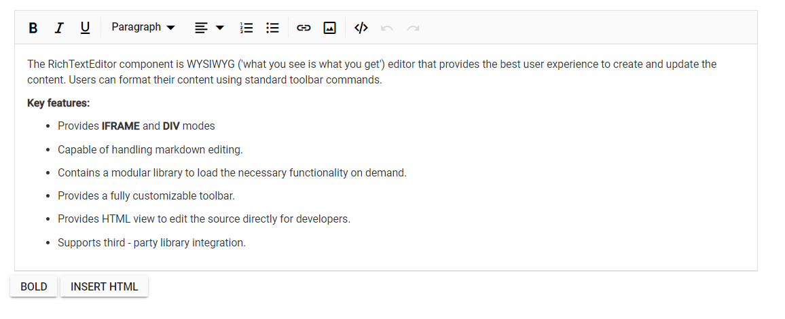

# ExecCommand in Rich Text Editor

In Rich Text Editor, the ExecuteCommand is used to perform commands for the modification of content in editable area.
The `ExecuteCommand` will perform the following commands.

| **commands** | **Value [options]** |
| --- | --- |
| bold | Bolds the selected content in the Rich Text Editor. |
| italic | The selected text will be Italics. |
| underline | Underlines the selected text in the Rich Text Editor. |
| strikeThrough | Applies single line strike through formatting for the selected text. |
| superscript | Makes the selected text as superscript (higher). |
| subscript | Makes the selected text as subscript (lower). |
| uppercase | Changes the case of selected text to upper in the content. |
| lowercase | Changes the case of selected text to lower in the content. |
| fontColor | Applies the specified font color for the selected text. |
| fontName | Applies the specified font name for the selected text. |
| fontSize | Applies the specified font size for the selected text. |
| backColor | Applies the specified background color the selected text. |
| justifyCenter | Aligns the content with center margin. |
| justifyFull | Aligns the content with left margin. |
| justifyLeft | Aligns the content with left margin. |
| justifyRight | Aligns the content with right margin. |
| undo | Allows to undo the actions. |
| redo | Allows to redo the actions |
| formatBlock | Adds HTML block element to the selected text. |
| heading | Adds heading to the selected text.  |
| indent | Allows to increase the indent level of the content. |
| outdent | Allows to decrease the indent level of the content. |
| insertHTML | Inserts the html content to the current cursor position. |
| insertOrderedList | Creates a new list item (numbered). |
| insertUnorderedList | Creates a new list item (bulleted). |
| insertParagraph | Inserts a paragraph to the selection or the current line. |
| removeFormat | Removes all formatting styles (such as bold, Italic, underline, color, superscript, subscript, and more) from currently selected text. |
| insertText | Inserts text to the current cursor position. |
| insertHorizontalRule | Inserts horizontal rule to the current cursor position. |
| insertBrOnReturn | Inserts `<br>` tag to the current cursor position. |

> Provided support to apply execute commands which do not require direct DOM access.

The following code block demonstrates the usage of the ExecuteCommand in Rich Text Editor.

```csharp

@using Syncfusion.Blazor.RichTextEditor
@using Syncfusion.Blazor.Buttons

<SfRichTextEditor @ref="@RteObj">
    <p>The Rich Text Editor component is WYSIWYG ('what you see is what you get') editor that provides the best user experience to create and update the content. Users can format their content using standard toolbar commands.</p>
    <p><b> Key features:</b></p>
    <ul>
        <li><p> Provides <b>IFRAME</b> and <b>DIV</b> modes </p></li>
        <li><p> Capable of handling markdown editing.</p></li>
        <li><p> Contains a modular library to load the necessary functionality on demand.</p></li>
        <li><p> Provides a fully customizable toolbar.</p></li>
        <li><p> Provides HTML view to edit the source directly for developers.</p></li>
        <li><p> Supports third - party library integration.</p></li>
    </ul>
</SfRichTextEditor>
<SfButton @onclick="@onBoldCommand" Content="Bold"></SfButton>
<SfButton @onclick="@onInsertHtmlCommand" Content="InsertHTML"></SfButton>

@code {
    SfRichTextEditor RteObj;

    private void onBoldCommand()
    {
        this.RteObj.ExecuteCommand(CommandName.Bold);
    }

    private void onInsertHtmlCommand()
    {
        this.RteObj.ExecuteCommand(CommandName.InsertHTML, "<div>Syncfusion Rich Text Editor component</div>");
    }
}

```

The output will be as follows.


