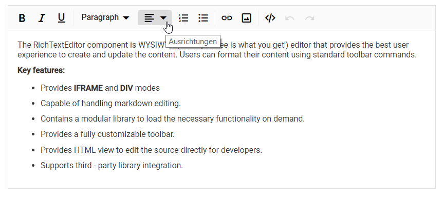
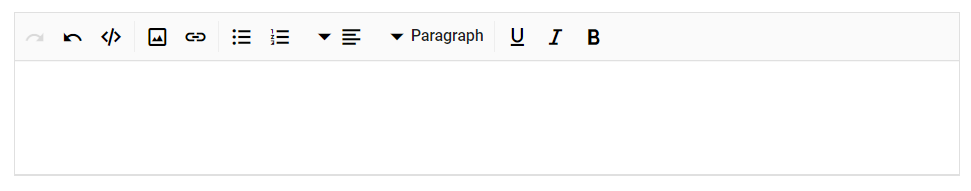

# Globalization

## Localization

The Rich Text Editor provides an option to localize its strings; it is used for adapting the editor to a particular local language. By default, the editor will use the `US English (en-US)` as its language. Find the table with a list of keys and their corresponding values for the default language (en-US).

```bash
{
    "en-US": {
        "richtexteditor": {
            "alignments": "Alignments",
            "justifyLeft": "Align Left",
            "justifyCenter": "Align Center",
            "justifyRight": "Align Right",
            "justifyFull": "Align Justify",
            "fontName": "Font Name",
            "fontSize": "Font Size",
            "fontColor": "Font Color",
            "backgroundColor": "Background Color",
            "bold": "Bold",
            "italic": "Italic",
            "underline": "Underline",
            "strikethrough": "Strikethrough",
            "clearFormat": "Clear Format",
            "clearAll": "Clear All",
            "cut": "Cut",
            "copy": "Copy",
            "paste": "Paste",
            "unorderedList": "Bulleted List",
            "orderedList": "Numbered List",
            "indent": "Increase Indent",
            "outdent": "Decrease Indent",
            "undo": "Undo",
            "redo": "Redo",
            "superscript": "Superscript",
            "subscript": "Subscript",
            "createLink": "Insert Hyperlink",
            "openLink": "Open Link",
            "editLink": "Edit Link",
            "removeLink": "Remove Link",
            "image": "Insert Image",
            "replace": "Replace",
            "align": "Align",
            "caption": "Image Caption",
            "remove": "Remove",
            "insertLink": "Insert Link",
            "display": "Display",
            "altText": "Alternative Text",
            "dimension": "Change Size",
            "fullscreen": "Maximize",
            "maximize": "Maximize",
            "minimize": "Minimize",
            "lowerCase": "Lower Case",
            "upperCase": "Upper Case",
            "print": "Print",
            "formats": "Formats",
            "sourcecode": "Code View",
            "preview": "Preview",
            "viewside": "ViewSide",
            "insertCode": "Insert Code",
            "linkText": "Display Text",
            "linkTooltipLabel": "Title",
            "linkWebUrl": "Web Address",
            "linkTitle": "Enter a title",
            "linkurl": "http://example.com",
            "linkOpenInNewWindow": "Open Link in New Window",
            "linkHeader": "Insert Link",
            "dialogInsert": "Insert",
            "dialogCancel": "Cancel",
            "dialogUpdate": "Update",
            "imageHeader": "Insert Image",
            "imageLinkHeader": "You can also provide a link from the web",
            "mdimageLink": "Please provide a URL for your image",
            "imageUploadMessage": "Drop image here or browse to upload",
            "imageDeviceUploadMessage": "Click here to upload",
            "imageAlternateText": "Alternate Text",
            "alternateHeader": "Alternative Text",
            "browse": "Browse",
            "imageUrl": "http://example.com/image.png",
            "imageCaption": "Caption",
            "imageSizeHeader": "Image Size",
            "imageHeight": "Height",
            "imageWidth": "Width",
            "textPlaceholder": "Enter Text",
            "inserttablebtn": "Insert Table",
            "tabledialogHeader": "Insert Table",
            "tableWidth": "Width",
            "cellpadding": "Cell Padding",
            "cellspacing": "Cell Spacing",
            "columns": "Number of columns",
            "rows": "Number of rows",
            "tableRows": "Table Rows",
            "tableColumns": "Table Columns",
            "tableCellHorizontalAlign": "Table Cell Horizontal Align",
            "tableCellVerticalAlign": "Table Cell Vertical Align",
            "createTable": "Create Table",
            "removeTable": "Remove Table",
            "tableHeader": "Table Header",
            "tableRemove": "Table Remove",
            "tableCellBackground": "Table Cell Background",
            "tableEditProperties": "Table Edit Properties",
            "styles": "Styles",
            "insertColumnLeft": "Insert Column Left",
            "insertColumnRight": "Insert Column Right",
            "deleteColumn": "Delete Column",
            "insertRowBefore": "Insert Row Before",
            "insertRowAfter": "Insert Row After",
            "deleteRow": "Delete Row",
            "tableEditHeader": "Edit Table",
            "TableHeadingText": "Heading",
            "TableColText": "Col",
            "imageInsertLinkHeader": "Insert Link",
            "editImageHeader": "Edit Image",
            "alignmentsDropDownLeft": "Align Left",
            "alignmentsDropDownCenter": "Align Center",
            "alignmentsDropDownRight": "Align Right",
            "alignmentsDropDownJustify": "Align Justify",
            "imageDisplayDropDownInline": "Inline",
            "imageDisplayDropDownBreak": "Break",
            "tableInsertRowDropDownBefore": "Insert row before",
            "tableInsertRowDropDownAfter": "Insert row after",
            "tableInsertRowDropDownDelete": "Delete row",
            "tableInsertColumnDropDownLeft": "Insert column left",
            "tableInsertColumnDropDownRight": "Insert column right",
            "tableInsertColumnDropDownDelete": "Delete column",
            "tableVerticalAlignDropDownTop": "Align Top",
            "tableVerticalAlignDropDownMiddle": "Align Middle",
            "tableVerticalAlignDropDownBottom": "Align Bottom",
            "tableStylesDropDownDashedBorder": "Dashed Borders",
            "tableStylesDropDownAlternateRows": "Alternate Rows",
            "pasteFormat": "Paste Format",
            "pasteFormatContent": "Choose the formatting action",
            "plainText": "Plain Text",
            "cleanFormat": "Clean",
            "keepFormat": "Keep"
        }
    }
}

```

To localize the editor's strings with your own localization, copy the default language informations and localize the strings in the values column. For example, to localize the editor in German language ("de-DE").

> To load translation object in an application, define the culture and the component's locale text corresponding to the language in a separate `locale.json` file under `wwwroot` folder.

```bash
{
    "de-DE": {
        "richtexteditor": {
            "alignments": "Alignments",
            "justifyLeft": "Ausrichten von Text links",
            "justifyCenter": "Text-Zentrum",
            "justifyRight": "Ausrichten von Text rechts",
            "justifyFull": "rechtfertigen",
            "fontName": "Wählen Sie Schriftfamilie",
            "fontSize": "Wählen Sie Schriftgröße",
            "fontColor": "Wählen Sie die Farbe",
            "backgroundColor": "Hintergrundfarbe",
            "bold": "fett",
            "italic": "kursiv",
            "underline": "unterstreichen",
            "strikethrough": "Durchgestrichen",
            "clearAll": "Alles",
            "clearFormat": "Klar Format",
            "cut": "schneiden",
            "copy": "Kopieren",
            "paste": "Paste",
            "unorderedList": "Legen Sie ungeordnete Liste",
            "orderedList": "Geordnete Liste einfügen",
            "indent": "Einzug",
            "outdent": "Einzug verkleinern",
            "undo": "lösen",
            "redo": "Wiederherstellen",
            "superscript": "Überschrift",
            "subscript": "index",
            "createLink": "Einfügen / Hyperlink Bearbeiten",
            "removeLink": "fjern Hyperlink",
            "openLink": "Open link",
            "editLink": "Edit link",
            "image": "Bild einfügen",
            "replace": "ersetzen",
            "align": "ausrichten",
            "caption": "Bildbeschriftung",
            "formats": "Formats",
            "remove": "Löschen",
            "insertLink": "Link einfügen",
            "display": "Anzeige",
            "alttext": "alternativer Text",
            "dimension": "Größe",
            "fullscreen": "Vollbild",
            "maximize": "Maximieren",
            "minimize": "minimieren",
            "zoomIn": "hineinzoomen",
            "zoomOut": "Rauszoomen",
            "upperCase": "Großbuchstaben",
            "lowerCase": "Kleinbuchstaben",
            "print": "Drucken",
            "sourcecode": "Quellcode",
            "preview": "Vorschau",
            "viewside": "Seite anzeigen",
            "insertcode": "Code eingeben",
            "linkText": "Displaytekst",
            "linkTooltipLabel": "tooltip",
            "linkWebUrl": "Webadres",
            "linkOpenInNewWindow": "Open de link in een nieuw venster",
            "linkHeader": "Link invoegen",
            "dialogInsert": "invoegen",
            "dialogCancel": "Annuleer",
            "dialogUpdate": "Bijwerken",
            "imageHeader": "Voeg afbeelding in",
            "imageLinkHeader": "U kunt ook een link van internet opgeven",
            "imageUploadMessage": "Zet hier een afbeelding neer of klik om te uploaden",
            "imageDeviceUploadMessage": "Klik hier om te uploaden",
            "imageAlternateText": "Alternatieve tekst",
            "alternateHeader": "Alternatieve tekst",
            "browse": "Blader",
            "imageUrl": "URL",
            "imageCaption": "onderschrift",
            "imageSizeHeader": "Afbeeldingsgrootte",
            "imageHeight": "Hoogte",
            "imageWidth": "Breedte",
            "textPlaceholder": "Text eingeben",
            "inserttablebtn": "Tabelle einfügen",
            "tabledialogHeader": "Tabelle einfügen",
            "tableWidth": "Breite",
            "cellpadding": "Zellauffüllung",
            "cellspacing": "Zellabstand",
            "columns": "Anzahl der Spalten",
            "rows": "Reihenanzahl",
            "tableRows": "Tabellenzeilen",
            "tableColumns": "Tabellenspalten",
            "tableCellHorizontalAlign": "Horizontale Ausrichtung der Tabellenzelle",
            "tableCellVerticalAlign": "Vertikale Ausrichtung der Tabellenzelle",
            "createTable": "Tabelle erstellen",
            "removeTable": "Tabelle entfernen",
            "tableHeader": "Tabellenkopfzeile",
            "tableRemove": "Tabelle entfernen",
            "tableCellBackground": "Tabellenzellenhintergrund",
            "tableEditProperties": "Eigenschaften der Tabellenbearbeitung",
            "styles": "Styles",
            "insertColumnLeft": "Spalte links einfügen",
            "insertColumnRight": "Spalte rechts einfügen",
            "deleteColumn": "Spalte löschen",
            "insertRowBefore": "Zeile vor einfügen",
            "insertRowAfter": "Zeile einfügen nach",
            "deleteRow": "Zeile löschen",
            "tableEditHeader": "Tabelle bearbeiten",
            "TableHeadingText": "Überschrift",
            "TableColText": "Col",
            "imageInsertLinkHeader": "Link einfügen",
            "editImageHeader": "Bild bearbeiten",
            "alignmentsDropDownLeft": "Linksbündig",
            "alignmentsDropDownCenter": "Im Zentrum anordnen",
            "alignmentsDropDownRight": "Rechts ausrichten",
            "alignmentsDropDownJustify": "Justize ausrichten",
            "imageDisplayDropDownInline": "In der Reihe",
            "imageDisplayDropDownBreak": "Brechen",
            "tableInsertRowDropDownBefore": "Reihe vorher einfügen",
            "tableInsertRowDropDownAfter": "Zeile danach einfügen",
            "tableInsertRowDropDownDelete": "Zeile löschen",
            "tableInsertColumnDropDownLeft": "Spalte links einfügen",
            "tableInsertColumnDropDownRight": "Spalte rechts einfügen",
            "tableInsertColumnDropDownDelete": "Spalte löschen",
            "tableVerticalAlignDropDownTop": "Top ausrichten",
            "tableVerticalAlignDropDownMiddle": "Mitte ausrichten",
            "tableVerticalAlignDropDownBottom": "Unten ausrichten",
            "tableStylesDropDownDashedBorder": "Gestrichelte Grenzen",
            "tableStylesDropDownAlternateRows": "Alternative Zeilen",
            "pasteFormat": "Format einfügen",
            "pasteFormatContent": "Wählen Sie die Formatierungsaktion aus",
            "plainText": "Einfacher Text",
            "cleanFormat": "sauber",
            "keepFormat": "Behalten"
        }
    }
}

```

The following sample code block demonstrates that the Rich Text Editor control rendered with `de-DE` German language using the Locale property.

```csharp

@using Syncfusion.Blazor
@using Syncfusion.Blazor.RichTextEditor
@using Microsoft.JSInterop;

<SfRichTextEditor Locale="de-DE">
    <p>The Rich Text Editor component is WYSIWYG ('what you see is what you get') editor that provides the best user experience to create and update the content. Users can format their content using standard toolbar commands.</p>
    <p><b> Key features:</b></p>
    <ul>
    <li><p> Provides <b>IFRAME</b> and <b>DIV</b> modes </p></li>
    <li><p> Capable of handling markdown editing.</p></li>
    <li><p> Contains a modular library to load the necessary functionality on demand.</p></li>
    <li><p> Provides a fully customizable toolbar.</p></li>
    <li><p> Provides HTML view to edit the source directly for developers.</p></li>
    <li><p> Supports third - party library integration.</p></li>
    </ul>
</SfRichTextEditor>

@code {
    [Inject]
    protected IJSRuntime JsRuntime { get; set; }

    protected override void OnAfterRender(bool firstRender) {
        //Refer the path for the locale data
        this.JsRuntime.Sf().LoadLocaleData("wwwroot/js/locale.json");
    }
}

```

The output will be as follows.



## RTL

Specifies the direction of the Rich Text Editor component using the `EnableRtl` property. For writing systems will require Arabic, Hebrew, and more. The direction can be switched to right-to-left.

```csharp

@using Syncfusion.Blazor
@using Syncfusion.Blazor.RichTextEditor

<SfRichTextEditor EnableRtl="true" />

```

The output will be as follows.



> `EnableRtl` property will not change based on `Locale` property.
