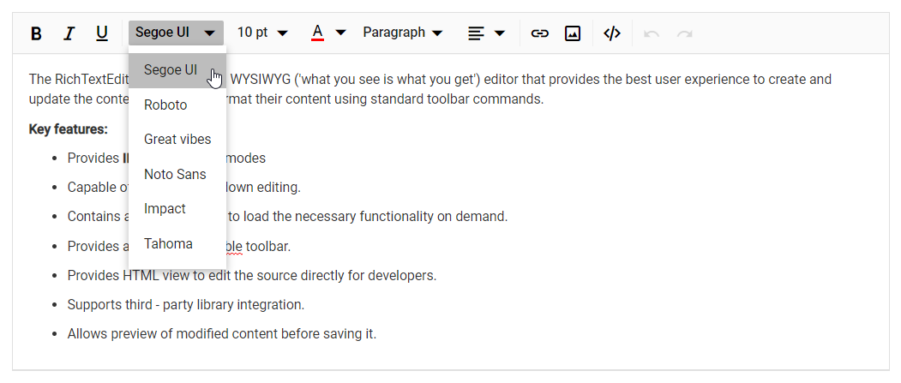

# Add Google fonts

To use web fonts in Rich Text Editor, the web fonts need not to be present in the local machine. To add the web fonts to Rich Text Editor, refer to the web font links and add the font names in the `FontFamily` property.

```csharp

@using Syncfusion.Blazor
@using Syncfusion.Blazor.RichTextEditor

<SfRichTextEditor>
    <RichTextEditorToolbarSettings Items="@Tools"></RichTextEditorToolbarSettings>
    <RichTextEditorFontFamily Items="@FontItems"></RichTextEditorFontFamily>
    <p>The Rich Text Editor component is WYSIWYG ('what you see is what you get') editor that provides the best user experience to create and update the content. Users can format their content using standard toolbar commands.</p>
    <p><b> Key features:</b></p>
    <ul>
        <li><p> Provides <b>IFRAME</b> and <b>DIV</b> modes </p></li>
        <li><p> Capable of handling markdown editing.</p></li>
        <li><p> Contains a modular library to load the necessary functionality on demand.</p></li>
        <li><p> Provides a fully customizable toolbar.</p></li>
        <li><p> Provides HTML view to edit the source directly for developers.</p></li>
        <li><p> Supports third - party library integration.</p></li>
        <li><p> Allows preview of modified content before saving it.</p></li>
    </ul>
</SfRichTextEditor>

@code {
    public List<IDropDownItemModel> FontItems = new List<IDropDownItemModel>() {
        new IDropDownItemModel() { text = "Segoe UI", value = "Segoe UI" },
        new IDropDownItemModel() { text = "Roboto", value = "Roboto" },
        // here font is added
        new IDropDownItemModel() { text = "Great vibes", value = "Great Vibes,cursive"},
        new IDropDownItemModel() { text = "Noto Sans", value = "Noto Sans" },
        new IDropDownItemModel() { text = "Impact", value = "Impact,Charcoal,sans-serif" },
        new IDropDownItemModel() { text = "Tahoma", value = "Tahoma,Geneva,sans-serif" }
    };
    public object[] Tools = new object[]{
        "Bold", "Italic", "Underline", "|", "FontName", "FontSize", "FontColor",
        "Formats", "Alignments", "|", "CreateLink", "Image", "|", "SourceCode", "|", "Undo", "Redo"
    };
    public class IDropDownItemModel
    {
        public string text { get; set; }
        public string value { get; set; }
    }
}

```

The output will be as follows.



The following font style links are referred in the page.

```bash

<link rel="stylesheet" href="http://fonts.googleapis.com/css?family=Roboto">
<link rel="stylesheet" href="http://fonts.googleapis.com/css?family=Great+Vibes">

```

> You can also add the two Google web fonts (`Roboto` and `Great vibes`) to `Rich Text Editor`.
